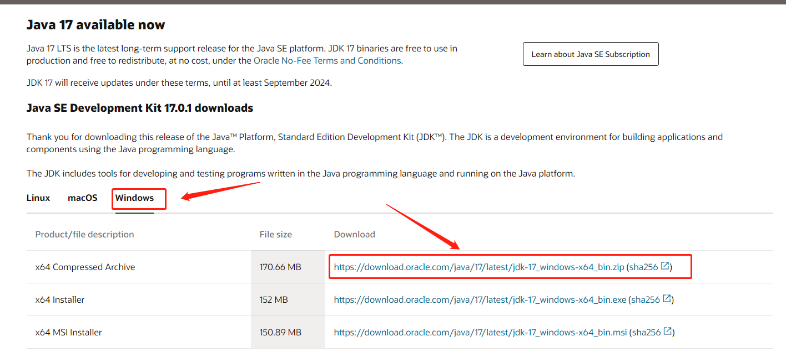
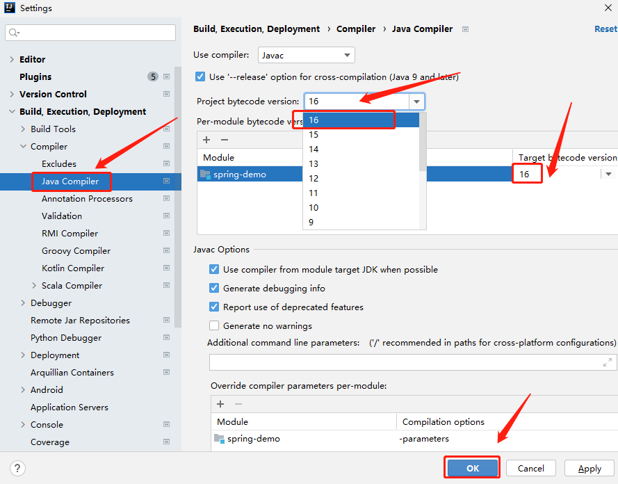
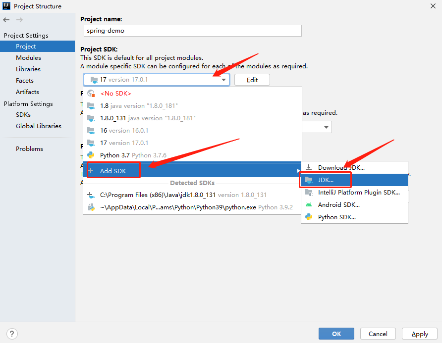
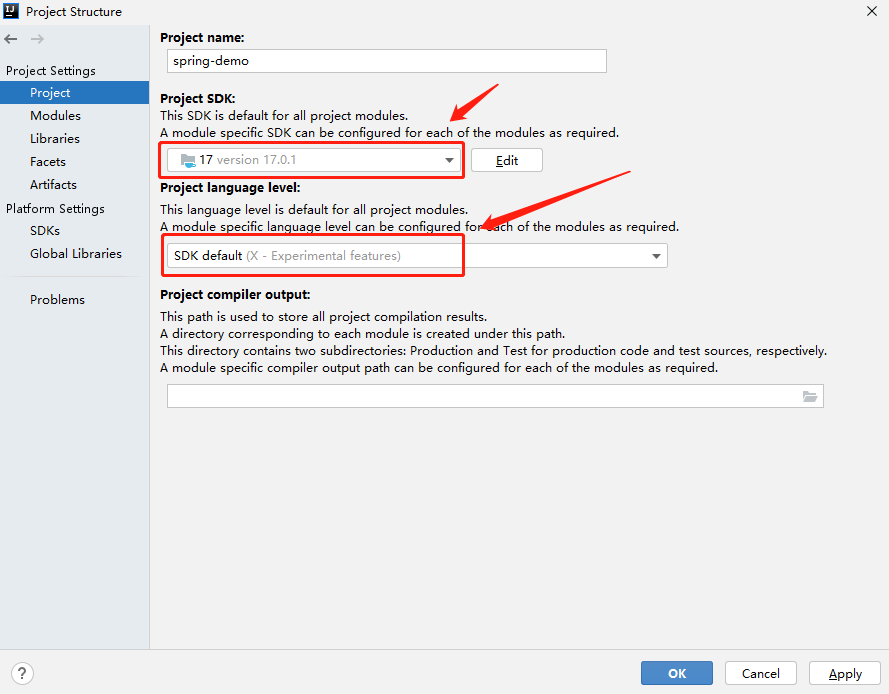
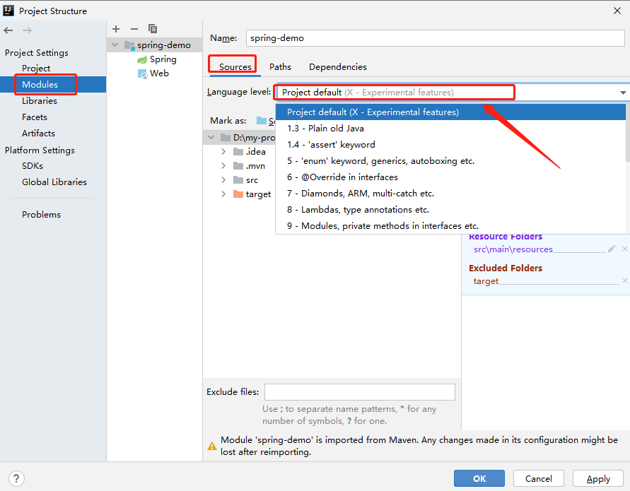

# Java 11 和 Java 17 之间有哪些新变化？


## 一. 简介

2021 年 9 月 14 日，Java 17 发布，有必要仔细看看自上一个 LTS （Long Term Support）版本（即 Java 11）以来的变化，本文主要简要介绍许可模型，然后介绍如何在 idea 中配置 jdk17。

首先，让我们仔细看看 Java 许可和[支持](https://www.oracle.com/java/technologies/java-se-support-roadmap.html)模型，Java 17 是一个 LTS（长期支持）版本，就像 Java 11 一样。随着 Java 11，一个新的发布节奏开始了，Java 11 支持到 2023 年 9 月，扩展支持到 2026 年 9 月。此外在 Java 11 中，Oracle JDK 不再免费用于生产和商业用途，每 6 个月发布一个新的 Java 版本，即所谓的非 LTS 发布 Java 12 直至并包括 Java 16。但是这些是生产就绪版本，与 LTS 版本的唯一区别是支持在下一个版本发布时结束。例如，Java 12 的支持在 Java 13 发布时结束。当你想要保持支持时，你或多或少需要升级到 Java 13。当你的某些依赖项尚未为 Java 13 做好准备时，这可能会导致一些问题。 

大多数情况下，对于生产用途，公司会等待 LTS 版本，但即便如此，一些公司也不愿意升级。最近[对 Snyk](https://snyk.io/jvm-ecosystem-report-2021/)的一项[调查](https://snyk.io/jvm-ecosystem-report-2021/)显示，只有 60% 的人在生产中使用 Java 11，而这距离 Java 11 发布已经过去了 3 年！60% 的公司仍在使用 Java 8。另一个值得注意的有趣事情是，下一个 LTS 版本将是 Java 21，它将在 2 年内发布，可以在[这里](https://wiki.openjdk.java.net/display/quality/Quality+Outreach)找到关于库是否存在 Java 17 问题的一个很好的概述。

随着 Java 17 的推出，Oracle 许可模式发生了变化， Java 17 是根据新的 NFTC（Oracle 免费条款和条件）许可发布的，因此再次允许免费将 Oracle JDK 版本用于生产和商业用途。在同一个 Snyk 调查中，有人指出 Oracle JDK 版本在生产环境中仅被 23% 的用户使用，请注意对 LTS 版本的支持将在下一个 LTS 版本发布一年后结束。

Java 11 和 Java 17 之间发生了什么变化？可以在[OpenJDK](https://openjdk.java.net/projects/jdk/17/jeps-since-jdk-11)网站上找到 JEP（Java 增强建议）的完整列表，你可以在此处阅读每个 JEP 的详细信息，有关自 Java 11 以来每个版本更改的完整列表， [Oracle 发行说明](https://www.oracle.com/java/technologies/javase/jdk-relnotes-index.html)提供了一个很好的概述。


# 二. 在 idea 中配置 jdk17

## 1. 下载 jdk 17

> 下载地址：https://www.oracle.com/java/technologies/downloads/

这里是在 windows 中安装 jdk 17，所以选择 Windows ，然后选择下载 zip 包，如下图所示：



下载完成后解压到一个指定的目录，我这里选择放在 `D:\environment\jdk-17` 目录，然后需要配置环境变量，配置环境变量非常简单，这里不再赘述。如果使用 idea 开发，则可以不用配置环境变量，通过在 idea 指定 jdk 的安装目录即可，下面详细说明如何配置。

## 2. 在 idea 中配置 jdk17

点击 `file --> settings`，打开 `settings` 确定 `Java  compiler` 的 `Project bytecode version` 是否选中项目需要的jdk版本，我这里的 idea 版本没有 17，所以选择 16 就可以了，如下图所示：




点击 `File --> Project Structure`，打开 `Project settings` ，配置 `Project SDK`，如果前面配置好了环境变量，idea 会自动识别配置的 jdk，如果前面没有配置环境变量，我们只需要选择 `Add SDK --> JDK`，并且指定前面解压后的 jdk 目录，如下图所示：




配置好 `Project SDK` 后，`Project language level` 选择 `SDK default` 即可，如下图所示：



配置 `Modules` 的 `Language level`，不同的 `Module` 可以配置不同的 `Language level` ，但是不能比项目的 jdk 版本高，这里配置项目默认的即可，如下图所示：




# 三. Java 17 新特性

根据前面的步骤就可以在 idea 中配置好 jdk 17，下面将通过例子重点介绍 Java 17 可以正式使用的一些新特性。

## 1. 文本块(Text Blocks)

Java 13 引入了文本块来解决多行文本的问题，文本块主要以三重双引号开头，并以同样的以三重双引号结尾终止，它们之间的任何内容都被解释为文本块字符串的一部分，包括换行符，避免了对大多数转义序列的需要，并且它仍然是普通的 `java.lang.String` 对象，文本块可以在 Java 中能够使用字符串的任何地方进行使用，而与编译后的代码没有区别，还增强了 Java 程序中的字符串可读性。并且通过这种方式，可以更直观地表示字符串，可以支持跨越多行，而且不会出现转义的视觉混乱，将可以广泛提高 Java 类程序的可读性和可写性。这个文本块的用法和 python 中的文本块一样，

Java 14 在 Java 13 引入的文本块的基础之上，新加入了两个转义符，分别是：`\` 和 `\s`，这两个转义符分别表达涵义如下：

- `\`：行终止符，主要用于阻止插入换行符；
- `\s`：表示一个空格。可以用来避免末尾的白字符被去掉。

在 Java 13 之前，多行字符串写法为：

```java
String literal = "Lorem ipsum dolor sit amet, consectetur adipiscing " +
                 "elit, sed do eiusmod tempor incididunt ut labore " +
                 "et dolore magna aliqua.";
String json = "{\n" +
    "  \"name\": \"张三\",\n" +
    "  \"age\": 20\n" +
    "}";
```

在 Java 14 新引入两个转义符之后，上述内容可以写为：

```java
String text = """
              Lorem ipsum dolor sit amet, consectetur adipiscing \
              elit, sed do eiusmod tempor incididunt ut labore \
              et dolore magna aliqua.\
              """;
String json = """
              {
                  "name": "张三",
                  "age": 20
              }
			  """;
```

上述两种写法，输出内容是一样的。

对于转义符：`\s`，用法如下，能够保证下列文本每行正好都是六个字符长度：

清单 13. 多行文本块加上转义符的写法

```java
String colors = """
             red  \s
             green\s
             blue \s
             """;
```

Java 14 带来的这两个转义符，能够简化跨多行字符串编码问题，通过转义符，能够避免对换行等特殊字符串进行转移，从而简化代码编写，同时也增强了使用 String 来表达 HTML、XML、SQL 或 JSON 等格式字符串的编码可读性，且易于维护。

同时 Java 14 还对 String 进行了方法扩展：

- `stripIndent()` ：用于从文本块中去除空白字符
- `translateEscapes()`：用于翻译转义字符
- `formatted(Object... args)`：用于格式化

## 2. Switch 表达式

switch 表达式在之前的 Java 12 和 Java 13 中都是处于预览阶段，而在这 Java 14 中，终于成为稳定版本，能够正式使用。

以往的 switch 语句写法如下：

```java
private static void oldStyleWithoutBreak(Fruit fruit) {
    switch (fruit) {
        case APPLE, PEAR:
            System.out.println("Common fruit");
        case ORANGE, AVOCADO:
            System.out.println("Exotic fruit");
        default:
            System.out.println("Undefined fruit");
    }
}
```

调用上面的方法：

```java
oldStyleWithoutBreak(Fruit.APPLE);
```

因为没有 `break` 语句，所以每一个 `case` 语句都会执行，输出如下：

```java
Common fruit
Exotic fruit
Undefined fruit
```

为了不让每一个 case 语句都执行，需要在每一个 case 的最后一行添加 break 语句，代码如下：

```java
private static void oldStyleWithBreak(Fruit fruit) {
    switch (fruit) {
        case APPLE, PEAR:
            System.out.println("Common fruit");
            break;
        case ORANGE, AVOCADO:
            System.out.println("Exotic fruit");
            break;
        default:
            System.out.println("Undefined fruit");
    }
}
```

而现在 Java 14 可以使用 switch 表达式正式版之后，上面语句可以转换为下列写法：

```java
private static void withSwitchExpression(Fruit fruit) {
    switch (fruit) {
        case APPLE, PEAR -> System.out.println("Common fruit");
        case ORANGE, AVOCADO -> System.out.println("Exotic fruit");
        default -> System.out.println("Undefined fruit");
    }
}
```

switch 表达式可以返回一个值，因此上面的代码可以转换成下面的写法：

```java
private static void withReturnValue(Fruit fruit) {
    String text = switch (fruit) {
        case APPLE, PEAR -> "Common fruit";
        case ORANGE, AVOCADO -> "Exotic fruit";
        default -> "Undefined fruit";
    };
    System.out.println(text);
}
```

switch 表达式用 yield 关键字来返回 case 分支需要返回的结果，上面的代码可以转换成下面的写法：

```java
private static void oldStyleWithYield(Fruit fruit) {
    System.out.println(switch (fruit) {
        case APPLE, PEAR:
            yield "Common fruit";
        case ORANGE, AVOCADO:
            yield "Exotic fruit";
        default:
            yield "Undefined fruit";
    });
}
```

switch 表达式带来的不仅仅是编码上的简洁、流畅，也精简了 switch 语句的使用方式，同时也兼容之前的 switch 语句的使用；之前使用 switch 语句时，在每个分支结束之前，往往都需要加上 break 关键字进行分支跳出，以防 switch 语句一直往后执行到整个 switch 语句结束，由此造成一些意想不到的问题。switch 语句一般使用冒号 `：`来作为语句分支代码的开始，而 switch 表达式则提供了新的分支切换方式，即 `->` 符号右则表达式方法体在执行完分支方法之后，自动结束 switch 分支，同时 -> 右则方法块中可以是表达式、代码块或者是手动抛出的异常。

很明显，switch 表达式将之前 switch 语句从编码方式上简化了不少，但是还是需要注意下面几点：

- 需要保持与之前 switch 语句同样的 case 分支情况。
- 之前需要用变量来接收返回值，而现在直接使用 yield 关键字来返回 case 分支需要返回的结果。
- 现在的 switch 表达式中不再需要显式地使用 return、break 或者 continue 来跳出当前分支。
- 现在不需要像之前一样，在每个分支结束之前加上 break 关键字来结束当前分支，如果不加，则会默认往后执行，直到遇到 break 关键字或者整个 switch 语句结束，在 Java 14 表达式中，表达式默认执行完之后自动跳出，不会继续往后执行。
- 对于多个相同的 case 方法块，可以将 case 条件并列，而不需要像之前一样，通过每个 case 后面故意不加 break 关键字来使用相同方法块。

与传统写法对比，可以发现模式匹配不但提高了程序的安全性、健壮性，另一方面，不需要显式的去进行二次类型转换，减少了大量不必要的强制类型转换。模式匹配变量在模式匹配成功之后，可以直接使用，同时它还被限制了作用范围，大大提高了程序的简洁性、可读性和安全性。instanceof 的模式匹配，为 Java 带来的有一次便捷的提升，能够剔除一些冗余的代码，写出更加简洁安全的代码，提高码代码效率。

## 3. Records

在以往开发过程中，被当作数据载体的类对象，在通常需要编写大量的无实际业务、重复性质的代码，其中包括：构造函数、属性调用、访问以及 equals() 、hashCode()、toString() 等方法，因此在 Java 14 中引入了 Record 类型，其效果有些类似 Lombok 的 @Data 注解、Kotlin 中的 data class，但是又不尽完全相同，它们的共同点都是类的部分或者全部可以直接在类头中定义、描述，并且这个类只用于存储数据而已。

对于 Record 类型，具体可以用下面代码来说明：

```java
public record Person(String name, int age) {
    public Person {
        System.out.println(name);
        System.out.println(age);
    }
}
```

对上述代码进行编译，然后反编译之后可以看到如下结果：

```java
public record Person(String name, int age) {
    public Person(String name, int age) {
        System.out.println(name);
        System.out.println(age);
        this.name = name;
        this.age = age;
    }

    public String name() {
        return this.name;
    }

    public int age() {
        return this.age;
    }
}

```

根据反编译结果，可以得出，当用 Record 来声明一个类时，该类将自动拥有下面特征：

- 拥有一个构造方法
- 获取成员属性值的方法：name()、age()
- hashCode() 方法和 euqals() 方法
- toString() 方法
- 类对象和属性被 final 关键字修饰，不能被继承，类的示例属性也都被 final 修饰，不能再被赋值使用。
- 还可以在 Record 声明的类中定义静态属性、方法和示例方法。注意，不能在 Record 声明的类中定义示例字段，类也不能声明为抽象类等。


## 4. instanceof 自动匹配模式

在调用一个对象的方法之前，通常有必要检查对象是否具有某种类型，如果是，首先要做的是将对象强制转换为该类型的新变量。

在 java 14 之前需要强制类型转换，写法如下：

```java
if (object instanceof Kid) {
    Kid kid = (Kid) object;
    // ...
} else if (object instanceof Kiddle) {
    Kid kid = (Kid) object;
    // ...
}
```

使用 `instanceof` 自动匹配模式后，写法如下：

```java
if (object instanceof Kid kid) {
    // ...
} else if (object instanceof Kiddle kiddle) {
    // ...
}
```

## 5. 改进 NullPointerExceptions 提示信息

Java 14 改进 NullPointerException 的可查性、可读性，能更准确地定位 null 变量的信息。该特性能够帮助开发者和技术支持人员提高生产力，以及改进各种开发工具和调试工具的质量，能够更加准确、清楚地根据动态异常与程序代码相结合来理解程序。

相信每位开发者在实际编码过程中都遇到过 NullPointerException，每当遇到这种异常的时候，都需要根据打印出来的详细信息来分析、定位出现问题的原因，以在程序代码中规避或解决。例如，假设下面代码出现了一个 NullPointerException：

```go
book.id = 99;
```

打印出来的 NullPointerException 信息如下：

```java
Exception in thread "main" java.lang.NullPointerException
    at Book.main(Book.java:5)
```

像上面这种异常，因为代码比较简单，并且异常信息中也打印出来了行号信息，开发者可以很快速定位到出现异常位置：book 为空而导致的 NullPointerException，而对于一些复杂或者嵌套的情况下出现 NullPointerException 时，仅根据打印出来的信息，很难判断实际出现问题的位置，具体见下面示例：

```go
shoopingcart.buy.book.id = 99;
```

对于这种比较复杂的情况下，仅仅单根据异常信息中打印的行号，则比较难判断出现 NullPointerException 的原因。

而 Java 14 中，则做了对 NullPointerException 打印异常信息的改进增强，通过分析程序的字节码信息，能够做到准确的定位到出现 NullPointerException 的变量，并且根据实际源代码打印出详细异常信息，对于上述示例，打印信息如下：

```go
Exception in thread "main" java.lang.NullPointerException: 
        Cannot assign field "book" because "shoopingcart.buy" is null
    at Book.main(Book.java:5)
```

对比可以看出，改进之后的 NullPointerException 信息，能够准确打印出具体哪个变量导致的 NullPointerException，减少了由于仅带行号的异常提示信息带来的困惑。

## 6. 支持精简的数据格式化

在 `NumberFormat` 中添加了一个工厂方法，以便根据 `Unicode` 标准以紧凑的、人类可读的形式格式化数字。

`SHORT` 格式样式如下面的代码所示：

```java
NumberFormat fmt = NumberFormat.getCompactNumberInstance(Locale.CHINA, NumberFormat.Style.SHORT);
System.out.println(fmt.format(1000));
System.out.println(fmt.format(100000));
System.out.println(fmt.format(1000000));
```

输出内容如下：

```java
1,000
10万
100万
```

## 7. 支持一天的时间段识别

添加了一个新的模式B，用于格式化DateTime，它根据Unicode标准指示一天时间段。

实例代码如下：

```java
DateTimeFormatter dtf = DateTimeFormatter.ofPattern("B").withLocale(Locale.CHINA);
System.out.println(dtf.format(LocalTime.of(8, 0)));
System.out.println(dtf.format(LocalTime.of(13, 0)));
System.out.println(dtf.format(LocalTime.of(20, 0)));
System.out.println(dtf.format(LocalTime.of(0, 0)));
System.out.println(dtf.format(LocalTime.of(1, 0)));
```

输出内容如下：

```java
上午
下午
晚上
午夜
凌晨
```

## 8. Stream.toList()

为了将 `Stream` 转换为 `List`，需要使用 `Collections . tolist()` 调用 `collect` 方法。

从下面的例子中可以看出，这非常冗长:

```java
private static void oldStyle() {
    Stream<String> stringStream = Stream.of("a", "b", "c");
    List<String> stringList =  stringStream.collect(Collectors.toList());
    for(String s : stringList) {
        System.out.println(s);
    }
}
```

在 Java 17 中，添加了一个 `toList` 方法来替换旧的行为：

```java
private static void streamToList() {
    Stream<String> stringStream = Stream.of("a", "b", "c");
    List<String> stringList =  stringStream.toList();
    for(String s : stringList) {
        System.out.println(s);
    }
}
```

## 9. Java 17 默认使用的 G1 GC

使用下面的命令可以查看：

```sh
>java -XX:+PrintCommandLineFlags -version

-XX:ConcGCThreads=1 -XX:G1ConcRefinementThreads=4 -XX:GCDrainStackTargetSize=64 -XX:InitialHeapSize=266605184 -XX:MarkStackSize=4194304 -XX:MaxHeapSize=4265682944 -XX:MinHeapSize=6815736 -XX:+PrintCommandLineFlags -XX:ReservedCodeCacheSize=251658240 -XX:+SegmentedCodeCache -XX:+UseCompressedClassPointers -XX:+UseCompressedOops -XX:+UseG1GC -XX:-UseLargePagesIndividualAllocation
java version "17.0.1" 2021-10-19 LTS
Java(TM) SE Runtime Environment (build 17.0.1+12-LTS-39)
Java HotSpot(TM) 64-Bit Server VM (build 17.0.1+12-LTS-39, mixed mode, sharing)
```


参考文档

https://dzone.com/articles/whats-new-between-java-11-and-java-17

