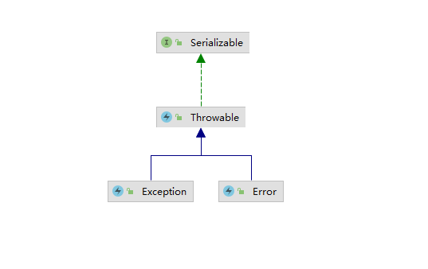
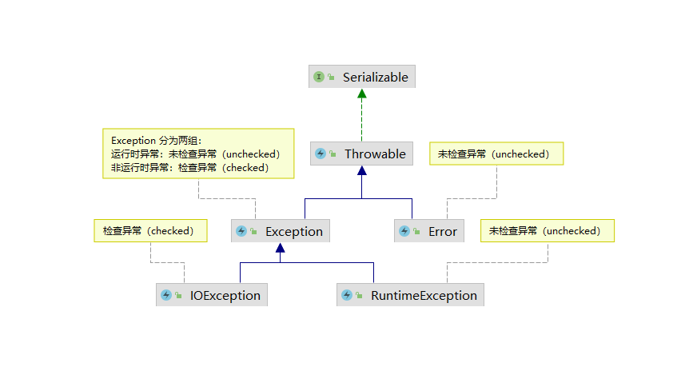
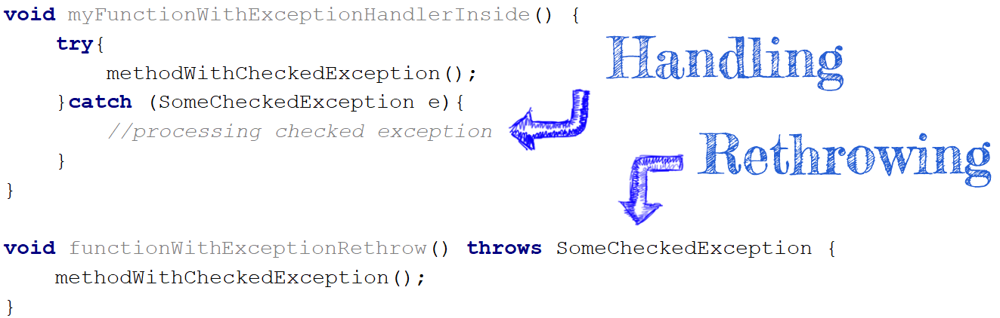
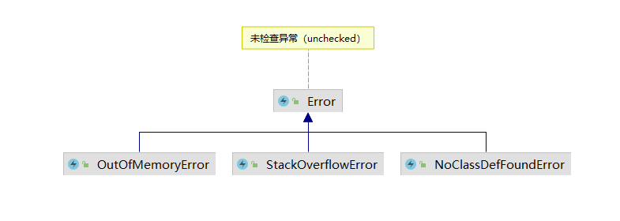
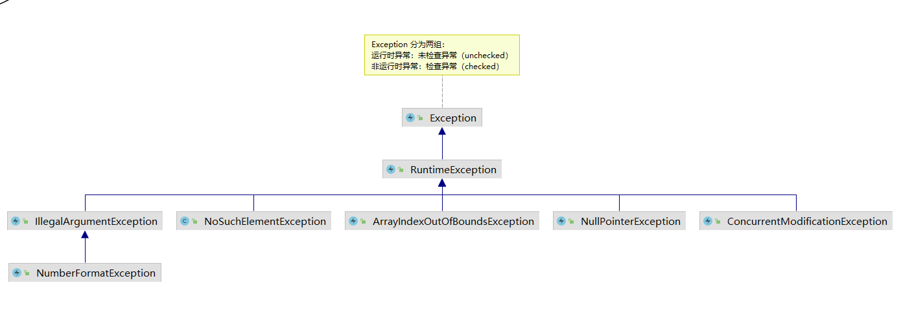
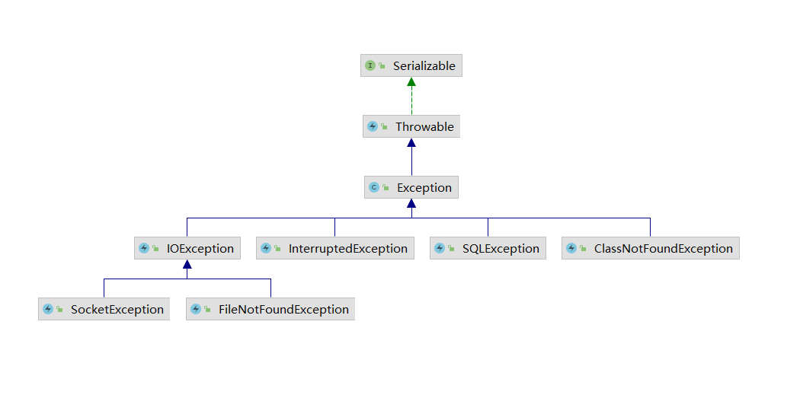

# Java 异常分析

**本文是对以下内容的分析：**

- **Java异常设计**

- **Java 异常分类**

- **Java异常可以告诉什么问题**

- **Java异常处理最佳实践**

Java Exception 是为了处理应用程序的异常行为而创建的类。在本文中，将解释如何使用 Java Exception 类以及如何在考虑现有 Java Exception 设计的情况下创建异常结构。Java 异常概念是 Java 中的重要里程碑之一，每个开发人员都***必须***知道它。 

## Java 异常体系结构

基本结构如下图：



`Throwable` 是所有异常的父类，它有两个子类：`Error` 和 `Exception`。

**Error ：程序一旦出现 Error 错误，程序可能会停止运行。**

**Exception：与 Error 不同，程序中出现 Exception 异常有机会从问题中恢复，并尝试保持程序运行。**

## Java 检查异常和非检查异常

**检查异常：**所有不是 `Runtime Exception` 的异常，统称为 `Checked Exception`，又被称为检查性异常。这类异常的产生不是程序本身的问题，通常由外界因素造成的。为了预防这些异常产生时，造成程序的中断或得到不正确的结果，Java 要求编写可能产生这类异常的程序代码时，一定要去做异常的处理。

**非检查异常：** Java 语言将派生于 `RuntimeException` 类或 `Error` 类的所有异常称为非检查性异常。



## Java 中的异常处理

有两种方法可以处理抛出的异常：

1. **在当前方法中通过 `try-catch` 的方式处理该异常。**

2. **在方法签名的后面通过 `throws` 重新抛出该异常。**

   




## Java 中的异常分类

我们可以将所有的异常分为三类：

- **检查性异常(checked exceptions)** 是必须在在方法的 throws 子句中声明的异常。它们扩展了异常，旨在成为一种“在你面前”的异常类型。JAVA希望你能够处理它们，因为它们以某种方式依赖于程序之外的外部因素。检查的异常表示在正常系统操作期间可能发生的预期问题。 当你尝试通过网络或文件系统使用外部系统时，通常会发生这些异常。 大多数情况下，对检查性异常的正确响应应该是稍后重试，或者提示用户修改其输入。
- **非检查性异常(unchecked Exceptions)** 是不需要在throws子句中声明的异常。 由于程序错误，JVM并不会强制你处理它们，因为它们大多数是在运行时生成的。 它们扩展了 RuntimeException。 最常见的例子是 NullPointerException， 未经检查的异常可能不应该重试，正确的操作通常应该是什么都不做，并让它从你的方法和执行堆栈中出来。
- **错误(errors)** 是严重的运行时环境问题，肯定无法恢复。 例如 `OutOfMemoryError`，`LinkageError` 和 `StackOverflowError`，通常会让程序崩溃。

了解异常类的类型后，我们可能需要回答以下问题：

- **异常情况有多糟糕以及异常的原因是什么？**
- **如何解决这个异常？**
- **我们需要重启JVM吗？**
- **我们需要重写代码吗？**

知道异常类，我们可以预测可能出错的地方。考虑潜在的原因，我们可以假设问题的原因是什么以及如何解决它。在接下来的段落中，我们将回顾常见的异常并调查潜在的原因是什么。在我们的调查中，我们假设应用程序足够稳定并且已经完成开发和测试。

### 常见 Error 异常



<table border="0" cellpadding="0" cellspacing="0" style="border-collapse: collapse;width:653pt;" width="870">
 <tbody>
  <tr>
   <td class="xl68" height="43" style="padding:0px;color:black;font-size:15px;font-weight:400;font-style:normal;text-decoration:none;font-family:Calibri, sans-serif;text-align:center;vertical-align:middle;border:.5pt solid windowtext;background:#F2F2F2;height:32.4pt;width:118pt;" width="18.04597701149425%" value="异常类型" text="异常类型"><font style="vertical-align: inherit;"><font style="vertical-align: inherit;"><font style="vertical-align: inherit;"><font style="vertical-align: inherit;">异常类型</font></font></font></font></td>
   <td class="xl68" style="padding:0px;color:black;font-size:15px;font-weight:400;font-style:normal;text-decoration:none;font-family:Calibri, sans-serif;text-align:center;vertical-align:middle;border:.5pt solid windowtext;background:#F2F2F2;border-left:none;width:145pt;" width="22.298850574712645%"><font style="vertical-align: inherit;"><font style="vertical-align: inherit;">潜在原因</font></font></td>
   <td class="xl68" style="padding:0px;color:black;font-size:15px;font-weight:400;font-style:normal;text-decoration:none;font-family:Calibri, sans-serif;text-align:center;vertical-align:middle;border:.5pt solid windowtext;background:#F2F2F2;border-left:none;width:73pt;" width="11.264367816091953%"><font style="vertical-align: inherit;"><font style="vertical-align: inherit;">原因的可能性有多大</font></font></td>
   <td class="xl68" style="padding:0px;color:black;font-size:15px;font-weight:400;font-style:normal;text-decoration:none;font-family:Calibri, sans-serif;text-align:center;vertical-align:middle;border:.5pt solid windowtext;background:#F2F2F2;border-left:none;width:170pt;" width="25.977011494252874%"><font style="vertical-align: inherit;"><font style="vertical-align: inherit;">怎么修复</font></font></td>
   <td class="xl68" style="padding:0px;color:black;font-size:15px;font-weight:400;font-style:normal;text-decoration:none;font-family:Calibri, sans-serif;text-align:center;vertical-align:middle;border:.5pt solid windowtext;background:#F2F2F2;border-left:none;width:82pt;" width="12.528735632183908%"><font style="vertical-align: inherit;"><font style="vertical-align: inherit;">需要重写代码吗？&nbsp;</font></font></td>
   <td class="xl68" style="padding:0px;color:black;font-size:15px;font-weight:400;font-style:normal;text-decoration:none;font-family:Calibri, sans-serif;text-align:center;vertical-align:middle;border:.5pt solid windowtext;background:#F2F2F2;border-left:none;width:65pt;" width="9.885057471264368%"><font style="vertical-align: inherit;"><font style="vertical-align: inherit;">需要重启JVM吗？</font></font></td>
  </tr>
  <tr>
   <td class="xl69" height="42" rowspan="2" style="padding:0px;color:black;font-size:15px;font-weight:400;font-style:normal;text-decoration:none;font-family:Calibri, sans-serif;text-align:center;vertical-align:middle;border:none;border-top:none;border-right:.5pt solid windowtext;border-bottom:.5pt solid black;border-left:.5pt solid windowtext;background:#F2F2F2;height:31.2pt;width:118pt;"><font style="vertical-align: inherit;"><font style="vertical-align: inherit;">OutOfMemoryError</font></font></td>
   <td class="xl68" style="padding:0px;color:black;font-size:15px;font-weight:400;font-style:normal;text-decoration:none;font-family:Calibri, sans-serif;text-align:center;vertical-align:middle;border:.5pt solid windowtext;background:#F2F2F2;border-top:none;border-left:none;width:145pt;"><font style="vertical-align: inherit;"><font style="vertical-align: inherit;">应用程序吃掉了所有内存</font></font></td>
   <td class="xl65" style="padding:0px;color:black;font-size:15px;font-weight:400;font-style:normal;text-decoration:none;font-family:Calibri, sans-serif;text-align:center;vertical-align:middle;border:.5pt solid windowtext;background:#AFEFB7;border-top:none;border-left:none;width:73pt;"><font style="vertical-align: inherit;"><font style="vertical-align: inherit;">高的</font></font></td>
   <td class="xl68" style="padding:0px;color:black;font-size:15px;font-weight:400;font-style:normal;text-decoration:none;font-family:Calibri, sans-serif;text-align:center;vertical-align:middle;border:.5pt solid windowtext;background:#F2F2F2;border-top:none;border-left:none;width:170pt;"><font style="vertical-align: inherit;"><font style="vertical-align: inherit;">增加堆内存大小</font></font></td>
   <td class="xl66" style="padding:0px;color:black;font-size:16px;font-weight:400;font-style:normal;text-decoration:none;font-family:Calibri, sans-serif;text-align:center;vertical-align:middle;border:.5pt solid windowtext;background:#AFEFB7;border-top:none;border-left:none;width:82pt;"><font style="vertical-align: inherit;"><font style="vertical-align: inherit;">不</font></font></td>
   <td class="xl71" style="padding:0px;color:black;font-size:15px;font-weight:400;font-style:normal;text-decoration:none;font-family:Calibri, sans-serif;text-align:center;vertical-align:middle;border:.5pt solid windowtext;background:#E6B9B8;border-top:none;border-left:none;"><font style="vertical-align: inherit;"><font style="vertical-align: inherit;">是的</font></font></td>
  </tr>
  <tr>
   <td class="xl68" height="21" style="padding:0px;color:black;font-size:15px;font-weight:400;font-style:normal;text-decoration:none;font-family:Calibri, sans-serif;text-align:center;vertical-align:middle;border:.5pt solid windowtext;background:#F2F2F2;height:15.6pt;border-top:none;border-left:none;width:145pt;"><font style="vertical-align: inherit;"><font style="vertical-align: inherit;">内存泄漏</font></font></td>
   <td class="xl68" style="padding:0px;color:black;font-size:15px;font-weight:400;font-style:normal;text-decoration:none;font-family:Calibri, sans-serif;text-align:center;vertical-align:middle;border:.5pt solid windowtext;background:#F2F2F2;border-top:none;border-left:none;width:73pt;"><font style="vertical-align: inherit;"><font style="vertical-align: inherit;">低的</font></font></td>
   <td class="xl68" style="padding:0px;color:black;font-size:15px;font-weight:400;font-style:normal;text-decoration:none;font-family:Calibri, sans-serif;text-align:center;vertical-align:middle;border:.5pt solid windowtext;background:#F2F2F2;border-top:none;border-left:none;width:170pt;"><font style="vertical-align: inherit;"><font style="vertical-align: inherit;">查找内存泄漏并修复</font></font></td>
   <td class="xl67" style="padding:0px;color:black;font-size:16px;font-weight:400;font-style:normal;text-decoration:none;font-family:Calibri, sans-serif;text-align:center;vertical-align:middle;border:.5pt solid windowtext;background:#F2F2F2;border-top:none;border-left:none;width:82pt;"><font style="vertical-align: inherit;"><font style="vertical-align: inherit;">是的</font></font></td>
   <td class="xl72" style="padding:0px;color:black;font-size:15px;font-weight:400;font-style:normal;text-decoration:none;font-family:Calibri, sans-serif;text-align:center;vertical-align:middle;border:.5pt solid windowtext;background:#F2F2F2;border-top:none;border-left:none;"><font style="vertical-align: inherit;"><font style="vertical-align: inherit;">是的</font></font></td>
  </tr>
  <tr>
   <td class="xl68" height="42" rowspan="2" style="padding:0px;color:black;font-size:15px;font-weight:400;font-style:normal;text-decoration:none;font-family:Calibri, sans-serif;text-align:center;vertical-align:middle;border:.5pt solid windowtext;background:#F2F2F2;height:31.2pt;border-top:  none;width:118pt;"><font style="vertical-align: inherit;"><font style="vertical-align: inherit;">StackOverflowError</font></font></td>
   <td class="xl68" style="padding:0px;color:black;font-size:15px;font-weight:400;font-style:normal;text-decoration:none;font-family:Calibri, sans-serif;text-align:center;vertical-align:middle;border:.5pt solid windowtext;background:#F2F2F2;border-top:none;border-left:none;width:145pt;"><font style="vertical-align: inherit;"><font style="vertical-align: inherit;">堆栈内存不足</font></font></td>
   <td class="xl65" style="padding:0px;color:black;font-size:15px;font-weight:400;font-style:normal;text-decoration:none;font-family:Calibri, sans-serif;text-align:center;vertical-align:middle;border:.5pt solid windowtext;background:#AFEFB7;border-top:none;border-left:none;width:73pt;"><font style="vertical-align: inherit;"><font style="vertical-align: inherit;">高的</font></font></td>
   <td class="xl68" style="padding:0px;color:black;font-size:15px;font-weight:400;font-style:normal;text-decoration:none;font-family:Calibri, sans-serif;text-align:center;vertical-align:middle;border:.5pt solid windowtext;background:#F2F2F2;border-top:none;border-left:none;width:170pt;"><font style="vertical-align: inherit;"><font style="vertical-align: inherit;">增加堆栈内存大小</font></font></td>
   <td class="xl66" style="padding:0px;color:black;font-size:16px;font-weight:400;font-style:normal;text-decoration:none;font-family:Calibri, sans-serif;text-align:center;vertical-align:middle;border:.5pt solid windowtext;background:#AFEFB7;border-top:none;border-left:none;width:82pt;"><font style="vertical-align: inherit;"><font style="vertical-align: inherit;">不</font></font></td>
   <td class="xl71" style="padding:0px;color:black;font-size:15px;font-weight:400;font-style:normal;text-decoration:none;font-family:Calibri, sans-serif;text-align:center;vertical-align:middle;border:.5pt solid windowtext;background:#E6B9B8;border-top:none;border-left:none;"><font style="vertical-align: inherit;"><font style="vertical-align: inherit;">是的</font></font></td>
  </tr>
  <tr>
   <td class="xl68" height="21" style="padding:0px;color:black;font-size:15px;font-weight:400;font-style:normal;text-decoration:none;font-family:Calibri, sans-serif;text-align:center;vertical-align:middle;border:.5pt solid windowtext;background:#F2F2F2;height:15.6pt;border-top:none;border-left:none;width:145pt;"><font style="vertical-align: inherit;"><font style="vertical-align: inherit;">无限递归</font></font></td>
   <td class="xl68" style="padding:0px;color:black;font-size:15px;font-weight:400;font-style:normal;text-decoration:none;font-family:Calibri, sans-serif;text-align:center;vertical-align:middle;border:.5pt solid windowtext;background:#F2F2F2;border-top:none;border-left:none;width:73pt;"><font style="vertical-align: inherit;"><font style="vertical-align: inherit;">低的</font></font></td>
   <td class="xl68" style="padding:0px;color:black;font-size:15px;font-weight:400;font-style:normal;text-decoration:none;font-family:Calibri, sans-serif;text-align:center;vertical-align:middle;border:.5pt solid windowtext;background:#F2F2F2;border-top:none;border-left:none;width:170pt;"><font style="vertical-align: inherit;"><font style="vertical-align: inherit;">设置递归调用的限制</font></font></td>
   <td class="xl67" style="padding:0px;color:black;font-size:16px;font-weight:400;font-style:normal;text-decoration:none;font-family:Calibri, sans-serif;text-align:center;vertical-align:middle;border:.5pt solid windowtext;background:#F2F2F2;border-top:none;border-left:none;width:82pt;"><font style="vertical-align: inherit;"><font style="vertical-align: inherit;">是的</font></font></td>
   <td class="xl72" style="padding:0px;color:black;font-size:15px;font-weight:400;font-style:normal;text-decoration:none;font-family:Calibri, sans-serif;text-align:center;vertical-align:middle;border:.5pt solid windowtext;background:#F2F2F2;border-top:none;border-left:none;"><font style="vertical-align: inherit;"><font style="vertical-align: inherit;">是的</font></font></td>
  </tr>
  <tr>
   <td class="xl69" height="76" rowspan="2" style="padding:0px;color:black;font-size:15px;font-weight:400;font-style:normal;text-decoration:none;font-family:Calibri, sans-serif;text-align:center;vertical-align:middle;border:none;border-top:none;border-right:.5pt solid windowtext;border-bottom:.5pt solid black;border-left:.5pt solid windowtext;background:#F2F2F2;height:57.6pt;width:118pt;"><font style="vertical-align: inherit;"><font style="vertical-align: inherit;">NoClassDefFoundError</font></font></td>
   <td class="xl68" style="padding:0px;color:black;font-size:15px;font-weight:400;font-style:normal;text-decoration:none;font-family:Calibri, sans-serif;text-align:center;vertical-align:middle;border:.5pt solid windowtext;background:#F2F2F2;border-top:none;border-left:none;width:145pt;"><font style="vertical-align: inherit;"><font style="vertical-align: inherit;">缺少依赖&nbsp;</font></font></td>
   <td class="xl65" style="padding:0px;color:black;font-size:15px;font-weight:400;font-style:normal;text-decoration:none;font-family:Calibri, sans-serif;text-align:center;vertical-align:middle;border:.5pt solid windowtext;background:#AFEFB7;border-top:none;border-left:none;width:73pt;"><font style="vertical-align: inherit;"><font style="vertical-align: inherit;">高的</font></font></td>
   <td class="xl68" style="padding:0px;color:black;font-size:15px;font-weight:400;font-style:normal;text-decoration:none;font-family:Calibri, sans-serif;text-align:center;vertical-align:middle;border:.5pt solid windowtext;background:#F2F2F2;border-top:none;border-left:none;width:170pt;"><font style="vertical-align: inherit;"><font style="vertical-align: inherit;">添加依赖或修复依赖配置</font></font></td>
   <td class="xl66" style="padding:0px;color:black;font-size:16px;font-weight:400;font-style:normal;text-decoration:none;font-family:Calibri, sans-serif;text-align:center;vertical-align:middle;border:.5pt solid windowtext;background:#AFEFB7;border-top:none;border-left:none;width:82pt;"><font style="vertical-align: inherit;"><font style="vertical-align: inherit;">不</font></font></td>
   <td class="xl71" style="padding:0px;color:black;font-size:15px;font-weight:400;font-style:normal;text-decoration:none;font-family:Calibri, sans-serif;text-align:center;vertical-align:middle;border:.5pt solid windowtext;background:#E6B9B8;border-top:none;border-left:none;"><font style="vertical-align: inherit;"><font style="vertical-align: inherit;">是的</font></font></td>
  </tr>
  <tr>
   <td class="xl68" height="38" style="padding:0px;color:black;font-size:15px;font-weight:400;font-style:normal;text-decoration:none;font-family:Calibri, sans-serif;text-align:center;vertical-align:middle;border:.5pt solid windowtext;background:#F2F2F2;height:28.8pt;border-top:none;border-left:none;width:145pt;"><font style="vertical-align: inherit;"><font style="vertical-align: inherit;">初始化期间加载类失败</font></font></td>
   <td class="xl68" style="padding:0px;color:black;font-size:15px;font-weight:400;font-style:normal;text-decoration:none;font-family:Calibri, sans-serif;text-align:center;vertical-align:middle;border:.5pt solid windowtext;background:#F2F2F2;border-top:none;border-left:none;width:73pt;"><font style="vertical-align: inherit;"><font style="vertical-align: inherit;">低的</font></font></td>
   <td class="xl68" style="padding:0px;color:black;font-size:15px;font-weight:400;font-style:normal;text-decoration:none;font-family:Calibri, sans-serif;text-align:center;vertical-align:middle;border:.5pt solid windowtext;background:#F2F2F2;border-top:none;border-left:none;width:170pt;"><font style="vertical-align: inherit;"><font style="vertical-align: inherit;">更改初始化过程</font></font></td>
   <td class="xl67" style="padding:0px;color:black;font-size:16px;font-weight:400;font-style:normal;text-decoration:none;font-family:Calibri, sans-serif;text-align:center;vertical-align:middle;border:.5pt solid windowtext;background:#F2F2F2;border-top:none;border-left:none;width:82pt;"><font style="vertical-align: inherit;"><font style="vertical-align: inherit;">是的</font></font></td>
   <td class="xl72" style="padding:0px;color:black;font-size:15px;font-weight:400;font-style:normal;text-decoration:none;font-family:Calibri, sans-serif;text-align:center;vertical-align:middle;border:.5pt solid windowtext;background:#F2F2F2;border-top:none;border-left:none;"><font style="vertical-align: inherit;"><font style="vertical-align: inherit;">是的</font></font></td>
  </tr>
 </tbody>
</table>

在大多数情况下，需要做的就是更改 JVM 配置或添加缺少的依赖项，仍然存在需要更改代码的情况，但它们不太可能在每种情况下更改。


### 常见 Runtime 异常



<table border="0" cellpadding="0" cellspacing="0" style="border-collapse: collapse;width:611pt;" width="813">
 <tbody>
  <tr>
   <td class="xl68" height="37" style="padding:0px;color:black;font-size:15px;font-weight:400;font-style:normal;text-decoration:none;font-family:Calibri, sans-serif;text-align:center;vertical-align:middle;border:.5pt solid windowtext;background:#F2F2F2;height:27.6pt;width:100pt;" width="16.359163591635916%"><font style="vertical-align: inherit;"><font style="vertical-align: inherit;"><font style="vertical-align: inherit;"><font style="vertical-align: inherit;">异常类型</font></font></font></font></td>
   <td class="xl68" style="padding:0px;color:black;font-size:15px;font-weight:400;font-style:normal;text-decoration:none;font-family:Calibri, sans-serif;text-align:center;vertical-align:middle;border:.5pt solid windowtext;background:#F2F2F2;border-left:none;width:178pt;" width="29.15129151291513%"><font style="vertical-align: inherit;"><font style="vertical-align: inherit;">潜在原因</font></font></td>
   <td class="xl68" style="padding:0px;color:black;font-size:15px;font-weight:400;font-style:normal;text-decoration:none;font-family:Calibri, sans-serif;text-align:center;vertical-align:middle;border:.5pt solid windowtext;background:#F2F2F2;border-left:none;width:62pt;" width="10.08610086100861%"><font style="vertical-align: inherit;"><font style="vertical-align: inherit;">原因的可能性有多大</font></font></td>
   <td class="xl68" style="padding:0px;color:black;font-size:15px;font-weight:400;font-style:normal;text-decoration:none;font-family:Calibri, sans-serif;text-align:center;vertical-align:middle;border:.5pt solid windowtext;background:#F2F2F2;border-left:none;width:160pt;" width="26.199261992619927%"><font style="vertical-align: inherit;"><font style="vertical-align: inherit;">怎么修复</font></font></td>
   <td class="xl68" style="padding:0px;color:black;font-size:15px;font-weight:400;font-style:normal;text-decoration:none;font-family:Calibri, sans-serif;text-align:center;vertical-align:middle;border:.5pt solid windowtext;background:#F2F2F2;border-left:none;width:65pt;" width="10.578105781057811%"><font style="vertical-align: inherit;"><font style="vertical-align: inherit;">需要重写代码吗？&nbsp;</font></font></td>
   <td class="xl68" style="padding:0px;color:black;font-size:15px;font-weight:400;font-style:normal;text-decoration:none;font-family:Calibri, sans-serif;text-align:center;vertical-align:middle;border:.5pt solid windowtext;background:#F2F2F2;border-left:none;width:46pt;" width="7.626076260762607%"><font style="vertical-align: inherit;"><font style="vertical-align: inherit;">需要重启吗？</font></font></td>
  </tr>
  <tr>
   <td class="xl67" height="86" rowspan="2" style="padding:0px;color:black;font-size:15px;font-weight:400;font-style:normal;text-decoration:none;font-family:Calibri, sans-serif;text-align:center;vertical-align:middle;border:.5pt solid windowtext;background:#AFEFB7;height:64.8pt;border-top:  none;width:100pt;" width="16.359163591635916%"><font style="vertical-align: inherit;"><font style="vertical-align: inherit;">NullPointerException</font></font></td>
   <td class="xl66" style="padding:0px;color:black;font-size:15px;font-weight:400;font-style:normal;text-decoration:none;font-family:Calibri, sans-serif;text-align:center;vertical-align:middle;border:.5pt solid windowtext;border-top:none;border-left:none;width:178pt;" width="29.15129151291513%"><font style="vertical-align: inherit;"><font style="vertical-align: inherit;">&nbsp;预期的不可为空的对象为空</font></font></td>
   <td class="xl67" style="padding:0px;color:black;font-size:15px;font-weight:400;font-style:normal;text-decoration:none;font-family:Calibri, sans-serif;text-align:center;vertical-align:middle;border:.5pt solid windowtext;background:#AFEFB7;border-top:none;border-left:none;width:62pt;" width="10.08610086100861%"><font style="vertical-align: inherit;"><font style="vertical-align: inherit;">高的</font></font></td>
   <td class="xl66" style="padding:0px;color:black;font-size:15px;font-weight:400;font-style:normal;text-decoration:none;font-family:Calibri, sans-serif;text-align:center;vertical-align:middle;border:.5pt solid windowtext;border-top:none;border-left:none;width:160pt;" width="26.199261992619927%"><font style="vertical-align: inherit;"><font style="vertical-align: inherit;">调用前添加验证层</font></font></td>
   <td class="xl71" style="padding:0px;color:black;font-size:15px;font-weight:400;font-style:normal;text-decoration:none;font-family:Calibri, sans-serif;text-align:center;vertical-align:middle;border:.5pt solid windowtext;background:#E6B9B8;border-top:none;border-left:none;width:65pt;" width="10.578105781057811%"><font style="vertical-align: inherit;"><font style="vertical-align: inherit;">是的</font></font></td>
   <td class="xl71" style="padding:0px;color:black;font-size:15px;font-weight:400;font-style:normal;text-decoration:none;font-family:Calibri, sans-serif;text-align:center;vertical-align:middle;border:.5pt solid windowtext;background:#E6B9B8;border-top:none;border-left:none;width:46pt;" width="7.626076260762607%"><font style="vertical-align: inherit;"><font style="vertical-align: inherit;">是的</font></font></td>
  </tr>
  <tr>
   <td class="xl66" height="44" style="padding:0px;color:black;font-size:15px;font-weight:400;font-style:normal;text-decoration:none;font-family:Calibri, sans-serif;text-align:center;vertical-align:middle;border:.5pt solid windowtext;height:33.0pt;border-top:none;border-left:none;width:178pt;" width="34.85294117647059%"><font style="vertical-align: inherit;"><font style="vertical-align: inherit;">某些资源不可用并返回空数据</font></font></td>
   <td class="xl66" style="padding:0px;color:black;font-size:15px;font-weight:400;font-style:normal;text-decoration:none;font-family:Calibri, sans-serif;text-align:center;vertical-align:middle;border:.5pt solid windowtext;border-top:none;border-left:none;width:62pt;" width="12.058823529411764%"><font style="vertical-align: inherit;"><font style="vertical-align: inherit;">中等的</font></font></td>
   <td class="xl66" style="padding:0px;color:black;font-size:15px;font-weight:400;font-style:normal;text-decoration:none;font-family:Calibri, sans-serif;text-align:center;vertical-align:middle;border:.5pt solid windowtext;border-top:none;border-left:none;width:160pt;" width="31.323529411764707%"><font style="vertical-align: inherit;"><font style="vertical-align: inherit;">调用前添加验证层</font></font></td>
   <td class="xl66" style="padding:0px;color:black;font-size:15px;font-weight:400;font-style:normal;text-decoration:none;font-family:Calibri, sans-serif;text-align:center;vertical-align:middle;border:.5pt solid windowtext;border-top:none;border-left:none;width:65pt;" width="12.647058823529411%"><font style="vertical-align: inherit;"><font style="vertical-align: inherit;">是的</font></font></td>
   <td class="xl66" style="padding:0px;color:black;font-size:15px;font-weight:400;font-style:normal;text-decoration:none;font-family:Calibri, sans-serif;text-align:center;vertical-align:middle;border:.5pt solid windowtext;border-top:none;border-left:none;width:46pt;" width="9.117647058823529%"><font style="vertical-align: inherit;"><font style="vertical-align: inherit;">是的</font></font></td>
  </tr>
  <tr>
   <td class="xl69" height="46" style="padding:0px;color:black;font-size:15px;font-weight:400;font-style:normal;text-decoration:none;font-family:Calibri, sans-serif;text-align:center;vertical-align:middle;border:none;border-top:none;border-right:.5pt solid windowtext;border-bottom:none;border-left:.5pt solid windowtext;background:#AFEFB7;height:34.2pt;width:100pt;" width="16.359163591635916%"><font style="vertical-align: inherit;"><font style="vertical-align: inherit;">ConcurrentModificationException</font></font></td>
   <td class="xl66" style="padding:0px;color:black;font-size:15px;font-weight:400;font-style:normal;text-decoration:none;font-family:Calibri, sans-serif;text-align:center;vertical-align:middle;border:.5pt solid windowtext;border-top:none;border-left:none;width:178pt;" width="29.15129151291513%"><font style="vertical-align: inherit;"><font style="vertical-align: inherit;">迭代期间集合已更改</font></font></td>
   <td class="xl67" style="padding:0px;color:black;font-size:15px;font-weight:400;font-style:normal;text-decoration:none;font-family:Calibri, sans-serif;text-align:center;vertical-align:middle;border:.5pt solid windowtext;background:#AFEFB7;border-top:none;border-left:none;width:62pt;" width="10.08610086100861%"><font style="vertical-align: inherit;"><font style="vertical-align: inherit;">高的</font></font></td>
   <td class="xl65" style="padding:0px;color:black;font-size:15px;font-weight:400;font-style:normal;text-decoration:none;font-family:Calibri, sans-serif;text-align:center;vertical-align:middle;border:none;width:160pt;" width="26.199261992619927%"><font style="vertical-align: inherit;"><font style="vertical-align: inherit;">分别进行集合迭代和修改</font></font></td>
   <td class="xl71" style="padding:0px;color:black;font-size:15px;font-weight:400;font-style:normal;text-decoration:none;font-family:Calibri, sans-serif;text-align:center;vertical-align:middle;border:.5pt solid windowtext;background:#E6B9B8;border-top:none;width:65pt;" width="10.578105781057811%"><font style="vertical-align: inherit;"><font style="vertical-align: inherit;">是的</font></font></td>
   <td class="xl71" style="padding:0px;color:black;font-size:15px;font-weight:400;font-style:normal;text-decoration:none;font-family:Calibri, sans-serif;text-align:center;vertical-align:middle;border:.5pt solid windowtext;background:#E6B9B8;border-top:none;border-left:none;width:46pt;" width="7.626076260762607%"><font style="vertical-align: inherit;"><font style="vertical-align: inherit;">是的</font></font></td>
  </tr>
  <tr>
   <td class="xl70" height="46" style="padding:0px;color:black;font-size:15px;font-weight:400;font-style:normal;text-decoration:none;font-family:Calibri, sans-serif;text-align:center;vertical-align:middle;border:none;border-top:none;border-right:.5pt solid windowtext;border-bottom:.5pt solid windowtext;border-left:.5pt solid windowtext;background:#AFEFB7;height:34.8pt;width:100pt;" width="16.359163591635916%"><br></td>
   <td class="xl66" style="padding:0px;color:black;font-size:15px;font-weight:400;font-style:normal;text-decoration:none;font-family:Calibri, sans-serif;text-align:center;vertical-align:middle;border:.5pt solid windowtext;border-top:none;border-left:none;width:178pt;" width="29.15129151291513%"><font style="vertical-align: inherit;"><font style="vertical-align: inherit;">集合在迭代期间已从另一个线程更改</font></font></td>
   <td class="xl67" style="padding:0px;color:black;font-size:15px;font-weight:400;font-style:normal;text-decoration:none;font-family:Calibri, sans-serif;text-align:center;vertical-align:middle;border:.5pt solid windowtext;background:#AFEFB7;border-top:none;border-left:none;width:62pt;" width="10.08610086100861%"><font style="vertical-align: inherit;"><font style="vertical-align: inherit;">高的</font></font></td>
   <td class="xl66" style="padding:0px;color:black;font-size:15px;font-weight:400;font-style:normal;text-decoration:none;font-family:Calibri, sans-serif;text-align:center;vertical-align:middle;border:.5pt solid windowtext;border-left:none;width:160pt;" width="26.199261992619927%"><font style="vertical-align: inherit;"><font style="vertical-align: inherit;">为集合添加同步</font></font></td>
   <td class="xl71" style="padding:0px;color:black;font-size:15px;font-weight:400;font-style:normal;text-decoration:none;font-family:Calibri, sans-serif;text-align:center;vertical-align:middle;border:.5pt solid windowtext;background:#E6B9B8;border-top:none;border-left:none;width:65pt;" width="10.578105781057811%"><font style="vertical-align: inherit;"><font style="vertical-align: inherit;">是的</font></font></td>
   <td class="xl71" style="padding:0px;color:black;font-size:15px;font-weight:400;font-style:normal;text-decoration:none;font-family:Calibri, sans-serif;text-align:center;vertical-align:middle;border:.5pt solid windowtext;background:#E6B9B8;border-top:none;border-left:none;width:46pt;" width="7.626076260762607%"><font style="vertical-align: inherit;"><font style="vertical-align: inherit;">是的</font></font></td>
  </tr>
  <tr>
   <td class="xl67" height="38" style="padding:0px;color:black;font-size:15px;font-weight:400;font-style:normal;text-decoration:none;font-family:Calibri, sans-serif;text-align:center;vertical-align:middle;border:.5pt solid windowtext;background:#AFEFB7;height:28.2pt;border-top:none;width:100pt;" width="16.359163591635916%"><font style="vertical-align: inherit;"><font style="vertical-align: inherit;">IlliegalArgumentException</font></font></td>
   <td class="xl66" style="padding:0px;color:black;font-size:15px;font-weight:400;font-style:normal;text-decoration:none;font-family:Calibri, sans-serif;text-align:center;vertical-align:middle;border:.5pt solid windowtext;border-top:none;border-left:none;width:178pt;" width="29.15129151291513%"><font style="vertical-align: inherit;"><font style="vertical-align: inherit;">传递的参数无效</font></font></td>
   <td class="xl67" style="padding:0px;color:black;font-size:15px;font-weight:400;font-style:normal;text-decoration:none;font-family:Calibri, sans-serif;text-align:center;vertical-align:middle;border:.5pt solid windowtext;background:#AFEFB7;border-top:none;border-left:none;width:62pt;" width="10.08610086100861%"><font style="vertical-align: inherit;"><font style="vertical-align: inherit;">高的</font></font></td>
   <td class="xl66" style="padding:0px;color:black;font-size:15px;font-weight:400;font-style:normal;text-decoration:none;font-family:Calibri, sans-serif;text-align:center;vertical-align:middle;border:.5pt solid windowtext;border-top:none;border-left:none;width:160pt;" width="26.199261992619927%"><font style="vertical-align: inherit;"><font style="vertical-align: inherit;">在传递参数之前添加验证</font></font></td>
   <td class="xl71" style="padding:0px;color:black;font-size:15px;font-weight:400;font-style:normal;text-decoration:none;font-family:Calibri, sans-serif;text-align:center;vertical-align:middle;border:.5pt solid windowtext;background:#E6B9B8;border-top:none;border-left:none;width:65pt;" width="10.578105781057811%"><font style="vertical-align: inherit;"><font style="vertical-align: inherit;">是的</font></font></td>
   <td class="xl71" style="padding:0px;color:black;font-size:15px;font-weight:400;font-style:normal;text-decoration:none;font-family:Calibri, sans-serif;text-align:center;vertical-align:middle;border:.5pt solid windowtext;background:#E6B9B8;border-top:none;border-left:none;width:46pt;" width="7.626076260762607%"><font style="vertical-align: inherit;"><font style="vertical-align: inherit;">是的</font></font></td>
  </tr>
  <tr>
   <td class="xl67" height="46" style="padding:0px;color:black;font-size:15px;font-weight:400;font-style:normal;text-decoration:none;font-family:Calibri, sans-serif;text-align:center;vertical-align:middle;border:.5pt solid windowtext;background:#AFEFB7;height:34.2pt;border-top:none;width:100pt;" width="16.359163591635916%"><font style="vertical-align: inherit;"><font style="vertical-align: inherit;">NumberFormatException</font></font></td>
   <td class="xl66" style="padding:0px;color:black;font-size:15px;font-weight:400;font-style:normal;text-decoration:none;font-family:Calibri, sans-serif;text-align:center;vertical-align:middle;border:.5pt solid windowtext;border-top:none;border-left:none;width:178pt;" width="29.15129151291513%"><font style="vertical-align: inherit;"><font style="vertical-align: inherit;">传递的参数格式错误或符号错误</font></font></td>
   <td class="xl67" style="padding:0px;color:black;font-size:15px;font-weight:400;font-style:normal;text-decoration:none;font-family:Calibri, sans-serif;text-align:center;vertical-align:middle;border:.5pt solid windowtext;background:#AFEFB7;border-top:none;border-left:none;width:62pt;" width="10.08610086100861%"><font style="vertical-align: inherit;"><font style="vertical-align: inherit;">高的</font></font></td>
   <td class="xl66" style="padding:0px;color:black;font-size:15px;font-weight:400;font-style:normal;text-decoration:none;font-family:Calibri, sans-serif;text-align:center;vertical-align:middle;border:.5pt solid windowtext;border-top:none;border-left:none;width:160pt;" width="26.199261992619927%"><font style="vertical-align: inherit;"><font style="vertical-align: inherit;">在传递数据之前添加格式或删除不可见符号</font></font></td>
   <td class="xl71" style="padding:0px;color:black;font-size:15px;font-weight:400;font-style:normal;text-decoration:none;font-family:Calibri, sans-serif;text-align:center;vertical-align:middle;border:.5pt solid windowtext;background:#E6B9B8;border-top:none;border-left:none;width:65pt;" width="10.578105781057811%"><font style="vertical-align: inherit;"><font style="vertical-align: inherit;">是的</font></font></td>
   <td class="xl71" style="padding:0px;color:black;font-size:15px;font-weight:400;font-style:normal;text-decoration:none;font-family:Calibri, sans-serif;text-align:center;vertical-align:middle;border:.5pt solid windowtext;background:#E6B9B8;border-top:none;border-left:none;width:46pt;" width="7.626076260762607%"><font style="vertical-align: inherit;"><font style="vertical-align: inherit;">是的</font></font></td>
  </tr>
  <tr>
   <td class="xl67" height="38" style="padding:0px;color:black;font-size:15px;font-weight:400;font-style:normal;text-decoration:none;font-family:Calibri, sans-serif;text-align:center;vertical-align:middle;border:.5pt solid windowtext;background:#AFEFB7;height:28.8pt;border-top:none;width:100pt;" width="16.359163591635916%"><font style="vertical-align: inherit;"><font style="vertical-align: inherit;">ArrayIndexOutOfBoundsException</font></font></td>
   <td class="xl66" style="padding:0px;color:black;font-size:15px;font-weight:400;font-style:normal;text-decoration:none;font-family:Calibri, sans-serif;text-align:center;vertical-align:middle;border:.5pt solid windowtext;border-top:none;border-left:none;width:178pt;" width="29.15129151291513%"><font style="vertical-align: inherit;"><font style="vertical-align: inherit;">指令试图通过不存在的索引访问单元格</font></font></td>
   <td class="xl67" style="padding:0px;color:black;font-size:15px;font-weight:400;font-style:normal;text-decoration:none;font-family:Calibri, sans-serif;text-align:center;vertical-align:middle;border:.5pt solid windowtext;background:#AFEFB7;border-top:none;border-left:none;width:62pt;" width="10.08610086100861%"><font style="vertical-align: inherit;"><font style="vertical-align: inherit;">高的</font></font></td>
   <td class="xl66" style="padding:0px;color:black;font-size:15px;font-weight:400;font-style:normal;text-decoration:none;font-family:Calibri, sans-serif;text-align:center;vertical-align:middle;border:.5pt solid windowtext;border-top:none;border-left:none;width:160pt;" width="26.199261992619927%"><font style="vertical-align: inherit;"><font style="vertical-align: inherit;">将访问逻辑更改为正确的逻辑</font></font></td>
   <td class="xl71" style="padding:0px;color:black;font-size:15px;font-weight:400;font-style:normal;text-decoration:none;font-family:Calibri, sans-serif;text-align:center;vertical-align:middle;border:.5pt solid windowtext;background:#E6B9B8;border-top:none;border-left:none;width:65pt;" width="10.578105781057811%"><font style="vertical-align: inherit;"><font style="vertical-align: inherit;">是的</font></font></td>
   <td class="xl71" style="padding:0px;color:black;font-size:15px;font-weight:400;font-style:normal;text-decoration:none;font-family:Calibri, sans-serif;text-align:center;vertical-align:middle;border:.5pt solid windowtext;background:#E6B9B8;border-top:none;border-left:none;width:46pt;" width="7.626076260762607%"><font style="vertical-align: inherit;"><font style="vertical-align: inherit;">是的</font></font></td>
  </tr>
  <tr>
   <td class="xl69" height="80" rowspan="2" style="padding:0px;color:black;font-size:15px;font-weight:400;font-style:normal;text-decoration:none;font-family:Calibri, sans-serif;text-align:center;vertical-align:middle;border:none;border-top:none;border-right:.5pt solid windowtext;border-bottom:.5pt solid black;border-left:.5pt solid windowtext;background:#AFEFB7;height:60.0pt;width:100pt;" width="16.359163591635916%"><font style="vertical-align: inherit;"><font style="vertical-align: inherit;">NoSuchElementException</font></font></td>
   <td class="xl66" style="padding:0px;color:black;font-size:15px;font-weight:400;font-style:normal;text-decoration:none;font-family:Calibri, sans-serif;text-align:center;vertical-align:middle;border:.5pt solid windowtext;border-top:none;border-left:none;width:178pt;" width="29.15129151291513%"><font style="vertical-align: inherit;"><font style="vertical-align: inherit;">当指针已经改变位置时访问元素</font></font></td>
   <td class="xl67" style="padding:0px;color:black;font-size:15px;font-weight:400;font-style:normal;text-decoration:none;font-family:Calibri, sans-serif;text-align:center;vertical-align:middle;border:.5pt solid windowtext;background:#AFEFB7;border-top:none;border-left:none;width:62pt;" width="10.08610086100861%"><font style="vertical-align: inherit;"><font style="vertical-align: inherit;">高的</font></font></td>
   <td class="xl66" style="padding:0px;color:black;font-size:15px;font-weight:400;font-style:normal;text-decoration:none;font-family:Calibri, sans-serif;text-align:center;vertical-align:middle;border:.5pt solid windowtext;border-top:none;border-left:none;width:160pt;" width="26.199261992619927%"><font style="vertical-align: inherit;"><font style="vertical-align: inherit;">将访问逻辑更改为正确的逻辑</font></font></td>
   <td class="xl71" style="padding:0px;color:black;font-size:15px;font-weight:400;font-style:normal;text-decoration:none;font-family:Calibri, sans-serif;text-align:center;vertical-align:middle;border:.5pt solid windowtext;background:#E6B9B8;border-top:none;border-left:none;width:65pt;" width="10.578105781057811%"><font style="vertical-align: inherit;"><font style="vertical-align: inherit;">是的</font></font></td>
   <td class="xl71" style="padding:0px;color:black;font-size:15px;font-weight:400;font-style:normal;text-decoration:none;font-family:Calibri, sans-serif;text-align:center;vertical-align:middle;border:.5pt solid windowtext;background:#E6B9B8;border-top:none;border-left:none;width:46pt;" width="7.626076260762607%"><font style="vertical-align: inherit;"><font style="vertical-align: inherit;">是的</font></font></td>
  </tr>
  <tr>
   <td class="xl66" height="38" style="padding:0px;color:black;font-size:15px;font-weight:400;font-style:normal;text-decoration:none;font-family:Calibri, sans-serif;text-align:center;vertical-align:middle;border:.5pt solid windowtext;height:28.8pt;border-top:none;border-left:none;width:178pt;" width="34.85294117647059%"><font style="vertical-align: inherit;"><font style="vertical-align: inherit;">集合在迭代过程中被修改</font></font></td>
   <td class="xl67" style="padding:0px;color:black;font-size:15px;font-weight:400;font-style:normal;text-decoration:none;font-family:Calibri, sans-serif;text-align:center;vertical-align:middle;border:.5pt solid windowtext;background:#AFEFB7;border-top:none;border-left:none;width:62pt;" width="12.058823529411764%"><font style="vertical-align: inherit;"><font style="vertical-align: inherit;">高的</font></font></td>
   <td class="xl66" style="padding:0px;color:black;font-size:15px;font-weight:400;font-style:normal;text-decoration:none;font-family:Calibri, sans-serif;text-align:center;vertical-align:middle;border:.5pt solid windowtext;border-top:none;border-left:none;width:160pt;" width="31.323529411764707%"><font style="vertical-align: inherit;"><font style="vertical-align: inherit;">为集合添加同步</font></font></td>
   <td class="xl71" style="padding:0px;color:black;font-size:15px;font-weight:400;font-style:normal;text-decoration:none;font-family:Calibri, sans-serif;text-align:center;vertical-align:middle;border:.5pt solid windowtext;background:#E6B9B8;border-top:none;border-left:none;width:65pt;" width="12.647058823529411%"><font style="vertical-align: inherit;"><font style="vertical-align: inherit;">是的</font></font></td>
   <td class="xl71" style="padding:0px;color:black;font-size:15px;font-weight:400;font-style:normal;text-decoration:none;font-family:Calibri, sans-serif;text-align:center;vertical-align:middle;border:.5pt solid windowtext;background:#E6B9B8;border-top:none;border-left:none;width:46pt;" width="9.117647058823529%"><font style="vertical-align: inherit;"><font style="vertical-align: inherit;">是的</font></font></td>
  </tr>
 </tbody>
</table>

Checked 和 Error 异常错误不会导致任何代码更改，但是在大多数情况下，运行时异常突出了代码中的真正问题，如果不重写代码就无法修复这些问题。


### 常见 Checked 异常



<table border="0" cellpadding="0" cellspacing="0" style="border-collapse: collapse;width:649pt;" width="865">
 <tbody>
  <tr>
   <td class="xl67" height="38" style="padding:0px;color:black;font-size:15px;font-weight:400;font-style:normal;text-decoration:none;font-family:Calibri, sans-serif;text-align:center;vertical-align:middle;border:.5pt solid windowtext;background:#F2F2F2;height:28.8pt;width:118pt;" width="18.15028901734104%"><font style="vertical-align: inherit;"><font style="vertical-align: inherit;"><font style="vertical-align: inherit;"><font style="vertical-align: inherit;">异常类型
    </font></font></font></font></td>
   <td class="xl67" style="padding:0px;color:black;font-size:15px;font-weight:400;font-style:normal;text-decoration:none;font-family:Calibri, sans-serif;text-align:center;vertical-align:middle;border:.5pt solid windowtext;background:#F2F2F2;border-left:none;width:145pt;" width="22.427745664739884%"><font style="vertical-align: inherit;"><font style="vertical-align: inherit;">潜在原因</font></font></td>
   <td class="xl67" style="padding:0px;color:black;font-size:15px;font-weight:400;font-style:normal;text-decoration:none;font-family:Calibri, sans-serif;text-align:center;vertical-align:middle;border:.5pt solid windowtext;background:#F2F2F2;border-left:none;width:73pt;" width="11.329479768786127%"><font style="vertical-align: inherit;"><font style="vertical-align: inherit;">原因的可能性有多大</font></font></td>
   <td class="xl67" style="padding:0px;color:black;font-size:15px;font-weight:400;font-style:normal;text-decoration:none;font-family:Calibri, sans-serif;text-align:center;vertical-align:middle;border:.5pt solid windowtext;background:#F2F2F2;border-left:none;width:170pt;" width="26.127167630057805%"><font style="vertical-align: inherit;"><font style="vertical-align: inherit;">怎么修复</font></font></td>
   <td class="xl67" style="padding:0px;color:black;font-size:15px;font-weight:400;font-style:normal;text-decoration:none;font-family:Calibri, sans-serif;text-align:center;vertical-align:middle;border:.5pt solid windowtext;background:#F2F2F2;border-left:none;width:78pt;" width="12.023121387283236%"><font style="vertical-align: inherit;"><font style="vertical-align: inherit;">需要重写代码吗？&nbsp;</font></font></td>
   <td class="xl67" style="padding:0px;color:black;font-size:15px;font-weight:400;font-style:normal;text-decoration:none;font-family:Calibri, sans-serif;text-align:center;vertical-align:middle;border:.5pt solid windowtext;background:#F2F2F2;border-left:none;width:65pt;" width="9.942196531791907%"><font style="vertical-align: inherit;"><font style="vertical-align: inherit;">需要重启吗？</font></font></td>
  </tr>
  <tr>
   <td class="xl70" height="40" rowspan="2" style="padding:0px;color:black;font-size:15px;font-weight:400;font-style:normal;text-decoration:none;font-family:Calibri, sans-serif;text-align:center;vertical-align:middle;border:none;border-top:none;border-right:.5pt solid windowtext;border-bottom:.5pt solid black;border-left:.5pt solid windowtext;background:#F2F2F2;height:30.0pt;width:118pt;" width="18.15028901734104%"><font style="vertical-align: inherit;"><font style="vertical-align: inherit;">FileNotFoundException</font></font></td>
   <td class="xl67" style="padding:0px;color:black;font-size:15px;font-weight:400;font-style:normal;text-decoration:none;font-family:Calibri, sans-serif;text-align:center;vertical-align:middle;border:.5pt solid windowtext;background:#F2F2F2;border-top:none;border-left:none;width:145pt;" width="22.427745664739884%"><font style="vertical-align: inherit;"><font style="vertical-align: inherit;">该文件不存在</font></font></td>
   <td class="xl65" style="padding:0px;color:black;font-size:15px;font-weight:400;font-style:normal;text-decoration:none;font-family:Calibri, sans-serif;text-align:center;vertical-align:middle;border:.5pt solid windowtext;background:#AFEFB7;border-top:none;border-left:none;width:73pt;" width="11.329479768786127%"><font style="vertical-align: inherit;"><font style="vertical-align: inherit;">高的</font></font></td>
   <td class="xl67" style="padding:0px;color:black;font-size:15px;font-weight:400;font-style:normal;text-decoration:none;font-family:Calibri, sans-serif;text-align:center;vertical-align:middle;border:.5pt solid windowtext;background:#F2F2F2;border-top:none;border-left:none;width:170pt;" width="26.127167630057805%"><font style="vertical-align: inherit;"><font style="vertical-align: inherit;">创建文件</font></font></td>
   <td class="xl66" style="padding:0px;color:black;font-size:16px;font-weight:400;font-style:normal;text-decoration:none;font-family:Calibri, sans-serif;text-align:center;vertical-align:middle;border:.5pt solid windowtext;background:#AFEFB7;border-top:none;border-left:none;width:78pt;" width="12.023121387283236%"><font style="vertical-align: inherit;"><font style="vertical-align: inherit;">不</font></font></td>
   <td class="xl66" style="padding:0px;color:black;font-size:16px;font-weight:400;font-style:normal;text-decoration:none;font-family:Calibri, sans-serif;text-align:center;vertical-align:middle;border:.5pt solid windowtext;background:#AFEFB7;border-top:none;border-left:none;width:65pt;" width="9.942196531791907%"><font style="vertical-align: inherit;"><font style="vertical-align: inherit;">不</font></font></td>
  </tr>
  <tr>
   <td class="xl67" height="19" style="padding:0px;color:black;font-size:15px;font-weight:400;font-style:normal;text-decoration:none;font-family:Calibri, sans-serif;text-align:center;vertical-align:middle;border:.5pt solid windowtext;background:#F2F2F2;height:14.4pt;border-top:none;border-left:none;width:145pt;" width="27.401129943502823%"><font style="vertical-align: inherit;"><font style="vertical-align: inherit;">应用程序调用错误的路径</font></font></td>
   <td class="xl67" style="padding:0px;color:black;font-size:15px;font-weight:400;font-style:normal;text-decoration:none;font-family:Calibri, sans-serif;text-align:center;vertical-align:middle;border:.5pt solid windowtext;background:#F2F2F2;border-top:none;border-left:none;width:73pt;" width="13.841807909604519%"><font style="vertical-align: inherit;"><font style="vertical-align: inherit;">低的</font></font></td>
   <td class="xl67" style="padding:0px;color:black;font-size:15px;font-weight:400;font-style:normal;text-decoration:none;font-family:Calibri, sans-serif;text-align:center;vertical-align:middle;border:.5pt solid windowtext;background:#F2F2F2;border-top:none;border-left:none;width:170pt;" width="31.92090395480226%"><font style="vertical-align: inherit;"><font style="vertical-align: inherit;">修复错误的路径生成</font></font></td>
   <td class="xl67" style="padding:0px;color:black;font-size:15px;font-weight:400;font-style:normal;text-decoration:none;font-family:Calibri, sans-serif;text-align:center;vertical-align:middle;border:.5pt solid windowtext;background:#F2F2F2;border-top:none;border-left:none;width:78pt;" width="14.689265536723164%"><font style="vertical-align: inherit;"><font style="vertical-align: inherit;">是的</font></font></td>
   <td class="xl67" style="padding:0px;color:black;font-size:15px;font-weight:400;font-style:normal;text-decoration:none;font-family:Calibri, sans-serif;text-align:center;vertical-align:middle;border:.5pt solid windowtext;background:#F2F2F2;border-top:none;border-left:none;width:65pt;" width="12.146892655367232%"><font style="vertical-align: inherit;"><font style="vertical-align: inherit;">是的</font></font></td>
  </tr>
  <tr>
   <td class="xl67" height="21" style="padding:0px;color:black;font-size:15px;font-weight:400;font-style:normal;text-decoration:none;font-family:Calibri, sans-serif;text-align:center;vertical-align:middle;border:.5pt solid windowtext;background:#F2F2F2;height:15.6pt;border-top:none;width:118pt;" width="18.15028901734104%"><font style="vertical-align: inherit;"><font style="vertical-align: inherit;">IOException</font></font></td>
   <td class="xl67" style="padding:0px;color:black;font-size:15px;font-weight:400;font-style:normal;text-decoration:none;font-family:Calibri, sans-serif;text-align:center;vertical-align:middle;border:.5pt solid windowtext;background:#F2F2F2;border-top:none;border-left:none;width:145pt;" width="22.427745664739884%"><font style="vertical-align: inherit;"><font style="vertical-align: inherit;">访问资源无效</font></font></td>
   <td class="xl65" style="padding:0px;color:black;font-size:15px;font-weight:400;font-style:normal;text-decoration:none;font-family:Calibri, sans-serif;text-align:center;vertical-align:middle;border:.5pt solid windowtext;background:#AFEFB7;border-top:none;border-left:none;width:73pt;" width="11.329479768786127%"><font style="vertical-align: inherit;"><font style="vertical-align: inherit;">高的</font></font></td>
   <td class="xl67" style="padding:0px;color:black;font-size:15px;font-weight:400;font-style:normal;text-decoration:none;font-family:Calibri, sans-serif;text-align:center;vertical-align:middle;border:.5pt solid windowtext;background:#F2F2F2;border-top:none;border-left:none;width:170pt;" width="26.127167630057805%"><font style="vertical-align: inherit;"><font style="vertical-align: inherit;">让资源再次可用</font></font></td>
   <td class="xl66" style="padding:0px;color:black;font-size:16px;font-weight:400;font-style:normal;text-decoration:none;font-family:Calibri, sans-serif;text-align:center;vertical-align:middle;border:.5pt solid windowtext;background:#AFEFB7;border-top:none;border-left:none;width:78pt;" width="12.023121387283236%"><font style="vertical-align: inherit;"><font style="vertical-align: inherit;">不</font></font></td>
   <td class="xl66" style="padding:0px;color:black;font-size:16px;font-weight:400;font-style:normal;text-decoration:none;font-family:Calibri, sans-serif;text-align:center;vertical-align:middle;border:.5pt solid windowtext;background:#AFEFB7;border-top:none;border-left:none;width:65pt;" width="9.942196531791907%"><font style="vertical-align: inherit;"><font style="vertical-align: inherit;">不</font></font></td>
  </tr>
  <tr>
   <td class="xl67" height="44" rowspan="2" style="padding:0px;color:black;font-size:15px;font-weight:400;font-style:normal;text-decoration:none;font-family:Calibri, sans-serif;text-align:center;vertical-align:middle;border:.5pt solid windowtext;background:#F2F2F2;height:33.0pt;border-top:  none;width:118pt;" width="18.15028901734104%"><font style="vertical-align: inherit;"><font style="vertical-align: inherit;">ClassNotFoundException</font></font></td>
   <td class="xl67" style="padding:0px;color:black;font-size:15px;font-weight:400;font-style:normal;text-decoration:none;font-family:Calibri, sans-serif;text-align:center;vertical-align:middle;border:.5pt solid windowtext;background:#F2F2F2;border-top:none;border-left:none;width:145pt;" width="22.427745664739884%"><font style="vertical-align: inherit;"><font style="vertical-align: inherit;">该类未添加依赖项</font></font></td>
   <td class="xl65" style="padding:0px;color:black;font-size:15px;font-weight:400;font-style:normal;text-decoration:none;font-family:Calibri, sans-serif;text-align:center;vertical-align:middle;border:.5pt solid windowtext;background:#AFEFB7;border-top:none;border-left:none;width:73pt;" width="11.329479768786127%"><font style="vertical-align: inherit;"><font style="vertical-align: inherit;">高的</font></font></td>
   <td class="xl67" style="padding:0px;color:black;font-size:15px;font-weight:400;font-style:normal;text-decoration:none;font-family:Calibri, sans-serif;text-align:center;vertical-align:middle;border:.5pt solid windowtext;background:#F2F2F2;border-top:none;border-left:none;width:170pt;" width="26.127167630057805%"><font style="vertical-align: inherit;"><font style="vertical-align: inherit;">添加缺少的依赖项</font></font></td>
   <td class="xl69" style="padding:0px;color:black;font-size:15px;font-weight:400;font-style:normal;text-decoration:none;font-family:Calibri, sans-serif;text-align:center;vertical-align:middle;border:none;border-top:none;border-right:.5pt solid windowtext;border-bottom:.5pt solid windowtext;border-left:none;background:#AFEFB7;width:78pt;" width="12.023121387283236%"><font style="vertical-align: inherit;"><font style="vertical-align: inherit;">不</font></font></td>
   <td class="xl73" style="padding:0px;color:black;font-size:15px;font-weight:400;font-style:normal;text-decoration:none;font-family:Calibri, sans-serif;text-align:center;vertical-align:middle;border:.5pt solid windowtext;background:#E6B9B8;border-top:none;border-left:none;width:65pt;" width="9.942196531791907%"><font style="vertical-align: inherit;"><font style="vertical-align: inherit;">是的</font></font></td>
  </tr>
  <tr>
   <td class="xl67" height="25" style="padding:0px;color:black;font-size:15px;font-weight:400;font-style:normal;text-decoration:none;font-family:Calibri, sans-serif;text-align:center;vertical-align:middle;border:.5pt solid windowtext;background:#F2F2F2;height:18.6pt;border-top:none;border-left:none;width:145pt;" width="27.401129943502823%"><font style="vertical-align: inherit;"><font style="vertical-align: inherit;">实现调用了错误的类&nbsp;</font></font></td>
   <td class="xl67" style="padding:0px;color:black;font-size:15px;font-weight:400;font-style:normal;text-decoration:none;font-family:Calibri, sans-serif;text-align:center;vertical-align:middle;border:.5pt solid windowtext;background:#F2F2F2;border-top:none;border-left:none;width:73pt;" width="13.841807909604519%"><font style="vertical-align: inherit;"><font style="vertical-align: inherit;">中等的</font></font></td>
   <td class="xl67" style="padding:0px;color:black;font-size:15px;font-weight:400;font-style:normal;text-decoration:none;font-family:Calibri, sans-serif;text-align:center;vertical-align:middle;border:.5pt solid windowtext;background:#F2F2F2;border-top:none;border-left:none;width:170pt;" width="31.92090395480226%"><font style="vertical-align: inherit;"><font style="vertical-align: inherit;">更改类调用</font></font></td>
   <td class="xl67" style="padding:0px;color:black;font-size:15px;font-weight:400;font-style:normal;text-decoration:none;font-family:Calibri, sans-serif;text-align:center;vertical-align:middle;border:.5pt solid windowtext;background:#F2F2F2;border-top:none;border-left:none;width:78pt;" width="14.689265536723164%"><font style="vertical-align: inherit;"><font style="vertical-align: inherit;">是的</font></font></td>
   <td class="xl67" style="padding:0px;color:black;font-size:15px;font-weight:400;font-style:normal;text-decoration:none;font-family:Calibri, sans-serif;text-align:center;vertical-align:middle;border:.5pt solid windowtext;background:#F2F2F2;border-top:none;border-left:none;width:65pt;" width="12.146892655367232%"><font style="vertical-align: inherit;"><font style="vertical-align: inherit;">是的</font></font></td>
  </tr>
  <tr>
   <td class="xl70" height="63" rowspan="3" style="padding:0px;color:black;font-size:15px;font-weight:400;font-style:normal;text-decoration:none;font-family:Calibri, sans-serif;text-align:center;vertical-align:middle;border:none;border-top:none;border-right:.5pt solid windowtext;border-bottom:.5pt solid black;border-left:.5pt solid windowtext;background:#F2F2F2;height:46.8pt;width:118pt;" width="18.15028901734104%"><font style="vertical-align: inherit;"><font style="vertical-align: inherit;">SqlException</font></font></td>
   <td class="xl67" style="padding:0px;color:black;font-size:15px;font-weight:400;font-style:normal;text-decoration:none;font-family:Calibri, sans-serif;text-align:center;vertical-align:middle;border:.5pt solid windowtext;background:#F2F2F2;border-top:none;border-left:none;width:145pt;" width="22.427745664739884%"><font style="vertical-align: inherit;"><font style="vertical-align: inherit;">架构与查询不匹配</font></font></td>
   <td class="xl65" style="padding:0px;color:black;font-size:15px;font-weight:400;font-style:normal;text-decoration:none;font-family:Calibri, sans-serif;text-align:center;vertical-align:middle;border:.5pt solid windowtext;background:#AFEFB7;border-top:none;border-left:none;width:73pt;" width="11.329479768786127%"><font style="vertical-align: inherit;"><font style="vertical-align: inherit;">高的</font></font></td>
   <td class="xl67" style="padding:0px;color:black;font-size:15px;font-weight:400;font-style:normal;text-decoration:none;font-family:Calibri, sans-serif;text-align:center;vertical-align:middle;border:.5pt solid windowtext;background:#F2F2F2;border-top:none;border-left:none;width:170pt;" width="26.127167630057805%"><font style="vertical-align: inherit;"><font style="vertical-align: inherit;">将缺失的脚本应用到数据库</font></font></td>
   <td class="xl66" style="padding:0px;color:black;font-size:16px;font-weight:400;font-style:normal;text-decoration:none;font-family:Calibri, sans-serif;text-align:center;vertical-align:middle;border:.5pt solid windowtext;background:#AFEFB7;border-top:none;border-left:none;width:78pt;" width="12.023121387283236%"><font style="vertical-align: inherit;"><font style="vertical-align: inherit;">不</font></font></td>
   <td class="xl65" style="padding:0px;color:black;font-size:15px;font-weight:400;font-style:normal;text-decoration:none;font-family:Calibri, sans-serif;text-align:center;vertical-align:middle;border:.5pt solid windowtext;background:#AFEFB7;border-top:none;border-left:none;width:65pt;" width="9.942196531791907%"><font style="vertical-align: inherit;"><font style="vertical-align: inherit;">不</font></font></td>
  </tr>
  <tr>
   <td class="xl67" height="21" style="padding:0px;color:black;font-size:15px;font-weight:400;font-style:normal;text-decoration:none;font-family:Calibri, sans-serif;text-align:center;vertical-align:middle;border:.5pt solid windowtext;background:#F2F2F2;height:15.6pt;border-top:none;border-left:none;width:145pt;" width="27.401129943502823%"><font style="vertical-align: inherit;"><font style="vertical-align: inherit;">查询错误</font></font></td>
   <td class="xl67" style="padding:0px;color:black;font-size:15px;font-weight:400;font-style:normal;text-decoration:none;font-family:Calibri, sans-serif;text-align:center;vertical-align:middle;border:.5pt solid windowtext;background:#F2F2F2;border-top:none;border-left:none;width:73pt;" width="13.841807909604519%"><font style="vertical-align: inherit;"><font style="vertical-align: inherit;">低的</font></font></td>
   <td class="xl67" style="padding:0px;color:black;font-size:15px;font-weight:400;font-style:normal;text-decoration:none;font-family:Calibri, sans-serif;text-align:center;vertical-align:middle;border:.5pt solid windowtext;background:#F2F2F2;border-top:none;border-left:none;width:170pt;" width="31.92090395480226%"><font style="vertical-align: inherit;"><font style="vertical-align: inherit;">更改查询</font></font></td>
   <td class="xl68" style="padding:0px;color:black;font-size:16px;font-weight:400;font-style:normal;text-decoration:none;font-family:Calibri, sans-serif;text-align:center;vertical-align:middle;border:.5pt solid windowtext;background:#F2F2F2;border-top:none;border-left:none;width:78pt;" width="14.689265536723164%"><font style="vertical-align: inherit;"><font style="vertical-align: inherit;">是的</font></font></td>
   <td class="xl67" style="padding:0px;color:black;font-size:15px;font-weight:400;font-style:normal;text-decoration:none;font-family:Calibri, sans-serif;text-align:center;vertical-align:middle;border:.5pt solid windowtext;background:#F2F2F2;border-top:none;border-left:none;width:65pt;" width="12.146892655367232%"><font style="vertical-align: inherit;"><font style="vertical-align: inherit;">是的</font></font></td>
  </tr>
  <tr>
   <td class="xl67" height="21" style="padding:0px;color:black;font-size:15px;font-weight:400;font-style:normal;text-decoration:none;font-family:Calibri, sans-serif;text-align:center;vertical-align:middle;border:.5pt solid windowtext;background:#F2F2F2;height:15.6pt;border-top:none;border-left:none;width:145pt;" width="27.401129943502823%"><font style="vertical-align: inherit;"><font style="vertical-align: inherit;">拒绝连接</font></font></td>
   <td class="xl65" style="padding:0px;color:black;font-size:15px;font-weight:400;font-style:normal;text-decoration:none;font-family:Calibri, sans-serif;text-align:center;vertical-align:middle;border:.5pt solid windowtext;background:#AFEFB7;border-top:none;border-left:none;width:73pt;" width="13.841807909604519%"><font style="vertical-align: inherit;"><font style="vertical-align: inherit;">高的</font></font></td>
   <td class="xl67" style="padding:0px;color:black;font-size:15px;font-weight:400;font-style:normal;text-decoration:none;font-family:Calibri, sans-serif;text-align:center;vertical-align:middle;border:.5pt solid windowtext;background:#F2F2F2;border-top:none;border-left:none;width:170pt;" width="31.92090395480226%"><font style="vertical-align: inherit;"><font style="vertical-align: inherit;">打开数据库，更改端口</font></font></td>
   <td class="xl66" style="padding:0px;color:black;font-size:16px;font-weight:400;font-style:normal;text-decoration:none;font-family:Calibri, sans-serif;text-align:center;vertical-align:middle;border:.5pt solid windowtext;background:#AFEFB7;border-top:none;border-left:none;width:78pt;" width="14.689265536723164%"><font style="vertical-align: inherit;"><font style="vertical-align: inherit;">不</font></font></td>
   <td class="xl66" style="padding:0px;color:black;font-size:16px;font-weight:400;font-style:normal;text-decoration:none;font-family:Calibri, sans-serif;text-align:center;vertical-align:middle;border:.5pt solid windowtext;background:#AFEFB7;border-top:none;border-left:none;width:65pt;" width="12.146892655367232%"><font style="vertical-align: inherit;"><font style="vertical-align: inherit;">不</font></font></td>
  </tr>
  <tr>
   <td class="xl67" height="120" rowspan="2" style="padding:0px;color:black;font-size:15px;font-weight:400;font-style:normal;text-decoration:none;font-family:Calibri, sans-serif;text-align:center;vertical-align:middle;border:.5pt solid windowtext;background:#F2F2F2;height:90.0pt;border-top:none;width:118pt;" width="18.15028901734104%"><font style="vertical-align: inherit;"><font style="vertical-align: inherit;">InterruptedException</font></font></td>
   <td class="xl67" style="padding:0px;color:black;font-size:15px;font-weight:400;font-style:normal;text-decoration:none;font-family:Calibri, sans-serif;text-align:center;vertical-align:middle;border:.5pt solid windowtext;background:#F2F2F2;border-top:none;border-left:none;width:145pt;" width="22.427745664739884%"><font style="vertical-align: inherit;"><font style="vertical-align: inherit;">依赖线程通知中断（锁释放，另一个线程完成操作）</font></font></td>
   <td class="xl65" style="padding:0px;color:black;font-size:15px;font-weight:400;font-style:normal;text-decoration:none;font-family:Calibri, sans-serif;text-align:center;vertical-align:middle;border:.5pt solid windowtext;background:#AFEFB7;border-top:none;border-left:none;width:73pt;" width="11.329479768786127%"><font style="vertical-align: inherit;"><font style="vertical-align: inherit;">高的</font></font></td>
   <td class="xl67" style="padding:0px;color:black;font-size:15px;font-weight:400;font-style:normal;text-decoration:none;font-family:Calibri, sans-serif;text-align:center;vertical-align:middle;border:.5pt solid windowtext;background:#F2F2F2;border-top:none;border-left:none;width:170pt;" width="26.127167630057805%"><font style="vertical-align: inherit;"><font style="vertical-align: inherit;">没有必要修复它；</font><font style="vertical-align: inherit;">这是一种通知相关线程中事件的方法</font></font></td>
   <td class="xl66" style="padding:0px;color:black;font-size:16px;font-weight:400;font-style:normal;text-decoration:none;font-family:Calibri, sans-serif;text-align:center;vertical-align:middle;border:.5pt solid windowtext;background:#AFEFB7;border-top:none;border-left:none;width:78pt;" width="12.023121387283236%"><font style="vertical-align: inherit;"><font style="vertical-align: inherit;">不</font></font></td>
   <td class="xl65" style="padding:0px;color:black;font-size:15px;font-weight:400;font-style:normal;text-decoration:none;font-family:Calibri, sans-serif;text-align:center;vertical-align:middle;border:.5pt solid windowtext;background:#AFEFB7;border-top:none;border-left:none;width:65pt;" width="9.942196531791907%"><font style="vertical-align: inherit;"><font style="vertical-align: inherit;">不</font></font></td>
  </tr>
  <tr>
   <td class="xl67" height="44" style="padding:0px;color:black;font-size:15px;font-weight:400;font-style:normal;text-decoration:none;font-family:Calibri, sans-serif;text-align:center;vertical-align:middle;border:.5pt solid windowtext;background:#F2F2F2;height:33.0pt;border-top:none;border-left:none;width:145pt;" width="27.401129943502823%"><font style="vertical-align: inherit;"><font style="vertical-align: inherit;">另一个线程中断并使用中断通知相关</font></font></td>
   <td class="xl67" style="padding:0px;color:black;font-size:15px;font-weight:400;font-style:normal;text-decoration:none;font-family:Calibri, sans-serif;text-align:center;vertical-align:middle;border:.5pt solid windowtext;background:#F2F2F2;border-top:none;border-left:none;width:73pt;" width="13.841807909604519%"><font style="vertical-align: inherit;"><font style="vertical-align: inherit;">中等的</font></font></td>
   <td class="xl67" style="padding:0px;color:black;font-size:15px;font-weight:400;font-style:normal;text-decoration:none;font-family:Calibri, sans-serif;text-align:center;vertical-align:middle;border:.5pt solid windowtext;background:#F2F2F2;border-top:none;border-left:none;width:170pt;" width="31.92090395480226%"><font style="vertical-align: inherit;"><font style="vertical-align: inherit;">修复另一个线程中出现的问题（可以是任何东西）</font></font></td>
   <td class="xl67" style="padding:0px;color:black;font-size:15px;font-weight:400;font-style:normal;text-decoration:none;font-family:Calibri, sans-serif;text-align:center;vertical-align:middle;border:.5pt solid windowtext;background:#F2F2F2;border-top:none;border-left:none;width:78pt;" width="14.689265536723164%"><font style="vertical-align: inherit;"><font style="vertical-align: inherit;">是的</font></font></td>
   <td class="xl67" style="padding:0px;color:black;font-size:15px;font-weight:400;font-style:normal;text-decoration:none;font-family:Calibri, sans-serif;text-align:center;vertical-align:middle;border:.5pt solid windowtext;background:#F2F2F2;border-top:none;border-left:none;width:65pt;" width="12.146892655367232%"><font style="vertical-align: inherit;"><font style="vertical-align: inherit;">是的</font></font></td>
  </tr>
  <tr>
   <td class="xl67" height="50" rowspan="2" style="padding:0px;color:black;font-size:15px;font-weight:400;font-style:normal;text-decoration:none;font-family:Calibri, sans-serif;text-align:center;vertical-align:middle;border:.5pt solid windowtext;background:#F2F2F2;height:37.8pt;border-top:  none;width:118pt;" width="18.15028901734104%"><font style="vertical-align: inherit;"><font style="vertical-align: inherit;">SocketException</font></font></td>
   <td class="xl67" style="padding:0px;color:black;font-size:15px;font-weight:400;font-style:normal;text-decoration:none;font-family:Calibri, sans-serif;text-align:center;vertical-align:middle;border:.5pt solid windowtext;background:#F2F2F2;border-top:none;border-left:none;width:145pt;" width="22.427745664739884%"><font style="vertical-align: inherit;"><font style="vertical-align: inherit;">端口被占用&nbsp;</font></font></td>
   <td class="xl65" style="padding:0px;color:black;font-size:15px;font-weight:400;font-style:normal;text-decoration:none;font-family:Calibri, sans-serif;text-align:center;vertical-align:middle;border:.5pt solid windowtext;background:#AFEFB7;border-top:none;border-left:none;width:73pt;" width="11.329479768786127%"><font style="vertical-align: inherit;"><font style="vertical-align: inherit;">高的</font></font></td>
   <td class="xl67" style="padding:0px;color:black;font-size:15px;font-weight:400;font-style:normal;text-decoration:none;font-family:Calibri, sans-serif;text-align:center;vertical-align:middle;border:.5pt solid windowtext;background:#F2F2F2;border-top:none;border-left:none;width:170pt;" width="26.127167630057805%"><font style="vertical-align: inherit;"><font style="vertical-align: inherit;">打开/释放端口</font></font></td>
   <td class="xl66" style="padding:0px;color:black;font-size:16px;font-weight:400;font-style:normal;text-decoration:none;font-family:Calibri, sans-serif;text-align:center;vertical-align:middle;border:.5pt solid windowtext;background:#AFEFB7;border-top:none;border-left:none;width:78pt;" width="12.023121387283236%"><font style="vertical-align: inherit;"><font style="vertical-align: inherit;">不</font></font></td>
   <td class="xl66" style="padding:0px;color:black;font-size:16px;font-weight:400;font-style:normal;text-decoration:none;font-family:Calibri, sans-serif;text-align:center;vertical-align:middle;border:.5pt solid windowtext;background:#AFEFB7;border-top:none;border-left:none;width:65pt;" width="9.942196531791907%"><font style="vertical-align: inherit;"><font style="vertical-align: inherit;">不</font></font></td>
  </tr>
  <tr>
   <td class="xl67" height="27" style="padding:0px;color:black;font-size:15px;font-weight:400;font-style:normal;text-decoration:none;font-family:Calibri, sans-serif;text-align:center;vertical-align:middle;border:.5pt solid windowtext;background:#F2F2F2;height:20.4pt;border-top:none;border-left:none;width:145pt;" width="27.401129943502823%"><font style="vertical-align: inherit;"><font style="vertical-align: inherit;">服务器断开连接</font></font></td>
   <td class="xl65" style="padding:0px;color:black;font-size:15px;font-weight:400;font-style:normal;text-decoration:none;font-family:Calibri, sans-serif;text-align:center;vertical-align:middle;border:.5pt solid windowtext;background:#AFEFB7;border-top:none;border-left:none;width:73pt;" width="13.841807909604519%"><font style="vertical-align: inherit;"><font style="vertical-align: inherit;">高的</font></font></td>
   <td class="xl67" style="padding:0px;color:black;font-size:15px;font-weight:400;font-style:normal;text-decoration:none;font-family:Calibri, sans-serif;text-align:center;vertical-align:middle;border:.5pt solid windowtext;background:#F2F2F2;border-top:none;border-left:none;width:170pt;" width="31.92090395480226%"><font style="vertical-align: inherit;"><font style="vertical-align: inherit;">检查网络连接 &nbsp;</font></font></td>
   <td class="xl66" style="padding:0px;color:black;font-size:16px;font-weight:400;font-style:normal;text-decoration:none;font-family:Calibri, sans-serif;text-align:center;vertical-align:middle;border:.5pt solid windowtext;background:#AFEFB7;border-top:none;border-left:none;width:78pt;" width="14.689265536723164%"><font style="vertical-align: inherit;"><font style="vertical-align: inherit;">不</font></font></td>
   <td class="xl66" style="padding:0px;color:black;font-size:16px;font-weight:400;font-style:normal;text-decoration:none;font-family:Calibri, sans-serif;text-align:center;vertical-align:middle;border:.5pt solid windowtext;background:#AFEFB7;border-top:none;border-left:none;width:65pt;" width="12.146892655367232%"><font style="vertical-align: inherit;"><font style="vertical-align: inherit;">不</font></font></td>
  </tr>
 </tbody>
</table>

如果我们查看最可能的原因，我们会发现其中的*大多数* 不仅不需要任何代码更改，甚至不需要重新启动应用程序。


# Java 异常处理最佳实践

## 1. 不要忽略捕获的异常

```java
Copycatch (NoSuchMethodException e) {
   return null;
}
```

虽然捕获了异常但是却没有做任何处理，除非你确信这个异常可以忽略，不然不应该这样做，这样会导致外面无法知晓该方法发生了错误，无法定位错误原因。

## 2. 在你的方法里抛出具体的检查性异常

```java
Copypublic void foo() throws Exception { //错误方式
}
```

一定要避免出现上面的代码示例，它破坏了检查性异常的目的。 声明你的方法可能抛出的具体检查性异常，如果有太多这样的检查性异常，你应该把它们包装在你自己的异常中，并在异常消息中添加信息。 如果可能的话，你也可以考虑代码重构。

```java
Copypublic void foo() throws SpecificException1, SpecificException2 { //正确方式
}
```

## 3. 捕获具体的子类而不是捕获 Exception 类

```java
Copytry {
   someMethod();
} catch (Exception e) { //错误方式
   LOGGER.error("method has failed", e);
}
```

捕获 `Exception` 的问题是，如果稍后调用的方法为其方法声明添加了新的检查性异常，则开发人员的意图是应该处理具体的新异常，但是你的代码只是捕获  `Exception` （或 `Throwable`），那么永远不会知道这个新的异常，并且你的程序可能会在运行时的任何时候中断。

## 3. 永远不要捕获 Throwable 类

这是一个更严重的问题，因为 `Error` 也是 `Throwable` 的子类，`Error` 是 JVM 本身无法处理的不可逆转的错误，对于某些 JVM 的实现，JVM 可能实际上甚至不会在 Error 上调用 catch 子句。

## 4. 始终正确包装自定义异常中的异常，以便堆栈跟踪不会丢失

```java
Copycatch (NoSuchMethodException e) {
   throw new MyServiceException("Some information: " + e.getMessage());  //错误方式
}
```

这破坏了原始异常的堆栈跟踪，并且始终是错误的，正确的做法是：

```java
Copycatch (NoSuchMethodException e) {
   throw new MyServiceException("Some information: " , e);  //正确方式
}
```

## 5. 要么记录异常要么抛出异常，但不要一起执行

```java
Copycatch (NoSuchMethodException e) {  
	//错误方式 
   LOGGER.error("Some information", e);
   throw e;
}
```

正如上面的代码中，记录和抛出异常会在日志文件中产生多条日志消息，代码中存在单个问题，并且对尝试分析日志的同事很不友好。

## 6. finally 块中永远不要抛出任何异常

```java
Copytry {
  someMethod();  //Throws exceptionOne
} finally {
  cleanUp();    //如果finally还抛出异常，那么exceptionOne将永远丢失
}
```

只要 `cleanUp()` 永远不会抛出任何异常，上面的代码没有问题，但是如果 `someMethod()` 抛出一个异常，并且在 `finally` 块中，`cleanUp()` 也抛出另一个异常，那么程序只会把第二个异常抛出来，原来的第一个异常（正确的原因）将永远丢失。如果在 `finally` 块中调用的代码可能会引发异常，请确保要么处理它，要么将其记录下来，永远不要让它从 finally 块中抛出来。

## 7. 始终只捕获实际可处理的异常

```java
Copycatch (NoSuchMethodException e) {
   throw e; //避免这种情况，因为它没有任何帮助
}
```

这是最重要的概念，不要为了捕获异常而捕获，只有在想要处理异常时才捕获异常，或者希望在该异常中提供其他上下文信息。如果你不能在 catch 块中处理它，那么最好的建议就是不要只为了重新抛出它而捕获它。

## 8. 不要使用 printStackTrace() 语句或类似的方法

完成代码后，切勿忽略 `printStackTrace()`，最终别人可能会得到这些堆栈，并且对于如何处理它完全没有任何帮助，因为它不会附加任何上下文信息。

## 9. 对于不打算处理的异常，直接使用 finally

```java
Copytry {
  someMethod();  //Method 2
} finally {
  cleanUp();    //do cleanup here
}
```

这是一个很好的做法，如果在你的方法中你正在访问 Method 2，而 Method 2 抛出一些你不想在 Method 1 中处理的异常，但是仍然希望在发生异常时进行一些清理，然后在 finally 块中进行清理，不要使用 catch 块。

## 10. 记住早 throw 晚 catch 原则

这可能是关于异常处理最著名的原则，简单说，应该尽快抛出(throw)异常，并尽可能晚地捕获(catch)它。应该等到有足够的信息来妥善处理它。

这个原则隐含地说，你将更有可能把它放在低级方法中，在那里你将检查单个值是否为空或不适合。而且你会让异常堆栈跟踪上升好几个级别，直到达到足够的抽象级别才能处理问题。

## 11. 在异常处理后清理资源

如果你正在使用数据库连接或网络连接等资源，请确保关闭它们。如果你正在调用的 API 仅使用非检查性异常，则仍应使用 try-finally 块来清理资源。 在 try 模块里面访问资源，在 finally 里面最后关闭资源。即使在访问资源时发生任何异常，资源也会优雅地关闭。

## 12. 只抛出和方法相关的异常

相关性对于应用程序排查问题非常重要。一种尝试读取文件的方法，如果抛出 `NullPointerException`，那么它不会给用户任何相关的信息。相反，如果这种异常被包裹在自定义异常中，则会更好，`NoSuchFileFoundException` 则对该方法的用户更有用。

## 13. 切勿在程序中使用异常来进行流程控制

不要在项目中出现使用异常来处理应用程序逻辑，永远不要这样做，它会使代码很难阅读和理解。

## 14. 尽早验证用户输入以在请求处理的早期捕获异常

始终要在非常早的阶段验证用户输入，甚至在达到 `controller` 之前，它将帮助你把核心应用程序逻辑中的异常处理代码量降到最低。如果用户输入出现错误，还可以保证与应用程序一致。

例如：如果在用户注册应用程序中，遵循以下逻辑：

1. 验证用户
2. 插入用户
3. 验证地址
4. 插入地址
5. 如果出问题回滚一切

这是不正确的做法，它会使数据库在各种情况下处于不一致的状态，应该首先验证所有内容，然后将用户数据置于 `dao` 层并进行数据库更新。正确的做法是：

1. 验证用户
2. 验证地址
3. 插入用户
4. 插入地址
5. 如果问题回滚一切

## 15. 一个异常只能包含在一个日志中

```java
CopyLOGGER.debug("Using cache sector A");
LOGGER.debug("Using retry sector B");
```

不要像上面这样做，对多个 `LOGGER.debug()` 调用使用多行日志消息可能在你的测试用例中看起来不错，但是当它在具有 100 个并行运行的线程的应用程序服务器的日志文件中显示时，所有信息都输出到相同的日志文件，即使它们在实际代码中为前后行，但是在日志文件中这两个日志消息可能会间隔 100 多行。应该这样做：

```java
CopyLOGGER.debug("Using cache sector A, using retry sector B");
```

## 16. 将所有相关信息尽可能地传递给异常

有用的异常消息和堆栈跟踪非常重要，如果你的日志不能定位异常位置，那要日志有什么用呢？

## 17. 终止掉被中断的线程

```java
Copywhile (true) {
  try {
    Thread.sleep(100000);
  } catch (InterruptedException e) {} //别这样做
  doSomethingCool();
}
```

`InterruptedException` 异常提示应该停止程序正在做的事情，比如事务超时或线程池被关闭等。

应该尽最大努力完成正在做的事情，并完成当前执行的线程，而不是忽略 `InterruptedException`。修改后的程序如下：

```java
Copywhile (true) {
  try {
    Thread.sleep(100000);
  } catch (InterruptedException e) {
    break;
  }
}
doSomethingCool();
```

## 18. 对于重复的 try-catch，使用模板方法

在代码中有许多类似的 catch 块是无用的，只会增加代码的重复性，针对这样的问题可以使用模板方法。

例如，在尝试关闭数据库连接时的异常处理。

```java
Copyclass DBUtil{
    public static void closeConnection(Connection conn){
        try{
            conn.close();
        } catch(Exception ex){
            //Log Exception - Cannot close connection
        }
    }
}
```

这类的方法将在应用程序很多地方使用，不要把这块代码放的到处都是，而是定义上面的方法，然后像下面这样使用它：

```java
Copypublic void dataAccessCode() {
    Connection conn = null;
    try{
        conn = getConnection();
        ....
    } finally{
        DBUtil.closeConnection(conn);
    }
}
```

## 19. 使用 JavaDoc 中记录应用程序中的所有异常

把用 JavaDoc 记录运行时可能抛出的所有异常作为一种习惯，其中也尽量包括用户应该遵循的操作，以防这些异常发生。

## 20. 使用 try-with-resource 自动地关闭资源

1、当一个外部资源的句柄对象实现了 `AutoCloseable` 接口，JDK7中便可以利用 try-with-resource 语法更优雅的关闭资源，消除板式代码。

2、使用 try-with-resource 时，如果对外部资源的处理和对外部资源的关闭均遭遇了异常，“关闭异常”将被抑制，“处理异常”将被抛出，但“关闭异常”并没有丢失，而是存放在“处理异常”的被抑制的异常列表中。

```java
public static void main(String[] args) {
    try (FileInputStream inputStream = new FileInputStream(new File("test"))) {
        System.out.println(inputStream.read());
    } catch (IOException e) {
        throw new RuntimeException(e.getMessage(), e);
    }
}
```

**将外部资源的句柄对象的创建放在try关键字后面的括号中**，当这个try-catch代码块执行完毕后，Java会确保外部资源的close方法被调用。

# 总结

这篇文章首先介绍了什么是异常，以及异常的三种分类，然后通过 20 个最佳实践来讨论如何处理异常，希望能在以后异常处理的时候有所改进及感悟。


参考文档：

https://dzone.com/articles/java-exceptions-1

http://www.yinwang.org/blog-cn/2015/11/21/programming-philosophy

https://www.cnblogs.com/wupeixuan/p/11746117.html

https://howtodoinjava.com/best-practices/java-exception-handling-best-practices/

