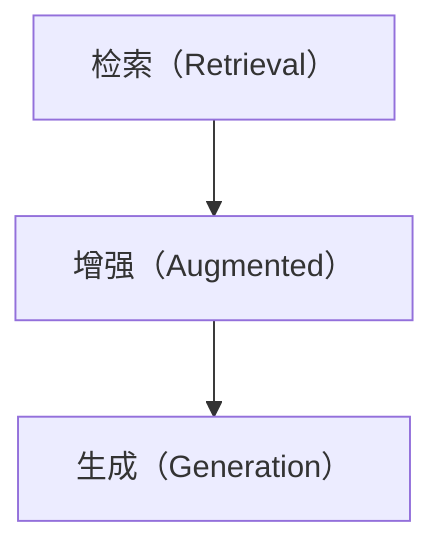
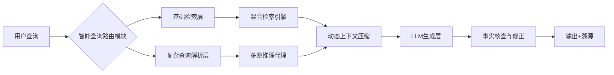
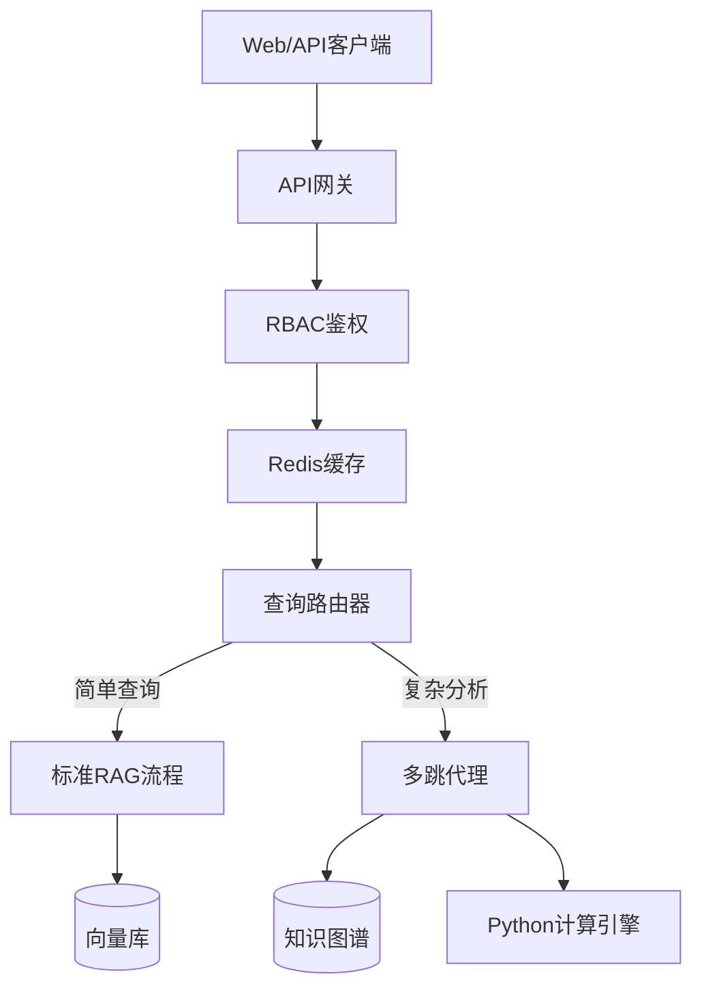

# RAG技术及其应用挑战分析
最近看了一些构建RAG应用相关的文章（放在后面的参考文档中），有下面的一些观点。

> **构建一个RAG应用很简单，把RAG应用做好很难。**
>
> **RAG的尽头是Agent**
>

本文将对这些文档做一个梳理，用自己理解的方式结合大模型的总结将相关内容记录下来，一方面，帮助自己对RAG应用有一个更加全面的理解，另一方面，可以帮助指导如何优化RAG，使RAG向着Agent的方向前进。

本文将从如下几个方面进行介绍：

+ RAG是什么
+ RAG和微调对比
+ RAG的优势/适用场景
+ RAG存在的挑战


## 1. RAG是什么？

*   **核心概念：** RAG（Retrieval augmented generation）是一种结合了**信息检索**和**文本生成**的人工智能架构。它旨在解决大型语言模型固有的局限性，特别是其**知识可能过时、不完整或无法访问特定私有数据**的问题。
*   **工作原理：**
    1.  **检索：** 当用户输入一个问题或指令时，RAG系统首先利用这个查询去**检索**一个外部的、通常是海量的**知识库**（如文档集合、数据库、网页等）。它使用高效的检索算法（如基于向量的相似度搜索）来找到与查询最相关的文本片段或文档。
    2.  **增强：** 检索到的相关文本片段（称为“上下文”或“证据”）被**注入**到发送给LLM的原始提示中。这意味着LLM在生成回答时，不仅能利用自身预训练的知识，还能“看到”这些外部检索到的、与当前问题高度相关的具体信息。
    3.  **生成：** LLM基于**原始查询 + 检索到的上下文**进行理解、推理和整合，最终生成更**准确、相关、信息丰富且事实依据更强**的回答。
   

*   **类比：** 想象一个学者写论文。他不会只凭记忆写，而是先去图书馆（检索）查找相关的书籍和论文（获取上下文），然后阅读、理解和整合这些资料（增强），最后结合自己的知识和找到的资料写出论文（生成）。RAG就是让LLM完成类似的过程。

* **基本流程图**：


## 2. RAG和微调对比

| 特性         | RAG (检索增强生成)                                 | 微调 (Fine-Tuning)                                   |
| :----------- | :------------------------------------------------ | :--------------------------------------------------- |
| **核心机制** | **运行时检索 + 提示增强**：每次查询时动态查找相关信息并入提示。 | **模型参数更新**：在特定数据集上训练模型，调整其内部权重。 |
| **知识来源** | **外部知识库**（可随时更新）。模型知识是静态基础。         | **模型参数内部**。知识固化在更新后的模型中。               |
| **知识更新** | **即时、低成本**：只需更新知识库，无需改动模型本身。       | **复杂、高成本**：需要收集新数据、重新训练模型。           |
| **成本**     | **相对较低**：无需大规模训练，主要成本在检索基础设施和推理。 | **相对较高**：需要大量计算资源进行训练。                   |
| **事实性/幻觉** | **通常更好**：答案基于检索到的具体证据，可追溯来源，减少幻觉。 | **依赖模型**：模型可能基于过时或错误记忆生成内容，幻觉风险仍存在。 |
| **可解释性** | **较高**：生成的答案可以关联回具体的检索来源片段。         | **较低**：模型是黑盒，难以解释答案具体基于哪些信息。       |
| **擅长领域** | **动态信息、特定领域知识、事实密集型任务、需要溯源**。     | **学习特定风格、复杂模式、领域语言、任务指令遵循**。       |
| **数据需求** | **依赖高质量知识库和检索效果**，对标注数据需求相对较低。   | **需要大量高质量的领域特定标注数据**。                 |
| **灵活性**   | **高**：同一模型可轻松切换不同知识库应对不同任务。         | **低**：模型绑定到训练数据任务，切换需重新微调。           |

**总结对比关键点：**
*   **知识新鲜度 & 特定性：** RAG 胜在访问最新、特定、外部海量知识；微调依赖模型内部已编码的知识（训练时的状态）。
*   **成本 & 敏捷性：** RAG 更新知识更便宜快捷；微调更新慢且贵。
*   **事实性 & 可解释性：** RAG 通常提供更可靠、可验证的答案；微调模型可能“自信地胡说”。
*   **学习能力：** 微调能更深入地学习特定任务模式、风格和复杂指令；RAG 更侧重于利用外部信息增强回答。

## 3. RAG的优势/适用场景

*   **优势：**
    *   **访问最新/特定知识：** 突破LLM训练数据的时间限制和通用性限制，利用最新信息或企业私有数据。
    *   **提高事实准确性与减少幻觉：** 答案基于检索到的具体证据，降低了模型编造信息的可能性。
    *   **增强答案相关性：** 确保回答紧扣查询，并包含具体细节。
    *   **可解释性与可溯源：** 可以展示答案所依据的检索来源片段，增加透明度和可信度。
    *   **成本效益：** 无需频繁重新训练昂贵的LLM，更新知识只需维护知识库。
    *   **灵活性：** 同一个基础LLM可以轻松连接到不同的知识库，服务于多种不同领域或任务。
    *   **降低算力要求：** 相较于训练超大模型容纳所有知识，RAG利用高效检索+较小LLM可能更经济。
*   **适用场景：**
    *   **问答系统：** 需要基于最新文档（新闻、研究论文）或内部文档（企业知识库、产品手册）回答事实性问题。
    *   **客服聊天机器人：** 根据产品文档、FAQ、客服记录提供准确、最新的解决方案。
    *   **内容摘要：** 针对特定长文档或文档集合生成摘要（检索相关部分再总结）。
    *   **研究报告/文献综述辅助：** 快速查找和整合相关研究资料。
    *   **代码辅助/文档生成：** 根据项目特定代码库或文档生成代码片段或解释。
    *   **需要高事实性和可验证性的领域：** 医疗咨询（基于最新指南）、法律研究（基于法规案例）、金融分析（基于报告数据）。
    *   **企业知识管理：** 让员工能自然语言查询内部文档、手册、会议记录等。

## 4. RAG存在的挑战

*   **检索质量是关键瓶颈：**
    *   **检索不相关：** 检索系统未能找到真正相关的文档片段，导致LLM基于错误信息生成答案。
    *   **检索不完整：** 遗漏了关键信息片段，导致答案片面或不准确。
    *   **噪声干扰：** 检索到的片段包含无关或低质量信息，干扰LLM生成。
*   **多跳推理能力有限：** 对于需要串联多个检索步骤（检索A -> 基于A检索B -> 综合A&B回答）的复杂问题，当前RAG系统表现往往不佳。
*   **上下文长度限制：** LLM有输入长度限制。检索到过多或过长的相关片段可能无法全部放入提示中，需要有效的信息压缩或选择策略，可能导致信息丢失。
*   **信息整合与生成质量：**
    *   **“抄作业”问题：** LLM可能只是简单地复制粘贴检索到的片段，缺乏有效的整合、重述和推理。
    *   **忽略自身知识：** 有时LLM可能过分依赖检索内容，而忽略了自身有用的通用知识。
    *   **矛盾信息处理：** 当检索到相互矛盾的证据时，LLM可能无法有效辨别和调和。
*   **知识库构建与维护：**
    *   **成本与复杂性：** 构建高质量、结构良好、覆盖面广、更新及时的知识库本身是一项重大工程。
    *   **数据质量：** 知识库中的错误、过时或偏见信息会直接影响RAG的输出。
*   **评估困难：** 评估RAG系统比评估纯LLM更复杂。需要同时评估检索质量（召回率、准确率）和生成质量（事实性、相关性、流畅性），以及两者如何协同作用。传统NLP指标可能不够全面。
*   **延迟：** 检索步骤增加了整体响应时间，可能影响用户体验，尤其是在需要低延迟的场景。
*   **安全性：** 如果知识库包含敏感或有害信息，RAG可能无意中将其检索并整合到输出中。

## 5. 如何构建一个RAG应用

以下是一个针对前述RAG挑战设计的**复杂企业级RAG应用架构**，融合前沿技术解决核心痛点：


### **架构核心设计**



### **关键技术方案与挑战应对**

#### 1. **挑战：检索质量瓶颈**  
   - **解决方案**：  
     - **混合检索引擎**：  
       ```python
       # 并行检索 + 自适应权重融合
       retriever = HybridRetriever(
           vector_store = Milvus(embedding="bge-large-zh", k=10),  # 稠密检索
           sparse_retriever = Elasticsearch(bm25, k=15),          # 稀疏检索
           fusion_algorithm = "RRF"                               # 互逆排序融合
       )
       ```
     - **查询扩展技术**：  
       - 使用 **Query2Doc**：LLM根据原始查询生成伪相关文档，扩展检索关键词  
       - 嵌入 **HyDE（假设性文档嵌入）**：生成假设答案并以其向量检索  

#### 2. **挑战：多跳推理能力弱**  
   - **解决方案**：
     - **查询改写**：将原始查询进行分解
    *示例流程*：  
     `用户问：“公司A 2023年毛利率相比竞争对手B的变化原因？” → 分解：1) 检索A的毛利率 2) 检索B的毛利率 3) 检索行业分析报告 → 综合对比` 
     - **递归检索代理（Recursive RAG Agent）**  
     ```python
     agent = MultiHopAgent(
         step_planner = "ReAct",              # 思维链规划：Reason→Act
         tools = [ 
             Tool("检索2023年报", retriever),  
             Tool("计算财务比率", calculator)
         ],
         verifier = "BERT-based NLI"           # 验证中间步骤合理性
     )
     ```
     

#### 3. **挑战：上下文长度限制**  
   - **解决方案**：**动态上下文压缩**  
     - **SummaRerank 策略**： 
        检索Top-50文档片段 → 2. 用小型T5模型生成每个片段摘要 → 3. 按摘要相关性重排 → 4. 仅输入Top-3完整片段+其他摘要  
     - **FlashAttention-2 优化**：  
       使用支持128K上下文的 **DeepSeek-V2** 模型，降低长文本处理成本
> SummaRerank: 是一种专门针对 RAG 上下文长度限制设计的动态上下文压缩与重排策略，其核心思想是通过“摘要代替原文”来突破大模型输入长度限制，同时保证关键信息不丢失。

#### 4. **挑战：知识库更新延迟**  
   - **实时数据管道**：  
     ```mermaid
     graph TB
     DataSource[数据源] -->|消息队列| Stream[流处理引擎]
     Stream -->|增量更新| VectorDB[向量数据库]
     Stream -->|语义解析| Graph[知识图谱]
     ```
     - 支持：PDF报告自动解析、电话会议语音转文本、终端API实时接入  
     - **版本化知识图谱**：存储历史事实关系（如：“2023Q4→2024Q1毛利率变化”）

#### 5. **挑战：幻觉与事实性错误**  
   - **三层验证机制**：  
     1. **检索证据标注**：生成答案时强制引用来源ID  
     2. **神经逻辑推理层**：  
        ```python
        # 使用DeBERTa-v3训练的事实核查模型
        if FactChecker(query, answer, context).score < 0.8:
            answer = "根据现有资料暂无法确认"
        ```
     3. **输出约束**：用 **Constrained Decoding** 禁止生成未检索到的数字实体

#### 6. **挑战：评估困难**  
   - **量化指标体系**：  
     | 指标                | 测量工具                     |
     |---------------------|-----------------------------|
     | 检索召回率@k        | TREC-style annotation      |
     | 事实一致性(FActScore) | 基于知识图谱的原子事实分解   |
     | 用户修正率          | 前端反馈埋点                |
     | 多跳推理成功率       | HotpotQA评测集迁移测试      |


后续会对每一个挑战进行详细介绍。

### **部署架构**


### **适用场景扩展**
1. **合规审计**：自动比对监管文件与公司披露  
2. **紧急事件分析**：实时抓取新闻+历史报告生成影响简报  
3. **投研助手**：跨文档对比竞争对手技术路线  

通过融合**多模态检索**（图表数据）与**联邦学习**（跨机构安全协作），可进一步扩展边界。


## 总结

RAG是一种强大的范式，通过将动态信息检索与LLM的生成能力相结合，有效弥补了纯LLM在知识时效性、特定性和事实准确性方面的不足。它在需要访问最新或专有信息、强调答案可验证性和事实性的场景中具有显著优势，且成本相对可控。**然而，其性能高度依赖于检索子系统的质量，并且在处理复杂推理、长上下文整合以及知识库维护方面仍面临挑战**。选择RAG还是微调（或结合使用）取决于具体的应用需求、数据可用性、成本预算以及对知识新鲜度、事实性和灵活性的要求。


**参考文档**

1. [https://python.langchain.com/docs/concepts/rag/](https://python.langchain.com/docs/concepts/rag/)
2. [ChatGPT应用：如何征服市场眼中的“万能RAG”](https://zhuanlan.zhihu.com/p/665383403)
3. [大模型微调与RAG检索增强有何区别？一文全面详解-从基础原理到案例分析](https://zhuanlan.zhihu.com/p/29224423956)
4. [大家觉得做一个大模型检索增强生成（RAG）系统，最难搞定的是那部分工作？](https://www.zhihu.com/question/642650878)
5. [https://arxiv.org/pdf/2312.10997](https://arxiv.org/pdf/2312.10997)

