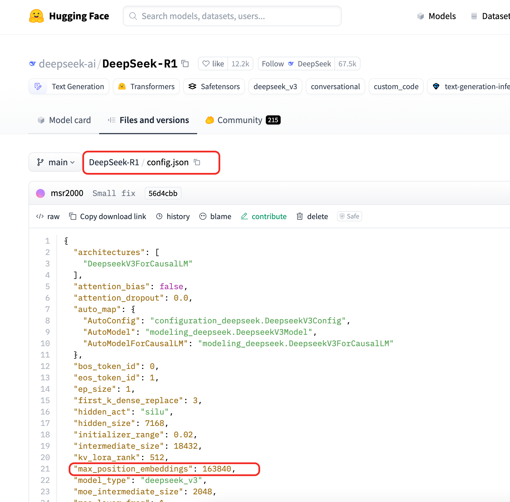
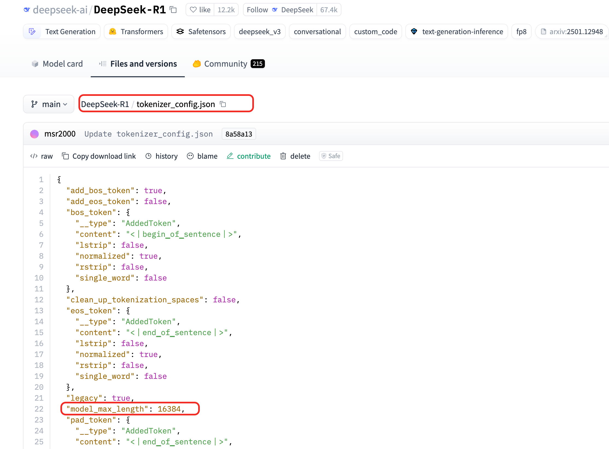

# 【RAG】chunk分块理论篇

> RAG 的尽头就是 Agent
>

## 概述
本文是RAG优化系列的第三篇文章，前面两篇文章分别是：

+ 【RAG优化】将pdf和docx转换为markdown格式
+ 【RAG优化】docling结合OCR实现pdf转markdown

前面两篇文章主要介绍了如何将 pdf 和 docx 文件转换为 markdown 格式文件，接下来我从下面几个方面介绍 RAG 应用中非常重要的一块 **chunk 分块：**

1. RAG与Long-Context之争
2. 为什么在RAG（检索增强生成）应用中需要分块chunk？
3. chunk分块需要考虑哪些问题？
4. chunk分块方法有哪些？

通过本文的学习你将对 chunk 分块有更加深入的了解，可以帮助在 RAG 应用中一定程度提高问答的准确率。

## RAG与Long-Context之争
在继续介绍 chunk 分块方法之前，有必要先了解一下 RAG 和 Long-Context，在知乎上面有一个话题：

[RAG（检索增强生成）会不会消亡呢？](https://www.zhihu.com/question/637421964)一旦大模型的Context Length变大，RAG还有存活的必要吗？

随着大模型上下文 sequence 支持长度越来越长，很多实践和工作发现，其实 RAG 做的事情似乎可以用很长的上下文给到大模型理解。比如可以将一本书直接丢给大模型，是不是就不需要分块chunk和检索了呢？这也是大家的所“争”之处，因为大模型可以接受的长度越长，那么检索的重要性就会降低，对检索效果的依赖就会降低，也就是为什么有人持观点，未来没有RAG，只有Long-Context。但大模型随着输入长度越长，KV Cache所占资源就越多，成本也会剧增，这也是为什么有人持观点，未来也会有RAG。

**接下来分析RAG（检索增强生成）与长上下文模型（Long-Context Models）之间的区别**。

在自然语言处理领域，RAG（检索增强生成）**与**长上下文模型（Long-Context Models）代表了两种处理长文本的核心技术路线。二者的核心目标都是解决模型对长文本的理解和生成问题，但实现方式与适用场景存在显著差异。以下从技术原理、优势劣势、适用场景和未来趋势四个维度展开对比分析：

### **技术原理对比**
| **技术** | **核心思想** | **典型实现** |
| --- | --- | --- |
| **RAG** | 通过检索外部知识库获取相关信息，与用户输入合并后输入生成模型。 | 分块索引文档 → 检索相关段落 → 拼接上下文输入生成模型（如 GPT-3 + FAISS 索引）。 |
| **长上下文模型** | 直接扩展模型的最大上下文窗口，支持一次性输入超长文本（如数万 token）。 | 改进位置编码（如 RoPE、ALiBi）、优化注意力机制（如稀疏注意力）的模型（如 GPT-4 Turbo、Claude 3）。 |

### **优势与劣势对比**
#### **RAG 的优缺点**
| **优势** | **劣势** |
| --- | --- |
| ✅ **轻量化**：无需修改模型架构，适配现有模型（如 GPT-3.5）。 | ❌ **检索依赖性强**：检索质量直接影响生成结果，分块不当导致信息丢失。 |
| ✅ **动态知识更新**：通过更新外部知识库快速集成新数据，避免重新训练模型。 | ❌ **上下文拼接噪声**：检索片段拼接可能引入无关内容，影响生成连贯性。 |
| ✅ **可控性高**：可干预检索阶段（如过滤来源、调整分块策略）。 | ❌ **延迟增加**：检索步骤引入额外计算和 I/O 开销，实时性受限。 |

#### **长上下文模型的优缺点**
| **优势** | **劣势** |
| --- | --- |
| ✅ **端到端处理**：无需额外检索步骤，直接处理完整长文本，上下文更连贯。 | ❌ **静态知识限制**：依赖训练数据，无法动态更新外部知识。 |
| ✅ **全局理解能力**：模型直接感知全文结构（如小说伏笔、长代码文件逻辑）。 | ❌ **计算成本高**：长序列注意力计算复杂度为 O(n²)，推理成本飙升。 |
| ✅ **无信息割裂**：避免分块导致的关键信息分散问题（如跨段落推理）。 | ❌ **实现门槛高**：需改进模型架构（如位置编码、稀疏化），技术难度大。 |

### **适用场景对比**
| **场景** | **RAG 更优** | **长上下文模型更优** |
| --- | --- | --- |
| **开放域问答** | 需实时检索最新知识（如天气、新闻）。 | 需深度理解长文档内部逻辑（如法律条款关联性）。 |
| **文档摘要** | 多文档聚合摘要（如从 100 篇论文中提取领域趋势）。 | 单篇长文档摘要（如技术白皮书的结构化总结）。 |
| **对话系统** | 需要结合用户历史对话和外部知识库（如客服系统调用产品手册）。 | 长对话连贯性维护（如心理治疗对话需回顾早期会话）。 |
| **代码生成** | 需检索 API 文档或代码片段补全（如根据需求匹配相似代码）。 | 理解长代码文件上下文（如跨函数变量追踪）。 |

### **技术挑战对比**
| **挑战** | **RAG** | **长上下文模型** |
| --- | --- | --- |
| **长文本处理** | 分块策略需平衡语义完整性与检索效率（如重叠比例、动态分块）。 | 位置编码外推（Positional Encoding Extrapolation）能力不足，长距离依赖衰减。 |
| **知识更新** | 知识库更新延迟导致生成结果过时（如金融数据时效性）。 | 模型重新训练成本高，难以快速吸收新知识。 |
| **计算效率** | 检索阶段引入向量数据库查询开销，但生成阶段轻量。 | 长序列注意力计算资源消耗大（如 100k token 输入需数百 GB 显存）。 |

总结：RAG的优点在于能够利用外部知识，减少模型幻觉，但需要有效的分块和检索机制；长上下文模型可以处理更长的文本，但可能在计算资源和效率上有挑战。

### **未来趋势：融合而非对立**
#### **混合架构（Hybrid Approach）**
+ **RAG 增强长上下文模型**：  
长上下文模型处理原始文本，RAG 补充外部知识（如 GPT-4 结合实时检索）。  
**案例**：Perplexity.ai 结合 GPT-4 与网络搜索，提升回答准确性。
+ **分级处理（Hierarchical Processing）**：  
先用长上下文模型粗筛文档，再用 RAG 细粒度检索关键段落。  
**案例**：法律文件分析中，先定位相关章节，再提取具体条款。

#### **技术互补方向**
| **技术** | **解决 RAG 痛点** | **解决长上下文模型痛点** |
| --- | --- | --- |
| **检索模型轻量化** | 降低检索延迟（如 TinyBERT 加速向量计算）。 | - |
| **高效注意力机制** | - | 降低长序列计算成本（如 FlashAttention）。 |
| **动态分块算法** | 提升分块语义连贯性（如基于嵌入相似度分块）。 | - |

### **总结：如何选择？**
| **维度** | **选择 RAG** | **选择长上下文模型** |
| --- | --- | --- |
| **知识时效性** | 需要频繁更新外部知识（如新闻、实时数据）。 | 依赖静态知识库（如经典文学分析）。 |
| **文本长度** | 处理超长多文档（如百万 token 级企业知识库）。 | 处理单文档长文本（如学术论文、长篇小说）。 |
| **硬件资源** | 低显存设备，可接受延迟（如边缘计算场景）。 | 高性能 GPU 集群，追求端到端低延迟（如云服务）。 |
| **任务复杂度** | 需结合多源异构数据（如跨数据库、API、文档的问答）。 | 需深度理解长文本内部结构（如代码生成、复杂推理）。 |

**最终建议**：  

+ **资源有限 + 动态知识需求** → 优先 RAG。  
+ **单文档深度分析 + 高算力** → 选择长上下文模型。  
+ **工业级复杂场景** → 探索混合架构（如 Claude 3 + 自建知识库检索）。

## 为什么需要chunk分块
RAG 结合了检索和生成两部分，它的工作流程大概是这样的：当有一个查询进来时，系统会先从大量的文档中检索出相关的信息，然后把这些信息输入到生成模型里，生成最终的答案。那为什么中间需要分块chunk呢？

因为模型有输入长度的限制，如果文档太大了，比如整个文档有几百页，直接输入到检索模型或者生成模型里可能不太行。比如像BERT这样的模型，通常只能处理512个token。如果文档太长，超过这个限制的话，就无法处理整个文档了。这时候就需要把文档切成小块，也就是chunk，每个chunk的大小在模型能处理的范围内。

另外，检索的效率也是一个原因。如果文档没有被分块，直接对整个大文档进行检索，计算相似度可能会很耗时间和资源，而分块成小chunk后，可以并行处理，或者更高效地建立索引，加快检索速度。比如，使用向量数据库的话，每个chunk会被编码成向量，然后在查询时只需要计算查询向量与各个chunk向量的相似度，找到最相关的几个chunk。

总结：

+ **模型输入限制**  
无论是检索模型（如 BERT）还是生成模型（如 GPT），均有固定最大上下文长度（如 512 或 4096 tokens）。未分块的长文本会被截断，导致关键信息丢失。
+ **检索效率与精度**  
大段文本直接检索时，计算相似度的复杂度高且噪声多；细粒度分块可精准定位相关段落，减少无关内容干扰。
+ **信息完整性**  
合理的分块能保留段落内的语义连贯性（如完整保留一个论点或案例），避免上下文断裂。
+ **成本控制**  
过大的块会增加向量化存储和计算成本，过小的块可能无法提供足够上下文，分块可平衡成本与效果。

## 查看模型接受的最大上下文长度
从前面的分析可以知道：chunk分块的一个原因是模型输入长度的限制，所以自然地想知道如何查看模型可接受的最大上下文长度，这个对于后续chunk分块非常有用。

不同的模型可以接受不同的上下文长度，我们可以通过模型的配置文件 `config.json` 和 `tokenizer` 的配置文件 `tokenizer_config.json`查看模型可接受的最大上下文长度。

在 huggingface 上面找到 `[DeepSeek-R1](https://huggingface.co/deepseek-ai/DeepSeek-R1/tree/main)`，在`config.json`中有`"max_position_embeddings":163840`，如下图所示：

在`tokenizer_config.json`中有`"model_max_length":16384`，如下图所示，表示可以接受的**最大 token 数为 16K：**

### **model_max_length ****核心作用**
`**model_max_length**` 定义了该分词器在设计时所适配的模型能处理的**最大单次输入长度（以token数为单位）**。例如：

+ **DeepSeek-R1**模型设置为 **16384**。
+ **Qwen3**等长上下文模型可能设置为 **131072** 或更高。

它的主要功能是：

+ **自动截断**：当输入文本转换后的token数超过该值时，默认触发截断（需配合`**truncation=True**`参数）。
+ **警告机制**：若输入超过此长度且未启用截断，可能引发警告或错误。
+ **指导预处理**：为开发者提供参考，确保输入适配模型能力。

**注意**：直接修改`**model_max_length**`不会扩展模型的真实处理能力。若需处理更长文本，需使用支持长上下文的模型（如Longformer）或调整位置编码。

### **与模型配置的关系**
+ **关联参数**：模型的`**max_position_embeddings**`（如BERT的`**config.json**`中定义）决定了模型的**实际位置编码能力**。
+ **一致性要求**：理想情况下，`**model_max_length**`应与`**max_position_embeddings**`一致。若二者不一致：
    - 当`**model_max_length**` < `**max_position_embeddings**`：可能导致输入被不必要地截断。
    - 当`**model_max_length**` > `**max_position_embeddings**`：模型可能无法正确处理超长输入（位置编码未训练到该长度）。

### **总结**
`**model_max_length**`是Tokenizer与模型协同工作的“桥梁”参数，作用包括：

1. **输入规范化**：确保输入适配模型的默认处理能力。
2. **开发者提示**：明确模型设计的最大长度限制。
3. **预处理控制**：通过截断或分块策略管理长文本。

## 分块需要考虑的因素
在语义搜索中，用户查询根据语义检索文档语料库中的相关文档，每个文档包含一个特定主题的有价值的信息。通过使用有效的分块策略，我们可以确保搜索结果准确地匹配用户查询的本质。如果我们的块太小或太大，可能会导致检索到不完整的内容或者不精确的搜索结果。根据经验，文本块应该尽量是语义独立的，也就是没有对上下文很强的依赖，这样对语言模型来说是最易于理解的。因此**为语料库中的文档找到最佳块大小或者保证文本块的语义完整性，对于确保搜索结果的准确性和相关性至关重要。简言之就是找到让文本块既保持可读性又保持语义的最佳边界。**

**chunk分块要考虑的问题是：**

+ **块大小（Chunk Size）**
    - 过小：丢失上下文，检索结果碎片化（如无法回答需要跨段落推理的问题）。
    - 过大：包含冗余信息，增加计算成本，超出模型限制。
    - **经验值**：通常 256-512 tokens（根据模型能力调整）。
+ **重叠策略（Overlap）**
    - 相邻块间保留部分重叠内容（如 10-20%），减少边界信息割裂（例如前一块末尾与后一块开头重叠）。
+ **语义边界识别**
    - 按段落、标题、标点或 NLP 工具（如 spaCy）划分，确保块内语义完整。
+ **文本类型适配**
    - 技术文档、小说、对话等不同文本需差异化分块（如对话按轮次分块）。
+ **多语言支持**
    - 中文、英文等语言的分词方式不同，需适配对应的分词器（Tokenizer）。

## chunk分块方法
以下是 **分块方法** 的总结表格，涵盖方法描述、优缺点及适用场景：

| **分块方法** | **方法描述** | **优点** | **缺点** | **适用场景** |
| --- | --- | --- | --- | --- |
| **按字符分块** | 基于固定字符数切分文本（如每 200 个字符一个块）。 | ✅ 实现简单   ✅ 无需依赖分词工具 | ❌ 破坏单词/句子结构   ❌ 多语言适配性差 | 简单文本预处理或日志分析 |
| **按 Token 分块** | 基于模型分词器（Tokenizer）的 token 数切分（如每 256 tokens 一个块）。 | ✅ 适配模型输入限制   ✅ 计算成本低 | ❌ 可能切断语义边界   ❌ 依赖分词器性能 | 适配预训练模型（如 BERT、GPT） |
| **按语义分块** | 利用 NLP 工具或规则识别语义边界（如句子、段落、章节）。 | ✅ 保留语义完整性   ✅ 适配结构化文本 | ❌ 依赖文本结构或模型   ❌ 计算成本高 | 技术文档、论文、法律条款 |
| **按 Markdown 层次化分块** | 根据 Markdown 标题层级（如 `#`、`##`）划分块，保留文档结构。 | ✅ 保持文档逻辑结构   ✅ 无需复杂 NLP 处理 | ❌ 仅支持 Markdown 格式   ❌ 格式错误导致分块失败 | 技术文档、API 文档、README 文件 |
| **动态分块** | 根据文档类型和内容动态调整块大小（如html文件，json文件，代码等使用不同的分块策略）。 | ✅ 灵活适配文本特性   ✅ 优化信息覆盖率 | ❌ 实现复杂度高   ❌ 需定制规则或模型 | 异构文档混合处理（如多格式知识库） |

### **补充说明**
1. **按字符分块**  
    - **典型工具**：Python 字符串切片（如 `text[i:i+200]`）。  
    - **问题示例**：中文无空格分隔，按字符切分易破坏词语（如将“人工智能”切为“人工智|能”）。
2. **按 Token 分块**  
    - **典型工具**：Hugging Face `AutoTokenizer`、LangChain `TokenTextSplitter`。  
    - **注意事项**：需与模型的 `max_position_embeddings` 参数匹配。
3. **按语义分块**  
    - **典型工具**：`spaCy`（段落分割）、`nltk.sent_tokenize`（句子分割）、正则表达式（按标点切分）。  
    - **示例**：技术文档按 `## 二级标题` 分块。
4. **按 Markdown 层次化分块**  
    - **典型工具**：正则表达式（如 `r'^#+\s+.+'` 匹配标题）、`markdown-it` 解析库。  
    - **扩展应用**：结合目录（TOC）生成多级索引。
5. **动态分块**  
    - **实现思路**：  
        * **基于规则**：技术文档中代码块密集区域切小块，冗余描述切大块。  
        * **基于模型**：用嵌入相似度检测内容密度（如相邻句子相似度高则合并为大块）。

### **选择建议**
| **场景需求** | **推荐方法** | **示例** |
| --- | --- | --- |
| 处理 API 文档 | Markdown 层次化分块 | 按 `## 接口定义` 分割章节 |
| 多语言混合文本 | 按 Token 分块 | 适配多语言分词器（如 `XLM-R`） |
| 实时日志分析 | 按字符分块 | 快速切割日志行（每 500 字符一个块） |
| 法律合同解析 | 按语义分块 | 按条款（`Article 1.`）分割 |
| 混合格式企业知识库 | 动态分块 | 技术文档小块 + 会议记录大块 |

通过合理选择分块方法，可显著提升检索增强生成（RAG）系统的准确性和效率。

## chunk分块实践
接下来主要使用 langchain 提供的工具对前面的chunk分块方法进行实践，下面内容都是在notebook中进行实践的，然后将内容转换为markdown格式。

**因为这边文章越来越长了，所以chunk分块相关的内容分为理论篇和实践篇，关于实践的具体内容请查看下一篇文章。**

## 总结
分块chunk是平衡模型限制、检索效率与信息完整性的必要手段，直接影响RAG系统的性能。合理的分块策略需结合模型能力、应用需求及文本特性，通过实验调优以达到最佳效果。

参考文档

1. [https://medium.com/towards-data-science/rag-101-chunking-strategies-fdc6f6c2aaec](https://medium.com/towards-data-science/rag-101-chunking-strategies-fdc6f6c2aaec)
2. [https://python.langchain.com/docs/how_to/markdown_header_metadata_splitter/](https://python.langchain.com/docs/how_to/markdown_header_metadata_splitter/)
3. [https://zhuanlan.zhihu.com/p/673906072](https://zhuanlan.zhihu.com/p/673906072)
4. [https://github.com/FullStackRetrieval-com/RetrievalTutorials/blob/main/tutorials/LevelsOfTextSplitting/5_Levels_Of_Text_Splitting.ipynb](https://github.com/FullStackRetrieval-com/RetrievalTutorials/blob/main/tutorials/LevelsOfTextSplitting/5_Levels_Of_Text_Splitting.ipynb)
5. [https://luxiangdong.com/2023/09/20/chunk/](https://luxiangdong.com/2023/09/20/chunk/)
6. [Retrieval Augmented Generation or Long-Context LLMs?A Comprehensive Study and Hybrid Approach](https://arxiv.org/pdf/2407.16833)
7. [https://python.langchain.com/docs/how_to/](https://python.langchain.com/docs/how_to/)

