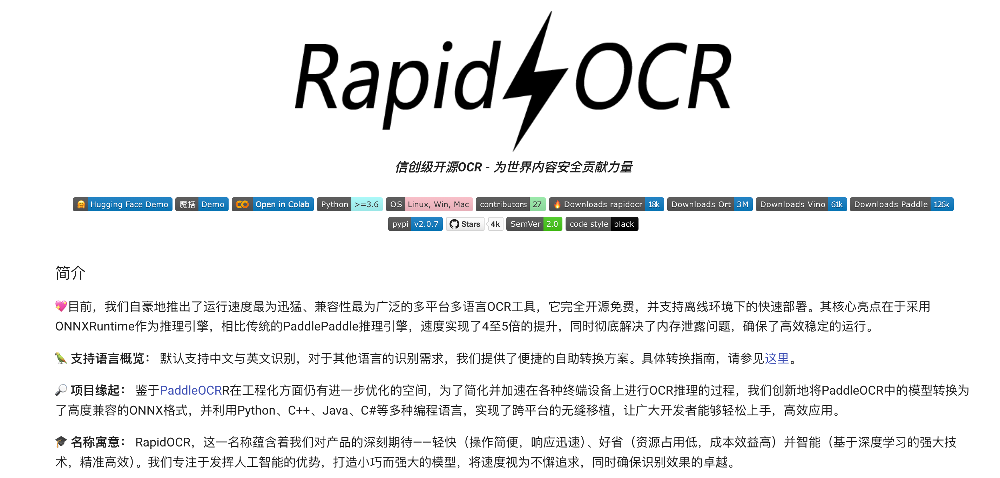
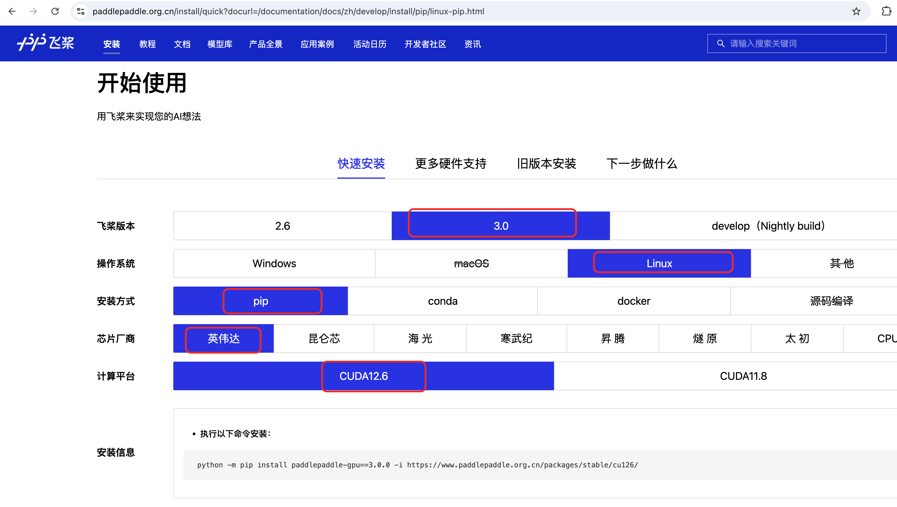
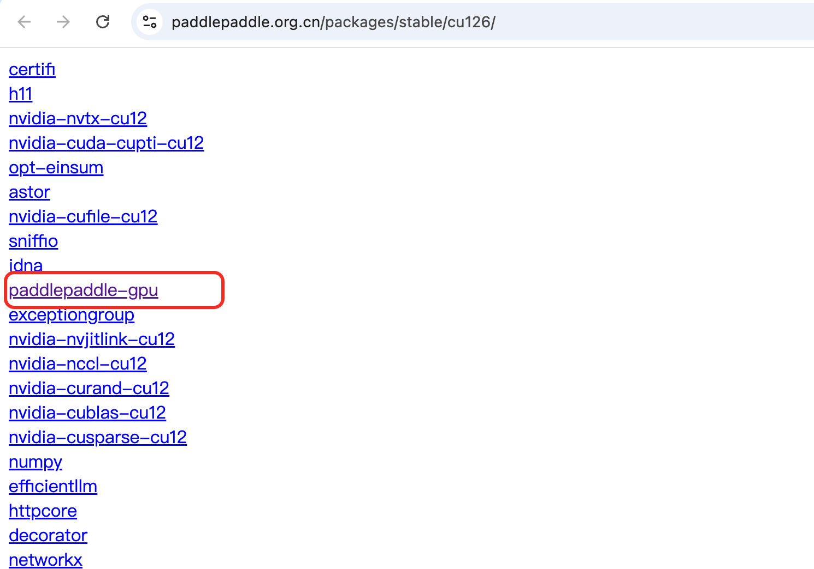
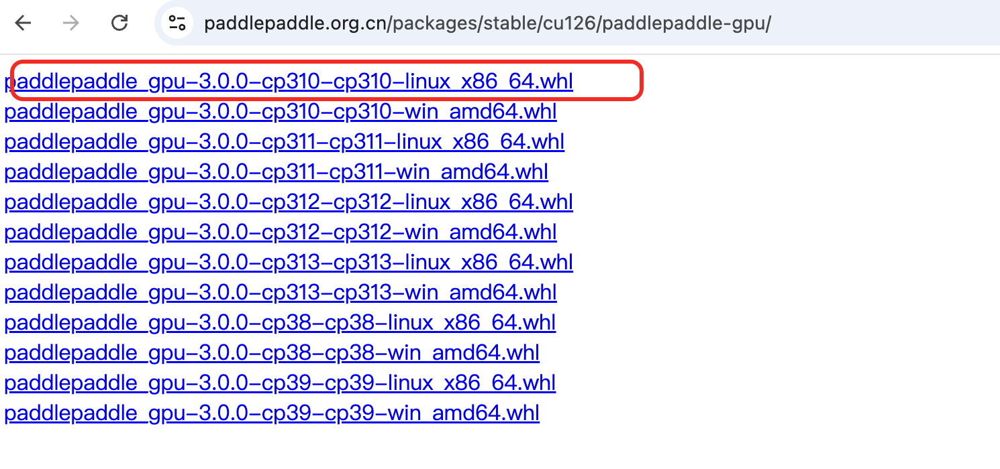
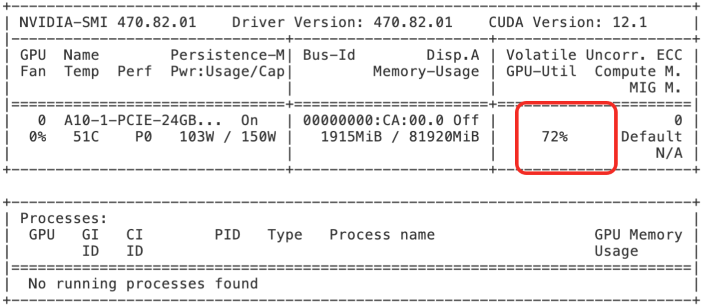

# docling结合OCR实现pdf转markdown
## 概述
前面写了一篇文章 **将pdf和docx转换为markdown格式** 介绍了使用一些开源工具转换pdf为markdown的效果对比，得出的结论是： 使用 docling 转换 pdf 为 markdown 格式的效果最好，并且docling使用的是 MIT licence。

在直接使用docling模型转换pdf文件为markdown格式时，如果pdf文件中有很多图片，或者pdf中的内容被模型直接识别为了图片，这种情况如何使用 docling 将 pdf 中图片中的内容提取出来呢？这就需要使用docling结合OCR实现pdf转markdown，本文主要介绍一下docling结合OCR的详细使用方法。

本文是在阅读了 docling 的官方文档和源码，以及 RapidOCR 的官方文档，并且经过大量测试和实践进行总结，在实践过程中踩了一些坑，比如：

+ 如何下载ocr模型
+ 如何与langchain结合
+ 如何实现 docling + ocr 在gpu上面运行
+ 如何保存图片并存储到oss

> 如果有兴趣可以先查看下面的文档
>
> docling 官方文档：[https://docling-project.github.io/docling/examples/rapidocr_with_custom_models/](https://docling-project.github.io/docling/examples/rapidocr_with_custom_models/)
>
> RapidOCR 官方文档：[https://rapidai.github.io/RapidOCRDocs/install_usage/rapidocr_paddle/usage/](https://rapidai.github.io/RapidOCRDocs/install_usage/rapidocr_paddle/usage/)
>

记录本文的目的是帮助有同样需求的小伙伴少走弯路，避免踩坑，如果你觉得本文内容对你有帮助，欢迎点赞收藏😀，如果发现有疏漏或者错误的地方，也欢迎评论🤝。

通过本文的学习你将部署一个生产可用的高效的pdf转markdown的服务，特别是在RAG应用中非常有用，后续我将写一篇文章介绍如何将markdown文件切分为有层级结构的chunk（按照标题和段落切分），帮助在RAG应用提高问答的准确率，请持续关注。

## pdf 转 markdown 文件效果演示
在 arxv 上面找一个pdf文件，然后使用docling 集成 ocr 转换为 markdown 文件格式示例如下：

| [原pdf](https://arxiv.org/pdf/2505.02171) | 转换后的markdown，并保存图片到oss，可以直接预览图片 |
| --- | --- |
|  |  |


## docling支持的OCR模型
首先查看[docling源码支持哪些ocr模型](https://github.com/docling-project/docling/blob/main/docling/models/plugins/defaults.py)，如下所示：

```python
from docling.models.easyocr_model import EasyOcrModel
from docling.models.ocr_mac_model import OcrMacModel
from docling.models.picture_description_api_model import PictureDescriptionApiModel
from docling.models.picture_description_vlm_model import PictureDescriptionVlmModel
from docling.models.rapid_ocr_model import RapidOcrModel
from docling.models.tesseract_ocr_cli_model import TesseractOcrCliModel
from docling.models.tesseract_ocr_model import TesseractOcrModel


def ocr_engines():
    return {
        "ocr_engines": [
            EasyOcrModel,
            OcrMacModel,
            RapidOcrModel,
            TesseractOcrModel,
            TesseractOcrCliModel,
        ]
    }


def picture_description():
    return {
        "picture_description": [
            PictureDescriptionVlmModel,
            PictureDescriptionApiModel,
        ]
    }
```

可以看到 docling 默认支持 5 种 ocr 模型，使用模型总结一下它们的区别，详细的区别请查阅相关文档。

以下是列出的五种 OCR 引擎模型的区别、优缺点及对应的技术背景分析：

| 引擎 | 速度 | 精度 | 资源占用 | 多语言 | 适用场景 |
| --- | --- | --- | --- | --- | --- |
| EasyOCR | 中 | 高 | 高 | 80+ | 自然场景、多语言混合 |
| macOS OCR | 快 | 中 | 低 | 10+ | macOS 生态、实时性要求高 |
| RapidOCR | 极快 | 中高 | 低 | 20+ | 实时处理、低配硬件 |
| Tesseract | 慢 | 中 | 中 | 100+ | 扫描文档、结构化文本 |
| Tesseract CLI | 慢 | 中 | 中 | 100+ | 批量处理、自动化脚本 |


这里选择 RapidOCR 模型和 docling 进行集成，关于 [RapidOCR 的介绍](https://rapidai.github.io/RapidOCRDocs/main/)如下：




## 下载docling模型和RapidOCR模型
在国内直接从 [modelscope](https://www.modelscope.cn/models) 下载[docling模型](https://www.modelscope.cn/models/ds4sd/docling-models/files)和RapidOCR模型即可。

1. 在下载前，请先通过如下命令安装ModelScope

```shell
pip install modelscope
```

2. 下载模型到指定目录

```python

from modelscope import snapshot_download
# docling 模型下载，local_dir指定模型路径
docling_model_dir = snapshot_download(
    model_id='ds4sd/docling-models',
    local_dir='./docling_model'
)
print(f'下载docling模型路径: {docling_model_dir}')

# rapidocr 模型下载，local_dir指定模型路径
rapidocr_model_dir = snapshot_download(
    model_id='RapidAI/RapidOCR', 
    local_dir='./rapidocr_model'
)
print(f'下载ocr模型路径: {rapidocr_model_dir}')
```

## docling集成langchain
在 github 上面有一个开源库[docling-langchain](https://github.com/docling-project/docling-langchain) 已经将 docling 和 langchain 进行了集成，有兴趣可以查看[langchain中的文档](https://python.langchain.com/docs/integrations/document_loaders/docling/)。因为后面会将 pdf 中的图片保存到 oss 中，这些自定义的功能在这个开源库中不方便实现，所以这里我将通过自定义一个类 `Pdf2MarkdownLoader` 继承 `langchain` 的 `BasePDFLoader`，并重新实现`load()`方法来实现相关的功能，实现代码如下：

```python
class Pdf2MarkdownLoader(BasePDFLoader):

    def __init__(
            self,
            file_path: str,
            model_path: str = '/Users/xiniao/大模型/RAG_Techniques/docling-models',
            do_ocr: bool = True,
            generate_picture_images: bool = True,
            images_scale: float = 2.0,
            do_image_upload: bool = False,
            bucket: oss2.Bucket = None,
            device: str = 'cpu',
            output_dir: str = 'markdown_files'
    ) -> None:
        """Initialize with a file path."""
        try:
            from docling.document_converter import DocumentConverter  # noqa:F401
        except ImportError:
            raise ImportError(
                "`docling` package not found, please install it with "
                "`pip install docling`"
            )

        super().__init__(file_path)
        self.model_path = model_path
        self.do_ocr = do_ocr
        self.generate_picture_images = generate_picture_images
        self.images_scale = images_scale
        self.do_image_upload = do_image_upload
        self.bucket = bucket
        self.device = device

        self.output_dir = Path(output_dir)
    def load(self) -> list[Document]:
        # todo 在后续的介绍中实现
        pass
```

## 部署RapidOCR到CPU
参考docling的文档，docling 集成 rapidocr 在 cpu 运行的代码如下：

```python
import os
from docling.datamodel.pipeline_options import PdfPipelineOptions, RapidOcrOptions
from docling.document_converter import (
    ConversionResult,
    DocumentConverter,
    InputFormat,
    PdfFormatOption,
)

def main():
    # Source document to convert
    source = "https://arxiv.org/pdf/2408.09869v4"

    # Setup RapidOcrOptions for english detection
    det_model_path = os.path.join(
        rapidocr_model_dir, "PP-OCRv4", "en_PP-OCRv3_det_infer.onnx"
    )
    rec_model_path = os.path.join(
        rapidocr_model_dir, "PP-OCRv4", "ch_PP-OCRv4_rec_server_infer.onnx"
    )
    cls_model_path = os.path.join(
        rapidocr_model_dir, "PP-OCRv3", "ch_ppocr_mobile_v2.0_cls_train.onnx"
    )
    ocr_options = RapidOcrOptions(
        det_model_path=det_model_path,
        rec_model_path=rec_model_path,
        cls_model_path=cls_model_path,
    )

    pipeline_options = PdfPipelineOptions(
        ocr_options=ocr_options,
    )

    # Convert the document
    converter = DocumentConverter(
        format_options={
            InputFormat.PDF: PdfFormatOption(
                pipeline_options=pipeline_options,
            ),
        },
    )

    conversion_result: ConversionResult = converter.convert(source=source)
    doc = conversion_result.document
    md = doc.export_to_markdown()
    print(md)

if __name__ == "__main__":
    main()
```

## 部署RapidOCR到GPU
### 如何选择推理引擎
参考 [RapidOCR推理引擎选择指南](https://rapidai.github.io/RapidOCRDocs/v1.4.4/blog/2022/10/04/which-inference/)，将RapidOCR部署到GPU推荐使用：`rapidocr_paddle`。

**推荐理由：**

PaddleOCR模型本身就是由PaddlePaddle框架训练而来的，PaddlePaddle框架原生支持在CPU和GPU上推理PaddleOCR相关模型。

rapidocr_paddle包是基于PaddlePaddle框架作为推理引擎的，支持CPU和GPU上推理，推荐GPU端使用。

原因是ONNXRuntime和OpenVINO在GPU上支持较差：

+ onnxruntime-gpu：在动态输入情况下，推理速度要比CPU慢很多，而OCR任务就是动态输入，因此不推荐使用onnxruntime-gpu版推理。
+ rapidocr_openvino: 出自英特尔，只适配自家GPU。

CPU端还是以rapidocr_onnxruntime和rapidocr_openvino为主。毕竟PaddlePaddle的CPU端还是比较重的。

值得说明的是，这个包和PaddleOCR相比，代码基本都是一样的，只不过这个库将里面核心推理代码抽了出来，更加精简而已。

### 在 gpu 上面运行 RapidOCR 步骤
#### 安装PaddlePaddle框架GPU版
安装PaddlePaddle框架GPU版，并验证可行性，详细参见: [官方教程](https://www.paddlepaddle.org.cn/install/quick?docurl=/documentation/docs/zh/install/pip/linux-pip.html)。这里打算将rapidocr部署到 linux 系统中，使用英伟达的 GPU 版本为 12.1。

> 直接查看 CUDA 工具包版本的命令为：`**nvcc --version**`
>
> **快速查看 CUDA 版本（依赖驱动）的命令为：**`**nvidia-smi**`
>

选择如下图所示：



使用 pip 安装 `paddlepaddle-gpu`的命令如下：

```shell
 python -m pip install paddlepaddle-gpu==3.0.0 -i https://www.paddlepaddle.org.cn/packages/stable/cu126/
```

直接运行前面的命令会报错，报错信息如下：

```shell
 ~ %  python3 -m pip install paddlepaddle-gpu==3.0.0 -i https://www.paddlepaddle.org.cn/packages/stable/cu126/
Looking in indexes: https://www.paddlepaddle.org.cn/packages/stable/cu126/
ERROR: Could not find a version that satisfies the requirement paddlepaddle-gpu==3.0.0 (from versions: none)

[notice] A new release of pip is available: 24.3.1 -> 25.1.1
[notice] To update, run: pip3 install --upgrade pip
ERROR: No matching distribution found for paddlepaddle-gpu==3.0.0
```

从报错信息可以发现，在仓库 `[https://www.paddlepaddle.org.cn/packages/stable/cu126/](https://www.paddlepaddle.org.cn/packages/stable/cu126/)`中找不到 `paddlepaddle-gpu==3.0.0`，接下来将介绍一下我是如何一步步解决这个问题的。

1. 首先 [pypi 仓库](https://pypi.org/project/paddlepaddle-gpu/)中搜索 `paddlepaddle-gpu`对应的包信息，发现最新的只有`paddlepaddle-gpu 2.6.2`，它不支持 cuda 12.1。
2. 然后进入仓库 `[https://www.paddlepaddle.org.cn/packages/stable/cu126/](https://www.paddlepaddle.org.cn/packages/stable/cu126/)`，找到`paddlepaddle-gpu`，如下图所示：



3. 最后进入 `paddlepaddle-gpu`目录，因为这里使用的使用 python3.10，使用的是 linux系统，所以下载的python包如下图所示，你可以根据你的系统和python版本下载对应的 python 包：



4. 下载完成后，将对应的包传入到服务器中，然后使用下面的命令安装 `paddlepaddle-gpu`包：

```shell
pip install paddlepaddle_gpu-3.0.0-cp310-cp310-linux_x86_64.whl
```


5. 安装 `paddlepaddle-gpu`包完成后，可以使用下面的代码来验证是否安装成功：

```python
import paddle

print(paddle.utils.run_check())
# 如果出现PaddlePaddle is installed successfully!，说明您已成功安装。
```

这里在notebook中的运行结果如下图所示，说明`paddlepaddle-gpu`包已经安装成功：


#### 安装rapidocr_paddle
安装`paddlepaddle-gpu`包成功后，需要使用下面的命令安装 `rapidocr_paddle`包：

```shell
pip install rapidocr_paddle
```

#### 基本使用
安装`paddlepaddle-gpu`包和 `rapidocr_paddle`包都成功后，可以使用下面的代码来验证 rapidocr 模型是否能正常运行：

```python
import cv2

from rapidocr_paddle import RapidOCR

# 注意这里的参数
engine = RapidOCR(det_use_cuda=True, cls_use_cuda=True, rec_use_cuda=True)

image_path = "tests/test_files/ch_en_num.jpg"
result, elapse_list = engine(image_path)
```

在运行过程中可以使用下面的命令查看 gpu 的使用情况，实时监控 GPU 使用率命令（每 2 秒刷新一次）：

```shell
nvidia-smi -l 2
```

运行的结果如下图所示，这里的gpu使用率达到了 72%：



## 保存图片并存储到oss
接下来介绍一下如何将pdf转markdown过程中，模型识别出的图片保存下来，并自动上传到oss中，以便在markdown文件中预览图片。

将pdf转markdown过程中，保存模型识别出的图片有两个步骤：

1. 查阅 [docling 的官方文档](https://docling-project.github.io/docling/examples/export_figures/)，发现可以在创建 `PdfPipelineOptions`时，通过设置参数 `generate_picture_images = True`来控制是否生成图片。

代码示例如下：

```python
pipeline_options = PdfPipelineOptions(
            artifacts_path=self.model_path, # docling模型的路径
            do_ocr=self.do_ocr,  # 控制是否进行 ocr 识别
            ocr_options=ocr_options,  # ocr 模型相关的配置
            # do_picture_description=True,
            generate_picture_images=self.generate_picture_images, # 控制是否生成图片
            images_scale=self.images_scale。# 保存图片的像素比例 scale * 72
        )
```

2. 在使用`document.save_as_markdown()`方法保存markdown文件内容的时候需要指定参数 `image_mode=ImageRefMode.REFERENCED`，在 `ImageRefMode`中有三种保存图片的模式：

```python
class ImageRefMode(str, Enum):
    """ImageRefMode."""

    PLACEHOLDER = "placeholder"  # just a place-holder
    EMBEDDED = "embedded"  # embed the image as a base64
    REFERENCED = "referenced"  # reference the image via uri

```

| **模式** | **描述** | **典型场景** |
| --- | --- | --- |
| `<font style="color:rgb(13, 18, 57);">PLACEHOLDER</font>` | <font style="color:rgb(13, 18, 57);">仅保留图像的占位符，不实际存储或引用图像数据。</font> | <font style="color:rgb(13, 18, 57);">图像尚未加载、临时标记、或仅需要位置标记的场景。</font> |
| `<font style="color:rgb(13, 18, 57);">EMBEDDED</font>` | <font style="color:rgb(13, 18, 57);">将图像数据直接嵌入到当前载体中（如通过 Base64 编码）。</font> | <font style="color:rgb(13, 18, 57);">需要将图像与文档/数据包绑定（如 PDF、JSON 配置）。</font> |
| `<font style="color:rgb(13, 18, 57);">REFERENCED</font>` | <font style="color:rgb(13, 18, 57);">通过 URI（如 URL、文件路径）引用外部图像资源。</font> | <font style="color:rgb(13, 18, 57);">图像存储在独立位置（如网络图片、本地文件系统）。</font> |


代码示例如下：

```python
# 没有提供artifacts_dir的时候，函数会根据filename自动生成一个目录路径。
# 比如，假设filename是/path/to/file.txt，那么artifacts_dir会被设置为/path/to/file_artifacts。
# 这里的逻辑是去掉原文件的扩展名，然后在后面加上_artifacts作为目录名
conv_res.document.save_as_markdown(
    filename=md_filename,
    image_mode=ImageRefMode.REFERENCED
)
```


使用上面两个步骤，可以将pdf中的图片保存到本地，下面定义一个方法，用于将 markdown 文件中的图片上传到 oss 中，并用 oss 的地址替换原来的图片：

```python
def replace_local_images_with_oss_url(
        content: str,
        bucket: oss2.Bucket = None,
        expires: int = 60 * 60 * 24 * 365 * 5,
        location: str = 'kg/document/image/',
        image_folder: Path = None
):
    """
    替换Markdown文件中的本地图片路径为OSS URL
    @param content: Markdown文件内容
    @param bucket: oss2.Bucket对象
    @param expires: 预览链接过期时间，单位秒，默认为一年
    @param location: OSS文件夹路径
    """
    import re
    if not bucket:
        logger.error('bucket is None, 请检查oss2.Bucket对象是否正确初始化, 返回原始内容')
        return content

    # 匹配Markdown文件中的图片路径
    pattern = r'!\[(.*?)\]\((.*?)\)'
    matches = re.findall(pattern, content)
    logger.info(f'匹配到 {len(matches)} 张图片')
    replace_num = 0

    new_content = content
    # 上传并替换图片
    for alt_text, image_path in matches:
        old_image_path = f""
        # 判断图片文件是否存在
        img_path = Path(image_path)
        if image_folder:
            img_path = image_folder / img_path
        if not img_path.exists():
            logger.warning(f"图片文件不存在: {image_path}")
            continue
        filename = img_path.stem
        suffix = img_path.suffix
        # 构造OSS文件名，确保不重复
        unique_name = generate_uuid(filename)
        file_key = f"{unique_name}_image_{replace_num:03}{suffix}"
        if location.endswith('/'):
            file_key = f"{location}{file_key}"
        else:
            file_key = f"{location}/{file_key}"
        filename = str(img_path.absolute())
        # 上传图片到OSS
        result = bucket.put_object_from_file(key=file_key, filename=filename)
        if result.status == 200:
            preview_url = bucket.sign_url(method='GET', key=file_key, expires=expires)
        else:
            logger.error(f"图片上传失败: {result.status} {result.reason}")
            preview_url = None

        # 替换图片路径
        if preview_url:
            preview_url = str(preview_url).replace('internal', 'office', 1)
            # 如果预览地址过期，可以通过new_alt_text，将"_"替换为"/"作为oss的key，重新生成预览地址
            new_alt_text = file_key.replace('/', '_')
            new_image_path = f""

            new_content = new_content.replace(old_image_path, new_image_path)
            replace_num += 1
            logger.info(f"Replacing {old_image_path} with {new_image_path}")

    logger.info(f"替换完成，共替换 {replace_num} 张图片")
    return new_content

```


## 修改docling源码
使用 docling 集成 RapidOCR 模型在 GPU 上面运行时，查看docling源码 [https://github.com/docling-project/docling/blob/main/docling/models/rapid_ocr_model.py](https://github.com/docling-project/docling/blob/main/docling/models/rapid_ocr_model.py)，**<font style="color:rgb(31, 35, 40);background-color:rgb(246, 248, 250);">rapid_ocr_model.py</font>** 默认情况下使用的是

`from rapidocr_onnxruntime import RapidOCR `。

如果直接运行的话，会有如下的告警信息：

> github相同issue: [https://github.com/docling-project/docling/issues/1143](https://github.com/docling-project/docling/issues/1143)
>

```shell
XGPU-lite: L-222:vGPU version: 2010, CUDA driver version: 12010
XGPU-lite: L-142:vGPUs:VGPU-34d49a72-ff09-9917-96e1-77378cb1f695.2 count:1 pGPUs:GPU-34d49a72-ff09-9917-96e1-77378cb1f695
XGPU-lite: L-73:vgpu client init done, hostID:90c56bdef158 PID:423712 gpuCnt:1 vir-ratio:1 vdev-ratio:1
XGPU-lite: L-86:pGPU used:GPU-34d49a72-ff09-9917-96e1-77378cb1f695
XGPU-lite: L-98:Job hostID:90c56bdef158 pid:423712 desc:python3.10 connecting to XGPU service ...
XGPU-lite: L-127:HostID:90c56bdef158 pid:423712 XGPU connected jobIdx:0 token:0
XGPU-lite: L-150:Client configuration: use_uma = 1, compute_schedule_mode: 4, need_launch_kernel_admission: 0, time_slice_spin_or_cv: 1, enable_heart_beat: 0, enable_monitor: 0.
XGPU-lite: L-235:func: cuInit, pid: 423712, tid: 423712, flags: 0
XGPU-lite: L-115:The device count is 1.
XGPU-lite: L-135:The device uuid string is 34d49a72-ff09-9917-96e1-77378cb1f695.
XGPU-lite: L-142:Find vGPU VGPU-34d49a72-ff09-9917-96e1-77378cb1f695.2 for the pGPU 34d49a72-ff09-9917-96e1-77378cb1f695
2025-05-07 19:59:54,030 - OrtInferSession - WARNING: CUDAExecutionProvider is not in available providers (['AzureExecutionProvider', 'CPUExecutionProvider']). Use AzureExecutionProvider inference by default.
2025-05-07 19:59:54,031 - OrtInferSession - INFO: !!!Recommend to use rapidocr_paddle for inference on GPU.
2025-05-07 19:59:54,031 - OrtInferSession - INFO: (For reference only) If you want to use GPU acceleration, you must do:
2025-05-07 19:59:54,031 - OrtInferSession - INFO: First, uninstall all onnxruntime pakcages in current environment.
2025-05-07 19:59:54,031 - OrtInferSession - INFO: Second, install onnxruntime-gpu by `pip install onnxruntime-gpu`.
2025-05-07 19:59:54,031 - OrtInferSession - INFO:       Note the onnxruntime-gpu version must match your cuda and cudnn version.
2025-05-07 19:59:54,031 - OrtInferSession - INFO:       You can refer this link: https://onnxruntime.ai/docs/execution-providers/CUDA-EP.html
2025-05-07 19:59:54,031 - OrtInferSession - INFO: Third, ensure CUDAExecutionProvider is in available providers list. e.g. ['CUDAExecutionProvider', 'CPUExecutionProvider']
2025-05-07 19:59:54,031 - OrtInferSession - WARNING: DirectML is only supported in Windows OS. The current OS is Linux. Use AzureExecutionProvider inference by default.
2025-05-07 19:59:54,080 - OrtInferSession - WARNING: CUDAExecutionProvider is not in available providers (['AzureExecutionProvider', 'CPUExecutionProvider']). Use AzureExecutionProvider inference by default.
```

从告警信息中可以看到，如果在 GPU 上面运行推荐使用 `rapidocr_paddle`，为了能够让 docling 使用 `rapidocr_paddle`运行 ocr 模型，那么需要将 **<font style="color:rgb(31, 35, 40);background-color:rgb(246, 248, 250);">rapid_ocr_model.py </font>**文件进行如下修改即可：

```python
原来的: from rapidocr_onnxruntime import RapidOCR
替换为: from rapidocr_paddle import RapidOCR
```

> 如果不想修改源码，在 docling 中也支持通过插件的方式注册自定义的 OCR 模型，详细可以查看文档：
>
> [https://docling-project.github.io/docling/concepts/plugins/](https://docling-project.github.io/docling/concepts/plugins/)
>

## 完整代码实现
接下来将前面所有的代码进行整合，整合后的代码支持如下功能：

+ 目前只支持 RapidOCR 
+ 支持和langchain集成
+ 支持在cpu和gpu运行
+ 支持上传图片到 oss

完整代码如下：

```python
import os
import oss2
from typing import Iterator
from langchain_community.document_loaders.pdf import BasePDFLoader
from langchain_core.documents import Document
from pathlib import Path
# SDK模型下载
from modelscope import snapshot_download
import logging

logger = logging.getLogger(__name__)

# docling 模型下载，local_dir指定模型路径
docling_model_dir = snapshot_download(
    model_id='ds4sd/docling-models',
    local_dir='./docling_model'
)
print(f'下载docling模型路径: {docling_model_dir}')

# rapidocr 模型下载，local_dir指定模型路径
rapidocr_model_dir = snapshot_download(
    model_id='RapidAI/RapidOCR',
    local_dir='./rapidocr_model'
)
print(f'下载ocr模型路径: {rapidocr_model_dir}')


def generate_uuid(content: str) -> str:
    """Generate a UUID for a document based on content."""
    import hashlib
    import uuid
    md5_hash = hashlib.md5(str(content).encode()).hexdigest()
    return str(uuid.UUID(md5_hash).hex)


def replace_local_images_with_oss_url(
        content: str,
        bucket: oss2.Bucket = None,
        expires: int = 60 * 60 * 24 * 365 * 5,
        location: str = 'kg/document/image/',
        image_folder: Path = None
):
    """
    替换Markdown文件中的本地图片路径为OSS URL
    @param content: Markdown文件内容
    @param bucket: oss2.Bucket对象
    @param expires: 预览链接过期时间，单位秒，默认为一年
    @param location: OSS文件夹路径
    """
    import re
    if not bucket:
        logger.error('bucket is None, 请检查oss2.Bucket对象是否正确初始化, 返回原始内容')
        return content

    # 匹配Markdown文件中的图片路径
    pattern = r'!\[(.*?)\]\((.*?)\)'
    matches = re.findall(pattern, content)
    logger.info(f'匹配到 {len(matches)} 张图片')
    replace_num = 0

    new_content = content
    # 上传并替换图片
    for alt_text, image_path in matches:
        old_image_path = f""
        # 判断图片文件是否存在
        img_path = Path(image_path)
        if image_folder:
            img_path = image_folder / img_path
        if not img_path.exists():
            logger.warning(f"图片文件不存在: {image_path}")
            continue
        filename = img_path.stem
        suffix = img_path.suffix
        # 构造OSS文件名，确保不重复
        unique_name = generate_uuid(filename)
        file_key = f"{unique_name}_image_{replace_num:03}{suffix}"
        if location.endswith('/'):
            file_key = f"{location}{file_key}"
        else:
            file_key = f"{location}/{file_key}"
        filename = str(img_path.absolute())
        # 上传图片到OSS
        result = bucket.put_object_from_file(key=file_key, filename=filename)
        if result.status == 200:
            preview_url = bucket.sign_url(method='GET', key=file_key, expires=expires)
        else:
            logger.error(f"图片上传失败: {result.status} {result.reason}")
            preview_url = None

        # 替换图片路径
        if preview_url:
            preview_url = str(preview_url).replace('internal', 'office', 1)
            # 如果预览地址过期，可以通过new_alt_text，将"_"替换为"/"作为oss的key，重新生成预览地址
            new_alt_text = file_key.replace('/', '_')
            new_image_path = f""

            new_content = new_content.replace(old_image_path, new_image_path)
            replace_num += 1
            logger.info(f"Replacing {old_image_path} with {new_image_path}")

    logger.info(f"替换完成，共替换 {replace_num} 张图片")
    return new_content


class Pdf2MarkdownLoader(BasePDFLoader):

    def __init__(
            self,
            file_path: str,
            model_path: str = docling_model_dir,
            rapidocr_model_dir: str = rapidocr_model_dir,
            do_ocr: bool = True,
            generate_picture_images: bool = True,
            images_scale: float = 2.0,
            do_image_upload: bool = False,
            bucket: oss2.Bucket = None,
            device: str = 'cpu',
            output_dir: str = 'markdown_files'
    ) -> None:
        """Initialize with a file path."""
        try:
            from docling.document_converter import DocumentConverter  # noqa:F401
        except ImportError:
            raise ImportError(
                "`docling` package not found, please install it with "
                "`pip install docling`"
            )

        super().__init__(file_path)
        self.model_path = model_path
        self.rapidocr_model_dir = rapidocr_model_dir
        self.do_ocr = do_ocr
        self.generate_picture_images = generate_picture_images
        self.images_scale = images_scale
        self.do_image_upload = do_image_upload
        self.bucket = bucket
        self.device = device

        self.output_dir = Path(output_dir)

    def _get_rapidocr_pipeline_options(self):

        from docling.datamodel.pipeline_options import PdfPipelineOptions, RapidOcrOptions
        download_path = self.rapidocr_model_dir
        if self.device == 'cpu':
            # pip install rapidocr_onnxruntime
            try:
                from rapidocr_onnxruntime import RapidOCR  # type: ignore
            except ImportError:
                raise ImportError(
                    "RapidOCR is not installed. Please install it via `pip install rapidocr_onnxruntime` to use this OCR engine. "
                    "Alternatively, Docling has support for other OCR engines. See the documentation."
                )
            det_model_path = os.path.join(
                download_path, "onnx/PP-OCRv4/det", "Multilingual_PP-OCRv3_det_infer.onnx"
            )
            rec_model_path = os.path.join(
                download_path, "onnx/PP-OCRv4/rec", "ch_PP-OCRv4_rec_server_infer.onnx"
            )
            cls_model_path = os.path.join(
                download_path, "onnx/PP-OCRv4/cls", "ch_ppocr_mobile_v2.0_cls_infer.onnx",
            )
        else:
            # pip install rapidocr_paddle
            try:
                from rapidocr_paddle import RapidOCR  # type: ignore
            except ImportError:
                raise ImportError(
                    "RapidOCR is not installed. Please install it via `pip install rapidocr_paddle` to use this OCR engine. "
                    "Alternatively, Docling has support for other OCR engines. See the documentation."
                )
            det_model_path = os.path.join(
                download_path, "paddle/PP-OCRv4/det", "ch_PP-OCRv4_det_server_infer"
            )
            rec_model_path = os.path.join(
                download_path, "paddle/PP-OCRv4/rec", "ch_PP-OCRv4_rec_server_infer"
            )
            cls_model_path = os.path.join(
                download_path, "paddle/PP-OCRv4/cls", "ch_ppocr_mobile_v2_cls_infer"
            )

        ocr_options = RapidOcrOptions(
            det_model_path=det_model_path,
            rec_model_path=rec_model_path,
            cls_model_path=cls_model_path,
            force_full_page_ocr=True,
        )

        pipeline_options = PdfPipelineOptions(
            artifacts_path=self.model_path,
            do_ocr=self.do_ocr,
            ocr_options=ocr_options,
            # do_picture_description=True,
            generate_picture_images=self.generate_picture_images,
            images_scale=self.images_scale
        )

        logger.info(f'使用ocr模型解析：{ocr_options}')
        return pipeline_options

    def _lazy_load(self) -> Iterator[Document]:
        from docling.datamodel.base_models import InputFormat
        from docling.datamodel.pipeline_options import PdfPipelineOptions
        from docling.document_converter import DocumentConverter, PdfFormatOption
        from docling_core.types.doc import ImageRefMode
        if self.do_ocr:
            pipeline_options = self._get_rapidocr_pipeline_options()
        else:
            # 这里不提取图片内容，所以do_ocr=False，默认为True，则需要下载OCR模型
            pipeline_options = PdfPipelineOptions(artifacts_path=self.model_path, do_ocr=False)

        doc_converter = DocumentConverter(
            format_options={
                InputFormat.PDF: PdfFormatOption(pipeline_options=pipeline_options)
            }
        )

        # source支持本地文件和远程URL
        conv_res = doc_converter.convert(source=self.file_path)

        markdown_content = ''
        if self.generate_picture_images:

            self.output_dir.mkdir(parents=True, exist_ok=True)
            doc_filename = conv_res.input.file.stem

            # Save markdown with externally referenced pictures
            md_filename = self.output_dir / f"{doc_filename}.md"
            # 没有提供artifacts_dir的时候，函数会根据filename自动生成一个目录路径。
            # 比如，假设filename是/path/to/file.txt，那么artifacts_dir会被设置为/path/to/file_artifacts。
            # 这里的逻辑是去掉原文件的扩展名，然后在后面加上_artifacts作为目录名
            conv_res.document.save_as_markdown(
                filename=md_filename,
                image_mode=ImageRefMode.REFERENCED
            )
            if md_filename.exists():
                # 读取markdown文件内容
                with open(md_filename, 'r') as f:
                    markdown_content = f.read()
            else:
                logger.error(f"Markdown file not found: {md_filename}")
        else:
            markdown_content = conv_res.document.export_to_markdown()

        if self.do_image_upload:
            # 上传图片到OSS
            markdown_content = replace_local_images_with_oss_url(
                content=markdown_content,
                bucket=self.bucket,
                expires=5 * 365 * 24 * 60 * 60,
                image_folder=self.output_dir
            )

        yield Document(
            page_content=markdown_content,
            metadata={},
        )

    def load(self) -> list[Document]:
        return list(self._lazy_load())


if __name__ == '__main__':
    import time
    from oss_test import oss_client

    start_time = time.time()
    source = "/Users/xiniao/Downloads/法人金融机构洗钱和恐怖融资风险自评估指引.pdf"
    doc = Pdf2MarkdownLoader(
        file_path=source,
        do_ocr=True,
        do_image_upload=True,
        bucket=oss_client.bucket
    )
    docs = doc.load()
    if not docs:
        markdown_content = ''
    else:
        markdown_content = '\n\n'.join(doc.page_content for doc in docs)

    print(markdown_content)
    execution_time = time.time() - start_time
    print(f"Function took {execution_time} seconds to run.")
    # 在mac中解析132页pdf耗时：27分钟
    # 使用 onnx 的 rapidocr模型，在gpu上面，解析21页pdf，耗时：2915秒
    # 使用 onnx 的 rapidocr模型，在gpu上面，解析5页pdf，耗时：744秒
    # 使用 paddle 的 rapidocr模型，在paddlepaddle-gpu==3.0.0上面，解析5页pdf，耗时：29秒

```


> 注意：有时候在解析pdf时，docling 模型会将整个或者部分pdf识别为图片，导致部分内容无法正确转换为markdown的内容，所以为了提高解析的准确率，可以考虑在创建 `RapidOcrOptions`时，指定参数：
>
> `force_full_page_ocr=True`该参数的作用是将所有的页面都作为图片，通过ocr进行识别转换。
>

## docling在cpu和gpu的效率对比
| **试场景** | **环境** | **是否使用OCR模型** | **模型及配置** | **PDF页数** | **耗时（秒）** |
| --- | --- | --- | --- | --- | --- |
| <font style="color:rgb(13, 18, 57);">不使用 RapidOCR 模型</font> | <font style="color:rgb(13, 18, 57);">CPU</font> | <font style="color:rgb(13, 18, 57);">否</font> | <font style="color:rgb(13, 18, 57);">无模型（仅基础解析）</font> | <font style="color:rgb(13, 18, 57);">6</font> | <font style="color:rgb(13, 18, 57);">14</font> |
| <font style="color:rgb(13, 18, 57);">使用 RapidOCR（ONNX Runtime-GPU）</font> | <font style="color:rgb(13, 18, 57);">GPU</font> | <font style="color:rgb(13, 18, 57);">是</font> | <font style="color:rgb(13, 18, 57);">RapidOCR + ONNX Runtime-GPU</font> | <font style="color:rgb(13, 18, 57);">6</font> | <font style="color:rgb(13, 18, 57);">72</font> |
| <font style="color:rgb(13, 18, 57);">在 Mac 上运行，使用OCR模型</font> | <font style="color:rgb(13, 18, 57);">Mac</font> | <font style="color:rgb(13, 18, 57);">是</font> | <font style="color:rgb(13, 18, 57);">RapidOCR + ONNX Runtime-GPU</font> | <font style="color:rgb(13, 18, 57);">6</font> | <font style="color:rgb(13, 18, 57);">110</font> |
| <font style="color:rgb(13, 18, 57);">在 Mac 上不使用OCR模型</font> | <font style="color:rgb(13, 18, 57);">Mac</font> | <font style="color:rgb(13, 18, 57);">否</font> | <font style="color:rgb(13, 18, 57);">无模型（仅基础解析）</font> | <font style="color:rgb(13, 18, 57);">6</font> | <font style="color:rgb(13, 18, 57);">6</font> |
| <font style="color:rgb(13, 18, 57);">ONNX Runtime-GPU + RapidOCR（全页OCR）</font> | <font style="color:rgb(13, 18, 57);">GPU</font> | <font style="color:rgb(13, 18, 57);">是</font> | <font style="color:rgb(13, 18, 57);">RapidOCR + ONNX Runtime-GPU +   </font>`<font style="color:rgb(13, 18, 57);">force_full_page_ocr=True</font>` | <font style="color:rgb(13, 18, 57);">5</font> | <font style="color:rgb(13, 18, 57);">744</font> |
| <font style="color:rgb(13, 18, 57);">PaddlePaddle-GPU 3.0.0 + RapidOCR（全页OCR）</font> | <font style="color:rgb(13, 18, 57);">GPU</font> | <font style="color:rgb(13, 18, 57);">是</font> | <font style="color:rgb(13, 18, 57);">RapidOCR + PaddlePaddle-GPU 3.0.0 +   </font>`<font style="color:rgb(13, 18, 57);">force_full_page_ocr=True</font>` | <font style="color:rgb(13, 18, 57);">5</font> | <font style="color:rgb(13, 18, 57);">29</font> |


## 问题记录
使用在 gpu 上面使用cuda版本 **`cuda_12.1.r12.1`** 安装 **`paddlepaddle-gpu==2.6.2`报错信息如下**

```shell
File "/usr/local/lib/python3.7/dist-packages/paddle/fluid/framework.py", line 3621, in append_op
      attrs=kwargs.get("attrs", None))
File "/usr/local/lib/python3.7/dist-packages/paddle/fluid/framework.py", line 2635, in __init__
  for frame in traceback.extract_stack():

ExternalError: CUDNN error(9), CUDNN_STATUS_NOT_SUPPORTED. 
  [Hint: 'CUDNN_STATUS_NOT_SUPPORTED'.  The functionality requested is not presently supported by cuDNN.  ] (at /paddle/paddle/phi/kernels/fusion/gpu/fused_conv2d_add_act_kernel.cu:610)
```

**报错原因：因为`paddlepaddle-gpu==2.6.2`不支持当前的 cuda_12.1**

**解决方法：升级paddlepaddle-gpu的版本为 `paddlepaddle-gpu==3.0.0`**


参考文档

1. [https://docling-project.github.io/docling/examples/full_page_ocr/](https://docling-project.github.io/docling/examples/full_page_ocr/)
2. [https://python.langchain.com/docs/integrations/document_loaders/docling/](https://python.langchain.com/docs/integrations/document_loaders/docling/)
3. [https://rapidai.github.io/RapidOCRDocs/install_usage/rapidocr_paddle/usage/](https://rapidai.github.io/RapidOCRDocs/install_usage/rapidocr_paddle/usage/)
4. [https://python.langchain.com/docs/integrations/document_loaders/docling/](https://python.langchain.com/docs/integrations/document_loaders/docling/)

