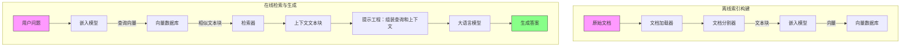
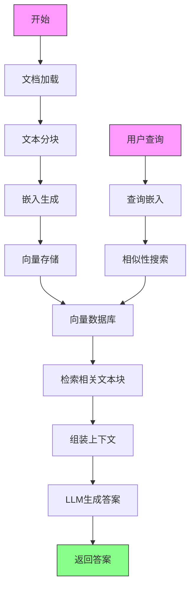
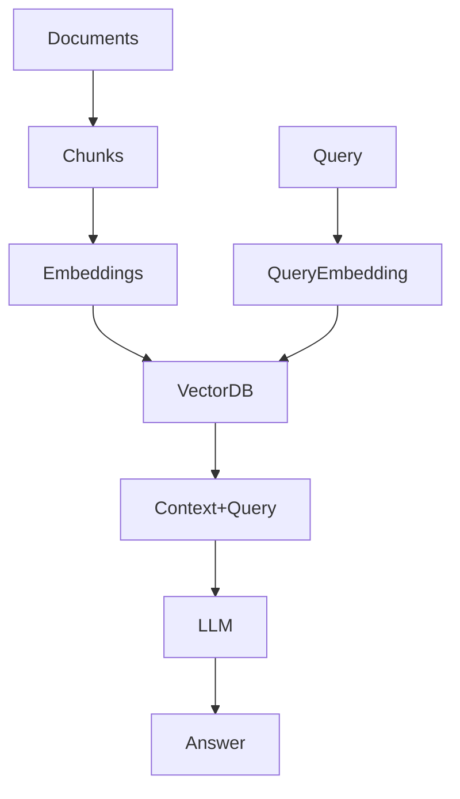
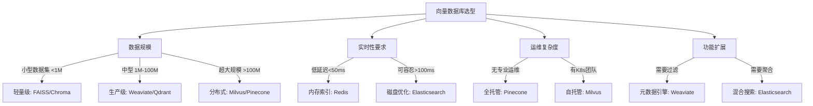

# 【RAG】构建向量数据库索引
本文主要是介绍如何构建向量数据库索引，接下来从如下几个方面进行介绍：
1. 回顾RAG构建流程
2. 如何选择向量数据库
3. 如何选择嵌入模型
4. 代码实践
5. 总结
## 回顾RAG构建流程
### RAG构建流程
RAG的构建分为两个主要阶段：索引构建（Offline）和查询/检索（Online）

#### 阶段1: 索引构建（离线处理）
1. **文档加载**：从各种来源（PDF、TXT等）加载文档。
2. **文本分块**：将文档分割成较小的文本块（chunks）。
3. **嵌入生成**：使用嵌入模型将每个文本块转换为向量（embedding）。
4. **向量存储**：将向量和对应的文本块（以及元数据）存储到向量数据库中。
#### 阶段2: 查询/检索（在线处理）
1. **用户输入查询**：接收用户的问题。
2. **查询嵌入**：使用相同的嵌入模型将查询转换为向量。
3. **相似性搜索**：在向量数据库中搜索与查询向量最相似的文本块（top k）。
4. **上下文组装**：将检索到的文本块作为上下文。
5. **生成答案**：将查询和检索到的上下文一起输入给大语言模型（LLM）生成答案。
### 流程图


### 详细步骤说明图
我们可以将上述流程图合并：

关键数据流：


## 回顾历史文章
前面几篇文章对应RAG索引构建步骤如下：

- **文档加载器**：支持多种格式（PDF、TXT、HTML等）
  - docling结合OCR实现pdf转markdown

- **文档分割器**：按固定长度分块，可重叠
  - chunk分块实践
  
- **嵌入模型**：如text-embedding-ada-002, all-MiniLM-L6-v2
  - todo

- **向量数据库**：如FAISS, Chroma, Pinecone
  - todo

- **检索器**：执行相似性搜索（如余弦相似度）
  - todo

- **大语言模型**：如GPT-4, LLaMA等
  - todo

- **提示工程**：组装查询和上下文
  - todo


## 如何选择向量数据库
### 常见的向量数据库
1. **FAISS（Facebook AI Similarity Search）**
   - 特点：快速、高效的相似性搜索，支持多种距离度量（如L2、内积等）。
   - 使用场景：大规模数据集，需要高性能检索。
2. **ChromaDB**
   - 特点：开源、易于使用的向量数据库，支持持久化存储。
   - 使用场景：小型到中型项目，需要简单的向量存储解决方案。
3. **Pinecone**
   - 特点：云服务，提供高可用的向量数据库，支持自动扩展。
   - 使用场景：需要高可靠性和可扩展性的生产环境。
4. **Milvus**
   - 特点：开源、分布式的向量搜索引擎，支持大规模数据处理。
   - 使用场景：大型企业级应用，需要高度定制化的向量检索能力。
5. **Redis**
   - 特点：内存数据库，支持向量操作，适用于实时应用。
   - 使用场景：需要低延迟响应的实时系统。


### 向量数据库选型


> 注意⚠️：如果已经有部署好的向量数据库，那么直接使用部署好的向量数据库即可。


## 如何选择嵌入模型

想要做语义检索，迫切需要embedding模型来做文本的嵌入，也就是转向量。 huggingface上那么多text embedding模型，到底应该选择什么模型效果更好呢？有条件的可以自己测试，如果不具备这个能力，可以看看[MTEB（Massive Text Embeddings Benchmark）](https://huggingface.co/spaces/mteb/leaderboard)这个排行榜！可以根据自己的场景，自己的资源，自己的语言需求来选择合适的模型，再去做测试，看看是否能够满足。


### 一、MTEB 是什么？
> github : https://github.com/embeddings-benchmark/mteb
> huggingface : https://huggingface.co/spaces/mteb/leaderboard
> paper : https://paperswithcode.com/paper/mteb-massive-text-embedding-benchmark

**[MTEB（Massive Text Embeddings Benchmark）](https://huggingface.co/spaces/mteb/leaderboard)** 是由 Hugging Face 团队推出的 **嵌入模型评估标准**，旨在解决传统评估中存在的三大问题：
1. **碎片化**：此前模型在不同论文中使用私有数据集评估，结果不可比
2. **片面性**：仅测试检索（Retrieval）或聚类（Clustering）等单一任务
3. **规模不足**：小数据集无法反映模型在真实海量数据下的表现

MTEB 整合 **8 类任务**、**56 个数据集**、涵盖 **200+ 语言**，成为业界公认的嵌入模型"黄金标准"。


### 二、核心评估框架
#### **八大任务类型**
| 任务类别           | 代表数据集         | 评估目标                     | RAG相关性 |
|--------------------|-------------------|----------------------------|-----------|
| **检索 (Retrieval)** | MS MARCO, NQ      | 查询-文档匹配精度            | ★★★★★      |
| **聚类 (Clustering)**| TwentyNewsgroups | 无监督分组能力               | ★☆☆☆☆      |
| **分类 (Classification)**| AmazonCounterfactual | 情感/主题分类              | ★★☆☆☆      |
| **配对分类 (Pair Classification)**| QQP            | 句子对相似度判断             | ★★★☆☆      |
| **重排序 (Reranking)** | StackExchange    | 搜索结果优化能力             | ★★★★☆      |
| **语义相似度 (Semantic Textual Similarity(STS))**   | STSBenchmark     | 句子语义相似度评分           | ★★★★☆      |
| **摘要相似度 (Summarization)** | SummEval      | 摘要与原文相关性             | ★★☆☆☆      |
| **比特文本匹配 (Bitext Mining)**| Tatoeba        | 跨语言对齐能力               | ★★☆☆☆      |

> **RAG 重点关注**：  
> **`检索任务`（占比35%权重） + `重排序任务`（占比20%权重）**

#### **关键指标**
- **检索任务**：`Recall@k`（前k个结果的召回率）、`MAP`（平均精度均值）
- **语义相似度**：`Spearman 相关系数`（预测分与人工标注的相关性）
- **整体评分**：**平均标准化得分**（所有任务得分的归一化平均值）


### 三、MTEB 排行榜解读
#### **最新榜单 (2025) Top 5 模型**

> 访问实时榜单： [MTEB Leaderboard](https://huggingface.co/spaces/mteb/leaderboard)

| Rank (Borda) | Model                                                                                                        | Zero-shot | Memory Usage (MB) | Number of Parameters | Embedding Dimensions | Max Tokens | Mean (Task) | Mean (TaskType) | Bitext Mining | Classification | Clustering | Instruction Retrieval | Multilabel Classification | Pair Classification | Reranking | Retrieval | STS   |
|--------------|--------------------------------------------------------------------------------------------------------------|-----------|-------------------|----------------------|----------------------|------------|-------------|-----------------|---------------|----------------|------------|-----------------------|---------------------------|---------------------|-----------|-----------|-------|
| 1            | [gemini-embedding-001](https://cloud.google.com/vertex-ai/generative-ai/docs/embeddings/get-text-embeddings) | 99%       | Unknown           | Unknown              | 3072                 | 2048       | 68.37       | 59.59           | 79.28         | 71.82          | 54.59      | 5.18                  | 29.16                     | 83.63               | 65.58     | 67.71     | 79.4  |
| 2            | [Qwen3-Embedding-8B](https://huggingface.co/Qwen/Qwen3-Embedding-8B)                                         | 99%       | 28866             | 7B                   | 4096                 | 32768      | 70.58       | 61.69           | 80.89         | 74             | 57.65      | 10.06                 | 28.66                     | 86.4                | 65.63     | 70.88     | 81.08 |
| 3            | [Qwen3-Embedding-4B](https://huggingface.co/Qwen/Qwen3-Embedding-4B)                                         | 99%       | 15341             | 4B                   | 2560                 | 32768      | 69.45       | 60.86           | 79.36         | 72.33          | 57.15      | 11.56                 | 26.77                     | 85.05               | 65.08     | 69.6      | 80.86 |
| 4            | [Qwen3-Embedding-0.6B](https://huggingface.co/Qwen/Qwen3-Embedding-0.6B)                                     | 99%       | 2272              | 595M                 | 1024                 | 32768      | 64.34       | 56.01           | 72.23         | 66.83          | 52.33      | 5.09                  | 24.59                     | 80.83               | 61.41     | 64.65     | 76.17 |
| 5            | [Linq-Embed-Mistral](https://huggingface.co/Linq-AI-Research/Linq-Embed-Mistral)                             | 99%       | 13563             | 7B                   | 4096                 | 32768      | 61.47       | 54.14           | 70.34         | 62.24          | 50.6       | 0.94                  | 24.77                     | 80.43               | 64.37     | 58.69     | 74.86 |

#### 根据榜单选择模型

从MTEB排行榜中，我们可以观察到不同模型在多个任务上的表现，但RAG最关心的是**检索（Retrieval）**和**重排序（Reranking）**任务的性能（可能还有**STS（语义文本相似度）**，因为它反映了模型对语义相似性的理解能力）。

根据提供的2025年MTEB排行榜（注意：当前是2025年6月），我们分析Top5模型在RAG相关任务的表现：
1. **gemini-embedding-001**：
   - Retrieval: 67.71
   - Reranking: 65.58
   - STS: 79.4
2. **Qwen3-Embedding-8B**：
   - Retrieval: 70.88 (Top1)
   - Reranking: 65.63
   - STS: 81.08 (Top1)
3. **Qwen3-Embedding-4B**：
   - Retrieval: 69.6
   - Reranking: 65.08
   - STS: 80.86
4. **Qwen3-Embedding-0.6B**：
   - Retrieval: 64.65
   - Reranking: 61.41
   - STS: 76.17
5. **Linq-Embed-Mistral**：
   - Retrieval: 58.69
   - Reranking: 64.37
   - STS: 74.86
  
从检索任务（Retrieval）来看，Qwen3-Embedding-8B以70.88分排名第一，其次是Qwen3-Embedding-4B（69.6）和gemini-embedding-001（67.71）。在STS任务上，Qwen3系列同样领先。

然而，选择模型不能仅看分数，还需要考虑：
 - **模型大小和推理成本**：Qwen3-Embedding-8B是一个8B参数的大模型，需要较高的计算资源（内存28.8GB），而gemini-embedding-001虽然参数未知，但作为Google的API服务，可能按调用收费。
 - **上下文长度**：Qwen3系列支持长达32768 tokens的上下文，这对于需要处理长文档的RAG应用非常有利。
 - **部署方式**：gemini-embedding-001是闭源API，而Qwen3是开源模型，可以自行部署。

根据RAG应用场景，建议如下：

 1. **如果追求最高检索性能且具备足够计算资源**：
    - 选择 **Qwen3-Embedding-8B**（检索70.88分，STS81.08分，支持32K上下文）。
    - 注意：需要约28.8GB内存，适合有GPU服务器的场景。
 2. **如果需要在性能和资源之间平衡**：
    - 选择 **Qwen3-Embedding-4B**（检索69.6分，STS80.86分，同样支持32K上下文），内存需求减半（约15.3GB）。
 3. **如果资源受限或需要轻量级模型**：
    - 考虑 **Qwen3-Embedding-0.6B**（600M参数，内存2.2GB），检索分数64.65，虽然比前两个低，但远高于其他轻量级模型。
 4. **如果不想管理基础设施且可接受API调用**：
    - 选择 **gemini-embedding-001**（检索67.71，STS79.4），但注意其最大上下文长度为2048 tokens，可能不适合长文档。
 5. **Linq-Embed-Mistral**在检索任务上表现较差（58.69），不建议用于RAG。
   
此外，我们还需要注意：

 - **多语言支持**：如果应用涉及多语言，需要额外检查模型的多语言能力（表中未直接给出，但Qwen系列通常支持中英双语，gemini也支持多语言）。
 - **指令优化**：Qwen3-Embedding系列支持指令优化（如为查询和文档分别添加指令前缀），这可以进一步提升检索效果。
  
总结选择策略：
 | 场景                     | 推荐模型               | 理由                                                                 |
 |--------------------------|------------------------|----------------------------------------------------------------------|
 | 最高性能，资源充足        | Qwen3-Embedding-8B    | 检索和STS双第一，长上下文支持                                        |
 | 平衡性能与资源            | Qwen3-Embedding-4B    | 性能接近8B，内存需求减半                                             |
 | 轻量级/边缘部署           | Qwen3-Embedding-0.6B  | 最低资源需求，性能仍超过其他小模型                                   |
 | 无运维偏好API服务         | gemini-embedding-001  | 免运维，但注意上下文限制和API成本                                    |
 | 多语言需求（中英外）       | 需额外查证，gemini可能覆盖更广 | 
 
 
**最后，在实际部署前，务必使用自己的业务数据测试召回率（Recall@k）和响应延迟，因为MTEB分数虽具参考性，但实际效果可能因数据分布而异。**


## 构建向量数据库索引分析

根据前面的分析，我们知道了如何选择向量数据库和如何选择嵌入模型，下面我们选择一个向量数据库和一个嵌入模型来进行代码实践。

### 选择向量数据库
我们选择使用Redis作为向量数据库，因为公司已经有了Redis的基础设施，而且Redis支持向量检索，且性能良好。

### 选择嵌入模型
我们选择使用Qwen3-Embedding-8B作为嵌入模型，因为它在RAG应用中表现优异，且参数较多，适合处理长文档，并且已经部署在生产环境上，提供了openai兼容的接口，方便我们调用。如果内部没有部署，可以考虑本地部署或者使用API服务。


因为我们的项目打算使用langchain 并且选择使用Redis作为向量数据库，所以我们可以使用`langchain_redis.RedisVectorStore`
> langchain_redis使用文档：https://github.com/langchain-ai/langchain-redis

在将chunk写入redis时，我们需要将chunk转换为向量，因为我们使用的嵌入模型服务是支持openai兼容的接口，所以我们可以使用`litellm`来封装服务接口。
> litellm使用文档：https://docs.litellm.ai/docs/


我们使用LangChain和RedisVectorStore，结合通过LiteLLM封装的OpenAI兼容的嵌入服务。以下是实现步骤：
1. 安装必要的库：
   ```bash
   pip install langchain langchain-redis redis litellm
   ```
2. 使用LiteLLM封装嵌入服务：
   LiteLLM允许我们将各种嵌入模型服务统一到OpenAI的API格式。假设我们有一个嵌入模型服务（比如Hugging Face上的一个模型，或者自己部署的模型），其API与OpenAI不兼容，我们可以通过LiteLLM进行封装。
   在代码中，我们将创建一个自定义的嵌入类，该类使用LiteLLM来生成嵌入向量。
3. 使用LangChain的RedisVectorStore将文档块（chunks）写入Redis。
### 步骤1：创建自定义嵌入类
我们需要创建一个类，继承自LangChain的`Embeddings`基类，并实现`embed_documents`和`embed_query`方法。在这些方法中，我们将调用LiteLLM的嵌入生成函数。
### 步骤2：使用RedisVectorStore存储文档
我们将使用`RedisVectorStore.from_documents`方法，将文档块和对应的嵌入向量存储到Redis中。
### 代码实现
#### 自定义嵌入类（使用LiteLLM）
```python
from langchain_core.embeddings import Embeddings
from typing import List
import litellm
class LiteLLMEmbeddings(Embeddings):
    def __init__(self, model: str, api_base: str = None, api_key: str = None):
        self.model = model
        self.api_base = api_base
        self.api_key = api_key
    def embed_documents(self, texts: List[str]) -> List[List[float]]:
        # 使用litellm生成嵌入向量
        embeddings = litellm.embedding(
            model=self.model,
            input=texts,
            api_base=self.api_base,
            api_key=self.api_key
        )
        # 返回嵌入向量列表
        return [item['embedding'] for item in embeddings.data]
    def embed_query(self, text: str) -> List[float]:
        # 对单个查询进行嵌入
        return self.embed_documents([text])[0]
```
#### 将文档块写入Redis
假设我们已经有了文档块（`documents`，是`Document`对象的列表）和Redis连接URL。
```python
from langchain_redis.vectorstores import RedisVectorStore
from langchain_redis.embeddings import LiteLLMEmbeddings
from langchain.schema import Document
# 初始化嵌入模型
embedding = LiteLLMEmbeddings(
    model="your_model_name",  # 例如 "huggingface/microsoft/codebert-base"
    api_base="https://your-embedding-service.com/v1",  # 嵌入服务的URL
    api_key="your_api_key"  # 如果需要
)
# Redis连接配置
redis_url = "redis://localhost:6379"
index_name = "knowledge_base"
# 将文档块写入Redis
vectorstore = RedisVectorStore.from_documents(
    documents=documents,  # 文档块列表
    embedding=embedding,
    index_name=index_name,
    redis_url=redis_url,
    # 可选：配置索引结构
    # 例如：设置向量维度，如果嵌入模型输出的维度是768
    vector_size=768
)
```
注意：`vector_size`需要根据嵌入模型输出的维度设置。如果不确定，可以先调用嵌入模型获取一个向量的维度。
#### 获取向量维度的方法
如果不知道嵌入模型的输出维度，可以这样获取：
```python
# 使用嵌入模型嵌入一个文本
sample_embedding = embedding.embed_query("sample text")
vector_size = len(sample_embedding)
```
然后在`RedisVectorStore.from_documents`中设置`vector_size=vector_size`。
### 完整示例
假设我们有一些文档块：
```python
documents = [
    Document(page_content="LangChain is a framework for developing applications powered by language models.", metadata={"source": "intro"}),
    Document(page_content="Redis is an in-memory data store that can be used as a vector database.", metadata={"source": "redis"}),
    # ... 更多文档
]
```
然后使用上述代码写入Redis。
### 注意事项
1. 确保Redis服务正在运行，并且可以通过指定的URL访问。
2. 根据嵌入模型的要求，可能需要设置`api_base`和`api_key`。如果嵌入模型是本地部署的，`api_base`可能是`http://localhost:8000`。
3. 索引一旦创建，后续可以继续添加文档。如果索引已存在，`from_documents`会向现有索引添加文档（确保索引结构一致，特别是向量维度）。
### 查询使用示例
写入后，我们可以使用同样的嵌入模型进行查询：
```python
# 初始化向量库
vectorstore = RedisVectorStore(
    redis_url=redis_url,
    index_name=index_name,
    embedding_function=embedding
)
# 进行相似度搜索
query = "What is LangChain?"
results = vectorstore.similarity_search(query, k=3)
print(results)
```
这样，我们就完成了使用LiteLLM封装的嵌入服务和LangChain的RedisVectorStore来构建向量数据库的流程。

### 完整代码实现
```python
import os
from langchain_community.document_loaders import TextLoader, PyPDFLoader
from langchain_text_splitters import RecursiveCharacterTextSplitter
from langchain_redis import RedisVectorStore
from langchain_core.embeddings import Embeddings
from typing import List
import litellm

# 配置环境变量 (实际使用时建议使用.env文件)
os.environ["LITELLM_MODEL"] = "your_embedding_model"  # 如 "azure/your-deployment-name"
os.environ["OPENAI_API_KEY"] = "your_api_key"
os.environ["OPENAI_API_BASE"] = "https://your-api-endpoint.com"

# 1. 使用 LiteLLM 封装嵌入服务
class LiteLLMEmbeddings(Embeddings):
    """使用 LiteLLM 封装的 OpenAI 兼容嵌入服务"""
    
    def __init__(self, model: str = None):
        self.model = model or os.getenv("LITELLM_MODEL")
    
    def embed_documents(self, texts: List[str]) -> List[List[float]]:
        """嵌入文档列表"""
        embeddings = litellm.embedding(
            model=self.model,
            input=texts
        )
        return [item['embedding'] for item in embeddings.data]
    
    def embed_query(self, text: str) -> List[float]:
        """嵌入查询文本"""
        return self.embed_documents([text])[0]

# 2. 文档加载与处理
def load_and_split_documents(file_path: str, chunk_size=512, chunk_overlap=64):
    """加载并分割文档"""
    # 根据文件类型选择加载器
    if file_path.endswith('.pdf'):
        loader = PyPDFLoader(file_path)
    else:  # 支持 txt, html 等
        loader = TextLoader(file_path)
    
    documents = loader.load()
    
    # 文本分割
    text_splitter = RecursiveCharacterTextSplitter(
        chunk_size=chunk_size,
        chunk_overlap=chunk_overlap,
        length_function=len,
        is_separator_regex=False,
    )
    return text_splitter.split_documents(documents)

# 3. 向量存储到 Redis
def vectorize_to_redis(documents, index_name="knowledge_base", redis_url="redis://localhost:6379"):
    """将文档向量化并存储到Redis"""
    # 初始化嵌入模型
    embeddings = LiteLLMEmbeddings()
    
    # 创建Redis向量存储
    vectorstore = RedisVectorStore.from_documents(
        documents=documents,
        embedding=embeddings,
        index_name=index_name,
        redis_url=redis_url,
        # Redis索引配置
        index_schema={
            "text": [{"name": "content"}],
            "vector": [{
                "dims": len(embeddings.embed_query("test")),  # 自动获取向量维度
                "distance_metric": "COSINE",
                "algorithm": "HNSW",
                "datatype": "FLOAT32"
            }],
            "metadata": ["source", "page"]
        }
    )
    return vectorstore

# 4. 主执行流程
if __name__ == "__main__":
    # 配置参数
    DOCUMENT_PATH = "path/to/your/document.pdf"
    REDIS_URL = "redis://:password@host:port"  # 生产环境使用认证
    INDEX_NAME = "company_knowledge_base"
    
    try:
        # 加载和分割文档
        print(f"正在处理文档: {DOCUMENT_PATH}")
        chunks = load_and_split_documents(DOCUMENT_PATH)
        print(f"生成 {len(chunks)} 个文本块")
        
        # 向量化并存储到Redis
        vector_db = vectorize_to_redis(
            chunks, 
            index_name=INDEX_NAME,
            redis_url=REDIS_URL
        )
        
        # 验证索引
        info = vector_db.client.ft(INDEX_NAME).info()
        print(f"索引创建成功! 文档数: {info['num_docs']}")
        print(f"向量维度: {info['attributes'][1]['dims']}")
        
    except Exception as e:
        print(f"处理失败: {str(e)}")
        # 这里可以添加重试或回滚逻辑
```


## 代码实现

### 使用litellm封装embedding服务
todo

### 使用langchain_redis写入向量数据库

todo


## **优化策略**
1. **分块优化**：
   - 实验不同块大小（256/512/1024 tokens）
   - 调整重叠比例（10-20%）
2. **多向量索引**：
   - 为摘要和细节分别建立索引
3. **混合检索**：
   - 结合关键词搜索（BM25）与语义搜索
4. **元数据过滤**：
   - 按文档类型/日期过滤检索范围

> 最终输出：为生成器（如 GPT-4）提供精准的上下文文档块，实现基于知识的增强生成。
 


参考文档
https://github.com/langchain-ai/langchain-redis
https://docs.redisvl.com/en/stable/api/searchindex.html
https://docs.redisvl.com/_/downloads/en/latest/pdf/
