# 将pdf和docx转换为markdown格式

## 概述
最近在调研RAG的优化，查阅了相关的资料（查看末尾的参考文档），本文将自己在阅读这些资料过程中的思考和实践过程记录下来，以便对有同样需求的小伙伴提供一些帮助。

本文将从如下几个方面进行介绍：

+ 为什么在RAG中选择Markdown格式（这部分内容由deepseek根据提供的资料总结生成的）
+ 如何将pdf文件转换为markdown格式（调研了几个流行的开源库并实践对比效果）
+ 如何将docx文件转换为markdown格式（调研了几个流行的开源库并实践对比效果）
+ 对于复杂的文档将pdf和docx互相转换再转换成markdown格式验证效果
+ 总结应该选择哪个工具（这里主要是根据笔者的实验效果选择，建议不同的文件可以按照本文的示例进行验证，选择符合自己文件要求的工具）


pdf 和 docx 文件转换成 markdown 格式文件其实是非常复杂的，特别是 pdf 的转换，因为pdf文件的布局非常复杂（包括表格，图片，特殊布局），为了取得较好的效果，通常会使用专门的模型提取pdf文件的布局和表格内容，即使如此很多比较复杂的pdf文件的转换效果任然可能不好。docx文件也是，对于复杂的表格，可能转换的效果也不是很好。


通过本文的学习，将对RAG应用的优化有一个简单的了解，在下一篇文章中，将基于本文的markdown格式内容介绍chunk的切分技巧（包括按照标题切分和合并），这也是对RAG优化非常重要的部分，请继续关注。


> 效果对比说明：
>
> 因为当前知识库中主要是pdf和docx文件居多，所以下面代码实践的效果对比，主要是比较pdf和docx表格和标题能否正确转换为markdown格式，虽然本文的这些库都有提取图片的能力，但是示例中不会提取文档中的图片。
>

接下来开始本文的内容。

## 为什么使用markdown格式
为什么在RAG中选择Markdown格式，主要有以下几个方面的原因：

+ **大模型对Markdown的支持**
+ **Markdown格式本身的优点**

以下是 **大模型对Markdown的支持** 和 **Markdown格式本身的优点** 两方面总结，解释为何在RAG中选择Markdown格式：

### 大模型对Markdown的支持
1. **大模型本身支持**
    - Markdown非常接近纯文本，标记或格式较少，但仍然提供了一种表示重要文档结构的方法。主流LLM，如chatgpt、qwen、deepseek等天生就返回Markdown格式内容，这表明他们已经接受了大量Markdown格式文本的训练，并且理解得很好。
2. **结构化语义理解**  
    - 大模型（如GPT-4、LLAMA）能直接解析Markdown的标题（`#`）、列表（`-`）、代码块（```）等标记，将其作为**显式语义标识符**，增强对文档逻辑结构的理解（如区分章节、重点内容）。  例如，标题层级（`## 实验结果`）能帮助模型快速定位关键段落，提升检索和生成的相关性。
3. **代码与公式的高保真处理**  
    - Markdown的代码块（```python）和数学公式（`$$E=mc^2$$`）能**原样保留格式**，避免模型将代码或公式误判为普通文本，确保技术文档、学术论文等内容生成的准确性。
4. **格式引导生成（Format-Guided Generation）**  
    - 输入Markdown时，模型能更自然地**模仿其结构输出结果**（如生成带层级的报告、列表或表格），减少生成内容的格式混乱，降低后处理成本。


### Markdown格式本身的优点
1. **轻量化与标准化**  
    - 相比HTML/XML/DOCX，Markdown**去除了冗余标签和样式**（如字体颜色、复杂排版），文件体积更小，解析效率更高，适合大模型处理长文本。作为开源社区通用格式，工具链支持完善（如Pandoc、GitHub），避免格式兼容性问题。
2. **显式结构化分块**  
    - Markdown的标题层级（`#`、`##`）天然适合将文档**按语义分块**（如章节、段落），适配RAG的文档切分需求，确保检索结果与问题上下文一致。  例如，RAG系统可直接按标题分块，精准匹配用户的查询。
3. **最大化Token利用率**  
    - Markdown的简洁性（无复杂标签）能**最大化Token利用率**，在相同输入长度限制下容纳更多核心内容。  对表格、图片链接（``）等元素的简洁表达，减少无效字符占用。


### 总结
| **维度** | **核心优势** |
| --- | --- |
| **大模型支持** | 1. 增强结构化语义解析能力   2. 支持代码/公式高保真处理   3. 引导生成格式可控性高 |
| **Markdown格式特性** | 1. 轻量化与标准化   2. 显式分块提升检索精度   3. 最大化Token利用率 |


**本质原因**：  
Markdown在**信息密度**（保留关键结构，去除冗余样式）和**可解析性**（机器与模型友好）之间达到最佳平衡，使RAG系统能更高效地完成“检索-生成”链路，同时为大模型提供清晰的上下文边界和语义标识符。


接下来介绍一个如何使用开源项目将pdf和docx转换为markdown格式，这部分主要是实践，包含大量的代码，详细的使用可以查看对应的项目的官方文档。

## 将pdf转换为markdown格式
将 pdf 文件转换为 markdown 格式，介绍如下几个开源库的使用：

+ [markitdown](https://github.com/microsoft/markitdown): 微软开源的用于将文件和办公文档转换为Markdown的Python工具。
+ [langchain-pymupdf4llm](https://github.com/lakinduboteju/langchain-pymupdf4llm): 将[PyMuPDF4LLM](https://github.com/pymupdf/RAG)集成到LangChain作为文档加载器中，便于和langchain使用。
+ [docling](https://github.com/docling-project/docling): Docling简化了文档处理，能够解析多种格式，包括高级PDF理解，并提供与通用AI生态系统的无缝集成。
+ [marker](https://github.com/VikParuchuri/marker)：快速、高精度地将PDF转换为markdown+JSON

**这里使用一个本地的pdf文件和一个**[**远程arxiv中的pdf文件**](https://arxiv.org/pdf/2408.09869)**进行效果比对，看看哪一个工具的性能最好。**

## markitdown转换pdf为markdown
### 代码实践
使用下面的命令安装 `markitdown`

```shell
pip install markitdown
```

使用下面的代码转换pdf文件为markdown格式：

```python
from markitdown import MarkItDown

local_docx_file = "/Users/xiniao/Downloads/FATF-ME-FATF-HK-FUR-4-1-202302.pdf"
remote_docx_file = "https://arxiv.org/pdf/2408.09869"

md = MarkItDown()
# source: 可以是字符串、pathlib路径对象或URL，或者是一个requests.response对象
result = md.convert(source=docx_file)

with open('test.md', mode='w') as f:
    f.write(result.text_content)
print(result.text_content)
```

`MarkItDown().convert()`方法中的参数`source`可以是字符串、pathlib路径对象或URL，或者是一个requests.response对象。

### 结果对比
这里使用一个本地的pdf文件和一个[远程arxiv中的pdf文件](https://arxiv.org/pdf/2408.09869)，分别提取的结果如下。

**本地pdf原文和转换后的markdown对比结果：**

| **本地pdf原文** | **转换后的markdown** |
| --- | --- |
| 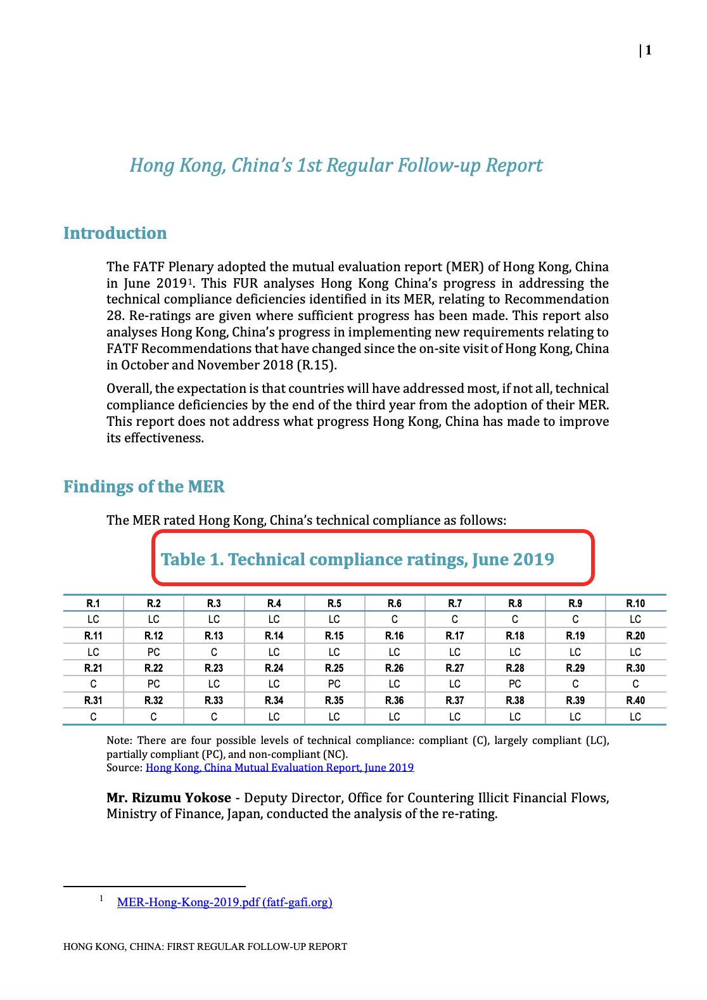 | 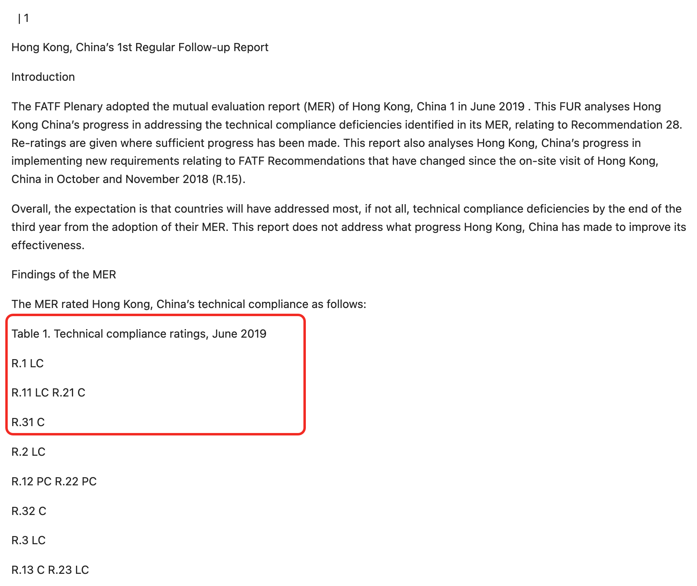 |


**arxiv中的pdf原文和转换后的markdown对比结果：**

| **arxiv中的pdf原文** | **转换后的markdown** |
| --- | --- |
| 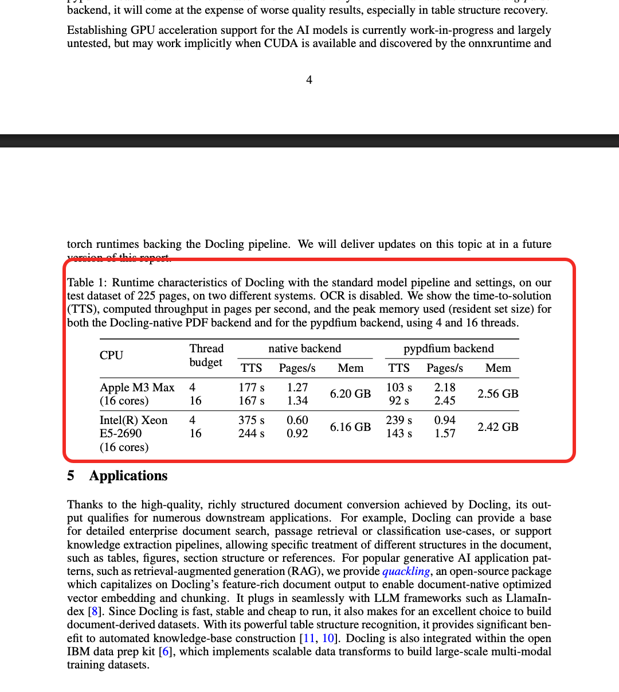 | 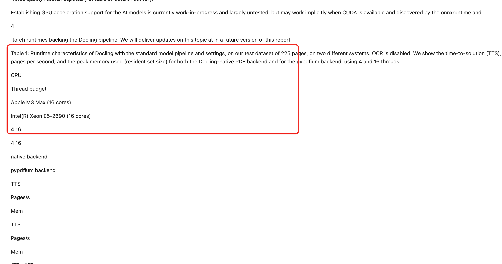 |


### 结论
**从前面的效果对比可以看到，**`**markitdown**`**无法正确提取pdf中的表格和标题。**

**查看**`**markitdown**`**中转换pdf的源码 **`**PdfConverter**`**使用的是 **`**pdfminer**`**提取pdf文件纯文本，没有保留格式：**

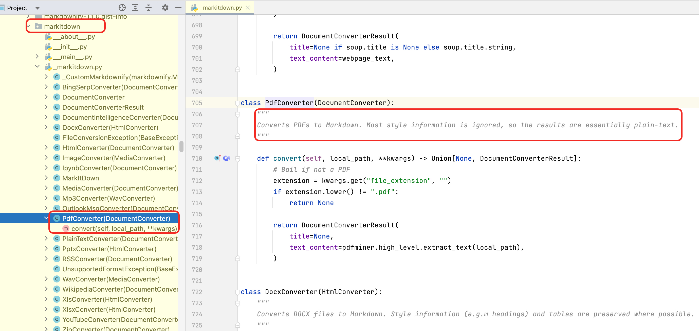

## pymupdf4llm转换pdf为markdown
接下来介绍一下使用[langchain-pymupdf4llm](https://github.com/lakinduboteju/langchain-pymupdf4llm)将pdf转换为markdown，[langchain-pymupdf4llm](https://github.com/lakinduboteju/langchain-pymupdf4llm)实际上是封装了`pymupdf4llm`（关于pymupdf4llm的使用可以查看我写的[这篇文章](https://ata.atatech.org/articles/12020334047)），`pymupdf4llm`实际使用`PyMuPDF`将PDF页面转换为Markdown格式的文本。

> 注意：库的license说明
>
> langchain-pymupdf4llm：[MIT license](https://github.com/lakinduboteju/langchain-pymupdf4llm?tab=MIT-1-ov-file#)
>
> pymupdf4llm：[AGPL-3.0 license](https://github.com/pymupdf/RAG?tab=AGPL-3.0-1-ov-file#)
>
> PyMuPDF：[AGPL-3.0 license](https://github.com/pymupdf/PyMuPDF?tab=AGPL-3.0-1-ov-file#)
>

### 代码实践
因为我们主要使用langchain框架，所以这里直接演示使用[langchain-pymupdf4llm](https://github.com/lakinduboteju/langchain-pymupdf4llm)将pdf转换为markdown，使用步骤如下：

1. 首先使用下面命令安装`langchain-pymupdf4llm`：

```python
pip install -U langchain-pymupdf4llm
```

2. 使用下面代码转换pdf为markdown：

```python
from langchain_pymupdf4llm import PyMuPDF4LLMLoader


def pdf_to_markdown(file_path: str) -> str:
    """
    将pdf转换为markdown
    :param file_path:
    :return:
    """
    loader = PyMuPDF4LLMLoader(file_path=file_path, mode="page", table_strategy="lines")
    docs = loader.load()
    for doc in docs:
        print(doc.page_content)
        print(doc.metadata)
        print('=' * 100)
    if not docs:
        return ''
    return '\n'.join(doc.page_content for doc in docs)

local_docx_file = "/Users/xiniao/Downloads/FATF-ME-FATF-HK-FUR-4-1-202302.pdf"
# remote_docx_file = "https://arxiv.org/pdf/2408.09869"

markdown_content = pdf_to_markdown(file_path=local_docx_file)

with open('test.md', mode='w') as f:
    f.write(markdown_content)

```

因为`PyMuPDF4LLMLoader`集成自langchain的`BasePDFLoader`，所以支持本地和远程文件的转换，如果是远程文件则会先下载到本地再转换。

### 结果对比
这里使用一个本地的pdf文件和一个[远程arxiv中的pdf文件](https://arxiv.org/pdf/2408.09869)，分别提取的结果如下。

**本地pdf原文和转换后的markdown对比结果：**

| **arxiv中的pdf原文** | **转换后的markdown** |
| --- | --- |
| 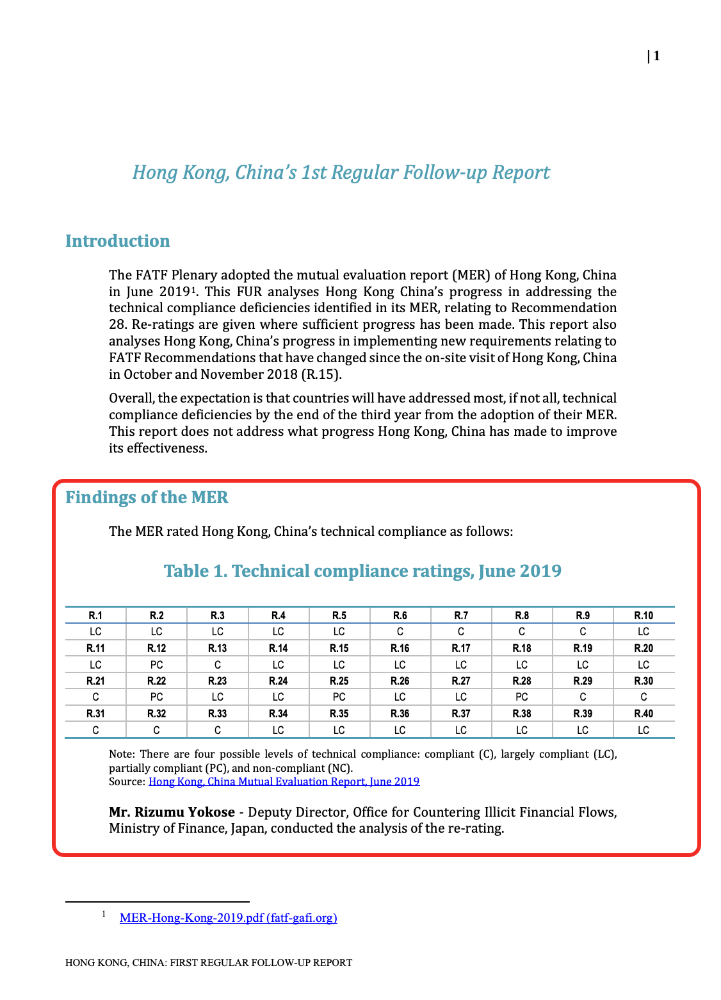 | 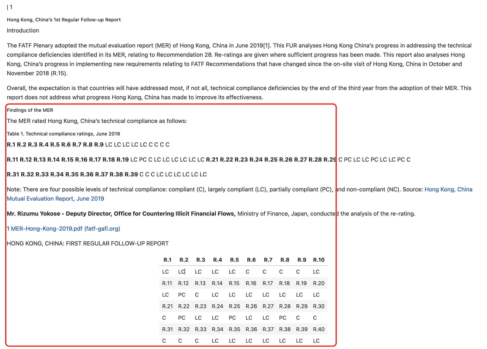 |


**arxiv中的pdf原文和转换后的markdown对比结果：**

| **本地pdf原文** | **转换后的markdown** |
| --- | --- |
| 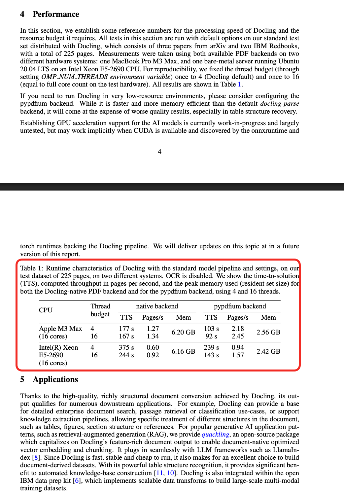 | 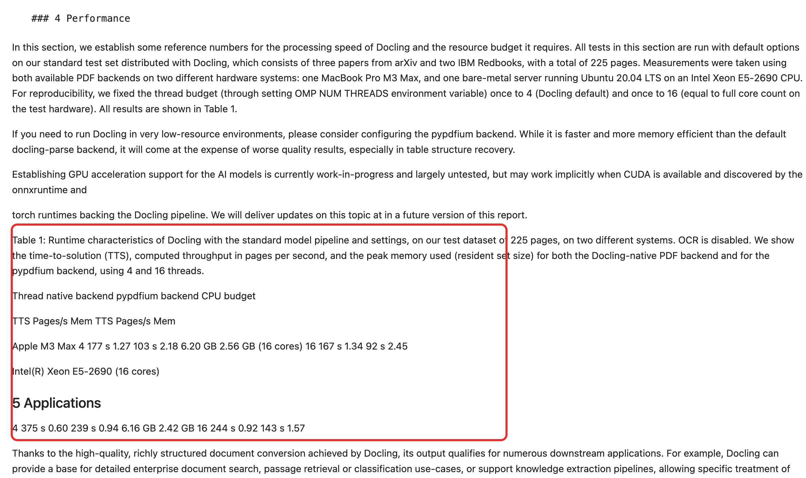 |


### 结论
使用`langchain_pymupdf4llm`可以正确提取标题，对于简单的表格也能提取内容和格式，但是对于复杂的表格，无法正确提取格式。如果pdf中包含很多复杂的表格，则提取效果不是很好，如果pdf只是文本和标题则效果较好。

## docling转换pdf为markdown
使用docling转换pdf为markdown时，需要用模型进行转换，docling训练了一个[docling-models](https://huggingface.co/ds4sd/docling-models)用来识别pdf文件的布局和表格，接下来介绍一下如何使用docling转换pdf为markdown。

### 代码实践
按照如下步骤进行实践

1. **安装docling**
2. **下载模型**
3. **编写代码**

**安装docling**依赖

```shell
pip install docling
```

**下载模型**

由于在国内无法直接访问huggingface，所以这里选择从modelscope下载模型。进入[modelscope](https://modelscope.cn/models)，选择**模型库，**搜索`ds4sd/docling-models`即可，如下图所示

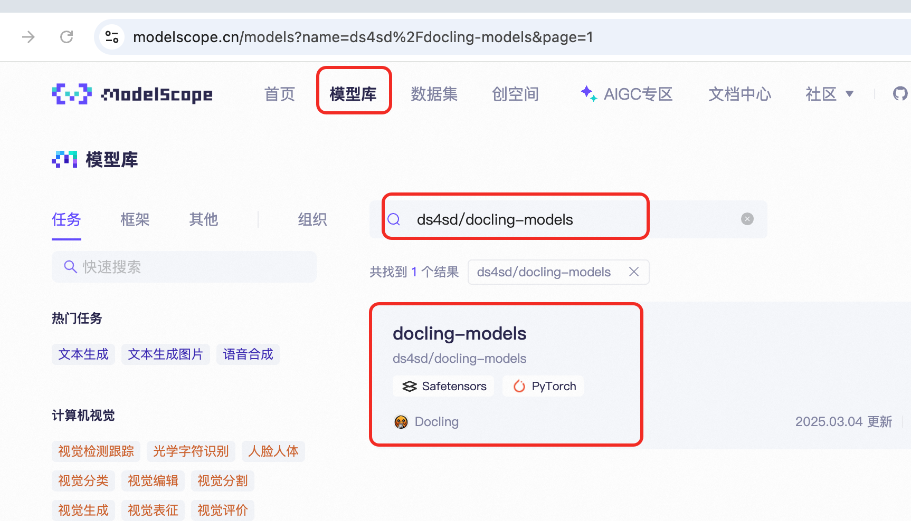

点击进入选择的模型，然后从模型文件中点击下载模型，如下图所示：

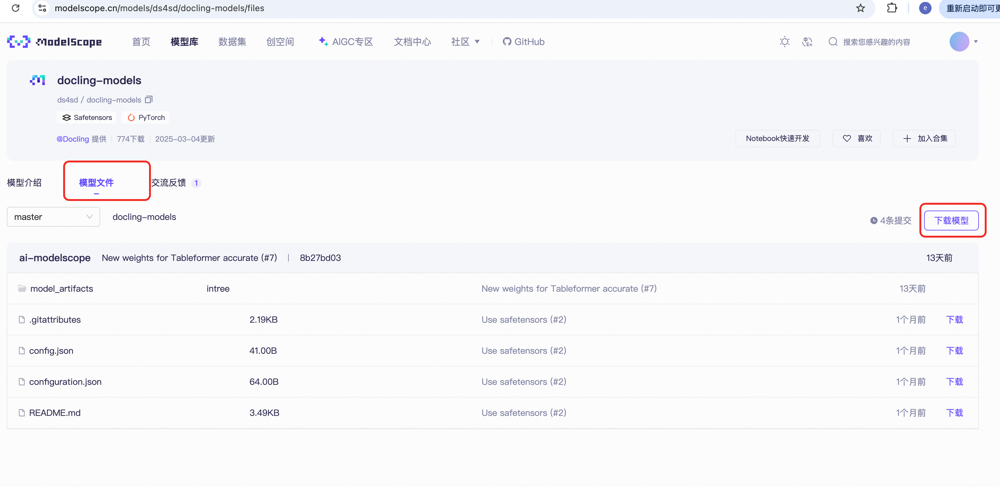

下载模型的代码如下：

**<font style="color:rgb(39, 37, 76);">在下载前，请先通过如下命令安装ModelScope</font>**

```plain
pip install modelscope
```

```python
#模型下载
from modelscope import snapshot_download
# 使用local_dir下载模型到指定的本地目录中
model_dir = snapshot_download(model_id='ds4sd/docling-models', 
                              local_dir='./docling-models')
print(model_dir)
```

**编写代码**

```python
from docling.datamodel.base_models import InputFormat
from docling.datamodel.pipeline_options import EasyOcrOptions, PdfPipelineOptions
from docling.document_converter import DocumentConverter, PdfFormatOption

# 指定下载的模型路径，默认为huggingface的下载模型路径
artifacts_path = "./docling-models"

# 这里不提取图片内容，所以设置do_ocr=False，默认为True，则需要下载OCR模型
pipeline_options = PdfPipelineOptions(artifacts_path=artifacts_path, do_ocr=False)

doc_converter = DocumentConverter(
    format_options={
        InputFormat.PDF: PdfFormatOption(pipeline_options=pipeline_options)
    }
)

local_docx_file = "/Users/xiniao/Downloads/FATF-ME-FATF-HK-FUR-4-1-202302.pdf"
# remote_docx_file = "https://arxiv.org/pdf/2408.09869"

# source支持本地文件和远程URL
result = doc_converter.convert(source=local_docx_file)
markdown_content = result.document.export_to_markdown()

temp_file = 'test.md'
with open(temp_file, mode="w") as f:
    f.write(markdown_content)
print(markdown_content)
```

### 结果对比
这里使用一个本地的pdf文件和一个[远程arxiv中的pdf文件](https://arxiv.org/pdf/2408.09869)，分别提取的结果如下。

**本地pdf原文和转换后的markdown对比结果：**

| **本地pdf原文** | **转换后的markdown** |
| --- | --- |
| 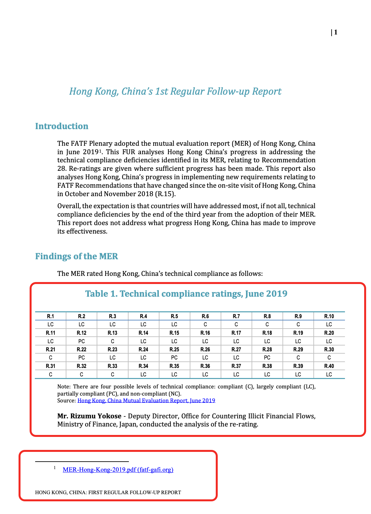 | 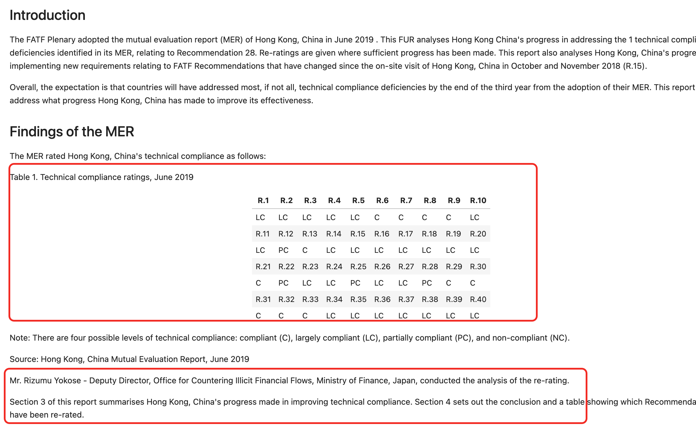 |


**arxiv中的pdf原文和转换后的markdown对比结果：**

| **arxiv中的pdf原文** | **转换后的markdown** |
| --- | --- |
| 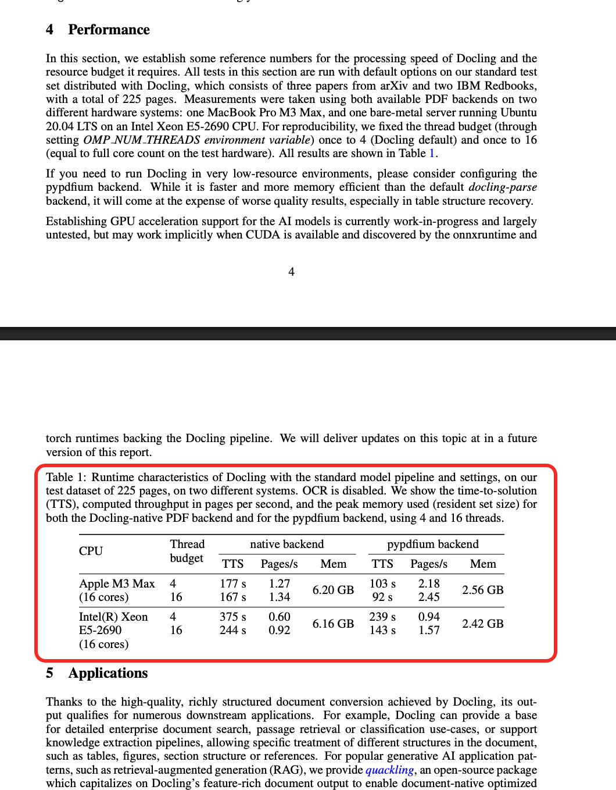 | 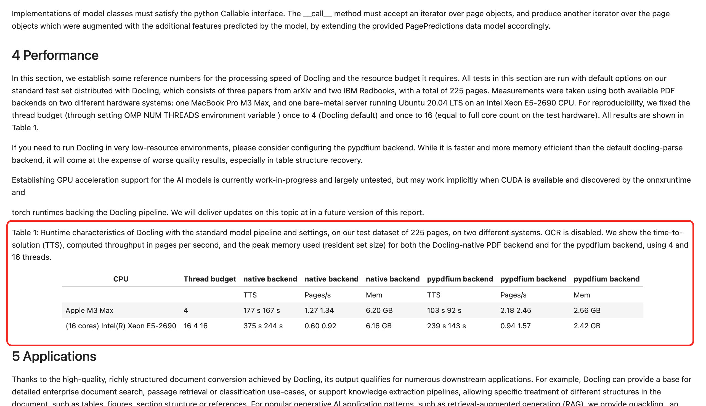 |


### 结论
从前面的两个示例可以看到，使用docling的模型提取pdf的效果相比于前两个实践还不错，对于简单表格可以比较完美的转换，对于复杂表格，转换的效果有一点问题（比如前面的示例中表格的数据存在错乱）但是整体还可以接受。另外，从实践结果可以看到，使用 docling的模型转换pdf时，会自动忽略掉页眉和页脚。

**运行效率说明，在mac中使用cpu运行模型，转换一个42页的带有复杂表格的pdf文件，总共耗时24秒。**

## marker转换pdf为markdown
由于marker的商业使用限制，这里只是对其做一个简单介绍不进行代码实验结果对比，如果对其对详细使用感兴趣，可以查看官方文档：[https://github.com/VikParuchuri/marker](https://github.com/VikParuchuri/marker)

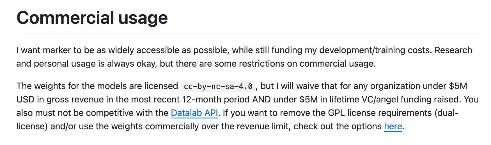

### 代码实践
1. **安装依赖**

```shell
pip install marker-pdf
```

2. **下载模型**

查看源码，会使用下列的模型：

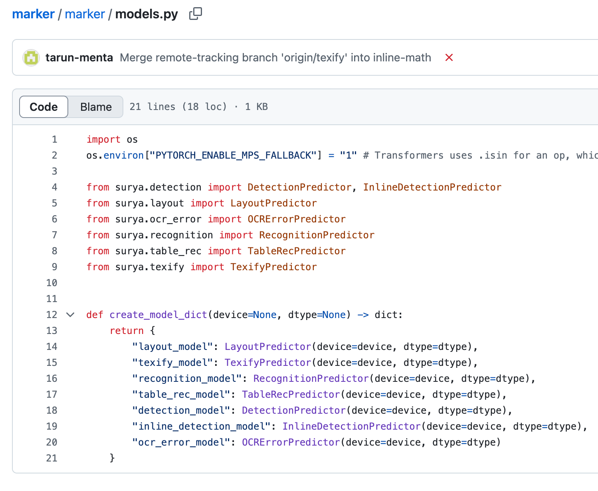

部分模型的名称如下：

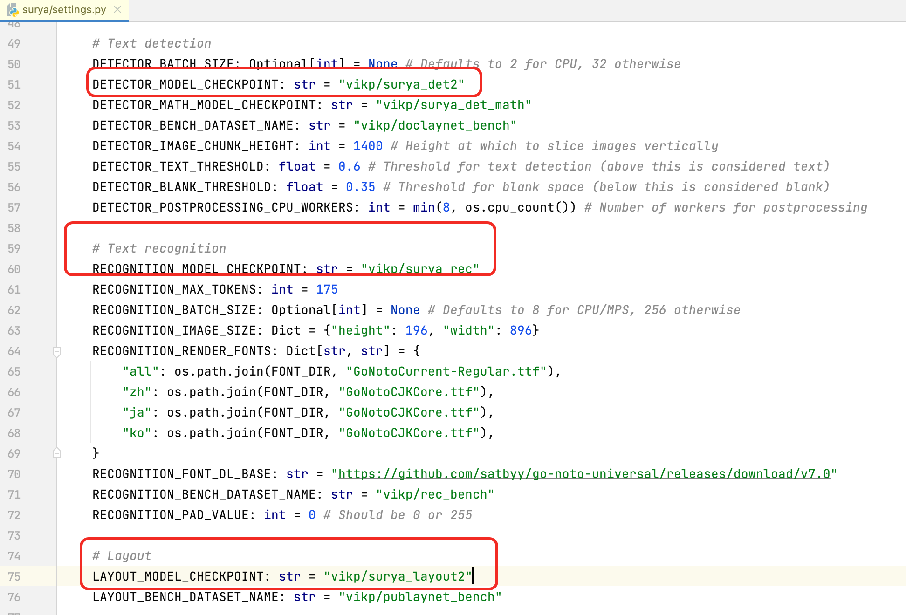

进入查看huggingface下载模型：[https://huggingface.co/vikp](https://huggingface.co/vikp)

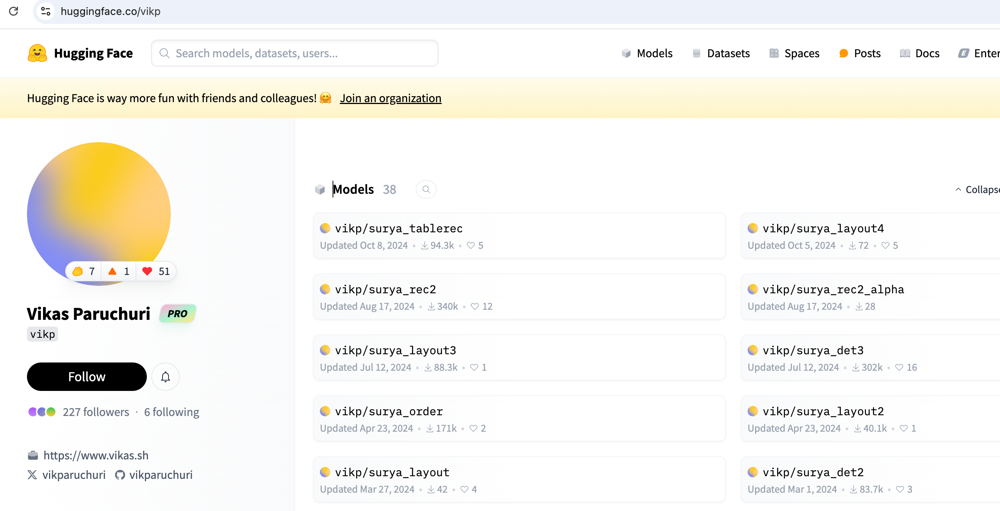


3. **编写代码**

```python
from marker.converters.pdf import PdfConverter
from marker.models import create_model_dict
from marker.output import text_from_rendered

converter = PdfConverter(
    artifact_dict=create_model_dict(),
)
rendered = converter("FILEPATH")
text, _, images = text_from_rendered(rendered)
```

### 结果对比
由于使用marker需要下载很多模型，处理过程中会占用较多的系统资源，这里就不再进行测试，如果感兴趣可以安装上面的步骤进行测试。放一张官方的效果评测图：

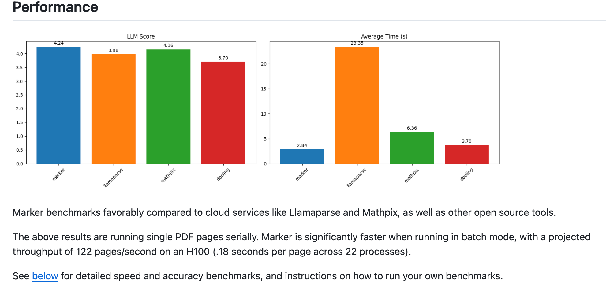

使用限制PDF是一种棘手的格式，因此标记并不总是完美工作，以下是要解决的一些已知限制：

+ 具有嵌套表格和表单的非常复杂的布局可能不起作用
+ 表格可能渲染得不好

注意：传递`--use_llm`标志将主要解决这些问题。

### 结论
根据官方文档的介绍，marker的解析效果要好于 docling，但是由于marker的使用限制，无法商业使用，可以根据使用场景考虑是否使用该工具。

## 将docx转换为markdown格式
将docx转换为markdown格式，介绍如下几个开源库的使用：

+ [markitdown](https://github.com/microsoft/markitdown): 微软开源的用于将文件和办公文档转换为Markdown的Python工具。
+ [docling](https://github.com/docling-project/docling): Docling简化了文档处理，能够解析多种格式，包括高级PDF理解，并提供与通用AI生态系统的无缝集成。
+ [docx2markdown](https://github.com/haesleinhuepf/docx2markdown): 内部使用 [python-docx](https://github.com/python-openxml/python-docx) 读取 docx 文件内容转换为 markdown 格式文件

因为我们知识库中存在法规类的文件，所以从[国家法律法规数据库](https://flk.npc.gov.cn/index.html)中下载一个法规文件来验证 docx 文件转换为 markdown 的效果，我这里使用[民法典](https://flk.npc.gov.cn/detail2.html?ZmY4MDgwODE3MjlkMWVmZTAxNzI5ZDUwYjVjNTAwYmY%3D)文件如下，点击下载是一个docx文件：

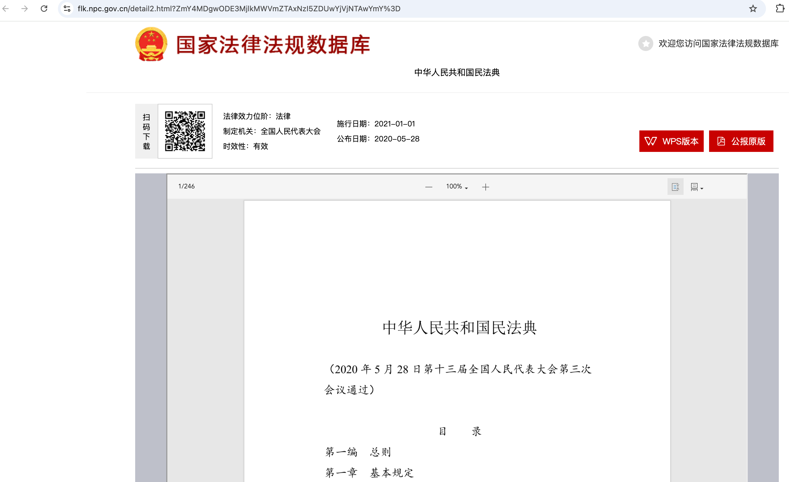

## markitdown转换docx为markdown
接下来将介绍使用markitdown转换docx为markdown。

### 代码实践
1. 安装依赖

```python
pip install markitdown[pdf, docx, pptx]
```

2. 编写代码

```python
from markitdown import MarkItDown

docx_file = "/Users/xiniao/Downloads/民法典.docx"

md = MarkItDown()
result = md.convert(docx_file)
markdown_content = result.text_content

temp_file = 'test.md'
with open(temp_file, mode="w") as f:
    f.write(markdown_content)
```

### 结果对比
| **本地docx原文** | **转换后的markdown** |
| --- | --- |
| 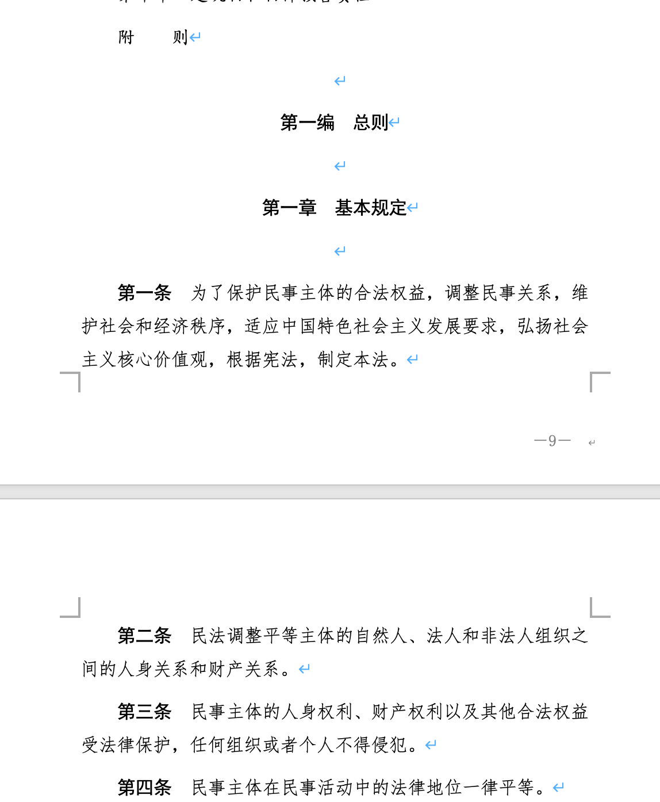 | 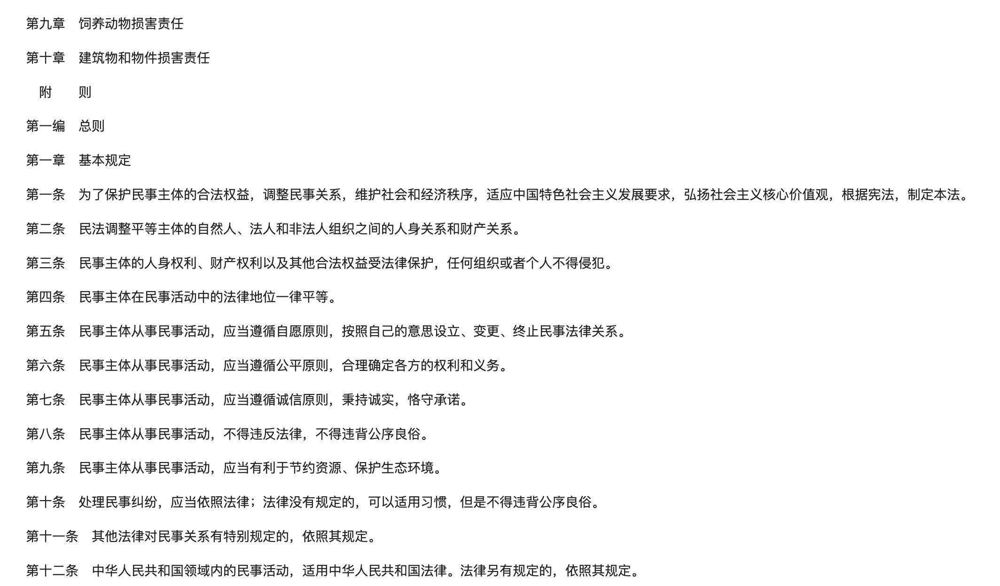 |


**验证表格提取**

| **本地docx原文** | **转换后的markdown** |
| --- | --- |
| 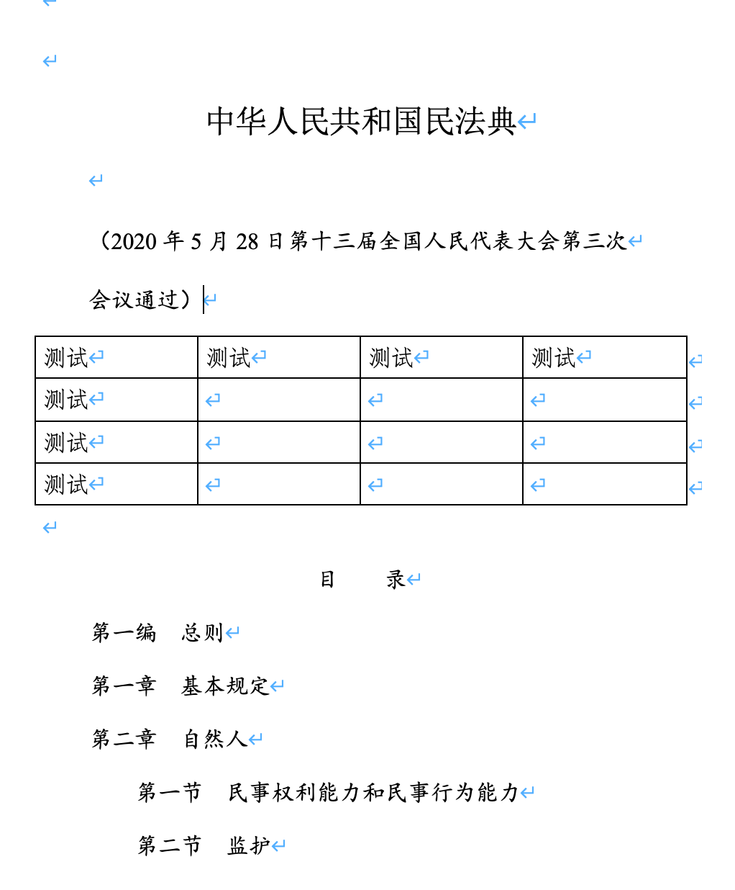 | 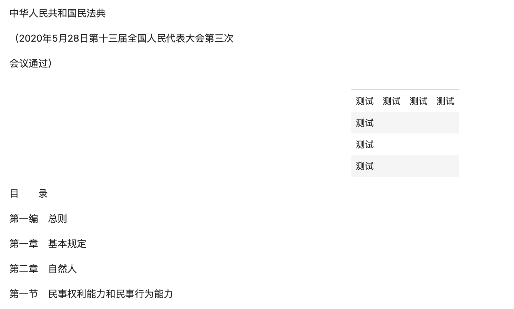 |


**验证手动给docx添加标题**

| **本地docx原文** | **转换后的markdown** |
| --- | --- |
| 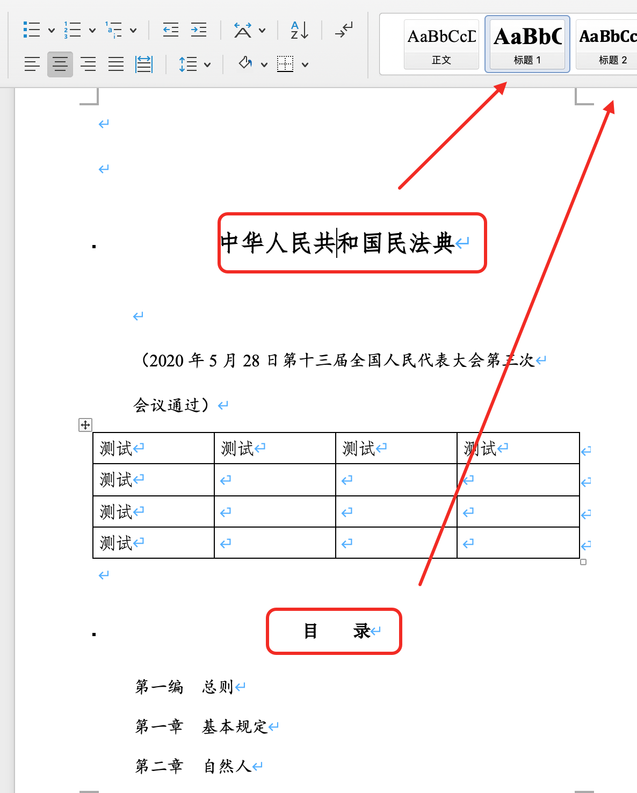 | 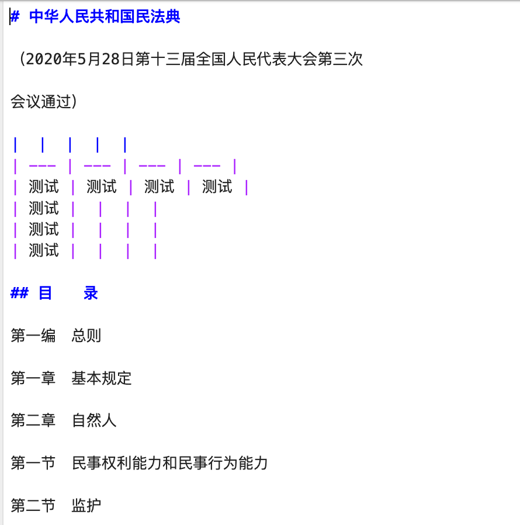 |


### 结论
从结果对比可以得出如下结论：

+ 如果docx文件没有样式，则只会保留纯文本。
+ 如果docx文件有表格，可以正常转换为markdown格式的表格（复杂表格还需要更多的验证）
+ 如果docx文件手动添加了标题，**可以正常转换为markdown格式的标题**

查看markitdown转换docx文件的源码，可以看到是使用`mammoth`先转换成 `html` 格式，然后使用`BeautifulSoup`提取html的内容，最后转换成markdown格式：

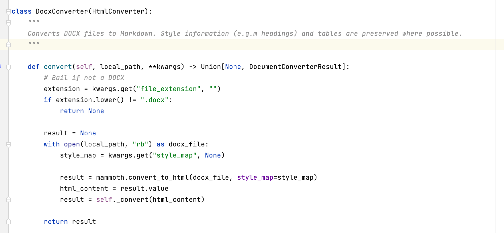

## docling转换docx为markdown
### 代码实践
1. 安装依赖

```python
pip install docling
```

2. 编写代码

```python
from docling.document_converter import DocumentConverter

docx_file = "/Users/xiniao/Downloads/民法典.docx"  # document per local path or URL
converter = DocumentConverter()
result = converter.convert(source=docx_file)
markdown_content = result.document.export_to_markdown()

temp_file = 'test.md'
with open(temp_file, mode="w") as f:
    f.write(markdown_content)

print(markdown_content[:500])
```

### 结果对比
| **本地docx原文** | **转换后的markdown** |
| --- | --- |
|  | 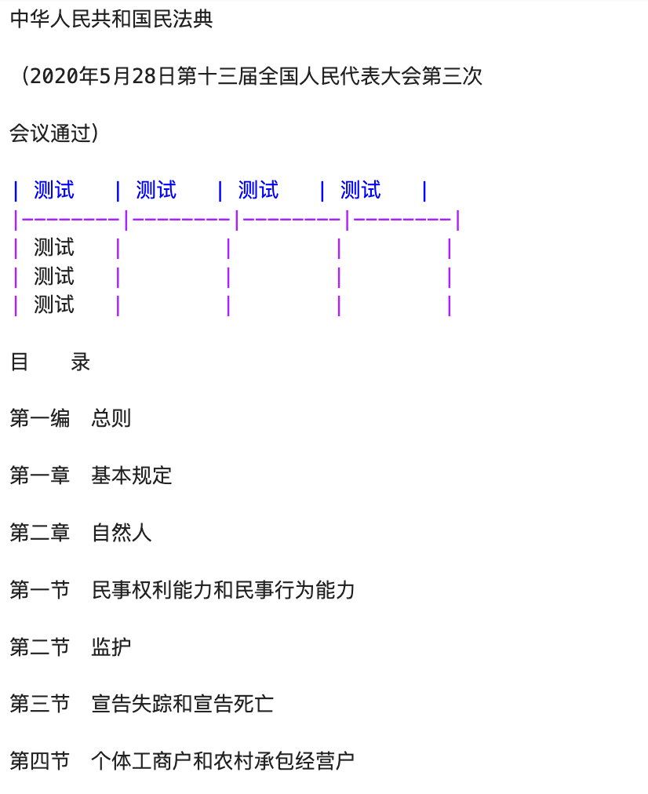 |


### 结论
使用docling转换docx为markdown，从前面的结果中可以得出如下结论：

+ 如果docx文件没有样式，则只会保留纯文本。
+ 如果docx文件有表格，可以正常转换为markdown格式的表格（复杂表格还需要更多的验证）
+ 如果docx文件手动添加了标题，**无法正常转换为markdown格式的标题**

查看docling转换docx文件的源码`MsWordDocumentBackend`，实际上使用的是 `[python-docx](https://github.com/python-openxml/python-docx)`进行转换。

## python-docx转换docx为markdown
下面参考[docx2markdown](https://github.com/haesleinhuepf/docx2markdown)的实现，实际上使用`[python-docx](https://github.com/python-openxml/python-docx)`将docx转换markdown的逻辑封装到 `langchain` 的 `BaseLoader` 中，方便在langchain中使用。因为在`Docx2txtLoader`的 `__init__()`方法中实现了支持本地文件和远程文件，所以这里定义一个`Docx2MarkdownLoader`类，该类继承 `Docx2txtLoader`类，重写`load()`方法。

下面是详细的代码实现。

### 代码实践
```python
from tempfile import TemporaryDirectory
from typing import Iterator

import docx
import os

from langchain_community.document_loaders import Docx2txtLoader
from langchain_core.documents import Document
from lxml import etree
from pathlib import Path


class Docx2MarkdownLoader(Docx2txtLoader):
    def _lazy_load(self) -> Iterator[Document]:
        markdown_content = docx_to_markdown(self.file_path)
        yield Document(
            page_content=markdown_content,
            metadata={},
        )

    def load(self) -> list[Document]:
        return list(self._lazy_load())


def docx_to_markdown(docx_file: str, extract_images: bool = False):
    """Convert a .docx file to a Markdown file and a subfolder of images."""

    doc = docx.Document(docx_file)

    paragraphs = list(doc.paragraphs)
    tables = list(doc.tables)
    markdown = []

    # save all images
    images = {}
    if extract_images:
        temp_dir = TemporaryDirectory()
        output_md = temp_dir.name
        folder = str(Path(output_md).parent)
        image_folder = str(Path(output_md).parent / "images")
        for rel in doc.part.rels.values():
            if "image" in rel.reltype:
                image_filename = save_image(rel.target_part, image_folder)
                images[rel.rId] = image_filename[len(folder) - 1:]

    # print("images", images)

    for block in doc.element.body:
        if block.tag.endswith('p'):  # Handle paragraphs
            paragraph = paragraphs.pop(0)  # Match current paragraph
            md_paragraph = ""

            style_name = paragraph.style.name
            if style_name.startswith('Heading'):
                level = int(style_name[-1])
                md_paragraph = '#' * level + ' '
            # print("Style:", style_name)
            elif "List" in style_name:
                prefix = get_bullet_point_prefix(paragraph)
                md_paragraph = prefix  # Markdown syntax for bullet points
            elif "Normal" in style_name:
                md_paragraph = ""
            elif "Body Text" in style_name:
                continue
            else:
                print("Unsupported style:", style_name, type(style_name), style_name.split(" "))

            md_paragraph += parse_run(paragraph, images)

            markdown.append(md_paragraph)

        elif block.tag.endswith('tbl'):  # Handle tables (if present)
            table = tables.pop(0)  # Match current table
            table_text = ""
            for i, row in enumerate(table.rows):
                table_text += "| " + " | ".join(cell.text.strip() for cell in row.cells) + " |\n"
                if i == 0:
                    table_text += "| " + " | ".join("---" for _ in row.cells) + " |\n"

            markdown.append(table_text)

        # else:
        #    print("Unsupported block:", block)

    return "\n\n".join(markdown)


def extract_r_embed(xml_string):
    """
    Extract the value of r:embed from the given XML string.

    :param xml_string: The XML content as a string.
    :return: The value of r:embed or None if not found.
    """
    # Parse the XML
    root = etree.fromstring(xml_string)

    # Define the namespaces
    namespaces = {
        'a': "http://schemas.openxmlformats.org/drawingml/2006/main",
        'r': "http://schemas.openxmlformats.org/officeDocument/2006/relationships",
        'pic': "http://schemas.openxmlformats.org/drawingml/2006/picture",
    }

    # Use XPath to find the <a:blip> element with r:embed
    blip = root.find(".//a:blip", namespaces=namespaces)

    # Extract the r:embed attribute value
    if blip is not None:
        return blip.attrib.get("{http://schemas.openxmlformats.org/officeDocument/2006/relationships}embed")
    return None


def save_image(image_part, output_folder):
    """Save an image to the output folder and return the filename."""
    os.makedirs(output_folder, exist_ok=True)
    image_filename = os.path.join(output_folder, os.path.basename(image_part.partname))
    with open(image_filename, "wb") as img_file:
        img_file.write(image_part.blob)
    return str(image_filename).replace("\\", "/")


def get_list_level(paragraph):
    """Determine the level of a bullet point or numbered list item."""
    # Access the raw XML of the paragraph
    p = paragraph._element
    numPr = p.find(".//w:numPr", namespaces=p.nsmap)
    if numPr is not None:
        ilvl = numPr.find(".//w:ilvl", namespaces=p.nsmap)
        if ilvl is not None:
            return int(ilvl.get("{http://schemas.openxmlformats.org/wordprocessingml/2006/main}val"))
    return 0


def get_bullet_point_prefix(paragraph):
    """Determine the Markdown prefix for a bullet point based on its indentation level."""
    level = get_list_level(paragraph)
    return "  " * level + "- "  # Use Markdown syntax for nested lists


def parse_run(run, images):
    """Go through document objects recursively and return markdown."""
    sub_parts = list(run.iter_inner_content())
    text = ""
    for s in sub_parts:
        if isinstance(s, str):
            text += s
        elif isinstance(s, docx.text.pagebreak.RenderedPageBreak):
            text += ''
        elif isinstance(s, docx.text.run.Run):
            text += parse_run(s, images)
        elif isinstance(s, docx.text.hyperlink.Hyperlink):
            text += f"[{s.text}]({s.address})"
        elif isinstance(s, docx.drawing.Drawing):
            # 如果没有图片，则跳过
            if not images:
                continue
            rId = extract_r_embed(s._element.xml)
            image_url = images[rId]
            text += f""
        else:
            print("unknown run type", s, s.text, type(s))
            print(f'{s} {type(s)}')

    if isinstance(run, docx.text.run.Run):
        if run.bold:
            text = f"**{text}**"
        if run.italic:
            text = f"*{text}*"
        if run.underline:
            text = f"__{text}__"
    return text


if __name__ == '__main__':
    docx_file = "/Users/xiniao/Downloads/民法典.docx"
    docs = Docx2MarkdownLoader(docx_file).load()

    markdown_content = '\n\n'.join([doc.page_content for doc in docs])
    temp_file = 'test.md'
    with open(temp_file, mode="w") as f:
        f.write(markdown_content)
    
    print(markdown_content[:500])

```

### 结果对比
| **docx原文** | **转换后的markdown** |
| --- | --- |
| 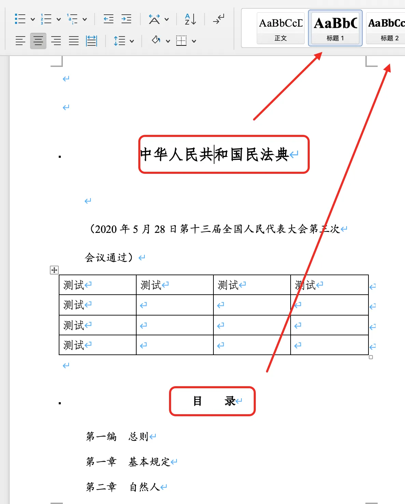 | 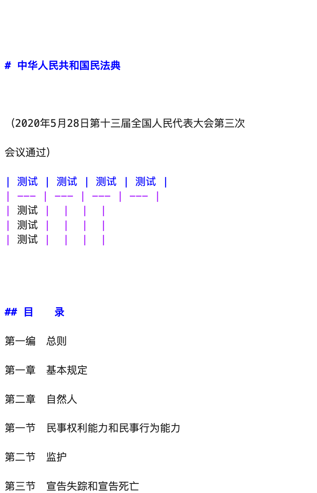 |


### 结论
使用`python-docx`转换docx文件为markdown，从前面的结果中可以得出如下结论：

+ 如果docx文件没有样式，则只会保留纯文本。
+ 如果docx文件有表格，可以正常转换为markdown格式的表格（复杂表格还需要更多的验证）
+ 如果docx文件手动添加了标题，**可以正常转换为markdown格式的标题**

****

## doc转pdf后提取markdown
前面介绍了使用工具将docx转换为markdown格式，如果docx文件没有设置标题的层级结构，那么这些工具都不能转换为markdown的标题。一个解决方法是，人工在上传docx文件到知识库之前，先标注出docx文件的标题层级机构再上传，如果有大量的docx文件，人工处理的效率就很低了。想到的另一个方法就是先将docx文件转换为pdf文件，然后利用前面介绍的工具将pdf转换为markdown，接下来使用docling转换pdf来验证这个想法。

首先将没有标题层级结构docx文件使用word转换为pdf：

| **没有标题层级结构docx文件使用word转换为pdf** | **使用docling转换pdf转换后的markdown** |
| --- | --- |
| 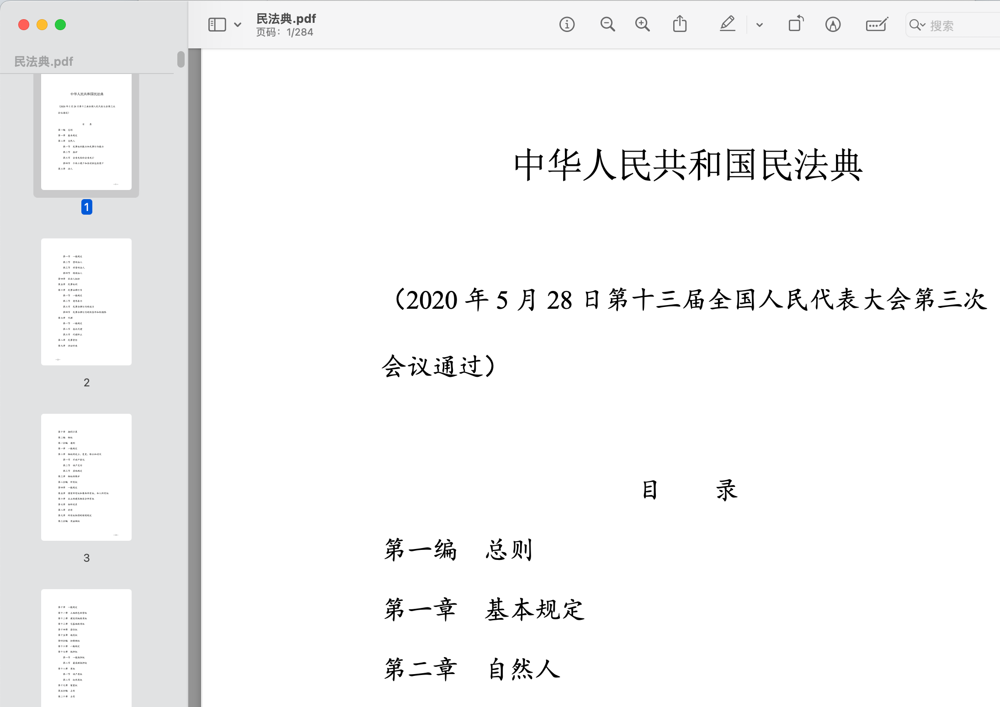 | 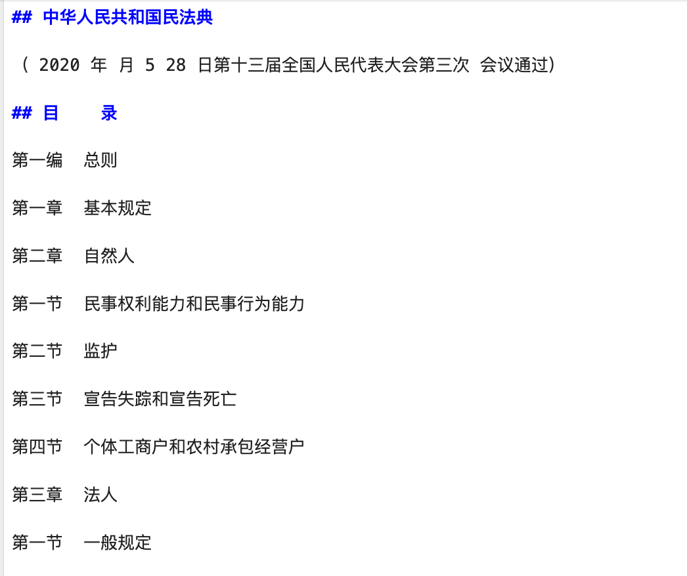 |


从转换后的结果可以看到，标题可以识别出来，但是标题的层级结构还是不够准确。

**结论：对于没有层级结构的docx文件，将docx文件转换为pdf，然后再将pdf转换为mardown格式可以提取部分标题。**


## 总结
本文使用开源工具和自己的实现对pdf文件和docx文件转换为markdown格式进行了实验，对比了各个开源工具的效果，下面根据前面的实验结果做一个总结。

**pdf文件转markdown工具使用总结如下：**

+ **markitdown**：使用的是 pdfminer 提取pdf文本，无法正确提取pdf中的表格和标题。
+ **langchain_pymupdf4llm**：使用**pymupdf**可以正确提取标题，对于简单的表格也能提取内容和格式，但是对于复杂的表格，无法正确提取格式。如果pdf中包含很多复杂的表格，则提取效果不是很好。没有使用模型，提取效率较高，但是PyMuPDF使用的是[AGPL-3.0 license](https://github.com/pymupdf/PyMuPDF?tab=AGPL-3.0-1-ov-file#)，对于商业使用不友好。
+ **docling**: 使用docling的模型提取pdf的效果还不错，使用cpu运行模型的效率也还可以，并且使用的[MIT license](https://github.com/docling-project/docling#)对商用比较友好，**推荐使用**。
+ **marker: **根据官方文档的介绍，marker的解析效果要好于 docling，但是由于marker的使用限制，无法商业使用，可以根据使用场景考虑是否使用该工具。

**docx文件转markdown工具使用总结如下:**

+ **markitdown**：可以正确转换docx文件的标题和表格，查看markitdown转换docx文件的源码，使用`mammoth`先转换成 `html` 格式，然后使用`BeautifulSoup`提取html的内容，最后转换成markdown格式。微软开源项目，代码质量有一定保障，**推荐使用**。
+ **docling**: 无法正确转换docx文件的标题和表格。
+ **python-docx**: 可以正常转换为markdown格式的标题，需要自己编写转换markdown格式的代码，开发成本较高。

所有这些工具都无法保证将pdf文件和docx文件准确地转换成markdown格式，所以在实际应用时，应该添加一个人工验证和修改的入口，比如在构建RAG索引时，先通过工具转换成markdown格式，用户可以预览和修改转换后的markdown内容（修正标题和表格等转换错误的内容），确认无误后再进行后续的chunk切分逻辑。

在RAG应用中同样遵循**垃圾输入，垃圾输出**，如果在最开始构建索引时，存在错误的数据，比如某个表格的数据提取错误，那么会导致整个应用的回答准确性下降。

本文时RAG优化系列的第一篇文章，后续会继续更新，由于知识的局限性文中可能存在错误的结论，欢迎评论指出，如果觉得本文有帮忙，也欢迎点赞评论。


参考文档

1. [https://github.com/microsoft/markitdown](https://github.com/microsoft/markitdown)
2. [https://github.com/docling-project/docling](https://github.com/docling-project/docling)
3. [https://github.com/lakinduboteju/langchain-pymupdf4llm](https://github.com/lakinduboteju/langchain-pymupdf4llm)
4. [https://github.com/VikParuchuri/marker](https://github.com/VikParuchuri/marker)
5. [https://github.com/pymupdf/RAG](https://github.com/pymupdf/RAG)

