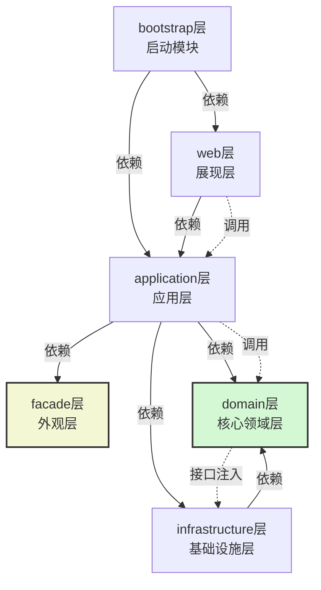
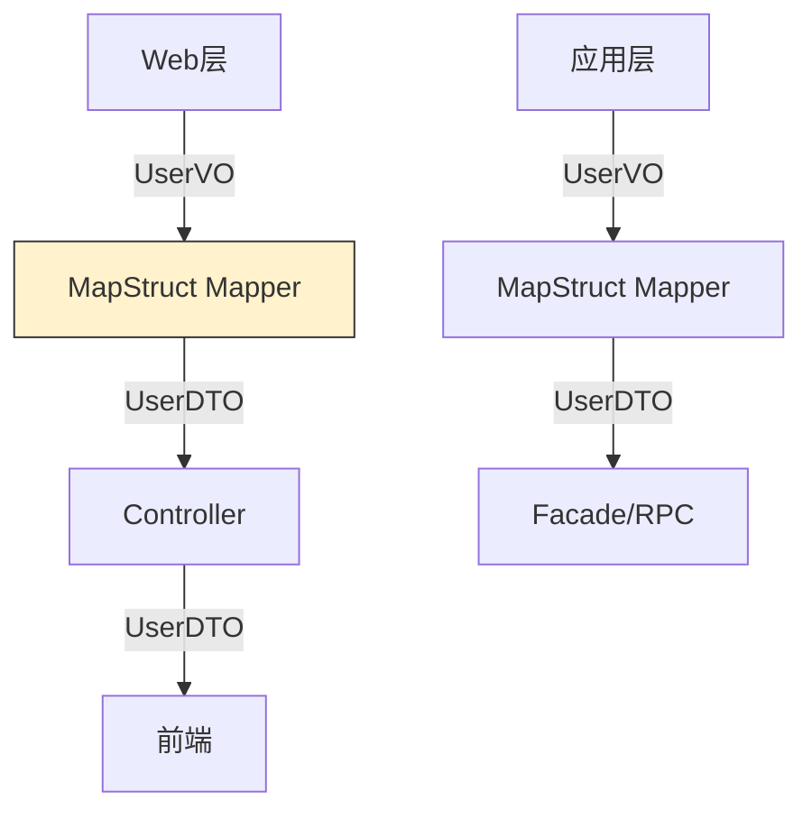
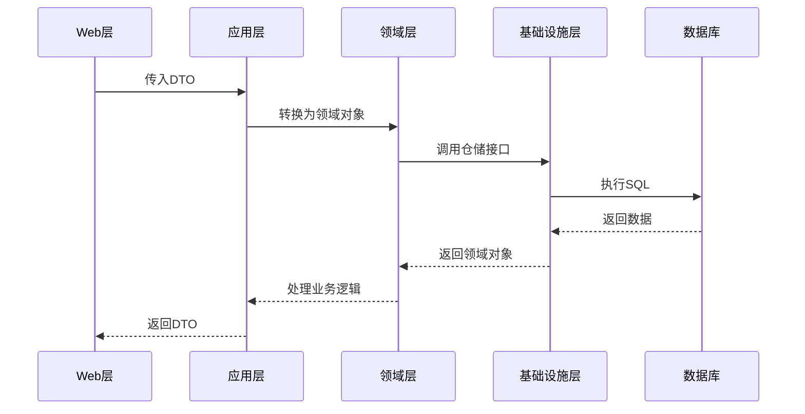
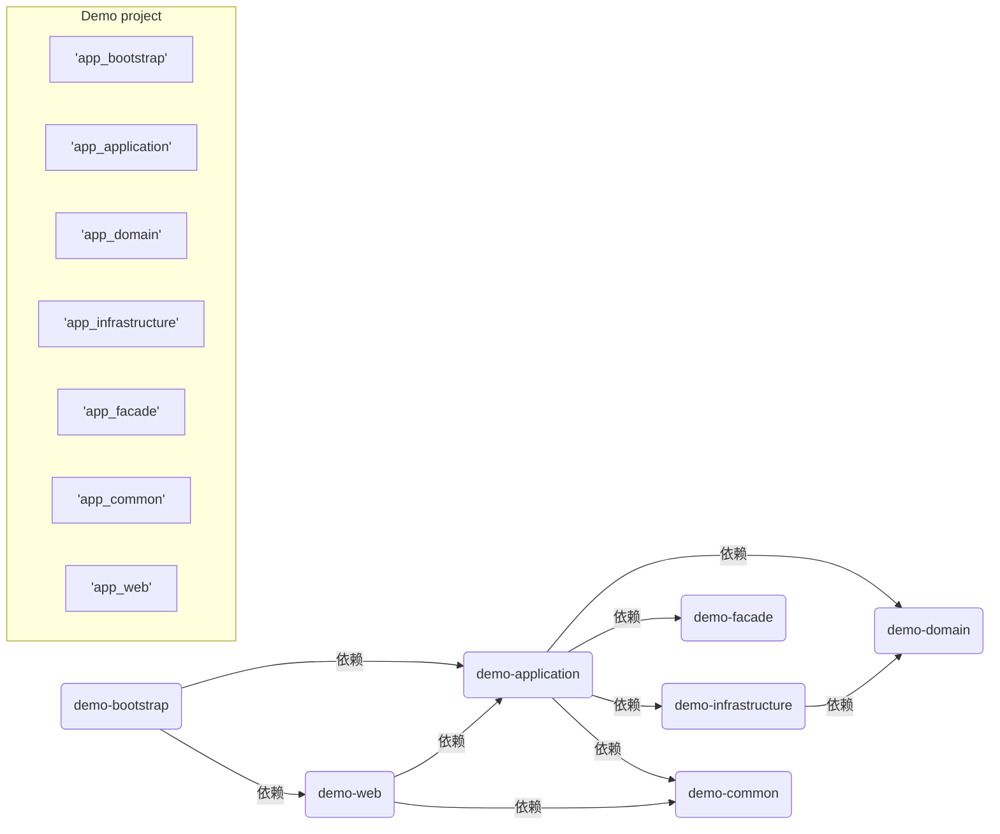

# springboot 大型复杂项目的包结构设计

## Spring Boot 项目按分层架构划分的优势  

在Spring Boot项目中按照领域驱动（DDD）分层架构进行模块划分的优势（分层优势）:
1. 模块化与解耦：将系统分为不同的层次，每层有明确的职责，层与层之间通过接口通信，降低耦合。

2. 可维护性：分层后，每层独立变化，便于维护和扩展。例如，基础设施层的变化不会影响到核心领域层。

3. 可测试性：各层可以独立测试，特别是核心领域层不依赖外部实现，可以很方便地进行单元测试。

4. 代码复用：核心领域层（domain）不依赖其他层，可以被多个应用层（application）复用。

5. 清晰的结构：开发人员可以快速理解项目结构，明确代码应该放在哪一层，有利于团队协作。

6. 技术选型的灵活性：基础设施层可以封装不同的技术实现（如数据库、缓存等），而核心业务逻辑不受影响。

## Maven模块层次结构

假设项目名为`example-project`，包含以下模块：

- example-project-bootstrap: 启动模块（包含Spring Boot启动类）

- example-project-web: web层（可选）

- example-project-facade: facade层（接口描述，可选，单独发布）

- example-project-application: application层（应用层）

- example-project-domain: domain层（核心领域层）

- example-project-infrastructure: infrastructure层（基础设施层）

依赖关系：

1. bootstrap层依赖web层（如果有web层）和application层（如果没有web层，则直接依赖application层）。如果项目有web层，那么bootstrap会依赖web，而web依赖application。

2. web层（如果有）依赖application层。

3. application层依赖domain层和infrastructure层，并且如果存在facade层，则application层也会依赖facade层（因为application层要实现facade的接口）。

4. facade层是独立的，不依赖任何其他模块（只包含接口和DTO）。

5. infrastructure层依赖domain层（因为需要实现domain层定义的一些接口，比如数据库访问接口）。

> 注意：facade层是可选的，如果存在，那么application层会依赖facade层。同时，facade层需要单独打包发布，供其他系统使用。

下面用Maven模块的形式表示：
```

父项目（parent）: example-project

| -- facade (example-project-facade) [可选]

| -- domain (example-project-domain)

| -- infrastructure (example-project-infrastructure)

| -- application (example-project-application) [依赖 domain 和 facade（如果存在）]

| -- web (example-project-web) [可选，依赖 application]

| -- bootstrap (example-project-bootstrap) [依赖 web（如果有）或者 application（如果没有web）]

```

如果没有web层，那么bootstrap直接依赖application层。

具体结构：
```
example-project (父POM)  
│  
├── example-project-domain (核心领域层)  
│     ├── 定义领域模型（Domain）  
│     ├── 核心业务服务接口（application Interfaces）  
│     └── 不依赖其他模块  
│  
├── example-project-infrastructure (基础设施层)  
│     ├── 数据库访问实现（Repository Impl）  
│     ├── RPC/消息队列客户端  
│     └── 依赖 domain 层（实现其接口）  
│  
├── example-project-application (应用层)  
│     ├── 应用服务实现（协调领域逻辑）  
│     └── 依赖 domain 层 + infrastructure层 + facade 层（若存在）  
│  
├── example-project-facade (外观层 - 可选)  
│     ├── 对外接口（API）  
│     ├── DTO 定义  
│     └── 无依赖，独立打包  
│  
├── example-project-web (Web 层 - 可选)  
│     ├── Controller  
│     └── 依赖 application 层  
│  
└── example-project-bootstrap (启动层)  
      ├── Spring Boot 启动类  
      ├── 全局配置  
      └── 依赖 application 层 + 依赖 web 层（若存在）
```

> 注意：在Spring Boot项目中，bootstrap模块是唯一包含启动类的模块，并且会打包成可执行的jar。


### 分层架构各层职责详解  

#### 1. **example-project-common (通用模块)**  
**核心职责**：提供全系统共享的**基础设施无关**的公共组件  
- **通用DTO**  
  - `PageRequest`：统一分页请求参数  
  - `PageResponse`：标准化分页响应结构  
  - `BaseResponse`：全局响应封装（成功/失败）  
- **常量定义**  
  - 系统级常量（如缓存Key前缀）  
  - 错误码枚举（`ErrorCode`）  
- **工具类**  
  - 加解密工具（`AESUtil`）  
  - 日期处理（`DateUtils`）  
  - 验证工具（`ValidationUtils`）  
- **全局异常**  
  - `BusinessException`：业务异常基类  
  - `GlobalExceptionHandler`：统一异常处理器  

> 📌 **设计原则**：零业务逻辑 + 无技术框架依赖，可被任意模块引用  


#### 2. **example-project-domain (核心领域层)**  
**核心职责**：实现系统的**核心业务逻辑**，保持领域模型纯净  
- **领域模型**  
  - 实体（`User`, `Product`）  
  - 值对象（`Money`, `Address`）  
  - 聚合根（`Order`）  
- **领域服务**  
  - 业务规则封装（`UserRegistrationService`）  
  - 跨实体操作（`OrderPaymentService`）  
- **仓储接口**  
  - 定义数据访问契约（`UserRepository`, `OrderRepository`）  
- **领域事件**  
  - `UserRegisteredEvent` 等事件定义  

> 🔒 **关键约束**：  
> 1. 禁止依赖其他模块（包括Spring框架）  
> 2. 通过接口与基础设施层解耦  
> 3. 不包含任何传输对象（DTO）或持久化注解  


#### 3. **example-project-infrastructure (基础设施层)**  
**核心职责**：实现**技术细节**，为领域层提供技术支持  
- **持久化实现**  
  - MyBatis Mapper（`UserMapper`）  
  - JPA Repository（`OrderJpaRepository`）  
  - 仓储接口实现（`UserRepositoryImpl`）  
- **PO对象**  
  - 数据库表映射实体（`UserPO`, `OrderPO`）  
- **三方集成**  
  - Redis客户端（`RedisTemplate`包装）  
  - RPC调用适配器（`PaymentServiceAdapter`）  
  - 消息队列生产者（`KafkaProducer`）  
- **对象转换器**  
  - `UserConverter`：PO ⇄ 领域对象转换  

> ⚙️ **技术重点**：  
> - 实现领域层定义的接口  
> - 处理所有与技术栈相关的代码  


#### 4. **example-project-application (应用层)**  
**核心职责**：**协调领域对象**完成具体应用场景  
- **应用服务**  
  - 用例实现（`UserAppService.register()`）  
  - 事务控制（`@Transactional`）  
- **DTO转换**  
  - 将领域对象转换为传输对象（BO → DTO）  
- **跨领域协调**  
  - 调用多个领域服务完成业务流  
  - 例如订单创建：  
    ```java
    public void createOrder(OrderRequest request) {
        // 1. 验证用户
        User user = userService.validateUser(request.userId());
        // 2. 创建订单领域对象
        Order order = OrderFactory.create(user, request.items());
        // 3. 支付处理
        paymentService.process(order);
        // 4. 保存订单
        orderRepository.save(order);
    }
    ```

> 🧩 **核心价值**：隔离领域逻辑与技术实现，保持用例可读性  


#### 5. **example-project-facade (外观层)**  
**核心职责**：作为系统对外的**服务契约**  
- **API接口定义**  
  - RPC服务接口（`UserFacade`, `OrderFacade`）  
- **接口专用DTO**  
  - 请求/响应对象（`UserCreateDTO`, `OrderResponse`）  
- **接口版本管理**  
  - 支持多版本API（`@ApiVersion("v1")`）  

> 🌐 **关键特性**：  
> 1. 独立打包发布（如Dubbo服务jar包）  
> 2. 不包含任何实现逻辑  
> 3. 定义明确的接口规范文档  


#### 6. **example-project-web (Web层)**  
**核心职责**：处理**HTTP请求**和**前端交互**  
- **控制器**  
  - RESTful API（`UserController`, `ProductController`）  
- **Web专用DTO**  
  - 前端定制化对象（`UserDetailVO`）  
- **参数校验**  
  - 请求验证（`@Valid` + `BindingResult`）  
- **安全控制**  
  - 权限注解（`@PreAuthorize`）  
- **Swagger支持**  
  - API文档生成配置  

> 🖥️ **前端对接要点**：  
> - 使用VO对象屏蔽领域模型细节  
> - 处理跨域等Web层关注点  


#### 7. **example-project-bootstrap (启动层)**  
**核心职责**：**整合所有模块**并启动应用  
- **启动类**  
  - `Application.java`：Spring Boot入口  
- **全局配置**  
  - 数据源配置（`DataSourceConfig`）  
  - MVC配置（`WebMvcConfig`）  
  - 安全配置（`SecurityConfig`）  
- **组件扫描**  
  - 包扫描路径配置  
  ```java
  @SpringBootApplication(scanBasePackages = {
      "com.example.domain",
      "com.example.infrastructure",
      "com.example.application",
      "com.example.web"
  })
  ```
- **Profile管理**  
  - 多环境配置（application-{dev|prod}.yml）  

> 🚀 **启动关键**：仅此模块包含`spring-boot-maven-plugin`插件  


### 分层架构依赖关系图  
以下是基于 Spring Boot 的分层架构依赖关系图，清晰展示了各层之间的编译时依赖（单向箭头）和运行时调用关系（虚线箭头）：  




### 关键依赖说明  
1. **编译时依赖（实线箭头）**  
   - `bootstrap → web`：启动层依赖 Web 层提供 HTTP 服务能力  
   - `web → application`：Web 层调用应用层实现业务逻辑  
   - `application → facade`：应用层实现外观层的接口  
   - `application → domain`：应用层调用核心领域服务
   - `application → infrastructure`：应用层调用基础设施服务
   - `infrastructure → domain`：基础设施层实现核心层定义的接口  

2. **运行时调用（虚线箭头）**  
   - `web → application`：Controller 调用 application 应用逻辑  
   - `application → domain`：应用服务调用领域服务  
   - `domain → infrastructure`：领域服务通过依赖注入调用基础设施实现  

3. **核心特性**  
   - **domain 层绝对稳定**（绿色高亮）：  
     - 不依赖任何其他层（包括 Spring 框架）  
     - 通过接口与 infrastructure 层解耦（依赖倒置原则）  
   - **facade 层独立存在**（黄色高亮）：  
     - 仅包含接口和 DTO，可独立打包发布  
     - 被 application 层实现但不被其反向依赖  
   - **基础设施可替换**：  
     - 数据库/RPC 等实现可在 infrastructure 层灵活更换  
     - 不影响 domain 层业务逻辑（如切换 MyBatis 为 JPA）  

#### 1. **单向依赖**  
   ```  
   bootstrap → web (或 application) → application → domain  
   infrastructure → domain  
   ``` 
   
> 依赖注入说明：
>
> 在domain层中定义接口（如Repository接口），在infrastructure层中实现。在application层中，通过依赖注入（使用Spring）将infrastructure层的实现注入到domain层的服务中。但是注意，domain层本身不依赖infrastructure，所以domain层的代码中不会出现infrastructure的具体类。这种依赖是通过Spring的IoC容器在运行时将infrastructure的bean注入到domain层需要的地方（比如domain层的领域服务中需要Repository接口，而实际注入的是infrastructure中实现的RepositoryImpl）。
>
> 如何实现依赖注入？
> 
> 在bootstrap模块（启动模块）中，由于它依赖了所有模块，所以可以通过`@ComponentScan`扫描到所有模块的Spring组件，然后进行自动装配。

#### 2. **接口解耦示例**

在domain模块中定义接口：
```java

package com.example.domain.repository;

public interface UserRepository {

    User findById(Long id);

}
```

在infrastructure模块中实现：
```java
package com.example.infrastructure.repository;

@Repository
public class UserRepositoryImpl implements UserRepository {

// 具体实现，比如使用JPA或者MyBatis

}
```

在domain层的领域服务中使用：
```java

package com.example.domain.application;

@application
public class UserApplication {

    @Autowired  // 这里注入的是UserRepository接口，实际运行时由Spring容器注入UserRepositoryImpl
    private UserRepository userRepository;

    public User getUser(Long id) {

        return userRepository.findById(id);

    }

}
```

在application层（应用层）中，可以调用domain层的领域服务（如UserApplication）来协调任务。
> 注意：由于domain层不依赖infrastructure层，所以domain层编译时并不需要infrastructure层的存在。但是运行时，Spring容器会需要将infrastructure层的实现类注入到domain层的接口中。因此，在bootstrap模块中，需要将domain层和infrastructure层都纳入Spring的组件扫描范围。


### 典型调用流程示例  
```  
用户请求 → bootstrap(启动)  
          → web(Controller)  
          → application(应用服务)  
          → domain(领域服务)  
          → infrastructure(数据库访问)  
```  

### 架构优势验证  
1. **修改数据库实现**：  
   - 只需重写 `infrastructure` 的 `UserRepositoryImpl`  
   - `domain` 层的 `UserRepository` 无需任何修改  

2. **新增 RPC 服务**：  
   - 在 `infrastructure` 添加新模块 `rpc-adapter`  
   - 实现 `domain` 定义的 `Paymentapplication` 接口  
   - `domain` 层通过依赖注入直接调用

3. **移除 Web 层**：  
   - 删除 `web` 模块和 `bootstrap` 中的相关依赖  
   - 系统自动退化为纯服务化应用（通过 facade 暴露服务）  


## 通用请求响应及分页类的模块归属建议  
根据分层架构的设计原则和模块职责划分，我们需要考虑通用请求响应类（包括分页请求和响应）的用途和依赖关系：

1. **请求响应类的作用**：

- 通常用于Web层（Controller）与前端交互的数据传输对象（DTO）。

- 分页请求（如PageRequest）包含页码、每页数量等分页信息。

- 分页响应（如PageResponse）包含分页数据、总记录数、总页数等信息。

2. **各层职责**：

- `web层`：负责接收HTTP请求，将请求参数转换为Java对象，并将处理结果以HTTP响应返回。因此，它需要定义Controller方法的参数和返回值的类型，这些类型通常就是请求和响应DTO。

- `facade层`：如果存在对外提供的服务接口（如RPC服务），那么facade层会定义服务接口的入参和返回类型（包括分页请求和响应）。这样，无论是Web层调用还是RPC调用，都可以使用相同的分页请求/响应结构。

3. **复用性考虑**：

- 如果项目同时提供Web接口和RPC接口（通过facade层暴露），那么分页请求/响应类应该放在一个公共的地方，以便web层和facade层都能使用。

- 但是，facade层是一个独立的模块，它不应该依赖其他模块（除了最基础的公共模块，如common模块），因为facade需要被其他系统依赖，应该尽量轻量。

4. **解决方案**：

- 方案一：将通用的请求响应类（包括分页请求/响应）放在一个独立的`common`模块中，这个模块只包含一些通用的DTO、工具类等。这样web层和facade层都可以依赖这个common模块。

- 方案二：如果项目中没有独立common模块，且facade层是独立的，那么可以将这些通用DTO放在facade模块中。因为web层会依赖facade层（在存在facade层的情况下，application层依赖facade，而web层依赖application，所以web层间接依赖facade），所以web层可以使用facade中的DTO。但是，这样会导致facade层包含了与Web相关的DTO，而facade层可能被其他RPC调用方引用，这些DTO对于RPC调用方也是适用的（因为分页请求/响应是通用的，不限于Web）。

5. **推荐做法**：

- 在项目中创建一个`common`模块（或称为`api-common`），专门存放跨层共享的DTO，包括通用的请求响应、分页请求响应、错误码枚举等。这个模块应该非常轻量，不依赖任何其他业务模块（可以依赖一些通用的工具包如lombok）。

- 然后，让`web`、`facade`、`application`（如果需要）等模块都依赖这个`common-dto`模块。

但是，根据前面描述的分层结构，我们并没有提到一个独立的common模块。因此，我们需要调整模块结构，增加一个common模块。

6. **调整后的模块结构**：

- 增加一个`example-project-common`模块，用于存放通用的DTO、常量、工具类等。

- 分页请求类（PageRequest）和分页响应类（PageResponse）就放在这个common模块中。

7. **依赖关系**：

- `common`模块不依赖任何其他模块。

- `facade`模块依赖`common`模块（因为facade中的接口参数和返回值可能会用到这些通用DTO）。

- `web`模块依赖`common`模块（因为Controller会使用这些通用DTO）。

- `application`模块如果也需要使用这些DTO（比如在应用服务内部传递分页信息），那么也可以依赖`common`模块，但通常application层使用的是领域对象，所以一般不需要。application层应该尽量使用领域对象，只有在需要与web层或facade层交互时才进行DTO转换。

8. **分页请求/响应类的设计**：

- `PageRequest`：包含pageNo（当前页码）、pageSize（每页大小）、sortBy（排序字段）、sortDirection（排序方向）等。

- `PageResponse`：包含data（当前页数据列表）、total（总记录数）、pageNo、pageSize、totalPages（总页数）等。

9. **具体放置位置**：

- 在`example-project-common`模块中创建包，如`com.example.common.dto`，然后在该包下定义`PageRequest`和`PageResponse`。

10. **为什么不放在domain层？**

- domain层是核心领域层，应该专注于领域模型和业务逻辑，不应该包含与传输相关的DTO。DTO是用于与外部交互的，属于应用层或表现层的东西。

11. **为什么不放在web层？**

- 如果放在web层，那么facade层就无法使用（因为facade层不依赖web层）。而facade层暴露的接口也需要使用相同的分页结构。

12. **为什么不放在facade层？**

- 如果项目没有facade层（比如不对外提供RPC服务），那么放在web层也可以。但是如果有facade层，那么web层会间接依赖facade层，所以放在facade层也可以被web层使用。但是，这样会导致facade层包含了通用的DTO，而facade层的主要职责是定义对外接口，这些通用DTO是多个层共享的，放在facade层可能让facade层变得臃肿，而且其他模块（如基础设施层）如果需要使用这些DTO（通常不会）也会依赖facade层，这是不合理的。

因此，最佳实践是创建一个独立的common模块来存放这些通用类。

调整后的Maven模块结构：

```

example-project (父POM)

│

├── example-project-common (通用模块)

│     ├── 通用DTO（PageRequest, PageResponse, BaseResponse等）

│     ├── 常量

│     └── 工具类

│

├── example-project-domain (核心领域层)

│     └── ...

│

├── example-project-infrastructure (基础设施层)

│     └── ...

│

├── example-project-application (应用层)

│     └── ...

│

├── example-project-facade (外观层)

│     └── ...

│

├── example-project-web (Web层)

│     └── ...

│

└── example-project-bootstrap (启动层)

└── ...

```


示例代码：

在`example-project-common`模块中：

```java

// PageRequest.java
package com.example.demo.common.model.page;

import jakarta.validation.constraints.Max;
import jakarta.validation.constraints.Min;
import jakarta.validation.constraints.Pattern;

import java.util.List;
import java.util.Set;

/**
 * 分页请求参数封装类
 */


public class PageRequest {

    /**
     * 默认第一页
     */
    public static final int DEFAULT_PAGE_NUM = 1;

    /**
     * 默认每页10条
     */
    public static final int DEFAULT_PAGE_SIZE = 10;

    /**
     * 默认排序方向 - 升序
     */
    public static final String DEFAULT_ORDER = "desc";

    /**
     * 最大允许的每页记录数
     */
    public static final int MAX_PAGE_SIZE = 1000;

    /**
     * 当前页码（从1开始）
     */
    @Min(value = 1, message = "页码不能小于1")
    private int pageNum = DEFAULT_PAGE_NUM;

    /**
     * 每页记录数
     */
    @Min(value = 1, message = "每页数量不能小于1")
    @Max(value = MAX_PAGE_SIZE, message = "每页数量不能超过" + MAX_PAGE_SIZE)
    private int pageSize = DEFAULT_PAGE_SIZE;

    /**
     * 排序字段
     */
    private String sort;

    /**
     * 排序方向
     * asc: 升序
     * desc: 降序
     */
    @Pattern(regexp = "asc|desc", message = "排序方向必须是asc或desc")
    private String order = DEFAULT_ORDER;

    // 无参构造器
    public PageRequest() {
    }

    /**
     * 带页码和每页数量的构造器
     *
     * @param pageNum  当前页码
     * @param pageSize 每页数量
     */
    public PageRequest(int pageNum, int pageSize) {
        this.pageNum = pageNum;
        this.pageSize = pageSize;
    }

    /**
     * 带所有参数的构造器
     *
     * @param pageNum  当前页码
     * @param pageSize 每页数量
     * @param sort     排序字段
     * @param order    排序方向
     */
    public PageRequest(int pageNum, int pageSize, String sort, String order) {
        this.pageNum = pageNum;
        this.pageSize = pageSize;
        this.sort = sort;
        this.order = order;
    }

    /**
     * 计算偏移量（用于数据库分页查询）
     *
     * @return 当前页的起始位置
     */
    public int getOffset() {
        return (pageNum - 1) * pageSize;
    }

    /**
     * 验证排序字段是否在允许的列表中
     *
     * @param allowedFields 允许的排序字段集合
     * @return 如果排序字段有效返回true，否则返回false
     */
    public boolean isSortValid(Set<String> allowedFields) {
        if (sort == null || sort.isEmpty()) {
            return true;
        }
        return allowedFields.contains(sort);
    }

    /**
     * 验证排序字段是否在允许的列表中，无效时抛出异常
     *
     * @param allowedFields 允许的排序字段集合
     * @param errorMessage  错误信息
     * @throws IllegalArgumentException 如果排序字段无效
     */
    public void validateSort(List<String> allowedFields, String errorMessage) {
        if (sort != null && !sort.isEmpty() && !allowedFields.contains(sort)) {
            throw new IllegalArgumentException(errorMessage);
        }
    }

    public int getPageNum() {
        return pageNum;
    }

    public void setPageNum(int pageNum) {
        this.pageNum = pageNum;
    }

    public int getPageSize() {
        return pageSize;
    }

    public void setPageSize(int pageSize) {
        this.pageSize = pageSize;
    }

    public String getSort() {
        return sort;
    }

    public void setSort(String sort) {
        this.sort = sort;
    }

    public String getOrder() {
        return order;
    }

    public void setOrder(String order) {
        this.order = order;
    }
}

```

```java

// PageResult.java

package com.example.demo.common.model.page;

import java.util.ArrayList;
import java.util.Collections;
import java.util.List;
import java.util.function.BiFunction;
import java.util.function.Function;
import java.util.stream.Collectors;


public class PageResult<T> {

    private final int pageNum;        // 当前页码
    private final int pageSize;        // 每页数量
    private final long total;      // 总记录数
    private final int totalPage;       // 总页数
    private final List<T> data;    // 当前页数据
    private final String sort;     // 排序字段
    private final String order;    // 排序方向

    /**
     * 构造函数
     *
     * @param pageRequest 分页请求
     * @param total       总记录数
     * @param data        当前页数据
     */
    public PageResult(PageRequest pageRequest, long total, List<T> data) {
        this.pageNum = pageRequest.getPageNum();
        this.pageSize = pageRequest.getPageSize();
        this.sort = pageRequest.getSort();
        this.order = pageRequest.getOrder();
        this.total = total;
        this.totalPage = calculateTotalPage(total, pageRequest.getPageSize());
        this.data = data;
    }

    /**
     * 构造函数
     *
     * @param pageNum  当前页码
     * @param pageSize  每页数量
     * @param total 总记录数
     * @param data  当前页数据
     * @param sort  排序字段
     * @param order 排序方向
     */
    public PageResult(int pageNum, int pageSize, long total, List<T> data, String sort, String order) {
        this.pageNum = pageNum;
        this.pageSize = pageSize;
        this.total = total;
        this.data = data != null ? data : Collections.emptyList();
        this.sort = sort;
        this.order = order;

        // 计算总页数
        this.totalPage = calculateTotalPage(total, pageSize);
    }

    /**
     * 计算总页数
     *
     * @param total 总记录数
     * @param size  每页数量
     * @return 总页数
     */
    private int calculateTotalPage(long total, int size) {
        if (size <= 0) return 0;
        return (int) Math.ceil((double) total / size);
    }


    // ================ 实用静态方法 ================ //

    /**
     * 创建空的分页结果
     *
     * @param <T> 数据类型
     * @return 空的分页结果
     */
    public static <T> PageResult<T> empty() {
        return new PageResult<>(1, 0, 0, Collections.emptyList(), null, null);
    }

    /**
     * 基于 PageRequest 创建空的分页结果
     *
     * @param pageRequest 分页请求
     * @param <T>         数据类型
     * @return 空的分页结果
     */
    public static <T> PageResult<T> empty(PageRequest pageRequest) {
        return new PageResult<>(
                pageRequest.getPageNum(),
                pageRequest.getPageSize(),
                0,
                Collections.emptyList(),
                pageRequest.getSort(),
                pageRequest.getOrder()
        );
    }

    /**
     * 创建单页结果（适用于数据量小的情况）
     *
     * @param data 所有数据
     * @param <T>  数据类型
     * @return 单页结果
     */
    public static <T> PageResult<T> singlePage(List<T> data) {
        long total = data != null ? data.size() : 0;
        return new PageResult<>(1, (int) total, total, data, null, null);
    }

    /**
     * 创建分页结果（基于 PageRequest）
     *
     * @param pageRequest 分页请求
     * @param total       总记录数
     * @param data        当前页数据
     * @param <T>         数据类型
     * @return 分页结果
     */
    public static <T> PageResult<T> of(PageRequest pageRequest, long total, List<T> data) {
        return new PageResult<>(
                pageRequest.getPageNum(),
                pageRequest.getPageSize(),
                total,
                data,
                pageRequest.getSort(),
                pageRequest.getOrder()
        );
    }

    /**
     * 转换分页结果的数据类型
     *
     * @param source 源分页结果
     * @param mapper 数据转换函数
     * @param <T>    源数据类型
     * @param <R>    目标数据类型
     * @return 转换后的分页结果
     */
    public static <T, R> PageResult<R> map(PageResult<T> source, Function<T, R> mapper) {
        if (source == null || mapper == null) {
            throw new IllegalArgumentException("Source and mapper must not be null");
        }

        List<R> mappedData = source.getData().stream()
                .map(mapper)
                .collect(Collectors.toList());

        return new PageResult<>(
                source.getPageNum(),
                source.getPageSize(),
                source.getTotal(),
                mappedData,
                source.getSort(),
                source.getOrder()
        );
    }

    /**
     * 合并两个分页结果（适用于并行查询场景）
     *
     * @param result1  第一个分页结果
     * @param result2  第二个分页结果
     * @param combiner 数据合并函数
     * @param <T>      第一个结果的数据类型
     * @param <U>      第二个结果的数据类型
     * @param <R>      合并后的数据类型
     * @return 合并后的分页结果
     */
    public static <T, U, R> PageResult<R> combine(
            PageResult<T> result1,
            PageResult<U> result2,
            BiFunction<T, U, R> combiner) {

        // 验证分页信息是否一致
        if (result1.getPageNum() != result2.getPageNum() ||
                result1.getPageSize() != result2.getPageSize() ||
                result1.getTotal() != result2.getTotal()) {
            throw new IllegalArgumentException("Page results are not compatible for combination");
        }

        // 验证数据数量是否一致
        if (result1.getData().size() != result2.getData().size()) {
            throw new IllegalArgumentException("Data lists have different sizes");
        }

        // 合并数据
        List<R> combinedData = new ArrayList<>();
        for (int i = 0; i < result1.getData().size(); i++) {
            R combined = combiner.apply(
                    result1.getData().get(i),
                    result2.getData().get(i)
            );
            combinedData.add(combined);
        }

        return new PageResult<>(
                result1.getPageNum(),
                result1.getPageSize(),
                result1.getTotal(),
                combinedData,
                result1.getSort(),
                result1.getOrder()
        );
    }

    public int getPageNum() {
        return pageNum;
    }

    public int getPageSize() {
        return pageSize;
    }

    public long getTotal() {
        return total;
    }

    public int getTotalPage() {
        return totalPage;
    }

    public List<T> getData() {
        return data;
    }

    public String getSort() {
        return sort;
    }

    public String getOrder() {
        return order;
    }
}

```

在web层使用：

```java

// UserController.java

@RestController
@RequestMapping("/users")
public class UserController {

    @Autowired
    private UserService userService;

    @GetMapping
    public PageResponse<UserDTO> listUsers(PageRequest pageRequest) {

        // 调用application层，返回PageResponse

        return userService.listUsers(pageRequest);

    }

}

```

在facade层接口中使用（如果facade层需要分页查询接口）：

```java

// UserFacade.java (在facade模块中)

public interface UserFacade {

    PageResponse<UserDTO> listUsers(PageRequest pageRequest);

}

```
通用请求响应以及分页请求和响应类应该放在独立的common模块中，以便多个层（web、facade）复用。
这样，无论是通过Web接口还是RPC接口，都使用相同的分页请求和响应结构，保持一致性。


## 为什么禁止Web层直接调用Domain层？

根据分层架构的依赖关系，web层（展现层）通常不直接调用domain层（核心领域层）。正确的依赖关系应该是：

web层 → 应用层（application） → 核心领域层（domain）

理由：

1. 分层隔离：web层负责处理HTTP请求和响应，不应该包含业务逻辑。业务逻辑应由应用层或领域层处理。

2. 单一职责：web层只负责参数校验、数据转换（DTO/VO转换）和路由，业务逻辑协调交给应用层。

3. 依赖倒置：核心领域层应该保持纯净，不依赖上层（如web层）。如果web层直接调用domain层，会导致domain层被上层污染，并且破坏了分层依赖规则。

正确的调用流程：

1. web层（Controller）接收到请求，将请求参数转换为DTO。

2. web层调用应用层（Application Service）的方法，传入DTO。

3. 应用层负责协调多个领域服务（Domain Service）或聚合根，执行具体的业务用例。

4. 应用层内部将DTO转换为领域对象（BO），然后调用领域层的方法。

5. 领域层执行核心业务逻辑，并调用基础设施层（如仓储接口）进行持久化操作。

因此，web层不应该直接调用domain层，而应该通过应用层来访问领域逻辑。

但是，在简单的CRUD项目中，有时会省略应用层，此时web层可以直接调用领域服务（但领域服务仍然在domain层，而web层依赖domain层）。但这种做法在严格的分层架构中是不推荐的，因为这样会导致领域层被上层直接依赖，使得领域层无法独立于交付机制（如Web）存在。

根据前面的架构设计，我们的分层依赖是：

web层 → 应用层 → 领域层

基础设施层 → 领域层

所以，在设计的项目中，web层不能直接调用domain层，而是通过应用层间接调用。

如果web层直接调用domain层，会导致：

- 领域层需要暴露给web层，增加了领域层的耦合。

- 业务逻辑可能会泄露到web层，导致重复代码。

- 破坏分层架构，使得领域层无法独立复用（比如领域层除了被web调用，还可能被消息监听器等调用）。

结论：web层不能直接调用domain层，必须通过应用层（application层）来协调。

## 使用 MapStruct 实现 VO 到 DTO 的转换

下面是一个完整的指南，展示如何使用 MapStruct 高效地将 View Object (VO) 转换为 Data Transfer Object (DTO)。

### 1. 添加 MapStruct 依赖

```xml
<!-- pom.xml -->
<properties>
    <org.mapstruct.version>1.5.5.Final</org.mapstruct.version>
</properties>

<dependencies>
    <dependency>
        <groupId>org.mapstruct</groupId>
        <artifactId>mapstruct</artifactId>
        <version>${org.mapstruct.version}</version>
    </dependency>
</dependencies>

<build>
    <plugins>
        <plugin>
            <groupId>org.apache.maven.plugins</groupId>
            <artifactId>maven-compiler-plugin</artifactId>
            <version>3.11.0</version>
            <configuration>
                <annotationProcessorPaths>
                    <path>
                        <groupId>org.mapstruct</groupId>
                        <artifactId>mapstruct-processor</artifactId>
                        <version>${org.mapstruct.version}</version>
                    </path>
                </annotationProcessorPaths>
            </configuration>
        </plugin>
    </plugins>
</build>
```

### 2. 创建 VO 和 DTO 类

#### VO (View Object) - Web层
```java
// web 模块
public class UserVO {
    private Long id;
    private String username;
    private String displayName;
    private String avatarUrl;
    private LocalDateTime lastLoginTime;
    
    // 省略 getter/setter
}
```

#### DTO (Data Transfer Object) - 公共DTO
```java
// common-dto 模块
public class UserDTO {
    private Long userId;
    private String loginName;
    private String fullName;
    private String profileImage;
    private LocalDateTime lastLogin;
    
    // 省略 getter/setter
}
```

### 3. 创建 MapStruct Mapper 接口

```java
// web 模块 (或 converter 模块)
@Mapper(componentModel = "spring")
public interface UserMapper {

    UserMapper INSTANCE = Mappers.getMapper(UserMapper.class);

    @Mapping(source = "id", target = "userId")
    @Mapping(source = "username", target = "loginName")
    @Mapping(source = "displayName", target = "fullName")
    @Mapping(source = "avatarUrl", target = "profileImage")
    @Mapping(source = "lastLoginTime", target = "lastLogin")
    UserDTO voToDto(UserVO vo);

    @Mapping(source = "userId", target = "id")
    @Mapping(source = "loginName", target = "username")
    @Mapping(source = "fullName", target = "displayName")
    @Mapping(source = "profileImage", target = "avatarUrl")
    @Mapping(source = "lastLogin", target = "lastLoginTime")
    UserVO dtoToVo(UserDTO dto);
}
```

### 4. 使用 MapStruct 进行转换

#### 在 Controller 中使用
```java
// web 模块
@RestController
@RequestMapping("/users")
public class UserController {

    private final UserMapper userMapper;
    private final UserAppService userAppService;

    @GetMapping("/{id}")
    public ResponseEntity<BaseResponse<UserDTO>> getUserById(@PathVariable Long id) {
        UserVO userVO = userAppService.getUserById(id);
        
        // 使用 MapStruct 进行转换
        UserDTO userDTO = userMapper.voToDto(userVO);
        
        return ResponseEntity.ok(BaseResponse.success(userDTO));
    }
}
```

#### 在 Service 中使用
```java
// application 模块
@Service
public class UserAppServiceImpl implements UserAppService {

    private final UserDomainService userDomainService;
    private final UserMapper userMapper;

    public UserDTO getUserById(Long id) {
        User user = userDomainService.findUserById(id);
        
        // 领域对象转VO
        UserVO userVO = convertToVO(user);
        
        // VO转DTO
        return userMapper.voToDto(userVO);
    }
    
    private UserVO convertToVO(User user) {
        // 领域对象转VO的逻辑
    }
}
```

### 5. 高级映射技巧

#### 自定义映射方法
```java
@Mapper(componentModel = "spring")
public interface UserMapper {

    // ... 其他映射
    
    @Mapping(target = "status", ignore = true) // 忽略字段
    @Mapping(target = "fullName", expression = "java(vo.getFirstName() + ' ' + vo.getLastName())")
    UserDTO voToDto(UserVO vo);
    
    // 自定义类型转换
    @Named("stringToLocalDate")
    default LocalDate stringToLocalDate(String date) {
        return date != null ? LocalDate.parse(date) : null;
    }
    
    @Mapping(source = "birthDateStr", target = "birthDate", qualifiedByName = "stringToLocalDate")
    UserDTO voToDtoWithBirthDate(UserVO vo);
}
```

#### 多个源对象映射
```java
@Mapper(componentModel = "spring")
public interface UserMapper {

    @Mapping(source = "vo.id", target = "userId")
    @Mapping(source = "meta.createTime", target = "registrationDate")
    UserDTO voAndMetaToDto(UserVO vo, UserMeta meta);
}
```

#### 集合映射
```java
@Mapper(componentModel = "spring")
public interface UserMapper {

    List<UserDTO> vosToDtos(List<UserVO> vos);
    
    Set<UserDTO> vosToDtos(Set<UserVO> vos);
    
    @Mapping(source = "id", target = "key")
    Map<Long, UserDTO> vosToDtoMap(List<UserVO> vos);
}
```

### 6. 性能优化建议

#### 1. 使用单例模式
```java
@Mapper(componentModel = "spring")
public interface UserMapper {
    UserMapper INSTANCE = Mappers.getMapper(UserMapper.class);
}
```

#### 2. 批量转换避免循环
```java
// 高效方式
List<UserDTO> dtos = userMapper.vosToDtos(vos);

// 避免这样使用（低效）
List<UserDTO> dtos = new ArrayList<>();
for (UserVO vo : vos) {
    dtos.add(userMapper.voToDto(vo));
}
```

#### 3. 使用 MapStruct SPI 进行高级配置
创建 `META-INF/services/org.mapstruct.ap.spi.AccessorNamingStrategy` 文件：
```java
public class CustomAccessorNamingStrategy extends DefaultAccessorNamingStrategy {
    @Override
    public boolean isGetterMethod(ExecutableElement method) {
        // 自定义getter识别逻辑
    }
}
```

### 7. 与分层架构集成



#### 各层对象转换关系：
1. **Web层**：
   - 接收前端请求 → `@RequestBody UserVO`
   - 返回响应 → `UserDTO`

2. **应用层**：
   - 接收Web层输入 → `UserVO`
   - 调用领域层 → `User` (领域对象)
   - 返回Web层 → `UserDTO`

3. **Facade层**：
   - 接收RPC请求 → `UserDTO`
   - 返回RPC响应 → `UserDTO`

### 8. 最佳实践总结

1. **模块化放置**：
   - 通用转换器：放在 `common-converter` 模块
   - 层特定转换器：放在各层模块中（如 `web-converter`）

2. **命名规范**：
   ```java
   // 推荐
   UserMapper
   ProductConverter
   
   // 方法名
   voToDto()
   entityToResponse()
   ```

3. **性能关键点**：
   - 对于高频转换，使用 `@MappingTarget` 更新现有对象
   ```java
   @Mapping(target = "lastLogin", source = "loginTime")
   void updateDtoFromVo(UserVO vo, @MappingTarget UserDTO dto);
   ```

4. **组合映射**：
   ```java
   @Mapper(uses = {DateMapper.class, AddressMapper.class})
   public interface UserMapper {
       // 会自动使用 DateMapper 和 AddressMapper
   }
   
   @Mapper
   public interface DateMapper {
       default String localDateTimeToString(LocalDateTime date) {
           return date != null ? date.toString() : null;
       }
   }
   ```

通过这种结构化的 MapStruct 实现，可以确保：
- 转换逻辑集中管理，易于维护
- 编译时生成代码，无运行时反射开销
- 类型安全，减少转换错误
- 与分层架构完美契合，保持各层职责清晰


## 典型请求流  


## 架构核心优势  
1. **领域层绝对稳定**  
   - 修改数据库不影响业务规则  
   - 替换Web框架不波及核心逻辑  

2. **技术细节隔离**  
   - 基础设施变更（如Redis→Memcached）只需修改基础设施层  

3. **多端接口统一**  
   ```mermaid
   graph LR
       Web前端 --> web层
       移动端 --> facade层
       第三方系统 --> facade层
       web层 & facade层 --> application层
   ```

4. **可测试性增强**  
   - 领域层可脱离Spring独立测试  
   - 应用层通过Mock领域服务测试用例  

> 通过这种分层，系统获得业务核心与技术实现的彻底解耦，支持长期演化和多端扩展。

## springboot 项目目录结构示例

### demo 目录结构
```
demo
├── HELP.md
├── README.md
├── app
│   ├── application
│   │   ├── pom.xml
│   │   └── src
│   │       ├── main
│   │       │   ├── java
│   │       │   │   └── com
│   │       │   │       └── example
│   │       │   │           └── demo
│   │       │   │               └── application
│   │       │   │                   ├── converter
│   │       │   │                   │   └── RuleDTO2BOConverter.java
│   │       │   │                   ├── dto
│   │       │   │                   │   └── RuleQueryDTO.java
│   │       │   │                   └── service
│   │       │   │                       ├── RuleService.java
│   │       │   │                       └── impl
│   │       │   │                           └── RuleServiceImpl.java
│   │       │   └── resources
│   │       │       └── spring
│   │       │           └── example.xml
│   │       └── test
│   │           └── java
│   │               └── com
│   │                   └── example
│   │                       └── demo
│   │                           └── application
│   ├── bootstrap
│   │   ├── pom.xml
│   │   └── src
│   │       ├── main
│   │       │   ├── java
│   │       │   │   └── com
│   │       │   │       └── example
│   │       │   │           └── demo
│   │       │   │               └── DemoApplication.java
│   │       │   └── resources
│   │       │       ├── config
│   │       │       │   ├── application-default.properties
│   │       │       │   ├── application-dev.properties
│   │       │       │   ├── application-prod.properties
│   │       │       │   ├── application-sim.properties
│   │       │       │   ├── application-test.properties
│   │       │       │   └── application.properties
│   │       │       ├── log4j2-spring.xml
│   │       │       ├── spring
│   │       │       │   └── example.xml
│   │       │       └── static
│   │       │           └── index.html
│   │       └── test
│   │           └── java
│   │               └── com
│   │                   └── example
│   │                       └── demo
│   │                           └── AbstractTestBase.java
│   ├── common
│   │   ├── pom.xml
│   │   └── src
│   │       ├── main
│   │       │   ├── java
│   │       │   │   └── com
│   │       │   │       └── example
│   │       │   │           └── demo
│   │       │   │               └── common
│   │       │   │                   ├── annotation
│   │       │   │                   ├── constant
│   │       │   │                   ├── enums
│   │       │   │                   │   ├── AppErrorCode.java
│   │       │   │                   │   └── ErrorCode.java
│   │       │   │                   ├── model
│   │       │   │                   │   ├── page
│   │       │   │                   │   │   ├── PageRequest.java
│   │       │   │                   │   │   ├── PageResult.java
│   │       │   │                   │   │   └── PaginationUtils.java
│   │       │   │                   │   └── response
│   │       │   │                   │       └── Result.java
│   │       │   │                   └── util
│   │       │   └── resources
│   │       └── test
│   │           └── java
│   ├── domain
│   │   ├── pom.xml
│   │   └── src
│   │       ├── main
│   │       │   ├── java
│   │       │   │   └── com
│   │       │   │       └── example
│   │       │   │           └── demo
│   │       │   │               └── domain
│   │       │   │                   ├── converter
│   │       │   │                   ├── model
│   │       │   │                   │   └── bo
│   │       │   │                   │       ├── RuleQueryBO.java
│   │       │   │                   │       └── RuleWithLatestVersionDTO.java
│   │       │   │                   └── repository
│   │       │   └── resources
│   │       │       └── spring
│   │       │           └── example.xml
│   │       └── test
│   │           └── java
│   │               └── com
│   │                   └── example
│   │                       └── demo
│   │                           └── domain
│   ├── facade
│   │   ├── pom.xml
│   │   └── src
│   │       ├── main
│   │       │   ├── java
│   │       │   │   └── com
│   │       │   │       └── example
│   │       │   │           └── demo
│   │       │   │               └── facade
│   │       │   └── resources
│   │       │       └── spring
│   │       │           └── example.xml
│   │       └── test
│   │           └── java
│   │               └── com
│   │                   └── example
│   │                       └── demo
│   │                           └── facade
│   ├── infrastructure
│   │   ├── pom.xml
│   │   └── src
│   │       ├── main
│   │       │   ├── java
│   │       │   │   └── com
│   │       │   │       └── example
│   │       │   │           └── demo
│   │       │   │               └── infrastructure
│   │       │   │                   ├── mybatis
│   │       │   │                   │   ├── MybatisConfiguration.java
│   │       │   │                   │   ├── mapper
│   │       │   │                   │   │   ├── custom
│   │       │   │                   │   │   │   ├── RuleCustomMapper.java
│   │       │   │                   │   │   │   └── builder
│   │       │   │                   │   │   │       └── RuleQueryBuilder.java
│   │       │   │                   │   │   └── generated
│   │       │   │                   │   │       ├── RuleEntityDynamicSqlSupport.java
│   │       │   │                   │   │       ├── RuleMapper.java
│   │       │   │                   │   │       ├── RuleVersionEntityDynamicSqlSupport.java
│   │       │   │                   │   │       └── RuleVersionMapper.java
│   │       │   │                   │   └── model
│   │       │   │                   │       └── entity
│   │       │   │                   │           ├── RuleEntity.java
│   │       │   │                   │           └── RuleVersionEntity.java
│   │       │   │                   └── repositoryimpl
│   │       │   └── resources
│   │       │       ├── generatorConfig.xml
│   │       │       └── spring
│   │       │           └── example.xml
│   │       └── test
│   │           └── java
│   │               └── com
│   │                   └── example
│   │                       └── demo
│   │                           └── infrastructure
│   └── web
│       ├── pom.xml
│       └── src
│           ├── main
│           │   ├── java
│           │   │   └── com
│           │   │       └── example
│           │   │           └── demo
│           │   │               └── web
│           │   │                   ├── controller
│           │   │                   │   └── RuleController.java
│           │   │                   ├── converter
│           │   │                   │   └── RuleConverter.java
│           │   │                   ├── exception
│           │   │                   │   └── ControllerExceptionHandler.java
│           │   │                   └── vo
│           │   │                       ├── request
│           │   │                       │   └── RuleQueryPageRequest.java
│           │   │                       └── response
│           │   └── resources
│           └── test
│               └── java
└── pom.xml


```

### 依赖关系



> 注意：common模块应该尽量保持精简，避免引入不必要的依赖，以免传递依赖到其他模块。


## 总结  
- **核心思想**：**领域驱动设计（DDD）** 分层，确保业务逻辑与技术实现分离。  
- **最大优势**：`domain` 层完全独立，业务逻辑不污染技术细节，适应需求变化与技术演进。  
- **适用场景**：中大型复杂业务系统，需长期维护、高频迭代的项目。

这种分层架构使得核心业务逻辑（domain层）独立于技术实现（infrastructure层），提高了系统的可维护性和可扩展性。此分层结构完美符合 **整洁架构** 和 **六边形架构** 思想，核心业务逻辑（domain 层）始终处于最内层且不受技术细节污染。

