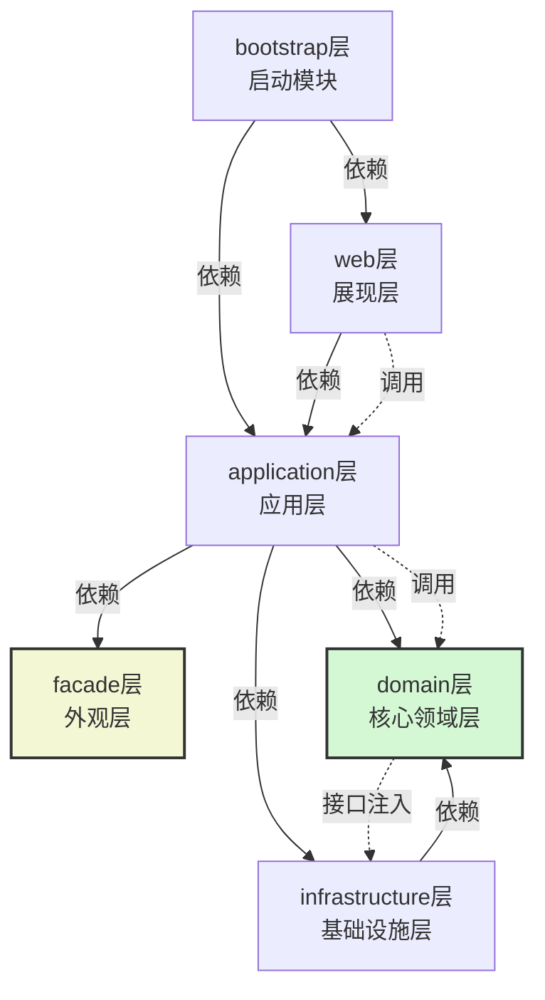
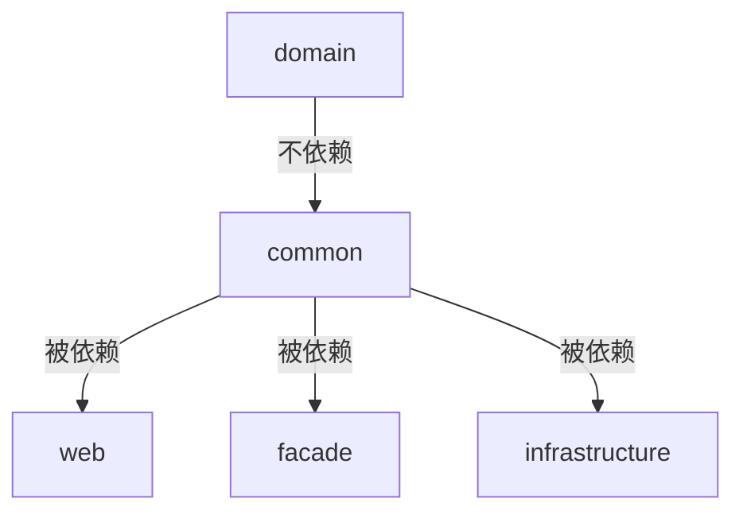

# springboot 大型复杂项目的包结构设计

## Spring Boot 项目按分层架构划分的优势  

在Spring Boot项目中按照领域驱动（DDD）分层架构进行模块划分的优势（分层优势）:
1. 模块化与解耦：将系统分为不同的层次，每层有明确的职责，层与层之间通过接口通信，降低耦合。

2. 可维护性：分层后，每层独立变化，便于维护和扩展。例如，基础设施层的变化不会影响到核心领域层。

3. 可测试性：各层可以独立测试，特别是核心领域层不依赖外部实现，可以很方便地进行单元测试。

4. 代码复用：核心领域层（domain）不依赖其他层，可以被多个应用层（application）复用。

5. 清晰的结构：开发人员可以快速理解项目结构，明确代码应该放在哪一层，有利于团队协作。

6. 技术选型的灵活性：基础设施层可以封装不同的技术实现（如数据库、缓存等），而核心业务逻辑不受影响。

## Maven模块层次结构

假设项目名为`example-project`，包含以下模块：

- example-project-bootstrap: 启动模块（包含Spring Boot启动类）

- example-project-web: web层（可选）

- example-project-facade: facade层（接口描述，可选，单独发布）

- example-project-application: application层（应用层）

- example-project-domain: domain层（核心领域层）

- example-project-infrastructure: infrastructure层（基础设施层）

依赖关系：

1. bootstrap层依赖web层（如果有web层）和application层（如果没有web层，则直接依赖application层）。如果项目有web层，那么bootstrap会依赖web，而web依赖application。

2. web层（如果有）依赖application层。

3. application层依赖domain层和infrastructure层，并且如果存在facade层，则application层也会依赖facade层（因为application层要实现facade的接口）。

4. facade层是独立的，不依赖任何其他模块（只包含接口和DTO）。

5. infrastructure层依赖domain层（因为需要实现domain层定义的一些接口，比如数据库访问接口）。

> 注意：facade层是可选的，如果存在，那么application层会依赖facade层。同时，facade层需要单独打包发布，供其他系统使用。

下面用Maven模块的形式表示：
```

父项目（parent）: example-project

| -- facade (example-project-facade) [可选]

| -- domain (example-project-domain)

| -- infrastructure (example-project-infrastructure)

| -- application (example-project-application) [依赖 domain 和 facade（如果存在）]

| -- web (example-project-web) [可选，依赖 application]

| -- bootstrap (example-project-bootstrap) [依赖 web（如果有）或者 application（如果没有web）]

```

如果没有web层，那么bootstrap直接依赖application层。

具体结构：
```
example-project (父POM)  
│  
├── example-project-domain (核心领域层)  
│     ├── 定义领域模型（Domain）  
│     ├── 核心业务服务接口（application Interfaces）  
│     └── 不依赖其他模块  
│  
├── example-project-infrastructure (基础设施层)  
│     ├── 数据库访问实现（Repository Impl）  
│     ├── RPC/消息队列客户端  
│     └── 依赖 domain 层（实现其接口）  
│  
├── example-project-application (应用层)  
│     ├── 应用服务实现（协调领域逻辑）  
│     └── 依赖 domain 层 + infrastructure层 + facade 层（若存在）  
│  
├── example-project-facade (外观层 - 可选)  
│     ├── 对外接口（API）  
│     ├── DTO 定义  
│     └── 无依赖，独立打包  
│  
├── example-project-web (Web 层 - 可选)  
│     ├── Controller  
│     └── 依赖 application 层  
│  
└── example-project-bootstrap (启动层)  
      ├── Spring Boot 启动类  
      ├── 全局配置  
      └── 依赖 application 层 + 依赖 web 层（若存在）
```

> 注意：在Spring Boot项目中，bootstrap模块是唯一包含启动类的模块，并且会打包成可执行的jar。

### 分层架构依赖关系图  
以下是基于 Spring Boot 的分层架构依赖关系图，清晰展示了各层之间的编译时依赖（单向箭头）和运行时调用关系（虚线箭头）：  



### 关键依赖说明  
1. **编译时依赖（实线箭头）**  
   - `bootstrap → web`：启动层依赖 Web 层提供 HTTP 服务能力  
   - `web → application`：Web 层调用应用层实现业务逻辑  
   - `application → facade`：应用层实现外观层的接口  
   - `application → domain`：应用层调用核心领域服务
   - `application → infrastructure`：应用层调用基础设施服务
   - `infrastructure → domain`：基础设施层实现核心层定义的接口  

2. **运行时调用（虚线箭头）**  
   - `web → application`：Controller 调用 application 应用逻辑  
   - `application → domain`：应用服务调用领域服务  
   - `domain → infrastructure`：领域服务通过依赖注入调用基础设施实现  

3. **核心特性**  
   - **domain 层绝对稳定**（绿色高亮）：  
     - 不依赖任何其他层（包括 Spring 框架）  
     - 通过接口与 infrastructure 层解耦（依赖倒置原则）  
   - **facade 层独立存在**（黄色高亮）：  
     - 仅包含接口和 DTO，可独立打包发布  
     - 被 application 层实现但不被其反向依赖  
   - **基础设施可替换**：  
     - 数据库/RPC 等实现可在 infrastructure 层灵活更换  
     - 不影响 domain 层业务逻辑（如切换 MyBatis 为 JPA）  

#### 1. **单向依赖**  
   ```  
   bootstrap → web (或 application) → application → domain  
   infrastructure → domain  
   ``` 
   
> 依赖注入说明：
>
> 在domain层中定义接口（如Repository接口），在infrastructure层中实现。在application层中，通过依赖注入（使用Spring）将infrastructure层的实现注入到domain层的服务中。但是注意，domain层本身不依赖infrastructure，所以domain层的代码中不会出现infrastructure的具体类。这种依赖是通过Spring的IoC容器在运行时将infrastructure的bean注入到domain层需要的地方（比如domain层的领域服务中需要Repository接口，而实际注入的是infrastructure中实现的RepositoryImpl）。
>
> 如何实现依赖注入？
> 
> 在bootstrap模块（启动模块）中，由于它依赖了所有模块，所以可以通过`@ComponentScan`扫描到所有模块的Spring组件，然后进行自动装配。

#### 2. **接口解耦示例**

在domain模块中定义接口：
```java

package com.example.domain.repository;

public interface UserRepository {

    User findById(Long id);

}
```

在infrastructure模块中实现：
```java
package com.example.infrastructure.repository;

@Repository
public class UserRepositoryImpl implements UserRepository {

// 具体实现，比如使用JPA或者MyBatis

}
```

在domain层的领域服务中使用：
```java

package com.example.domain.application;

@application
public class UserApplication {

    @Autowired  // 这里注入的是UserRepository接口，实际运行时由Spring容器注入UserRepositoryImpl
    private UserRepository userRepository;

    public User getUser(Long id) {

        return userRepository.findById(id);

    }

}
```

在application层（应用层）中，可以调用domain层的领域服务（如UserApplication）来协调任务。
> 注意：由于domain层不依赖infrastructure层，所以domain层编译时并不需要infrastructure层的存在。但是运行时，Spring容器会需要将infrastructure层的实现类注入到domain层的接口中。因此，在bootstrap模块中，需要将domain层和infrastructure层都纳入Spring的组件扫描范围。


### 典型调用流程示例  
```  
用户请求 → bootstrap(启动)  
          → web(Controller)  
          → application(应用服务)  
          → domain(领域服务)  
          → infrastructure(数据库访问)  
```  

### 架构优势验证  
1. **修改数据库实现**：  
   - 只需重写 `infrastructure` 的 `UserRepositoryImpl`  
   - `domain` 层的 `UserRepository` 无需任何修改  

2. **新增 RPC 服务**：  
   - 在 `infrastructure` 添加新模块 `rpc-adapter`  
   - 实现 `domain` 定义的 `Paymentapplication` 接口  
   - `domain` 层通过依赖注入直接调用

3. **移除 Web 层**：  
   - 删除 `web` 模块和 `bootstrap` 中的相关依赖  
   - 系统自动退化为纯服务化应用（通过 facade 暴露服务）  


## 通用请求响应及分页类的模块归属建议  
根据分层架构的设计原则和模块职责划分，我们需要考虑通用请求响应类（包括分页请求和响应）的用途和依赖关系：

1. **请求响应类的作用**：

- 通常用于Web层（Controller）与前端交互的数据传输对象（DTO）。

- 分页请求（如PageRequest）包含页码、每页数量等分页信息。

- 分页响应（如PageResponse）包含分页数据、总记录数、总页数等信息。

2. **各层职责**：

- `web层`：负责接收HTTP请求，将请求参数转换为Java对象，并将处理结果以HTTP响应返回。因此，它需要定义Controller方法的参数和返回值的类型，这些类型通常就是请求和响应DTO。

- `facade层`：如果存在对外提供的服务接口（如RPC服务），那么facade层会定义服务接口的入参和返回类型（包括分页请求和响应）。这样，无论是Web层调用还是RPC调用，都可以使用相同的分页请求/响应结构。

3. **复用性考虑**：

- 如果项目同时提供Web接口和RPC接口（通过facade层暴露），那么分页请求/响应类应该放在一个公共的地方，以便web层和facade层都能使用。

- 但是，facade层是一个独立的模块，它不应该依赖其他模块（除了最基础的公共模块，如common模块），因为facade需要被其他系统依赖，应该尽量轻量。

4. **解决方案**：

- 方案一：将通用的请求响应类（包括分页请求/响应）放在一个独立的`common`模块中，这个模块只包含一些通用的DTO、工具类等。这样web层和facade层都可以依赖这个common模块。

- 方案二：如果项目中没有独立common模块，且facade层是独立的，那么可以将这些通用DTO放在facade模块中。因为web层会依赖facade层（在存在facade层的情况下，application层依赖facade，而web层依赖application，所以web层间接依赖facade），所以web层可以使用facade中的DTO。但是，这样会导致facade层包含了与Web相关的DTO，而facade层可能被其他RPC调用方引用，这些DTO对于RPC调用方也是适用的（因为分页请求/响应是通用的，不限于Web）。

5. **推荐做法**：

- 在项目中创建一个`common`模块（或称为`api-common`），专门存放跨层共享的DTO，包括通用的请求响应、分页请求响应、错误码枚举等。这个模块应该非常轻量，不依赖任何其他业务模块（可以依赖一些通用的工具包如lombok）。

- 然后，让`web`、`facade`、`application`（如果需要）等模块都依赖这个`common-dto`模块。

但是，根据前面描述的分层结构，我们并没有提到一个独立的common模块。因此，我们需要调整模块结构，增加一个common模块。

6. **调整后的模块结构**：

- 增加一个`example-project-common`模块，用于存放通用的DTO、常量、工具类等。

- 分页请求类（PageRequest）和分页响应类（PageResponse）就放在这个common模块中。

7. **依赖关系**：

- `common`模块不依赖任何其他模块。

- `facade`模块依赖`common`模块（因为facade中的接口参数和返回值可能会用到这些通用DTO）。

- `web`模块依赖`common`模块（因为Controller会使用这些通用DTO）。

- `application`模块如果也需要使用这些DTO（比如在应用服务内部传递分页信息），那么也可以依赖`common`模块，但通常application层使用的是领域对象，所以一般不需要。application层应该尽量使用领域对象，只有在需要与web层或facade层交互时才进行DTO转换。

8. **分页请求/响应类的设计**：

- `PageRequest`：包含pageNo（当前页码）、pageSize（每页大小）、sortBy（排序字段）、sortDirection（排序方向）等。

- `PageResponse`：包含data（当前页数据列表）、total（总记录数）、pageNo、pageSize、totalPages（总页数）等。

9. **具体放置位置**：

- 在`example-project-common`模块中创建包，如`com.example.common.dto`，然后在该包下定义`PageRequest`和`PageResponse`。

10. **为什么不放在domain层？**

- domain层是核心领域层，应该专注于领域模型和业务逻辑，不应该包含与传输相关的DTO。DTO是用于与外部交互的，属于应用层或表现层的东西。

11. **为什么不放在web层？**

- 如果放在web层，那么facade层就无法使用（因为facade层不依赖web层）。而facade层暴露的接口也需要使用相同的分页结构。

12. **为什么不放在facade层？**

- 如果项目没有facade层（比如不对外提供RPC服务），那么放在web层也可以。但是如果有facade层，那么web层会间接依赖facade层，所以放在facade层也可以被web层使用。但是，这样会导致facade层包含了通用的DTO，而facade层的主要职责是定义对外接口，这些通用DTO是多个层共享的，放在facade层可能让facade层变得臃肿，而且其他模块（如基础设施层）如果需要使用这些DTO（通常不会）也会依赖facade层，这是不合理的。

因此，最佳实践是创建一个独立的common模块来存放这些通用类。

调整后的Maven模块结构：

```

example-project (父POM)

│

├── example-project-common (通用模块)

│     ├── 通用DTO（PageRequest, PageResponse, BaseResponse等）

│     ├── 常量

│     └── 工具类

│

├── example-project-domain (核心领域层)

│     └── ...

│

├── example-project-infrastructure (基础设施层)

│     └── ...

│

├── example-project-application (应用层)

│     └── ...

│

├── example-project-facade (外观层)

│     └── ...

│

├── example-project-web (Web层)

│     └── ...

│

└── example-project-bootstrap (启动层)

└── ...

```

依赖关系：

- facade模块依赖common模块

- web模块依赖common模块

- application模块如果需要也可以依赖common模块（但通常不需要，因为application层应该使用领域对象，除非有特殊情况需要直接使用DTO）

- bootstrap模块因为依赖web模块，所以间接可以访问common模块



> 注意：common模块应该尽量保持精简，避免引入不必要的依赖，以免传递依赖到其他模块。

示例代码：

在`example-project-common`模块中：

```java

// PageRequest.java

package com.example.common.dto;

public class PageRequest {

    private int pageNo = 1;

    private int pageSize = 10;

    private String sortBy;

    private String sortDirection = "ASC";

    // getters and setters

    // 也可以提供一些验证方法

}

```

```java

// PageResponse.java

package com.example.common.dto;

import java.util.List;

public class PageResponse<T> {

    private List<T> data;

    private int total;

    private int pageNo;

    private int pageSize;

    public int getTotalPages() {

        return (int) Math.ceil((double) total / pageSize);

    }

// getters and setters

}

```

在web层使用：

```java

// UserController.java

@RestController
@RequestMapping("/users")
public class UserController {

@Autowired
private Userapplication userapplication;

    @GetMapping
    public PageResponse<UserDTO> listUsers(PageRequest pageRequest) {

        // 调用application层，返回PageResponse

        return userapplication.listUsers(pageRequest);

    }

}

```

在facade层接口中使用（如果facade层需要分页查询接口）：

```java

// UserFacade.java (在facade模块中)

public interface UserFacade {

    PageResponse<UserDTO> listUsers(PageRequest pageRequest);

}

```
通用请求响应以及分页请求和响应类应该放在独立的common模块中，以便多个层（web、facade）复用。
这样，无论是通过Web接口还是RPC接口，都使用相同的分页请求和响应结构，保持一致性。


## 总结  
- **核心思想**：**领域驱动设计（DDD）** 分层，确保业务逻辑与技术实现分离。  
- **最大优势**：`domain` 层完全独立，业务逻辑不污染技术细节，适应需求变化与技术演进。  
- **适用场景**：中大型复杂业务系统，需长期维护、高频迭代的项目。

这种分层架构使得核心业务逻辑（domain层）独立于技术实现（infrastructure层），提高了系统的可维护性和可扩展性。此分层结构完美符合 **整洁架构** 和 **六边形架构** 思想，核心业务逻辑（domain 层）始终处于最内层且不受技术细节污染。
