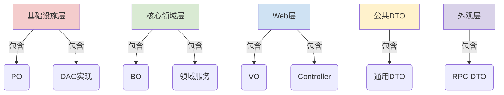
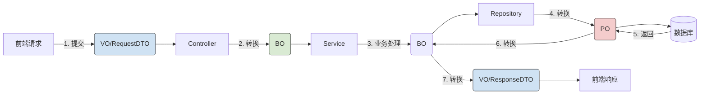
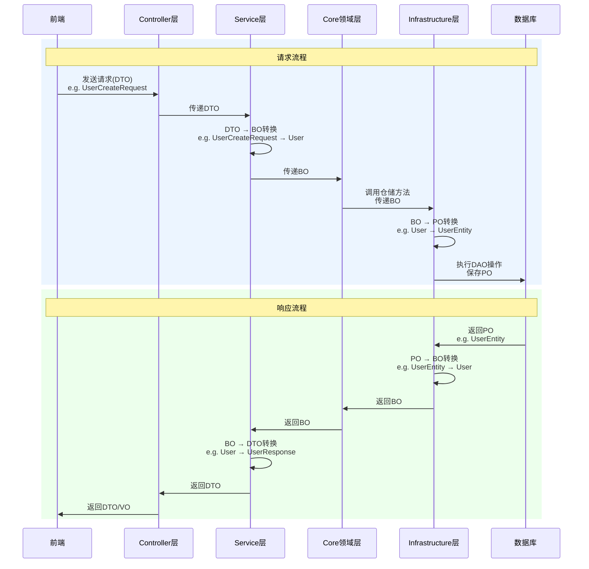

# springboot项目中 PO BO VO DTO POJO DAO概念及其作用（附转换图）

下面详细解释Spring Boot项目中常见的对象类型：PO、BO、VO、DTO、POJO、DAO，并说明它们在分层架构中的位置。
## Spring Boot 项目中常见对象类型详解

### 1. PO (Persistent Object) 持久化对象
- **定义**：与数据库表结构一一对应的 Java 对象
- **特征**：
  - 每个属性对应数据库表的一个字段
  - 通常包含 ORM 框架注解（如 `@Table`, `@Column`）
- **作用**：作为 ORM 框架操作数据库的载体
- **位置**：位于`infrastructure`层（因为与数据库直接相关）。
  (e.g., `UserEntity.java`)

### 2. DAO (Data Access Object) 数据访问对象
- **定义**：封装数据库访问操作的对象
- **特征**：
  - 包含 CRUD 操作方法
  - 隔离数据库操作细节
- **作用**：提供统一的数据访问接口
- **位置**：位于`infrastructure`层（因为直接操作数据库）。
  (e.g., `UserRepositoryImpl.java`, `UserMapper.java`)

### 3. DTO (Data Transfer Object) 数据传输对象
- **定义**：跨层/跨系统传输数据的对象
- **特征**：
  - 扁平化结构，无业务逻辑
  - 通常实现序列化接口
- **作用**：减少网络传输次数，解耦接口
- **位置**：
  - 通用DTO（如分页请求/响应）放在`common-dto`模块。
  - 各层特有的DTO放在各自模块：
  - Web层：接收前端请求的DTO（如`UserCreateRequest`）和返回给前端的响应DTO（如`UserResponse`）放在`web`模块。
  - Facade层：对外暴露的接口使用的DTO放在`facade`模块。

### 4. BO (Business Object) 业务对象
- **定义**：包含业务逻辑的领域核心对象
- **特征**：
  - 聚合多个 PO 或值对象
  - 包含业务方法和领域规则
- **作用**：封装核心业务逻辑和状态
- **位置**：位于`core`层（核心业务领域层）。
  (e.g., `User.java`)

### 5. VO (View Object) 视图对象
- **定义**：前端展示专用的数据对象
- **特征**：
  - 聚合多个领域对象的展示数据
  - 包含前端需要的特定字段和格式
- **作用**：为前端提供定制化数据结构
- **位置**：放在`web`模块（作为Controller的响应对象）。实际上，在我们的结构中，Web层的响应DTO就可以视为VO。
  (e.g., `UserResponse.java`)
> 注意：在有些上下文中，VO与DTO概念重叠，但在分层架构中，我们通常将用于展示的VO放在Web层。


### 6. POJO (Plain Old Java Object) 普通Java对象
- **定义**：不继承框架特定基类的简单对象
- **特征**：
  - 只有属性和 getter/setter
  - 无框架依赖
- **作用**：作为其他对象的基类
- **位置**：所有层通用基础对象


## 分层架构中的位置分配



总结它们在分层架构中的位置：

| 对象类型 | 所在模块              | 说明                                 | 示例文件                  |
|----------|-----------------------|--------------------------------------|--------------------------|
| PO       | infrastructure        | 与数据库表对应的实体                 |`UserEntity.java`        |
| DAO      | infrastructure        | 数据访问接口（如Mapper）            | `UserMapper.java`|
| DTO      | common-dto, web, facade | 数据传输对象，按使用场景分模块存放   | `PageRequest.java`       |
| BO       | core                  | 业务对象（领域模型）                | `User.java`              |
| VO       | web                   | 视图对象（可视为Web层的响应DTO）    | `UserResponse.java`      |
| POJO     | 所有模块              | 泛指简单的Java对象，无特定位置      | 简单值对象               |

## 对象转换流程

在典型的请求流程中，对象转换如下：

```

请求：

前端 -> Controller (接收DTO, 如UserCreateRequest) -> Service (将DTO转换为BO) -> Core (处理BO)

-> Infrastructure (将BO转换为PO, 然后通过DAO操作数据库)

响应：

Infrastructure (从数据库获取PO) -> 将PO转换为BO -> Core (返回BO) -> Service (将BO转换为DTO)

-> Controller (返回DTO/VO给前端)

```

### 具体转换步骤

1. **Controller层**：

- 接收前端请求：使用`DTO`（如`UserCreateRequest`）接收参数。

- 调用Service层：将`DTO`转换为`BO`（业务对象）传递给Service。

2. **Service层（应用服务层）**：

- 处理业务逻辑：使用`BO`进行业务操作。

- 调用Core层（领域服务）：传递`BO`。

3. **Core层**：

- 执行核心业务逻辑：使用`BO`（领域对象）。

- 调用Repository接口：传递`BO`（注意：这里Core层只依赖接口）。

4. **Infrastructure层**：

- 实现Repository：将`BO`转换为`PO`（持久化对象）。

- 使用DAO（如MyBatis Mapper）操作数据库：操作的是`PO`。

- 从数据库获取数据：将`PO`转换为`BO`返回给Core层。

5. **返回流程**：

- Core层返回`BO`给Service层。

- Service层将`BO`转换为`DTO`（如`UserResponse`）返回给Controller。

- Controller将`DTO`返回给前端（此时作为VO使用）。


### 转换流程
1. **Controller 层**  
   `VO/RequestDTO` ➔ `BO`  
   (e.g., `UserCreateRequest` ➔ `User`)
   
2. **Service 层**  
   `BO` ➔ `PO`  
   (e.g., `User` ➔ `UserEntity`)

3. **Repository 层**  
   `PO` ➔ 数据库记录

4. **返回流程**  
   数据库记录 ➔ `PO` ➔ `BO` ➔ `VO/ResponseDTO`

转换流程



请求响应流程图




### 各层对象转换示例代码

1. **Controller（接收DTO，返回DTO）**：

```java

@PostMapping("/users")
public UserResponse createUser(@RequestBody UserCreateRequest request) {

    User user = userConverter.toDomain(request); // DTO转BO

    User createdUser = userService.createUser(user);

    return userConverter.toResponse(createdUser); // BO转DTO

}

```

2. **Service（使用BO）**：

```java

public User createUser(User user) {

    // 业务逻辑处理
    user = userDomainService.create(user); // 调用领域服务
    return user;
}

```

3. **Infrastructure（BO与PO转换）**：

```java

@Repository
public class UserRepositoryImpl implements UserRepository {

    @Autowired
    private UserMapper userMapper;

    @Override
    public User save(User user) {

        UserEntity entity = UserConverter.toEntity(user); // BO转PO

        userMapper.insert(entity);

        return UserConverter.toDomain(entity); // PO转BO

    }

}

```

4. **Converter（转换器）**：

- 通常放在`infrastructure`层（负责BO与PO的转换）和`web`层（负责BO与DTO的转换）。

- 也可以独立放在`common`模块，但要注意避免循环依赖。

总结：

- 严格的分层和对象转换虽然增加了代码量，但提高了系统的可维护性和可扩展性。

- 核心是保持`core`层的纯净（只使用BO），避免技术细节污染业务逻辑。

- 通过转换器（Converter）实现各层对象之间的转换，确保各层职责明确。


### 最佳实践示例

#### 1. PO 定义 (基础设施层)
```java
// infrastructure 模块
@Table(name = "t_user")
public class UserEntity {
    @Id
    private Long id;
    private String username;
    private String encryptedPassword;
    // 省略getter/setter
}
```

#### 2. BO 定义 (核心层)
```java
// core 模块
public class User {
    private Long id;
    private String username;
    private Password password; // 值对象
    
    // 业务方法
    public void changePassword(String newPassword) {
        this.password = Password.create(newPassword);
    }
}
```

#### 3. VO 定义 (Web层)
```java
// web 模块
public class UserResponse {
    private Long id;
    private String name;
    private String avatarUrl;
    private LocalDateTime lastLoginTime;
    // 省略getter/setter
}
```

#### 4. DTO 定义 (公共模块)
```java
// common-dto 模块
public class PageRequest {
    private int pageNum = 1;
    private int pageSize = 10;
    // 计算偏移量
    public int getOffset() {
        return (pageNum - 1) * pageSize;
    }
}
```

#### 5. 转换器 (基础设施层)
```java
// infrastructure 模块
@Component
public class UserConverter {
    
    // PO -> BO
    public User toDomain(UserEntity entity) {
        User user = new User();
        user.setId(entity.getId());
        user.setUsername(entity.getUsername());
        user.setPassword(Password.fromEncrypted(entity.getEncryptedPassword()));
        return user;
    }
    
    // BO -> VO
    public UserResponse toResponse(User user) {
        UserResponse response = new UserResponse();
        response.setId(user.getId());
        response.setName(user.getUsername());
        response.setLastLoginTime(user.getLastLogin());
        return response;
    }
}
```


### 关键设计原则
1. **单一职责**：
   - PO 只负责数据库映射
   - BO 只包含业务逻辑
   - VO 只服务前端展示

2. **层间隔离**：
   - Controller 不应直接操作 PO
   - Service 不应返回 VO/DTO
   - Repository 不应接收 BO

3. **转换时机**：
   ```mermaid
   sequenceDiagram
       Controller->>Service: DTO->BO
       Service->>Repository: BO->PO
       Repository->>Service: PO->BO
       Service->>Controller: BO->VO
   ```

4. **性能优化**：
   - 使用 MapStruct 进行高效对象转换
   - 避免在循环中进行转换
   - VO 只包含前端需要的字段

通过这种严格的分层和对象分离，系统获得：
- 核心业务与技术实现解耦
- 数据库变更不影响业务逻辑
- 前端展示独立演化
- 微服务间接口稳定
