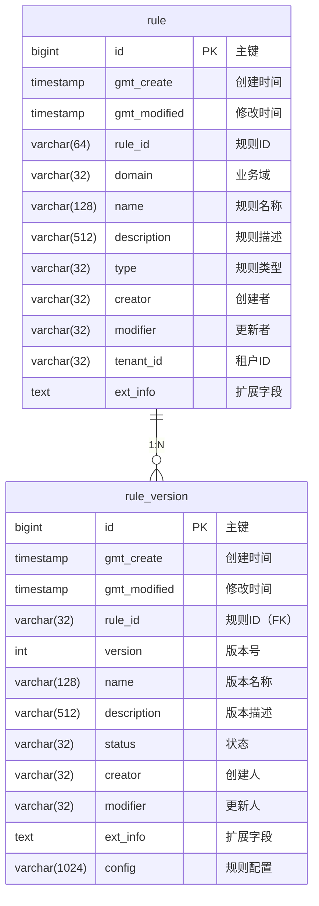

# 从零开始十分钟实现springboot + MyBatis Dynamic SQL

写这篇文章本来是为了记录一下 MyBatis Dynamic SQL 处理复杂JOIN 或者子查询，但是为了更好的实践，打算从零建一个springboot项目，所以将整个实践过程记录下来，本文将从如下几个方面介绍：

*   安装 JDK21
*   使用 docker 创建数据库并创建表
*   使用 [spring initializr](https://start.spring.io/) 初始化 springboot 项目
*   使用 [MyBatis Generator](https://mybatis.org/generator/index.html) 自动生成 MySQL 表结构代码
*   使用 [MyBatis Dynamic SQL](https://mybatis.org/mybatis-dynamic-sql/docs/subQueries.html) 实现处理复杂JOIN 或者子查询
*   分页查询封装
*   统一返回参数和全局异常处理
*   通过 http 接口提供服务

通过本文的学习，我将指导你创建一个 Spring Boot 项目，结合 MyBatis Generator 和 MyBatis Dynamic SQL 来处理复杂查询，并通过 HTTP 接口提供服务，你可以快速从零开发一个完整的 springboot 项目。

## 安装 JDK21

安装 JDK 21 的步骤如下（根据操作系统选择对应方法）：

### **Windows 系统**

#### 手动安装

1.  从[ Oracle 官网](https://www.oracle.com/java/technologies/downloads/#jdk21-windows)下载 ZIP 格式的 JDK 21（如 `jdk-21_windows-x64_bin.zip`）。
2.  解压到任意目录（例如 `D:\Java\jdk-21`）。
3.  配置 `JAVA_HOME` 和 `Path` 变量（同上），指向解压后的 `bin` 目录。

### **macOS 系统**

#### 手动安装

1.  下载 macOS 版 `.dmg` 或 `.tar.gz` 文件 [从 Oracle 官网](https://www.oracle.com/java/technologies/downloads/#jdk21-mac)。
2.  双击 `.dmg` 运行安装，或解压 `.tar.gz` 到 `/Library/Java/JavaVirtualMachines/`。
3.  配置环境变量

*   打开终端，编辑`~/.zshrc`（如果使用Zsh）或`~/.bash_profile`（如果使用Bash）
*   添加以下内容：

```bash

export JAVA_HOME=/usr/lib/jvm/jdk-21

export PATH=$JAVA_HOME/bin:$PATH

```

*   然后运行`source ~/.zshrc`（或`source ~/.bash_profile`）使配置生效

### **Linux 系统（Ubuntu/Debian）**

#### 手动安装（Oracle JDK）

1.  下载 `.tar.gz` 包 [从 Oracle 官网](https://www.oracle.com/java/technologies/downloads/#jdk21-linux)。
2.  解压到 `/usr/lib/jvm/`：

```bash
sudo tar -xzvf jdk-21_linux-x64_bin.tar.gz -C /usr/lib/jvm/
```

3.  配置环境变量：

```bash
echo 'export JAVA_HOME=/usr/lib/jvm/jdk-21' >> ~/.bashrc
echo 'export PATH=$JAVA_HOME/bin:$PATH' >> ~/.bashrc
source ~/.bashrc
```

### **验证安装**

在所有系统上，终端运行以下命令检查版本：

```bash
java -version
javac -version
```

应显示 `JDK 21` 相关信息。

### 注意事项

1.  **选择版本**：
    *   Oracle JDK：需注册 Oracle 账户下载（含商业许可条款）。
    *   OpenJDK：开源免费，推荐通过 [Adoptium](https://adoptium.net/) 或系统包管理器安装。
2.  **防火墙问题**：
    *   若下载慢，可尝试国内镜像（如 [清华镜像](https://mirrors.tuna.tsinghua.edu.cn/Adoptium/)）。

按步骤操作即可顺利完成安装！

## 使用 docker 创建数据库并创建表

使用 Docker 创建数据库并建表的完整流程如下（以 MySQL 为例）：

### 1. 拉取 MySQL 镜像

```bash
docker pull mysql:latest
```

### 2. 启动 MySQL 容器

```bash
docker run -d \
  --name mysql-container \
  -e MYSQL_ROOT_PASSWORD=mysecretpassword \
  -e MYSQL_DATABASE=testdb \
  -e MYSQL_USER=testuser \
  -e MYSQL_PASSWORD=testpass \
  -p 3306:3306 \
  mysql:latest
```

**参数说明**：

*   `-d`：后台运行
*   `--name`：容器名称
*   `-e`：环境变量（设置密码/数据库/用户）
*   `-p`：端口映射（主机端口:容器端口）

### 3. 进入容器终端

```bash
docker exec -it mysql-container mysql -u root -p
# 输入密码：mysecretpassword
```

### 4. 创建数据库（可选）

如果未通过环境变量创建数据库，可以使用下面的命令创建数据库：

```sql
CREATE DATABASE mydatabase;
USE mydatabase;
```

### 5. 创建数据表

```sql
CREATE TABLE `rule` (
  `id` bigint(20) unsigned NOT NULL AUTO_INCREMENT COMMENT '主键',
  `gmt_create` timestamp NOT NULL DEFAULT CURRENT_TIMESTAMP COMMENT '创建时间',
  `gmt_modified` timestamp NOT NULL DEFAULT CURRENT_TIMESTAMP ON UPDATE CURRENT_TIMESTAMP COMMENT '修改时间',
  `rule_id` varchar(64) NOT NULL COMMENT '规则ID',
  `domain` varchar(32) NOT NULL COMMENT '业务域',
  `name` varchar(128) NOT NULL COMMENT '规则名称',
  `description` varchar(512) DEFAULT NULL COMMENT '规则描述',
  `type` varchar(32) NOT NULL COMMENT '规则类型',
  `creator` varchar(32) DEFAULT NULL COMMENT '创建者',
  `modifier` varchar(32) DEFAULT NULL COMMENT '更新者',
  `tenant_id` varchar(32) NOT NULL COMMENT '租户ID',
  `ext_info` text DEFAULT NULL COMMENT '扩展字段',
  PRIMARY KEY(`id`),
  UNIQUE KEY `uk_uuid`(`rule_id`, `tenant_id`),
  KEY `idx_rule_name`(`name`, `tenant_id`)
)  DEFAULT CHARSET = utf8mb4 COMMENT = '规则表';


CREATE TABLE `rule_version` (
  `id` bigint(20) unsigned NOT NULL AUTO_INCREMENT COMMENT '主键',
  `gmt_create` timestamp NOT NULL DEFAULT CURRENT_TIMESTAMP COMMENT '创建时间',
  `gmt_modified` timestamp NOT NULL DEFAULT CURRENT_TIMESTAMP ON UPDATE CURRENT_TIMESTAMP COMMENT '修改时间',
  `rule_id` varchar(32) NOT NULL COMMENT '规则ID',
  `version` int(11) NOT NULL DEFAULT '1' COMMENT '版本号',
  `name` varchar(128) NOT NULL COMMENT '规则版本名称',
  `description` varchar(512) DEFAULT NULL COMMENT '规则版本描述',
  `status` varchar(32) NOT NULL DEFAULT 'DRAFT' COMMENT '版本状态',
  `creator` varchar(32) DEFAULT NULL COMMENT '创建人',
  `modifier` varchar(32) DEFAULT NULL COMMENT '更新人',
  `ext_info` text DEFAULT NULL COMMENT '扩展字段',
  `config` varchar(1024) DEFAULT NULL COMMENT '规则配置详情',
  PRIMARY KEY(`id`),
  UNIQUE KEY `uk_uuid_version`(`rule_id`, `version`)
)  DEFAULT CHARSET = utf8mb4 COMMENT = '规则版本表';
```

### 6. 验证表结构

```sql
mysql> SHOW TABLES;
+----------------------+
| Tables_in_mydatabase |
+----------------------+
| rule                 |
| rule_version         |
+----------------------+
2 rows in set (0.004 sec)

mysql> DESCRIBE rule;
```

### 7. 插入测试数据

> 注意⚠️：因为下面的插入语句包含中文，如果直接在docker容器中通过命令执行下面的插入语句，那么中文会不可见，建议通过后面提供的工具执行插入数据操作

```sql
-- 插入规则表数据
INSERT INTO `rule` (
  `rule_id`, `domain`, `name`, `description`, `type`, 
  `creator`, `modifier`, `tenant_id`, `ext_info`
) VALUES
('RULE_001', 'RISK', '风控规则', '高风险操作拦截规则', 'RISK_CONTROL', 
 'admin', 'admin', 'TNT_A', '{"priority": 1}'),
('RULE_002', 'PROMOTION', '优惠券规则', '满减优惠券发放规则', 'MARKETING', 
 'marketing_user', 'marketing_user', 'TNT_B', '{"scope": "global"}'),
('RULE_003', 'INVENTORY', '库存规则', '自动补货计算规则', 'SUPPLY_CHAIN', 
 'ops_user', 'ops_user', 'TNT_A', NULL);

-- 插入规则版本表数据
INSERT INTO `rule_version` (
  `rule_id`, `version`, `name`, `description`, `status`, 
  `creator`, `modifier`, `ext_info`, `config`
) VALUES
-- RULE_001的3个版本
('RULE_001', 1, 'V1基础版', '初始风控规则', 'DRAFT', 
 'admin', 'admin', NULL, '{"threshold": 50}'),
('RULE_001', 2, 'V2增强版', '增加二次验证', 'PUBLISHED', 
 'admin', 'admin', '{"reviewer":"john"}', '{"threshold": 70, "2fa": true}'),
('RULE_001', 3, 'V3优化版', '性能优化版本', 'PUBLISHED', 
 'admin', 'admin', NULL, '{"threshold": 65, "2fa": true, "timeout": 500}'),

-- RULE_002的2个版本
('RULE_002', 1, '基础版', '满100减10规则', 'PUBLISHED', 
 'marketing_user', 'marketing_user', NULL, '{"condition": 100, "discount": 10}'),
('RULE_002', 2, '618大促版', '618活动专属规则', 'DRAFT', 
 'marketing_user', 'marketing_user', '{"event":"618"}', '{"condition": 80, "discount": 15}'),

-- RULE_003的2个版本
('RULE_003', 1, '初始版本', '默认补货规则', 'PUBLISHED', 
 'ops_user', 'ops_user', NULL, '{"min_stock": 100, "reorder_qty": 500}'),
('RULE_003', 2, '季节调整版', '冬季补货策略', 'PUBLISHED', 
 'ops_user', 'ops_user', '{"season":"winter"}', '{"min_stock": 150, "reorder_qty": 700}');
```

### 8. 查询数据

```sql
-- 验证规则表数据
SELECT * FROM rule WHERE tenant_id IN ('TNT_A', 'TNT_B');

-- 验证最新版本规则
SELECT r.rule_id, r.name, MAX(rv.version) AS latest_version
FROM rule r
JOIN rule_version rv ON r.rule_id = rv.rule_id
GROUP BY r.rule_id, r.name;
```

### 9. 退出 MySQL

```sql
EXIT;
```

### 10. 持久化数据（可选）

默认数据存储在容器内，需创建卷持久化：

```bash
# 停止并删除原容器
docker stop mysql-container
docker rm mysql-container

# 创建数据卷
docker volume create mysql-data

# 启动新容器（添加 -v 参数）
docker run -d \
  --name mysql-container \
  -v mysql-data:/var/lib/mysql \
  -e MYSQL_ROOT_PASSWORD=mysecretpassword \
  -p 3306:3306 \
  mysql:latest
```

### 常用管理命令

| 命令                                                           | 说明      |
| ------------------------------------------------------------ | ------- |
| `docker logs mysql-container`                                | 查看容器日志  |
| `docker inspect mysql-container`                             | 查看容器详情  |
| `docker cp file.sql mysql-container:/`                       | 复制文件到容器 |
| `docker exec -i mysql-container mysql -u root -p < file.sql` | 执行SQL文件 |

### 可视化工具推荐

1.  **DBeaver**：开源通用数据库工具
2.  **TablePlus**：轻量级多数据库客户端
3.  **phpMyAdmin**（MySQL专用）：

使用下面的命令启动 `**phpMyAdmin**`**：**

```bash
docker run -d \
  --name phpmyadmin \
  --link mysql-container:db \
  -p 8080:80 \
  phpmyadmin
```

访问 <http://localhost:8080>，输入用户名和密码，可以看到前面创建的表和数据


> **注意事项**：
>
> 1.  生产环境务必使用强密码
> 2.  重要数据必须配置卷持久化
> 3.  可添加 `--restart=always` 参数实现自动重启
> 4.  需要远程访问时配置 `-e MYSQL_ROOT_HOST=%`

## 创建 Spring Boot 项目

1.  访问 [Spring Initializr](https://start.spring.io/)
2.  选择以下配置：
    *   Project: Maven Project
    *   Language: Java
    *   Spring Boot: 3.4.6 (最新稳定版)
3.  添加依赖：
    *   Spring Web
    *   MyBatis Framework
    *   MySQL Driver
    *   Lombok (推荐)
4.  点击 "Generate" 下载项目

如下图所示：


创建项目后，对于小项目可以创建如下的目录结构：

```plain
src/main/java
└── com
    └── example
        └── demo
            ├── Application.java                  # 启动类
            │
            ├── config                            # 配置类
            │   ├── MyBatisDynamicConfig.java
            │   ├── WebMvcConfig.java
            │   └── SecurityConfig.java
            │
            ├── common                            # 公共模块
            │   ├── annotation                    # 自定义注解
            │   ├── constant                      # 常量
            │   ├── enums                         # 枚举类
            │   │   ├── AppErrorCode.java
            │   │   └── ErrorCode.java            
            │   ├── exception                     # 异常处理
            │   │   ├── GlobalExceptionHandler.java
            │   │   └── BusinessException.java
            │   ├── model                         # 公共模型
            │   │   ├── page                      # 分页相关
            │   │   │   ├── PageRequest.java
            │   │   │   ├── PageResult.java
            │   │   │   └── PaginationUtils.java
            │   │   ├── response                  # 响应封装
            │   │   │   ├── Result.java
            │   │   └── validation                # 验证工具
            │   └── util                          # 工具类
            │
            ├── controller                        # 控制器层
            │   ├── UserController.java
            │   ├── ProductController.java
            │   └── ...
            │
            ├── service                           # 服务层
            │   ├── UserService.java
            │   ├── ProductService.java
            │   └── impl                          # 服务实现
            │       ├── UserServiceImpl.java
            │       ├── ProductServiceImpl.java
            │       └── ...
            │
            ├── repository                        # 数据访问层
            │   ├── generated                     # MyBatis Generator 生成 MyBatis Dynamic SQL 代码
            │   │   ├── UserMapper.java
            │   │   ├── UserDynamicSqlSupport.java
            │   │   ├── ProductMapper.java
            │   │   ├── ProductDynamicSqlSupport.java            
            │   │   └── ...
            │   ├── custom                        # 自定义Mapper接口
            │   │   ├── UserCustomMapper.java
            │   │   ├── ProductCustomMapper.java
            │   │   └── ...
            │   │   └──builder                          # 构建 SelectStatementProvider
            │   │       ├── UserQueryBuilder.java
            │   │       ├── ProductQueryBuilder.java
            │   │       └── ...
            │   │
            ├── model                             # 数据模型层
            │   ├── entity                        # 实体类 (MyBatis Generator 生成)
            │   │   ├── UserEntity.java
            │   │   ├── ProductEntity.java
            │   │   └── ...
            │   ├── dto                           # 数据传输对象
            │   │   ├── request                   # 请求DTO
            │   │   │   ├── UserCreateRequest.java
            │   │   │   ├── UserUpdateRequest.java
            │   │   │   ├── UserQueryRequest.java
            │   │   │   └── ...
            │   │   └── response                  # 响应DTO
            │   │       ├── UserResponse.java
            │   │       ├── ProductResponse.java
            │   │       └── ...
            │   └── query                         # 查询条件封装
            │       ├── UserQueryCondition.java
            │       ├── ProductQueryCondition.java
            │       └── ...
            │
            └── converter                         # 对象转换器
                ├── UserConverter.java
                ├── ProductConverter.java
                └── ...

src/main/resources
├─ application.yml      // 配置文件
└─ generatorConfig.xml  // MyBatis Generator 配置
```

## 使用 MyBatis Generator 自动生成 MySQL 表结构代码

MyBatis Generator (MBG) 是一个强大的代码生成工具，可以自动创建与数据库表结构对应的模型类、Mapper 接口和 XML 映射文件。下面我将详细介绍完整的使用流程。

### 一、环境准备与配置

1.  在 `pom.xml` 中添加 MyBatis Generator 插件：

```xml

<build>
    <plugins>
        <!-- MyBatis Generator Maven 插件 -->
        <plugin>
            <groupId>org.mybatis.generator</groupId>
            <artifactId>mybatis-generator-maven-plugin</artifactId>
            <version>1.4.2</version>
            <dependencies>
                <!-- 使用 MySQL 驱动 -->
                <dependency>
                    <groupId>mysql</groupId>
                    <artifactId>mysql-connector-java</artifactId>
                    <version>8.0.33</version>
                </dependency>
            </dependencies>
            <configuration>
                <!-- 配置文件路径 -->
                <configurationFile>src/main/resources/generatorConfig.xml</configurationFile>
                <overwrite>true</overwrite>
                <verbose>true</verbose>
            </configuration>
        </plugin>
    </plugins>
</build>

```

2.  在 `src/main/resources` 目录下创建 `generatorConfig.xml` 文件：

```xml
<?xml version="1.0" encoding="UTF-8"?>
<!DOCTYPE generatorConfiguration
        PUBLIC "-//mybatis.org//DTD MyBatis Generator Configuration 1.0//EN"
        "https://mybatis.org/dtd/mybatis-generator-config_1_0.dtd">

<generatorConfiguration>
    <!-- 数据库驱动路径（如果未通过Maven依赖管理） -->
    <!-- <classPathEntry location="/path/to/mysql-connector-java-8.0.33.jar"/> -->

    <context id="mysql" targetRuntime="MyBatis3DynamicSql">
        <!-- 生成的Java文件编码 -->
        <property name="javaFileEncoding" value="UTF-8"/>

        <!-- 生成的Java文件的注释 -->
        <commentGenerator>
            <!-- 注释配置：不生成注释 -->
<!--            <property name="suppressAllComments" value="true"/>-->
            <!-- 生成注释 -->
            <property name="addRemarkComments" value="true"/>

        </commentGenerator>
        <!-- 数据库连接信息 -->
        <jdbcConnection driverClass="com.mysql.cj.jdbc.Driver"
                        connectionURL="jdbc:mysql://localhost:3306/mydatabase"
                        userId="root"
                        password="mysecretpassword">
        </jdbcConnection>
        <!-- Java模型生成配置 -->
        <javaModelGenerator targetPackage="com.example.demo.model.entity" targetProject="src/main/java">
            <property name="enableSubPackages" value="true"/>
            <property name="trimStrings" value="true"/>
        </javaModelGenerator>
        <!-- SQL映射文件生成配置（如果使用XML） -->
        <!-- 注意：如果使用Dynamic SQL方式，不需要XML映射文件 -->
<!--        <sqlMapGenerator targetPackage="mapper"-->
<!--                         targetProject="src/main/resources">-->
<!--            <property name="enableSubPackages" value="true"/>-->
<!--        </sqlMapGenerator>-->
        <!-- Mapper接口生成配置 -->
        <javaClientGenerator type="ANNOTATEDMAPPER"
                             targetPackage="com.example.demo.repository.generated"
                             targetProject="src/main/java">
            <property name="enableSubPackages" value="true"/>
        </javaClientGenerator>
        <!-- 指定要生成的表 -->
        <table tableName="rule" domainObjectName="RuleEntity" mapperName="RuleMapper">
            <generatedKey column="id" sqlStatement="MySql" identity="true"/>
        </table>

        <table tableName="rule_version" domainObjectName="RuleVersionEntity" mapperName="RuleVersionMapper">
            <generatedKey column="id" sqlStatement="MySql" identity="true"/>
        </table>
        <!-- 生成所有表 -->
<!--         <table tableName="%" />-->
    </context>
</generatorConfiguration>

```

### 二、配置详解与高级选项

#### 1. 关键配置项说明

| 配置项                      | 说明         | 推荐值                                    |
| ------------------------ | ---------- | -------------------------------------- |
| targetRuntime            | 生成代码的运行时环境 | `MyBatis3DynamicSql` (推荐) 或 `MyBatis3` |
| javaClientGenerator type | Mapper接口类型 | `ANNOTATEDMAPPER` (注解方式) 或 `XMLMAPPER` |
| enableSubPackages        | 是否使用子包     | `true` (按表名分包)                         |
| trimStrings              | 自动去除字符串空格  | `true`                                 |
| suppressAllComments      | 是否生成注释     | `true` (减少冗余)                          |

#### 2. 高级表配置

```xml
<table tableName="employee" domainObjectName="Employee">
    <!-- 忽略字段 -->
    <ignoreColumn column="deleted"/>
    
    <!-- 重命名字段 -->
    <columnOverride column="start_date" property="employmentDate"/>
    
    <!-- 枚举类型处理 -->
    <columnOverride column="status" 
                   javaType="com.example.enums.EmployeeStatus"
                   typeHandler="org.apache.ibatis.type.EnumTypeHandler"/>
    
    <!-- 逻辑删除配置 -->
    <columnOverride column="is_deleted" 
                   jdbcType="TINYINT" 
                   javaType="java.lang.Boolean"
                   delimitedColumnName="true">
        <property name="logicalDeleteColumn" value="true"/>
    </columnOverride>
</table>

```

#### 3.自定义插件扩展

创建自定义生成器插件，在 `generatorConfig.xml` 中添加：

```xml
<context id="mysql" targetRuntime="MyBatis3DynamicSql">
    <!-- 添加自定义插件 -->
    <plugin type="com.example.generator.CustomPlugin"/>
    ...
</context>

```

自定义插件示例：

```java
public class CustomPlugin extends PluginAdapter {
    // 在模型类生成后添加 Lombok 注解
    @Override
    public boolean modelBaseRecordClassGenerated(TopLevelClass topLevelClass, 
            IntrospectedTable introspectedTable) {
        topLevelClass.addAnnotation("@Data");
        topLevelClass.addAnnotation("@Builder");
        topLevelClass.addAnnotation("@NoArgsConstructor");
        topLevelClass.addAnnotation("@AllArgsConstructor");
        
        topLevelClass.addImportedType("lombok.Data");
        topLevelClass.addImportedType("lombok.Builder");
        topLevelClass.addImportedType("lombok.NoArgsConstructor");
        topLevelClass.addImportedType("lombok.AllArgsConstructor");
        
        return true;
    }
    
    // 添加 Swagger 注解
    @Override
    public boolean modelFieldGenerated(Field field, 
            TopLevelClass topLevelClass, 
            IntrospectedColumn introspectedColumn,
            IntrospectedTable introspectedTable, 
            ModelClassType modelClassType) {
        
        field.addAnnotation("@ApiModelProperty(value = \"" + 
                introspectedColumn.getRemarks() + "\")");
        
        topLevelClass.addImportedType("io.swagger.annotations.ApiModelProperty");
        return true;
    }
}
```

### 三、运行代码生成器

#### 1. 使用 Maven 命令生成

```bash
mvn mybatis-generator:generate
```

#### 2. 在 IDE 中运行（以 IntelliJ IDEA 为例）

1.  打开 Maven 工具窗口
2.  展开 Plugins > mybatis-generator
3.  双击 mybatis-generator:generate


#### 3. 生成后项目结构

```plain
src/main/java
└── com
    └── example
        └── demo
            ├── model
            │   ├── entity
            │   │   ├── RuleEntity.java
            │   │   └── RuleVersionEntity.java
            ├── repository
            │   └── generated
            │       ├── RuleEntityDynamicSqlSupport.java
            │       ├── RuleMapper.java
            │       ├── RuleVersionEntityDynamicSqlSupport.java
            └──     └── RuleVersionMapper.java
```

## 使用 [MyBatis Dynamic SQL](https://mybatis.org/mybatis-dynamic-sql/docs/subQueries.html) 处理复杂子查询

### 需求描述

根据提供的建表语句，以下是两个表的ER图（使用mermaid语法表示），展示了 一个规则（rule）对应多个规则版本（rule\_version） 的一对多关系：



**需求描述：根据前面的提供的两个表，分页查询规则信息和规则对应的最大版本信息并按照规则版本的更新时间倒序排列**

**需求分析**：我们可以先获取每个规则的最新版本记录（最大版本号对应的记录），然后与规则版本表再次关联以获取最新版本的完整信息，最后再与规则表关联。

需求实现：根据需求，需要查询规则信息及其对应的最新版本信息（最大版本号），并按版本更新时间倒序排列。以下是实现该查询的SQL语句：

```sql
SELECT ruleDO.id AS id, ruleDO.rule_id AS ruleId, ruleDO.name AS name, ruleDO.domain AS domain, max_version AS latestVersion
    , ruleVersionDO.name AS versionName, ruleVersionDO.status AS versionStatus, ruleVersionDO.gmt_modified AS versionModifiedDate
FROM rule ruleDO
    JOIN rule_version ruleVersionDO ON ruleDO.rule_id = ruleVersionDO.rule_id
    JOIN (
        SELECT ruleVersionDO.rule_id AS rule_uuid, MAX(ruleVersionDO.version) AS max_version
        FROM rule_version ruleVersionDO
        WHERE ruleVersionDO.id > #{parameters.p1,jdbcType=BIGINT}
            AND ruleVersionDO.modifier LIKE #{parameters.p2,jdbcType=VARCHAR}
            AND ruleVersionDO.gmt_create >= #{parameters.p3,jdbcType=TIMESTAMP}
            AND ruleVersionDO.gmt_create <= #{parameters.p4,jdbcType=TIMESTAMP}
            AND ruleVersionDO.gmt_modified >= #{parameters.p5,jdbcType=TIMESTAMP}
            AND ruleVersionDO.gmt_modified <= #{parameters.p6,jdbcType=TIMESTAMP}
            AND ruleVersionDO.description LIKE #{parameters.p7,jdbcType=VARCHAR}
            AND ruleVersionDO.name LIKE #{parameters.p8,jdbcType=VARCHAR}
            AND ruleVersionDO.status = #{parameters.p9,jdbcType=VARCHAR}
        GROUP BY ruleVersionDO.rule_id
    ) max_ver
    ON ruleVersionDO.rule_id = max_ver.rule_uuid
        AND ruleVersionDO.version = max_ver.max_version
WHERE ruleDO.id > #{parameters.p10,jdbcType=BIGINT}
    AND ruleDO.tenant_id = #{parameters.p11,jdbcType=VARCHAR}
    AND ruleDO.rule_id LIKE #{parameters.p12,jdbcType=VARCHAR}
    AND ruleDO.name LIKE #{parameters.p13,jdbcType=VARCHAR}
    AND ruleDO.creator LIKE #{parameters.p14,jdbcType=VARCHAR}
    AND ruleDO.type = #{parameters.p15,jdbcType=VARCHAR}
    AND ruleDO.domain = #{parameters.p16,jdbcType=VARCHAR}
    AND ruleDO.description LIKE #{parameters.p17,jdbcType=VARCHAR}
ORDER BY ruleVersionDO.id
LIMIT #{parameters.p19}, #{parameters.p18}
```

### 需求分析

在springboot 中使用 mybatis dynamic sql 实现上面的sql语句，我们首先需要分析这个SQL语句的结构。该SQL语句的主要部分包括：

1.  从rule表（别名为ruleDO）和rule\_version表（别名为ruleVersionDO）中选取字段。
2.  使用一个子查询（别名为max\_ver）来获取每个rule\_id的最大版本号，同时子查询中有一系列的条件。
3.  将ruleDO和ruleVersionDO表与子查询max\_ver进行连接，连接条件是rule\_id相等并且版本号等于最大版本。
4.  对ruleDO表有一系列的条件。
5.  按照ruleVersionDO.id排序，并分页。

在MyBatis Dynamic SQL中，我们可以这样构建：

步骤：

1.  创建rule和rule\_version表的动态SQL支持类（通常使用代码生成器生成，这里假设我们已经有了RuleDynamicSqlSupport和RuleVersionDynamicSqlSupport）。
2.  将整个查询拆分为几个部分：

a. 子查询（max\_ver）：从rule\_version表中，根据条件分组获取每个rule\_id的最大版本。

b. 主查询：连接rule、rule\_version和子查询max\_ver，并添加条件，最后排序分页。

注意：由于子查询中使用了多个条件，且主查询也有多个条件，我们需要分别构建。

### 使用 mybatis dynamic sql 实现

参考前面Mybatis Generator根据表结构自动生成的表定义类。

#### 1. 创建表定义

示例代码如下：

```java

import jakarta.annotation.Generated;
import java.sql.JDBCType;
import java.util.Date;
import org.mybatis.dynamic.sql.AliasableSqlTable;
import org.mybatis.dynamic.sql.SqlColumn;

// 自动生成的表定义类（由MyBatis Generator创建）
public final class RuleVersionEntityDynamicSqlSupport {
    @Generated("org.mybatis.generator.api.MyBatisGenerator")
    public static final RuleVersionEntity ruleVersionEntity = new RuleVersionEntity();

    @Generated("org.mybatis.generator.api.MyBatisGenerator")
    public static final SqlColumn<Long> id = ruleVersionEntity.id;

    @Generated("org.mybatis.generator.api.MyBatisGenerator")
    public static final SqlColumn<Date> gmtCreate = ruleVersionEntity.gmtCreate;

    @Generated("org.mybatis.generator.api.MyBatisGenerator")
    public static final SqlColumn<Date> gmtModified = ruleVersionEntity.gmtModified;

    @Generated("org.mybatis.generator.api.MyBatisGenerator")
    public static final SqlColumn<String> ruleId = ruleVersionEntity.ruleId;

    @Generated("org.mybatis.generator.api.MyBatisGenerator")
    public static final SqlColumn<Integer> version = ruleVersionEntity.version;

    @Generated("org.mybatis.generator.api.MyBatisGenerator")
    public static final SqlColumn<String> name = ruleVersionEntity.name;

    @Generated("org.mybatis.generator.api.MyBatisGenerator")
    public static final SqlColumn<String> description = ruleVersionEntity.description;

    @Generated("org.mybatis.generator.api.MyBatisGenerator")
    public static final SqlColumn<String> status = ruleVersionEntity.status;

    @Generated("org.mybatis.generator.api.MyBatisGenerator")
    public static final SqlColumn<String> creator = ruleVersionEntity.creator;

    @Generated("org.mybatis.generator.api.MyBatisGenerator")
    public static final SqlColumn<String> modifier = ruleVersionEntity.modifier;

    @Generated("org.mybatis.generator.api.MyBatisGenerator")
    public static final SqlColumn<String> config = ruleVersionEntity.config;

    @Generated("org.mybatis.generator.api.MyBatisGenerator")
    public static final SqlColumn<String> extInfo = ruleVersionEntity.extInfo;

    @Generated("org.mybatis.generator.api.MyBatisGenerator")
    public static final class RuleVersionEntity extends AliasableSqlTable<RuleVersionEntity> {
        public final SqlColumn<Long> id = column("id", JDBCType.BIGINT);

        public final SqlColumn<Date> gmtCreate = column("gmt_create", JDBCType.TIMESTAMP);

        public final SqlColumn<Date> gmtModified = column("gmt_modified", JDBCType.TIMESTAMP);

        public final SqlColumn<String> ruleId = column("rule_id", JDBCType.VARCHAR);

        public final SqlColumn<Integer> version = column("version", JDBCType.INTEGER);

        public final SqlColumn<String> name = column("name", JDBCType.VARCHAR);

        public final SqlColumn<String> description = column("description", JDBCType.VARCHAR);

        public final SqlColumn<String> status = column("status", JDBCType.VARCHAR);

        public final SqlColumn<String> creator = column("creator", JDBCType.VARCHAR);

        public final SqlColumn<String> modifier = column("modifier", JDBCType.VARCHAR);

        public final SqlColumn<String> config = column("config", JDBCType.VARCHAR);

        public final SqlColumn<String> extInfo = column("ext_info", JDBCType.LONGVARCHAR);

        public RuleVersionEntity() {
            super("rule_version", RuleVersionEntity::new);
        }
    }
}

```

#### 2. 构建MyBatis Dynamic SQL复杂查询

```java

import com.example.demo.common.model.page.PageRequest;
import com.example.demo.model.query.RuleQueryCondition;
import com.example.demo.repository.generated.RuleEntityDynamicSqlSupport;
import com.example.demo.repository.generated.RuleVersionEntityDynamicSqlSupport;
import org.mybatis.dynamic.sql.SortSpecification;
import org.mybatis.dynamic.sql.SqlColumn;
import org.mybatis.dynamic.sql.SqlTable;
import org.mybatis.dynamic.sql.select.ColumnSortSpecification;
import org.mybatis.dynamic.sql.select.QueryExpressionDSL;
import org.mybatis.dynamic.sql.select.SelectModel;
import org.mybatis.dynamic.sql.select.render.SelectStatementProvider;
import org.mybatis.dynamic.sql.render.RenderingStrategies;
import org.springframework.stereotype.Component;

import java.util.ArrayList;
import java.util.List;
import java.sql.JDBCType;

import static org.mybatis.dynamic.sql.SqlBuilder.*;

@Component
public class RuleQueryBuilder {
    private final RuleVersionEntityDynamicSqlSupport.RuleVersionEntity ruleVersionDO = RuleVersionEntityDynamicSqlSupport.ruleVersionEntity;
    private final RuleEntityDynamicSqlSupport.RuleEntity ruleDO = RuleEntityDynamicSqlSupport.ruleEntity;

    // 数据查询
    public SelectStatementProvider buildDataQuery(RuleQueryCondition queryCondition, PageRequest pageRequest) {

        // 1. 创建子查询表的别名和列定义
        // 子查询的表别名
        String subQueryTable = "max_ver";
        SqlTable maxVerTable = SqlTable.of(subQueryTable);
        SqlColumn<String> maxVerRuleUuid = SqlColumn.of("rule_uuid", maxVerTable, JDBCType.VARCHAR);
        SqlColumn<Integer> maxVerMaxVersion = SqlColumn.of("max_version", maxVerTable, JDBCType.INTEGER);
        // 动态构建排序
        List<SortSpecification> sortSpecs = new ArrayList<>();
        SortSpecification sortSpecification = buildSortSpecification(pageRequest.getSort(), pageRequest.getOrder());
        if (sortSpecification != null) {
            sortSpecs.add(sortSpecification);
        }

        // 2.构建子查询
        QueryExpressionDSL<SelectModel>.GroupByFinisher maxVersionSubQuery = buildMaxVersionSubQuery(queryCondition);

        // 3. 主查询：关联规则表、版本表和最大版本子查询
        return select(
                ruleDO.id.as("id"),
                ruleDO.ruleId.as("ruleId"),
                ruleDO.name.as("name"),
                ruleDO.domain.as("domain"),
                maxVerMaxVersion.as("latestVersion"),
                ruleVersionDO.name.as("versionName"),
                ruleVersionDO.status.as("versionStatus"),
                ruleVersionDO.gmtModified.as("versionModifiedDate")
        )
                .from(ruleDO, "ruleDO")
                .join(ruleVersionDO, "ruleVersionDO")
                .on(ruleDO.ruleId, equalTo(ruleVersionDO.ruleId))
                .join(maxVersionSubQuery, subQueryTable)
                .on(ruleVersionDO.ruleId, equalTo(maxVerRuleUuid.qualifiedWith(subQueryTable)))
                .and(ruleVersionDO.version, equalTo(maxVerMaxVersion.qualifiedWith(subQueryTable)))
                .where(ruleDO.id, isGreaterThan(0L))
                .and(ruleDO.tenantId, isEqualToWhenPresent(queryCondition.getTenantId()))
                .and(ruleDO.ruleId, isLikeWhenPresent(wrapLike(queryCondition.getRuleId())))
                .and(ruleDO.name, isLikeWhenPresent(wrapLike(queryCondition.getName())))
                .and(ruleDO.creator, isLikeWhenPresent(wrapLike(queryCondition.getCreateBy())))
                .and(ruleDO.type, isEqualToWhenPresent(queryCondition.getType()))
                .and(ruleDO.domain, isEqualToWhenPresent(queryCondition.getDomain()))
                .and(ruleDO.description, isLikeWhenPresent(wrapLike(queryCondition.getDescription())))
                .orderBy(sortSpecs.toArray(new SortSpecification[0]))
                .limit(pageRequest.getPageSize())
                .offset(pageRequest.getOffset())
                .build()
                .render(RenderingStrategies.MYBATIS3);

    }

    // 总数查询
    public SelectStatementProvider buildCountQuery(RuleQueryCondition queryCondition) {
        // 1. 创建派生表的别名和列定义

        String subQueryTable = "max_ver";
        SqlTable maxVerTable = SqlTable.of(subQueryTable);
        SqlColumn<String> maxVerRuleUuid = SqlColumn.of("rule_uuid", maxVerTable, JDBCType.VARCHAR);
        SqlColumn<Integer> maxVerMaxVersion = SqlColumn.of("max_version", maxVerTable, JDBCType.INTEGER);
        // 2. 构建子查询
        QueryExpressionDSL<SelectModel>.GroupByFinisher maxVersionSubQuery = buildMaxVersionSubQuery(queryCondition);

        // 3. 主查询：关联规则表、版本表和最大版本子查询
        return select(count())
                .from(ruleDO, "ruleDO")
                .join(ruleVersionDO, "ruleVersionDO")
                .on(ruleDO.ruleId, equalTo(ruleVersionDO.ruleId))
                .join(maxVersionSubQuery, subQueryTable)
                .on(ruleVersionDO.ruleId, equalTo(maxVerRuleUuid.qualifiedWith(subQueryTable)))
                .and(ruleVersionDO.version, equalTo(maxVerMaxVersion.qualifiedWith(subQueryTable)))
                .where(ruleVersionDO.id, isGreaterThan(0L))  // 确保where条件有值
                .and(ruleDO.tenantId, isEqualToWhenPresent(queryCondition.getTenantId()))
                .and(ruleDO.ruleId, isLikeWhenPresent(wrapLike(queryCondition.getRuleId())))
                .and(ruleDO.name, isLikeWhenPresent(wrapLike(queryCondition.getName())))
                .and(ruleDO.creator, isLikeWhenPresent(wrapLike(queryCondition.getCreateBy())))
                .and(ruleDO.type, isEqualToWhenPresent(queryCondition.getType()))
                .and(ruleDO.domain, isEqualToWhenPresent(queryCondition.getDomain()))
                .and(ruleDO.description, isLikeWhenPresent(wrapLike(queryCondition.getDescription())))
                .build()
                .render(RenderingStrategies.MYBATIS3);
    }

    // 公共方法：构建最大版本子查询
    private QueryExpressionDSL<SelectModel>.GroupByFinisher buildMaxVersionSubQuery(RuleQueryCondition queryCondition) {
        return select(
                ruleVersionDO.ruleId.as("rule_uuid"),
                max(ruleVersionDO.version).as("max_version"))
                .from(ruleVersionDO)
                .where(ruleVersionDO.id, isGreaterThan(0L))
                .and(ruleVersionDO.modifier, isLikeWhenPresent(wrapLike(queryCondition.getUpdateBy())))
                .and(ruleVersionDO.gmtCreate, isGreaterThanOrEqualToWhenPresent(queryCondition.getGmtCreateFrom()))
                .and(ruleVersionDO.gmtCreate, isLessThanOrEqualToWhenPresent(queryCondition.getGmtCreateTo()))
                .and(ruleVersionDO.gmtModified, isGreaterThanOrEqualToWhenPresent(queryCondition.getGmtModifiedFrom()))
                .and(ruleVersionDO.gmtModified, isLessThanOrEqualToWhenPresent(queryCondition.getGmtModifiedTo()))
                .and(ruleVersionDO.description, isLikeWhenPresent(wrapLike(queryCondition.getRuleVersionDesc())))
                .and(ruleVersionDO.name, isLikeWhenPresent(wrapLike(queryCondition.getRuleVersionName())))
                .and(ruleVersionDO.status, isEqualToWhenPresent(queryCondition.getStatus()))

                .groupBy(ruleVersionDO.ruleId);
    }

    private SortSpecification buildSortSpecification(String field, String order) {
        if (field == null) {
            return new ColumnSortSpecification("ruleVersionDO", ruleVersionDO.id);
        }
        ColumnSortSpecification columnSortSpecification;
        switch (field) {
            case "gmtCreate" ->
                    columnSortSpecification = new ColumnSortSpecification("ruleVersionDO", ruleVersionDO.gmtCreate);
            case "gmtModified" ->
                    columnSortSpecification = new ColumnSortSpecification("ruleVersionDO", ruleVersionDO.gmtModified);
            // 其他字段...
            // 默认排序逻辑
            default -> columnSortSpecification = new ColumnSortSpecification("ruleVersionDO", ruleVersionDO.id);
        }

        return "asc".equalsIgnoreCase(order) ? columnSortSpecification : columnSortSpecification.descending();
    }


    private String wrapLike(String value) {
        return value != null ? "%" + value + "%" : null;
    }


}

```

在使用MyBatis Dynamic SQL处理复杂的JOIN或子查询时，需要通过下面的方式创建子查询的表和字段定义：

```java
// 1. 创建子查询表的别名和列定义
// 子查询的表别名
String subQueryTable = "max_ver";
SqlTable maxVerTable = SqlTable.of(subQueryTable);
SqlColumn<String> maxVerRuleUuid = SqlColumn.of("rule_uuid", maxVerTable, JDBCType.VARCHAR);
SqlColumn<Integer> maxVerMaxVersion = SqlColumn.of("max_version", maxVerTable, JDBCType.INTEGER);
```

#### 3. 结果映射

创建自定义的Mapper接口，因为当进行JOIN或复杂子查询时，查询结果通常涉及多个实体，因此需要自定义结果映射。MyBatis Dynamic SQL本身不处理结果映射，你需要：

*   **使用注解**：在Mapper接口的方法上使用`@Results`和`@Result`注解定义映射关系。
*   **使用XML**：在Mapper XML文件中定义`<resultMap>`。

```java
import com.example.demo.model.dto.response.RuleWithLatestVersionDTO;
import org.apache.ibatis.annotations.Mapper;
import org.apache.ibatis.annotations.Result;
import org.apache.ibatis.annotations.Results;
import org.apache.ibatis.annotations.SelectProvider;
import org.mybatis.dynamic.sql.select.render.SelectStatementProvider;
import org.mybatis.dynamic.sql.util.SqlProviderAdapter;
import org.mybatis.dynamic.sql.util.mybatis3.CommonCountMapper;

import java.util.List;

@Mapper
public interface RuleCustomMapper extends CommonCountMapper {


    // 使用@Result注解处理多表字段
    @SelectProvider(type = SqlProviderAdapter.class, method = "select")
    @Results({
            @Result(column = "id", property = "id"),
            @Result(column = "ruleId", property = "ruleId"),
            @Result(column = "name", property = "name"),
            @Result(column = "domain", property = "domain"),
            @Result(column = "latestVersion", property = "latestVersion"),
            @Result(column = "versionName", property = "versionName"),
            @Result(column = "versionStatus", property = "versionStatus"),
            @Result(column = "versionModifiedDate", property = "versionModifiedDate"),
    })
    List<RuleWithLatestVersionDTO> findByCondition(SelectStatementProvider selectStatement);
}

```

## 分页查询封装

### 1. 分页请求参数类（PageRequest）：

```java

import jakarta.validation.constraints.Max;
import jakarta.validation.constraints.Min;
import jakarta.validation.constraints.Pattern;


import java.util.List;
import java.util.Set;

/**
 * 分页请求参数封装类
 */


public class PageRequest {

    /**
     * 默认第一页
     */
    public static final int DEFAULT_PAGE_NUM = 1;

    /**
     * 默认每页10条
     */
    public static final int DEFAULT_PAGE_SIZE = 10;

    /**
     * 默认排序方向 - 升序
     */
    public static final String DEFAULT_ORDER = "desc";

    /**
     * 最大允许的每页记录数
     */
    public static final int MAX_PAGE_SIZE = 1000;

    /**
     * 当前页码（从1开始）
     */
    @Min(value = 1, message = "页码不能小于1")
    private int pageNum = DEFAULT_PAGE_NUM;

    /**
     * 每页记录数
     */
    @Min(value = 1, message = "每页数量不能小于1")
    @Max(value = MAX_PAGE_SIZE, message = "每页数量不能超过" + MAX_PAGE_SIZE)
    private int pageSize = DEFAULT_PAGE_SIZE;

    /**
     * 排序字段
     */
    private String sort;

    /**
     * 排序方向
     * asc: 升序
     * desc: 降序
     */
    @Pattern(regexp = "asc|desc", message = "排序方向必须是asc或desc")
    private String order = DEFAULT_ORDER;

    // 无参构造器
    public PageRequest() {
    }

    /**
     * 带页码和每页数量的构造器
     *
     * @param pageNum  当前页码
     * @param pageSize 每页数量
     */
    public PageRequest(int pageNum, int pageSize) {
        this.pageNum = pageNum;
        this.pageSize = pageSize;
    }

    /**
     * 带所有参数的构造器
     *
     * @param pageNum  当前页码
     * @param pageSize 每页数量
     * @param sort     排序字段
     * @param order    排序方向
     */
    public PageRequest(int pageNum, int pageSize, String sort, String order) {
        this.pageNum = pageNum;
        this.pageSize = pageSize;
        this.sort = sort;
        this.order = order;
    }

    /**
     * 计算偏移量（用于数据库分页查询）
     *
     * @return 当前页的起始位置
     */
    public int getOffset() {
        return (pageNum - 1) * pageSize;
    }

    /**
     * 验证排序字段是否在允许的列表中
     *
     * @param allowedFields 允许的排序字段集合
     * @return 如果排序字段有效返回true，否则返回false
     */
    public boolean isSortValid(Set<String> allowedFields) {
        if (sort == null || sort.isEmpty()) {
            return true;
        }
        return allowedFields.contains(sort);
    }

    /**
     * 验证排序字段是否在允许的列表中，无效时抛出异常
     *
     * @param allowedFields 允许的排序字段集合
     * @param errorMessage  错误信息
     * @throws IllegalArgumentException 如果排序字段无效
     */
    public void validateSort(List<String> allowedFields, String errorMessage) {
        if (sort != null && !sort.isEmpty() && !allowedFields.contains(sort)) {
            throw new IllegalArgumentException(errorMessage);
        }
    }

    public int getPageNum() {
        return pageNum;
    }

    public void setPageNum(int pageNum) {
        this.pageNum = pageNum;
    }

    public int getPageSize() {
        return pageSize;
    }

    public void setPageSize(int pageSize) {
        this.pageSize = pageSize;
    }

    public String getSort() {
        return sort;
    }

    public void setSort(String sort) {
        this.sort = sort;
    }

    public String getOrder() {
        return order;
    }

    public void setOrder(String order) {
        this.order = order;
    }
}

```

### 2. 分页结果类（PageResult）：

```java

import java.util.ArrayList;
import java.util.Collections;
import java.util.List;
import java.util.function.BiFunction;
import java.util.function.Function;
import java.util.stream.Collectors;


public class PageResult<T> {

    private final int pageNum;        // 当前页码
    private final int pageSize;        // 每页数量
    private final long total;      // 总记录数
    private final int totalPage;       // 总页数
    private final List<T> data;    // 当前页数据
    private final String sort;     // 排序字段
    private final String order;    // 排序方向

    /**
     * 构造函数
     *
     * @param pageRequest 分页请求
     * @param total       总记录数
     * @param data        当前页数据
     */
    public PageResult(PageRequest pageRequest, long total, List<T> data) {
        this.pageNum = pageRequest.getPageNum();
        this.pageSize = pageRequest.getPageSize();
        this.sort = pageRequest.getSort();
        this.order = pageRequest.getOrder();
        this.total = total;
        this.totalPage = calculateTotalPage(total, pageRequest.getPageSize());
        this.data = data;
    }

    /**
     * 构造函数
     *
     * @param pageNum  当前页码
     * @param pageSize  每页数量
     * @param total 总记录数
     * @param data  当前页数据
     * @param sort  排序字段
     * @param order 排序方向
     */
    public PageResult(int pageNum, int pageSize, long total, List<T> data, String sort, String order) {
        this.pageNum = pageNum;
        this.pageSize = pageSize;
        this.total = total;
        this.data = data != null ? data : Collections.emptyList();
        this.sort = sort;
        this.order = order;

        // 计算总页数
        this.totalPage = calculateTotalPage(total, pageSize);
    }

    /**
     * 计算总页数
     *
     * @param total 总记录数
     * @param size  每页数量
     * @return 总页数
     */
    private int calculateTotalPage(long total, int size) {
        if (size <= 0) return 0;
        return (int) Math.ceil((double) total / size);
    }


    // ================ 实用静态方法 ================ //

    /**
     * 创建空的分页结果
     *
     * @param <T> 数据类型
     * @return 空的分页结果
     */
    public static <T> PageResult<T> empty() {
        return new PageResult<>(1, 0, 0, Collections.emptyList(), null, null);
    }

    /**
     * 基于 PageRequest 创建空的分页结果
     *
     * @param pageRequest 分页请求
     * @param <T>         数据类型
     * @return 空的分页结果
     */
    public static <T> PageResult<T> empty(PageRequest pageRequest) {
        return new PageResult<>(
                pageRequest.getPageNum(),
                pageRequest.getPageSize(),
                0,
                Collections.emptyList(),
                pageRequest.getSort(),
                pageRequest.getOrder()
        );
    }

    /**
     * 创建单页结果（适用于数据量小的情况）
     *
     * @param data 所有数据
     * @param <T>  数据类型
     * @return 单页结果
     */
    public static <T> PageResult<T> singlePage(List<T> data) {
        long total = data != null ? data.size() : 0;
        return new PageResult<>(1, (int) total, total, data, null, null);
    }

    /**
     * 创建分页结果（基于 PageRequest）
     *
     * @param pageRequest 分页请求
     * @param total       总记录数
     * @param data        当前页数据
     * @param <T>         数据类型
     * @return 分页结果
     */
    public static <T> PageResult<T> of(PageRequest pageRequest, long total, List<T> data) {
        return new PageResult<>(
                pageRequest.getPageNum(),
                pageRequest.getPageSize(),
                total,
                data,
                pageRequest.getSort(),
                pageRequest.getOrder()
        );
    }

    /**
     * 转换分页结果的数据类型
     *
     * @param source 源分页结果
     * @param mapper 数据转换函数
     * @param <T>    源数据类型
     * @param <R>    目标数据类型
     * @return 转换后的分页结果
     */
    public static <T, R> PageResult<R> map(PageResult<T> source, Function<T, R> mapper) {
        if (source == null || mapper == null) {
            throw new IllegalArgumentException("Source and mapper must not be null");
        }

        List<R> mappedData = source.getData().stream()
                .map(mapper)
                .collect(Collectors.toList());

        return new PageResult<>(
                source.getPageNum(),
                source.getPageSize(),
                source.getTotal(),
                mappedData,
                source.getSort(),
                source.getOrder()
        );
    }

    /**
     * 合并两个分页结果（适用于并行查询场景）
     *
     * @param result1  第一个分页结果
     * @param result2  第二个分页结果
     * @param combiner 数据合并函数
     * @param <T>      第一个结果的数据类型
     * @param <U>      第二个结果的数据类型
     * @param <R>      合并后的数据类型
     * @return 合并后的分页结果
     */
    public static <T, U, R> PageResult<R> combine(
            PageResult<T> result1,
            PageResult<U> result2,
            BiFunction<T, U, R> combiner) {

        // 验证分页信息是否一致
        if (result1.getPageNum() != result2.getPageNum() ||
                result1.getPageSize() != result2.getPageSize() ||
                result1.getTotal() != result2.getTotal()) {
            throw new IllegalArgumentException("Page results are not compatible for combination");
        }

        // 验证数据数量是否一致
        if (result1.getData().size() != result2.getData().size()) {
            throw new IllegalArgumentException("Data lists have different sizes");
        }

        // 合并数据
        List<R> combinedData = new ArrayList<>();
        for (int i = 0; i < result1.getData().size(); i++) {
            R combined = combiner.apply(
                    result1.getData().get(i),
                    result2.getData().get(i)
            );
            combinedData.add(combined);
        }

        return new PageResult<>(
                result1.getPageNum(),
                result1.getPageSize(),
                result1.getTotal(),
                combinedData,
                result1.getSort(),
                result1.getOrder()
        );
    }

    public int getPageNum() {
        return pageNum;
    }

    public int getPageSize() {
        return pageSize;
    }

    public long getTotal() {
        return total;
    }

    public int getTotalPage() {
        return totalPage;
    }

    public List<T> getData() {
        return data;
    }

    public String getSort() {
        return sort;
    }

    public String getOrder() {
        return order;
    }
}


```

### 3. 创建分页查询工具（PaginationUtils）

```java

import java.util.List;
import java.util.function.Supplier;

public class PaginationUtils {

    /**
     * 执行分页查询（使用PageRequest对象）
     *
     * @param pageRequest   分页请求（包含页码、大小、排序等信息）
     * @param countFunction 查询总数的函数
     * @param dataFunction  查询数据的函数
     * @return 分页结果
     */
    public static <T> PageResult<T> paginate(PageRequest pageRequest,
                                             Supplier<Long> countFunction,
                                             Supplier<List<T>> dataFunction) {
        // 查询总数
        long total = countFunction.get();

        // 如果没有数据，直接返回空结果
        if (total == 0) {
            return PageResult.empty(pageRequest);
        }

        // 查询当前页数据
        List<T> data = dataFunction.get();

        return new PageResult<>(pageRequest, total, data);
    }
}

```

## 统一返回参数和全局异常处理

### 统一返回参数

定义一个 `Result` 类，用来封装REST请求的返回结果：

```java
package com.example.demo.common.model.response;

import com.example.demo.common.enums.AppErrorCode;
import com.example.demo.common.enums.ErrorCode;

import java.io.Serial;
import java.io.Serializable;

/**
 * result 结果类
 *
 */
public class Result<T> implements Serializable {

    @Serial
    private static final long serialVersionUID = -1525914055479353120L;
    /**
     * 错误码
     */
    private final String code;
    /**
     * 提示信息
     */
    private final String message;
    /**
     * 返回数据
     */
    private final T data;
    /**
     * 是否成功
     */
    private final Boolean success;

    /**
     * 私有构造方法，不允许直接创建对象
     * 也就是不允许传入自定义的错误码，所有错误码的定义必须在枚举中定义
     *
     * @param code    错误码
     * @param message 提示信息
     * @param data    返回的数据
     * @param success 是否成功
     */
    private Result(String code, String message, T data, Boolean success) {
        this.code = code;
        this.message = message;
        this.data = data;
        this.success = success;
    }


    /**
     * 创建 Result 对象
     *
     * @param errorCode ErrorCode 错误码
     * @param data      返回的数据
     * @param success   是否成功
     */
    private static <T> Result<T> of(ErrorCode errorCode, T data, Boolean success) {
        return new Result<>(errorCode.getCode(), errorCode.getMessage(), data, success);
    }

    /**
     * 成功，没有返回数据
     *
     * @param <T> 范型参数
     * @return Result
     */
    public static <T> Result<T> success() {
        return of(AppErrorCode.SUCCESS, null, true);
    }

    /**
     * 成功，有返回数据
     *
     * @param data 返回数据
     * @param <T>  范型参数
     * @return Result
     */
    public static <T> Result<T> success(T data) {
        return of(AppErrorCode.SUCCESS, data, true);
    }

    /**
     * 失败，有错误信息
     *
     * @param message 错误信息
     * @param <T>     范型参数
     * @return Result
     */
    public static <T> Result<T> fail(String message) {
        return of(AppErrorCode.FAIL.setMessage(message), null, false);
    }

    /**
     * 失败，有错误码和错误信息
     *
     * @param errorCode ErrorCode 错误码
     * @param <T>       范型参数
     * @return Result
     */
    public static <T> Result<T> fail(ErrorCode errorCode) {
        return of(errorCode, null, false);
    }


    /**
     * 获取错误码
     *
     * @return 错误码
     */
    public String getCode() {
        return code;
    }

    /**
     * 获取提示信息
     *
     * @return 提示信息
     */
    public String getMessage() {
        return message;
    }

    /**
     * 获取数据
     *
     * @return 返回的数据
     */
    public T getData() {
        return data;
    }

    /**
     * 获取是否成功
     *
     * @return 是否成功
     */
    public Boolean getSuccess() {
        return success;
    }
}


```

### 全局异常处理

在 Spring Boot 中使用 Validation 可以轻松实现数据校验功能，确保应用程序接收的数据符合预期格式和业务规则。

当使用 Validation 校验失败时，会抛出如下的异常：

*   `MethodArgumentNotValidException`（对于请求体）
*   `ConstraintViolationException`（对于路径变量/请求参数）。

可以定一个`GlobalExceptionHandler`类，在类上添加注解`@RestControllerAdvice`（ `@ControllerAdvice` + `@ResponseBody`），用来实现全局异常捕获：

```java
import jakarta.servlet.http.HttpServletRequest;
import jakarta.validation.ConstraintViolationException;
import org.springframework.http.ResponseEntity;
import org.springframework.validation.FieldError;
import org.springframework.web.bind.MethodArgumentNotValidException;
import org.springframework.web.bind.annotation.ExceptionHandler;
import org.springframework.web.bind.annotation.RestControllerAdvice;

import java.util.HashMap;
import java.util.Map;


@RestControllerAdvice("com.example.demo.controller")
public class GlobalExceptionHandler {


    /**
     * 处理请求体校验失败
     *
     * @param ex 异常
     * @return Result
     */
    @ExceptionHandler(MethodArgumentNotValidException.class)
    public ResponseEntity<?> handleValidationExceptions(MethodArgumentNotValidException ex) {

        Map<String, String> errors = new HashMap<>();
        ex.getBindingResult().getAllErrors().forEach(error -> {
            String fieldName = ((FieldError) error).getField();
            String errorMessage = error.getDefaultMessage();
            errors.put(fieldName, errorMessage);

        });
        return ResponseEntity.badRequest().body(errors);

    }

    /**
     * 处理路径变量或请求参数校验失败
     *
     * @param ex 异常
     * @return Result
     */
    @ExceptionHandler(ConstraintViolationException.class)
    public ResponseEntity<?> handleConstraintViolationExceptions(ConstraintViolationException ex) {

        Map<String, String> errors = new HashMap<>();
        ex.getConstraintViolations().forEach(violation -> {
            String fieldName = violation.getPropertyPath().toString();
            String errorMessage = violation.getMessage();
            errors.put(fieldName, errorMessage);

        });

        return ResponseEntity.badRequest().body(errors);

    }


    /**
     * 处理未知异常
     *
     * @param request 请求参数
     * @param e       异常
     * @return Result
     */
    @ExceptionHandler(value = Throwable.class)
    public ResponseEntity<?> unknownExceptionHandler(HttpServletRequest request, Throwable e) {
        return ResponseEntity.badRequest().body(e.getMessage());
    }

}

```

## 通过 http 接口提供服务

### Service层

```java

import com.example.demo.common.model.page.PageRequest;
import com.example.demo.common.model.page.PageResult;
import com.example.demo.common.model.page.PaginationUtils;
import com.example.demo.model.dto.response.RuleWithLatestVersionDTO;
import com.example.demo.model.query.RuleQueryCondition;
import com.example.demo.repository.custom.RuleCustomMapper;
import com.example.demo.repository.custom.builder.RuleQueryBuilder;
import com.example.demo.repository.generated.RuleMapper;
import com.example.demo.service.RuleService;


import org.mybatis.dynamic.sql.SqlColumn;
import org.mybatis.dynamic.sql.select.render.SelectStatementProvider;
import org.springframework.beans.factory.annotation.Autowired;
import org.springframework.stereotype.Service;

import java.util.Arrays;
import java.util.List;


@Service
public class RuleServiceImpl implements RuleService {

    private final RuleCustomMapper ruleCustomMapper;

    private final RuleMapper ruleMapper;

    private final RuleQueryBuilder ruleQueryBuilder;

    @Autowired
    public RuleServiceImpl(RuleMapper ruleMapper, RuleCustomMapper ruleCustomMapper, RuleQueryBuilder ruleQueryBuilder) {
        this.ruleMapper = ruleMapper;
        this.ruleCustomMapper = ruleCustomMapper;
        this.ruleQueryBuilder = ruleQueryBuilder;
    }

    @Override
    public PageResult<RuleWithLatestVersionDTO> findByCondition(RuleQueryCondition condition, PageRequest pageRequest) {

        List<String> columNames = Arrays.stream(ruleMapper.selectList).map(c -> ((SqlColumn<?>) c).name()).toList();
        pageRequest.validateSort(columNames, "排序字段不合法");
        // 构建查询语句
        SelectStatementProvider selectStatementProvider = ruleQueryBuilder.buildDataQuery(condition, pageRequest);

        System.out.println(selectStatementProvider.getSelectStatement());

        // 构建总数查询语句
        SelectStatementProvider countQuery = ruleQueryBuilder.buildCountQuery(condition);
        System.out.println(countQuery.getSelectStatement());

        return PaginationUtils.paginate(pageRequest,
                () -> ruleMapper.count(countQuery),
                () -> ruleCustomMapper.findByCondition(selectStatementProvider));

    }

}

```

### Controller层

```java

package com.example.demo.controller;

import com.example.demo.common.model.page.PageResult;
import com.example.demo.common.model.response.Result;
import com.example.demo.model.dto.request.RuleQueryPageRequest;
import com.example.demo.model.dto.response.RuleWithLatestVersionDTO;
import com.example.demo.service.RuleService;


import jakarta.validation.Valid;
import org.springframework.beans.factory.annotation.Autowired;
import org.springframework.validation.annotation.Validated;
import org.springframework.web.bind.annotation.PostMapping;
import org.springframework.web.bind.annotation.RequestBody;
import org.springframework.web.bind.annotation.RequestMapping;
import org.springframework.web.bind.annotation.RestController;


@RestController
@RequestMapping("/api")
@Validated
public class RuleController {

    private final RuleService ruleService;

    @Autowired
    public RuleController(RuleService ruleService) {
        this.ruleService = ruleService;
    }


    @PostMapping("/rule")
    public Result<PageResult<RuleWithLatestVersionDTO>> queryRule(@Valid @RequestBody RuleQueryPageRequest request) {

        PageResult<RuleWithLatestVersionDTO> pageResult = ruleService.findByCondition(request.getQueryCondition(), request.getPageRequest());

        return Result.success(pageResult);
    }
}


```

## 常见问题解决

### 1. 无法找到数据库驱动

**解决方案**：

*   确保在 Maven 插件中正确配置了数据库驱动依赖
*   或者使用 `<classPathEntry>` 指定驱动 JAR 的绝对路径

### 2. 生成的字段名不符合预期

**解决方案**：

*   使用 `<columnOverride>` 重命名字段
*   配置驼峰命名转换：

```xml
<property name="useActualColumnNames" value="false"/>
```

### 3. 需要生成复杂查询

**解决方案**：

1.  生成基础 CRUD 代码
2.  手动扩展 Mapper 接口添加自定义方法
3.  使用 XML 或注解实现复杂查询

### 4. 处理数据库注释

```xml
<commentGenerator>
    <property name="addRemarkComments" value="true"/>
</commentGenerator>

```

### 5. 生成代码不符合项目规范

**解决方案**：

*   使用自定义插件修改代码生成规则
*   配置模板文件（需要切换到 `MyBatis3` 运行时）

## 生产环境建议

1.  **代码分离管理**：

```latex
src/main/java
├── generated   // 生成的代码（.gitignore 排除）
└── custom      // 手动编写的代码
```

2.  **多环境配置**：

```xml
<!-- generatorConfig-dev.xml -->
<jdbcConnection 
    connectionURL="jdbc:mysql://dev-db:3306/db"
    userId="dev_user" ... />

<!-- generatorConfig-prod.xml -->
<jdbcConnection 
    connectionURL="jdbc:mysql://prod-db:3306/db"
    userId="prod_user" ... />
```

3.  **版本控制策略**：
    *   将 `generatorConfig.xml` 纳入版本控制
    *   将生成的代码标记为 "generated" 来源
    *   使用 `.gitattributes` 忽略生成代码的变更：

```plain
src/main/java/generated/** linguist-generated=true
```

通过以上完整配置和使用指南，你可以高效地使用 MyBatis Generator 为 MySQL 数据库生成健壮、类型安全的持久层代码，大幅提升开发效率。

## 总结

本文从零开始完整的介绍了如何快速实现springboot+mybatis dynamic sql，对于小型项目可以快速开发，有如下优势：

1.  **动态 SQL**：使用 MyBatis Dynamic SQL 构建复杂 JOIN 和子查询
2.  **类型安全**：通过支持类确保列名正确
3.  **高效分页**：支持数据库级分页优化
4.  **自动映射**：结果自动映射到 DTO 对象
5.  **RESTful API**：提供标准化的 HTTP 接口
