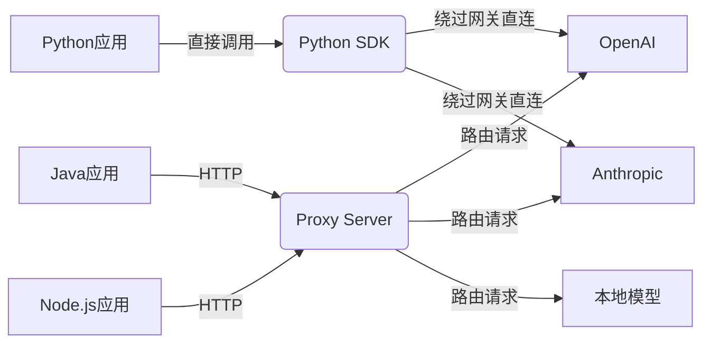
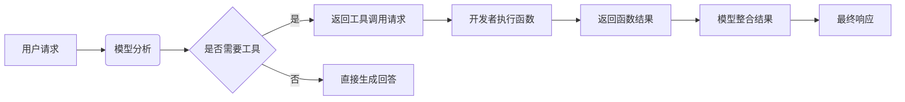
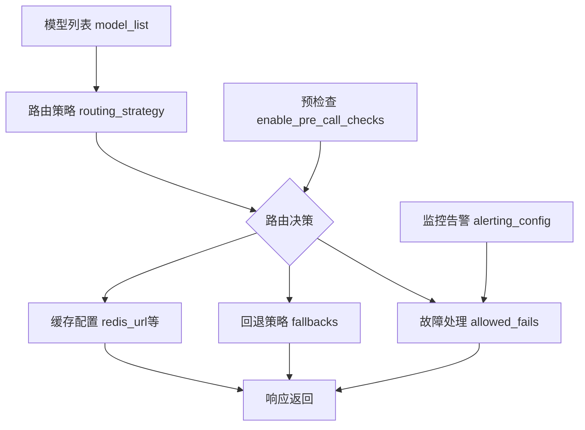
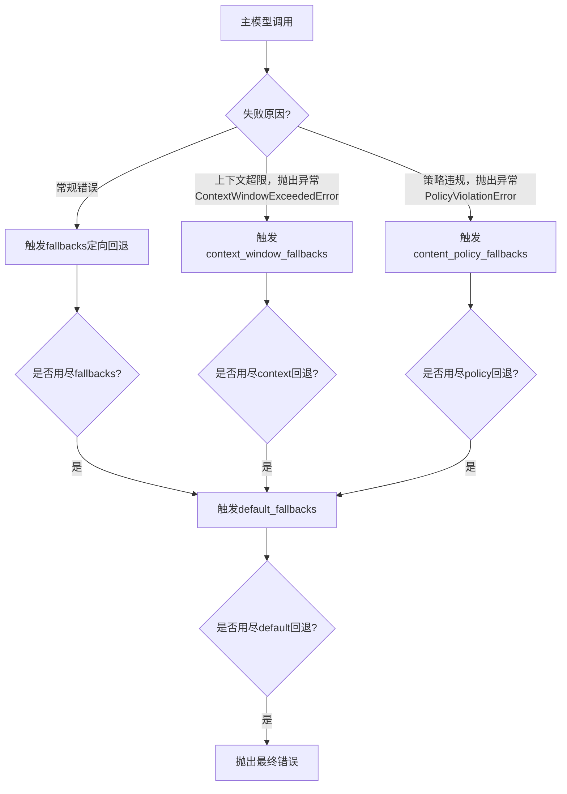
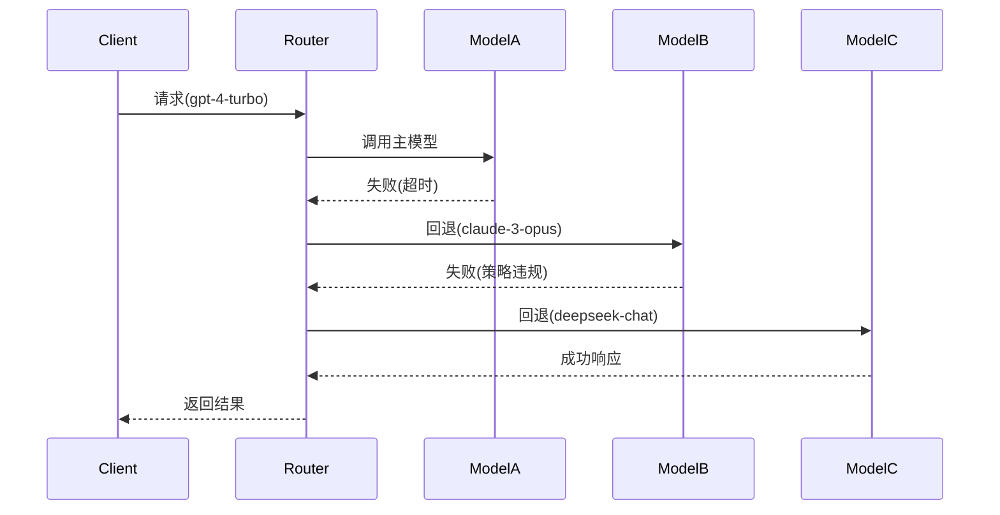

# LLM统一网关：LiteLLM 详细介绍

## LiteLLM 基本介绍

#### 为什么需要LiteLLM？

在AI应用开发过程中，开发者常常遇到以下痛点：
- 接口碎片化：不同厂商的API接口差异巨大，从参数命名到响应格式都不统一
- 密钥管理复杂：每个服务商都有独立的认证机制，密钥管理成为运维负担
- 多模型管理成本：更换模型提供商需要重写大量代码，项目难以灵活调整
- 安全与合规：医疗或金融场景需确保数据不经过第三方模型，需要在调用第三方模型前拦截
- 开发迭代：快速对比不同模型在业务场景中的效果，需为每个模型单独编写评测代码
- 系统稳定性：动态路由与负载均衡，容灾与故障转移，智能重试与限流

#### 项目概述

**LiteLLM** 是一个开源工具，LiteLLM通过提供统一的OpenAI兼容接口，作为 LLM API 的通用适配器，简化大型语言模型（LLM）的集成与管理，允许开发人员通过标准化接口与各种大模型进行交互。该项目支持目前市面上大多数LLM提供商，包括 Anthropic、AWS Bedrock、AWS SageMaker、Azure OpenAI、deepseek、Google Vertex AI、OpenAI等等，除了云端产品，还支持本地化部署工具，如Ollama等。

除了统一接口之外，还实现了成本跟踪、访问控制和 API 调用的实时监控等功能。该项目核心目标是是简化多 LLM 应用的开发，提高平台团队管理多提供商的效率。目前，LiteLLM 集成了100多个LLM的访问、费用跟踪和回退。

使用LiteLLM，可为开发团队节省时间和精力。开发者无需自定义集成每个新的模型 API ，或等待特定提供商发布SDK。

#### 核心功能
1. **标准化API接口**
   - **统一调用格式**：无论底层模型如何，所有请求均使用相同结构（如OpenAI格式），降低代码适配成本。
   - **示例**：调用GPT-4与Claude 2均通过 `litellm.completion(model="模型名", messages=[...])` 实现。

2. **多模型支持**
   - **覆盖主流LLM**：支持包括OpenAI、Anthropic、Google Vertex AI、Hugging Face、Cohere等20+模型，持续扩展中。
   - **自定义模型接入**：通过配置可接入私有化部署模型或小众API。

3. **智能路由与负载均衡**
   - **路由策略**：根据模型类型、可用性、成本或时延自动选择最优服务节点。
   - **故障转移**：当某模型服务不可用时，自动切换至备用模型，确保业务连续性。

4. **缓存与成本优化**
   - **请求缓存**：对重复查询结果缓存，减少API调用次数。
   - **用量统计**：实时监控各模型Token消耗，生成成本报告，支持预算告警。

5. **监控与日志**
   - **性能指标**：记录响应时间、错误率、Token用量等关键指标。
   - **审计日志**：追踪所有请求详情，便于调试与合规审查。

6. **安全增强**
   - **API密钥管理**：集中存储加密密钥，避免硬编码泄露风险。
   - **访问控制**：支持基于角色的权限管理（RBAC），限制敏感操作。

#### 技术架构
LiteLLM采用模块化设计，关键组件包括：
- **API网关**：接收请求并转发至适配器，处理认证、限流等。
- **模型适配器**：将统一API转换为各LLM原生接口（如将OpenAI格式转为Anthropic的HTTP参数）。
- **路由引擎**：动态决策模型调用路径，支持自定义规则（如“优先使用成本低于$0.01/1k Tokens的模型”）。
- **缓存层**：基于Redis或内存存储高频查询结果。
- **监控代理**：集成Prometheus、Grafana等工具，提供可视化看板。

#### 典型应用场景
1. **多模型A/B测试**
   - 同时向GPT-4和Claude 2发送请求，比较生成质量，辅助模型选型。

2. **混合云LLM调度**
   - 结合公有云API（如OpenAI）与本地部署模型（如Llama 2），根据数据敏感性自动路由。

3. **成本敏感型应用**
   - 配置路由策略，在非关键任务中使用低价模型（如GPT-3.5），关键任务切换至高成本模型（如GPT-4）。

4. **容灾备份**
   - 当Qwen模型调用服务出现故障时，自动将请求转发至deepseek模型调用服务，避免服务中断。

#### 优势对比
| 特性               | 原生多模型开发         | 使用LiteLLM          |
|--------------------|------------------------|----------------------|
| 代码复杂度         | 需为每个模型编写适配层 | 统一API，代码复用率高|
| 维护成本           | 需跟踪各API更新        | 自动处理接口变更     |
| 故障恢复           | 手动实现重试逻辑       | 内置智能故障转移     |
| 成本优化           | 需自行统计与分析       | 提供用量仪表盘       |

#### 总结
LiteLLM通过抽象化底层LLM的复杂性，显著降低了多模型应用的开发门槛。其核心价值在于：
- **开发者友好**：减少70%以上的模型集成代码量。
- **企业级管控**：提供从成本控制到安全审计的全生命周期管理。
- **生态兼容性**：无缝对接现有MLOps工具链（如MLflow、Weights & Biases）。

随着LLM技术的快速演进，LiteLLM正成为构建稳健、可扩展AI应用的关键基础设施。


## LiteLLM 两种使用方式介绍

LiteLLM有两种使用方式：
- **Python SDK**：在 Python 代码中使用 LiteLLM，通常由构建 llm 项目的开发人员使用。
- **Proxy Server**：需要中央服务（LLM 网关）访问多个 LLM，通常由 Gen AI 支持/ML 平台团队使用。

### LiteLLM Proxy Server vs. Python SDK：核心区别详解
#### **定位与架构差异**
| **维度**         | **LiteLLM Python SDK**                     | **LiteLLM Proxy Server**                  |
|------------------|-------------------------------------------|-------------------------------------------|
| **本质**         | 轻量级Python客户端库                      | 独立部署的API网关服务                     |
| **运行方式**     | 嵌入应用代码中（如Django/Flask/fastapi）          | 独立进程（Docker/K8s部署）                |
| **通信协议**     | 函数调用（Python进程内）                  | HTTP REST API（跨语言调用）               |
| **依赖**         | 需Python环境                              | 需要单独部署（任何HTTP客户端可访问，无语言限制）        |

### 一、**LiteLLM Python SDK**
#### 核心特征

- **本地集成**：作为Python包直接安装（`pip install litellm`）
- **开发者友好**：面向Python开发者，提供同步/异步API
- **无服务依赖**：无需额外基础设施

#### 典型使用场景
1. **单应用快速集成**
   ```python
   import litellm  # 单库集成所有功能
   # 直接调用模型
   response = litellm.completion(model="gpt-4", messages=[...])
   ```

2. **脚本/实验环境**
   ```python
   # Jupyter Notebook中快速测试模型
    import litellm
    model_list = litellm.model_list # 查看支持模型
    print(len(model_list)) # 791
   ```

3. **与其他Python库协同**
   ```python
    # 安装 langchain-litellm 依赖
    !pip install -qU langchain-litellm
    # 无缝接入LangChain
    from langchain_litellm import ChatLiteLLM
    llm = ChatLiteLLM(model="gpt-4.1-nano", temperature=0.1)
   ```


### 二、**LiteLLM Proxy Server**
#### 使用docker部署
```bash
docker run \
    -v $(pwd)/litellm_config.yaml:/app/config.yaml \
    -e AZURE_API_KEY=d6*********** \
    -e AZURE_API_BASE=https://openai-***********/ \
    -p 4000:4000 \
    ghcr.io/berriai/litellm:main-latest \
    --config /app/config.yaml --detailed_debug
```
#### 核心功能
- **中心化网关**：独立服务，通过HTTP暴露统一API
- **企业级功能**：
  - **多租户管理**（团队/项目隔离）
  - **集中式监控面板**
  - **全局速率限制**
  - **成本跟踪**

#### 典型使用场景
1. **多语言架构**

   使用 javascript 调用
   ```javascript
   // 前端JS直接调用
   fetch("http://llm-gateway.company.com/completions", {
     method: "POST",
     headers: { 
       "Authorization": "Bearer team-123",
       "Content-Type": "application/json"
     },
     body: JSON.stringify({
       model: "gpt-4",
       messages: [{role: "user", content: "Hello"}]
     })
   })
   ```
   使用 curl 调用
   ```shell
    curl -X POST 'http://0.0.0.0:4000/chat/completions' \
    -H 'Content-Type: application/json' \
    -H 'Authorization: Bearer sk-1234' \
    -d '{
        "model": "gpt-4o",
        "messages": [
          {
            "role": "system",
            "content": "You are an LLM named gpt-4o"
          },
          {
            "role": "user",
            "content": "what is your name?"
          }
        ]
    }'
   ```
   使用 openai 兼容接口调用

   ```python
    import openai # openai v1.0.0+
    client = openai.OpenAI(api_key="anything",base_url="http://0.0.0.0:4000") # set proxy to base_url
    messages = [{
                    "role": "user",
                    "content": "this is a test request, write a short poem"
                }]
    # request sent to model set on litellm proxy, `litellm --model`
    response = client.chat.completions.create(model="gpt-3.5-turbo", messages=messages )
    
    print(response)
   ```

### 三、核心能力对比
| **功能**               | **Python SDK**                          | **Proxy Server**                         |
|------------------------|-----------------------------------------|------------------------------------------|
| **多模型调用**         | ✅ 支持                                 | ✅ 支持                                  |
| **负载均衡**           | ✅ 基础路由策略                         | ✅ 高级算法（一致性哈希/权重轮询）       |
| **成本跟踪**           | ✅ 单进程级统计                         | ✅ 多团队细粒度分析                      |
| **密钥管理**           | ❌ 需自行实现加密                       | ✅ 集中存储（Vault集成）                 |
| **访问控制**           | ❌ 无                                   | ✅ RBAC/团队隔离                         |
| **全局速率限制**       | ❌ 仅单进程有效                         | ✅ 集群级控制                            |
| **审计日志**           | ✅ 基础日志                             | ✅ 结构化日志（ElasticSearch集成）       |
| **服务发现**           | ❌ 无                                   | ✅ 健康检查+自动故障转移                 |

### 四、如何选择？
#### 选择 **Python SDK** ：
- 构建纯Python应用（如AI助手脚本）
- 需要极简原型验证（POC阶段）
- 无多团队/多语言集成需求

#### 选择 **Proxy Server** ：
- 企业生产环境部署
- 需要支持Java/Go/Node.js等多语言客户端
- 要求团队隔离与SLA保障
- 已有Prometheus/Grafana监控栈

### 五、协同使用方案

**最佳实践**：
- 开发环境用SDK快速迭代
- 生产环境通过Proxy统一管理
- SDK应用可逐步迁移至Proxy

## LiteLLM 实践

因为我们使用的是python应用，并且主要使用的是 **langchain** 框架，所以接下来的实践内容以 **LiteLLM Python SDK** 为主，重点介绍下面功能的使用方法。

- 非流式对话
- 流式对话
- 函数调用
- 动态路由
- 智能重试

这里从两个大的方面介绍这些功能的使用
1. 使用 **LiteLLM Python SDK** 直接提供的接口
2. 与langchain集成，使用 **langchain-litellm** 提供的接口

为了更好的实践，接下来从 [deepseek](https://api-docs.deepseek.com/zh-cn/) 和 [阿里云百炼](https://www.aliyun.com/product/bailian) 这两个平台申请模型调用服务。
- 申请 deepseek 模型调用服务需要充值，具体使用可以查看[deepseek](https://api-docs.deepseek.com/zh-cn/)官方文档。
- 申请阿里云百炼模型调用服务，首次开通每个模型可以免费领取100万token使用额度，具体使用可以查看[阿里云百炼](https://www.aliyun.com/product/bailian)官方文档。

假设你已经申请好了对应的 **api_key** ，接下来开始实践。

### LiteLLM Python SDK 的 基本使用

#### 安装依赖
```bash
pip install litellm -U
```

#### litellm.completion方法参数详解

使用 **LiteLLM Python SDK** 主要的接口是 **litellm.completion()**，查看源码参数及说明如下：

```python
@client
def completion(  # type: ignore # noqa: PLR0915
    model: str,
    # Optional OpenAI params: see https://platform.openai.com/docs/api-reference/chat/create
    messages: List = [],
    timeout: Optional[Union[float, str, httpx.Timeout]] = None,
    temperature: Optional[float] = None,
    top_p: Optional[float] = None,
    n: Optional[int] = None,
    stream: Optional[bool] = None,
    stream_options: Optional[dict] = None,
    stop=None,
    max_completion_tokens: Optional[int] = None,
    max_tokens: Optional[int] = None,
    modalities: Optional[List[ChatCompletionModality]] = None,
    prediction: Optional[ChatCompletionPredictionContentParam] = None,
    audio: Optional[ChatCompletionAudioParam] = None,
    presence_penalty: Optional[float] = None,
    frequency_penalty: Optional[float] = None,
    logit_bias: Optional[dict] = None,
    user: Optional[str] = None,
    # openai v1.0+ new params
    reasoning_effort: Optional[Literal["low", "medium", "high"]] = None,
    response_format: Optional[Union[dict, Type[BaseModel]]] = None,
    seed: Optional[int] = None,
    tools: Optional[List] = None,
    tool_choice: Optional[Union[str, dict]] = None,
    logprobs: Optional[bool] = None,
    top_logprobs: Optional[int] = None,
    parallel_tool_calls: Optional[bool] = None,
    web_search_options: Optional[OpenAIWebSearchOptions] = None,
    deployment_id=None,
    extra_headers: Optional[dict] = None,
    # soon to be deprecated params by OpenAI
    functions: Optional[List] = None,
    function_call: Optional[str] = None,
    # set api_base, api_version, api_key
    base_url: Optional[str] = None,
    api_version: Optional[str] = None,
    api_key: Optional[str] = None,
    model_list: Optional[list] = None,  # pass in a list of api_base,keys, etc.
    # Optional liteLLM function params
    thinking: Optional[AnthropicThinkingParam] = None,
    **kwargs,
) -> Union[ModelResponse, CustomStreamWrapper]:
```

注意：由于参数很多，我会尽量简洁明了地解释每个参数。

1. `model: str`：指定要使用的模型名称，例如 "gpt-3.5-turbo"。

2. `messages: List = []`：聊天消息列表，每个消息是一个字典，包含"role"（如"user"、"assistant"）和"content"。

3. `timeout: Optional[Union[float, str, httpx.Timeout]] = None`：请求超时时间，可以是秒数（float），字符串（如"5s"）或httpx.Timeout对象。

4. `temperature: Optional[float] = None`：控制生成文本的随机性。值越高，输出越随机；值越低，输出越确定。

5. `top_p: Optional[float] = None`：核采样（nucleus sampling）的参数，控制生成文本的多样性。与temperature类似，但通常只考虑概率质量累计到top_p的词汇。

6. `n: Optional[int] = None`：生成多个独立的回复（选择其中一个返回）。

7. `stream: Optional[bool] = None`：是否以流式（stream）方式返回响应。

8. `stream_options: Optional[dict] = None`：流式传输的额外选项。

9. `stop`：可选，指定一个或多个字符串，当模型生成这些字符串时停止生成。

10. `max_completion_tokens: Optional[int] = None`：限制完成部分的最大token数（不包括提示）。

11. `max_tokens: Optional[int] = None`：整个生成的最大token数（包括提示和完成部分）。通常用这个或max_completion_tokens。

12. `modalities: Optional[List[ChatCompletionModality]] = None`：指定交互的模态（如文本、图像等），可能是多模态输入。

13. `prediction: Optional[ChatCompletionPredictionContentParam] = None`：预测内容参数，可能用于指定生成内容的结构或类型。

14. `audio: Optional[ChatCompletionAudioParam] = None`：音频参数，可能用于语音输入或输出。

15. `presence_penalty: Optional[float] = None`：存在惩罚，用于降低已经出现过的token的概率。

16. `frequency_penalty: Optional[float] = None`：频率惩罚，用于降低频繁出现的token的概率。

17. `logit_bias: Optional[dict] = None`：一个字典，用于调整特定token的生成概率（通过调整logit值）。

18. `user: Optional[str] = None`：终端用户的标识符，用于监控和滥用检测。

19. `reasoning_effort: Optional[Literal["low", "medium", "high"]] = None`：指定模型推理的努力程度（可能影响响应时间和质量）。

20. `response_format: Optional[Union[dict, Type[BaseModel]]] = None`：指定响应格式，比如JSON对象，或者使用Pydantic的BaseModel定义结构。

21. `seed: Optional[int] = None`：随机种子，用于使生成结果具有确定性。

22. `tools: Optional[List] = None`：一个工具列表，模型可以调用这些工具（类似于functions的替代）。

23. `tool_choice: Optional[Union[str, dict]] = None`：控制模型如何选择工具，可以是"auto"、"none"，或指定某个工具。

24. `logprobs: Optional[bool] = None`：是否返回每个token的对数概率。

25. `top_logprobs: Optional[int] = None`：如果logprobs为True，这个参数指定返回每个位置概率最高的几个token及其对数概率。

26. `parallel_tool_calls: Optional[bool] = None`：是否允许模型并行调用多个工具（如果支持）。

27. `web_search_options: Optional[OpenAIWebSearchOptions] = None`：网络搜索选项，可能用于让模型在生成前进行网络搜索。

28. `deployment_id=None`：部署ID，可能用于Azure OpenAI服务，指定特定的部署。

29. `extra_headers: Optional[dict] = None`：额外的HTTP头，用于自定义请求。

30. `functions: Optional[List] = None`：函数列表（旧版），模型可以调用这些函数（将被tools取代）。

31. `function_call: Optional[str] = None`：控制函数调用行为，如"auto"、"none"或强制调用特定函数。

32. `base_url: Optional[str] = None`：API的基础URL，用于覆盖默认的OpenAI API地址。

33. `api_version: Optional[str] = None`：API版本，特别用于Azure OpenAI服务。

34. `api_key: Optional[str] = None`：API密钥，用于认证。

35. `model_list: Optional[list] = None`：一个列表，可能包含多个API的配置（如多个base_url和api_key），用于负载均衡或回退。

36. `thinking: Optional[AnthropicThinkingParam] = None`：特定于Anthropic模型的参数，可能用于控制模型的“思考”过程。

37. `**kwargs`：其他未指定的参数，用于向前或向后兼容。

返回类型：`Union[ModelResponse, CustomStreamWrapper]`，表示返回一个模型响应对象，或者如果是流式响应，则返回一个自定义的流包装器。

> 注意：这个函数是一个封装函数，用于统一调用不同提供者（如OpenAI、Anthropic等）的API，因此参数非常丰富，涵盖了多个提供者的特定参数。

为了便于理解各个参数的作用，接下来将按照参数的功能分类，整理成表格，以下是 `completion` 函数参数的分类整理表格：

##### **基础参数**
| 参数名 | 类型 | 默认值 | 说明 |
|--------|------|--------|------|
| `model` | `str` | - | **必需**，模型名称（如 `gpt-4-turbo`） |
| `messages` | `List` | `[]` | **必需**，聊天消息列表（格式：`[{"role": "user", "content": "text"}]`） |


##### **生成控制参数**
| 参数名 | 类型 | 默认值 | 说明 |
|--------|------|--------|------|
| `temperature` | `float` | `None` | 随机性控制（0.0-2.0），值越高输出越随机 |
| `top_p` | `float` | `None` | 核采样阈值（0.0-1.0），仅累积概率超过阈值的词参与采样 |
| `max_tokens` | `int` | `None` | **输入+输出**总 token 数上限 |
| `max_completion_tokens` | `int` | `None` | **仅输出** token 数上限 |
| `stop` | `Union[str, List[str]]` | `None` | 停止生成标记（如 `["\n", "."]`） |
| `n` | `int` | `None` | 生成多条独立回复的数量 |
| `seed` | `int` | `None` | 随机种子，确保结果可复现 |


##### **高级控制参数**
| 参数名 | 类型 | 默认值 | 说明 |
|--------|------|--------|------|
| `presence_penalty` | `float` | `None` | 惩罚已出现 token（-2.0~2.0），避免重复内容 |
| `frequency_penalty` | `float` | `None` | 惩罚高频 token（-2.0~2.0），避免常见词滥用 |
| `logit_bias` | `dict` | `None` | 特定 token 概率偏移（如 `{12345: 5.0}` 提高该 token 概率） |
| `logprobs` | `bool` | `None` | 是否返回 token 对数概率 |
| `top_logprobs` | `int` | `None` | 返回每个位置概率最高的 token 数量（需 `logprobs=True`） |
| `user` | `str` | `None` | 终端用户 ID（用于滥用监控） |


##### **多模态与工具调用**
| 参数名 | 类型 | 默认值 | 说明 |
|--------|------|--------|------|
| `modalities` | `List[ChatCompletionModality]` | `None` | 多模态输入类型（文本/图像/音频） |
| `audio` | `ChatCompletionAudioParam` | `None` | 音频输入参数（如语音转文本） |
| `tools` | `List` | `None` | **新版**工具调用列表（替代 `functions`） |
| `tool_choice` | `Union[str, dict]` | `None` | 工具调用控制（`"auto"`/`"none"` 或指定工具） |
| `parallel_tool_calls` | `bool` | `None` | 是否允许并行调用多个工具 |
| `functions` | `List` | `None` | **旧版**函数列表（即将弃用） |
| `function_call` | `str` | `None` | **旧版**函数调用控制（即将弃用） |


##### **流式传输**
| 参数名 | 类型 | 默认值 | 说明 |
|--------|------|--------|------|
| `stream` | `bool` | `None` | 是否启用流式传输 |
| `stream_options` | `dict` | `None` | 流式配置（如 `{"include_usage": true}`） |


##### **模型推理控制**
| 参数名 | 类型 | 默认值 | 说明 |
|--------|------|--------|------|
| `reasoning_effort` | `Literal["low","medium","high"]` | `None` | 推理强度（影响响应质量与延迟） |
| `prediction` | `ChatCompletionPredictionContentParam` | `None` | 预测内容结构化参数 |
| `thinking` | `AnthropicThinkingParam` | `None` | Anthropic 模型专用思考控制 |


##### **搜索与响应格式**
| 参数名 | 类型 | 默认值 | 说明 |
|--------|------|--------|------|
| `web_search_options` | `OpenAIWebSearchOptions` | `None` | 网络搜索配置（如启用实时搜索） |
| `response_format` | `Union[dict, Type[BaseModel]]` | `None` | 响应格式（如 `{"type": "json_object"}` 或 Pydantic 模型） |


##### **API 配置**
| 参数名 | 类型 | 默认值 | 说明 |
|--------|------|--------|------|
| `api_key` | `str` | `None` | 覆盖默认 API 密钥 |
| `base_url` | `str` | `None` | 覆盖 API 地址（如 Azure 端点） |
| `api_version` | `str` | `None` | 指定 API 版本（Azure 必需） |
| `model_list` | `list` | `None` | 多模型配置列表（负载均衡/故障转移） |
| `deployment_id` | `str` | `None` | Azure 部署 ID |


##### **其他参数**
| 参数名 | 类型 | 默认值 | 说明 |
|--------|------|--------|------|
| `timeout` | `Union[float, str, httpx.Timeout]` | `None` | 请求超时时间（秒或 `httpx.Timeout` 对象） |
| `extra_headers` | `dict` | `None` | 自定义 HTTP 头 |
| `kwargs` | `Any` | - | 兼容未来扩展的额外参数 |


##### **返回值**
| 类型 | 说明 |
|------|------|
| `ModelResponse` | 非流式响应时的结构化对象 |
| `CustomStreamWrapper` | 流式响应时的迭代器包装器 |

> **关键说明**：
> 1. 部分参数（如 `modalities`、`audio`）需特定模型支持（如 GPT-4o）
> 2. `tools` 已取代 `functions`，推荐使用新参数
> 3. openai接口完整文档参考：[OpenAI API 文档](https://platform.openai.com/docs/api-reference/chat/create)(https://platform.openai.com/docs/api-reference/chat/create)


### LiteLLM Python SDK 实践
下面的实践中主要使用了 **completion** 方法的**基础参数(model和messages)和API 配置参数(base_url 和 api_key)**。

> ⚠️注意：使用 model 参数时需要在模型名称前面添加 provider 的名称，查看 [litellm 支持的 provider](https://docs.litellm.ai/docs/providers) 。
> 在 LiteLLM 中，`model` 参数的设计非常灵活，它允许你通过一个字符串同时指定模型名称和提供商（provider），这种设计主要是为了简化多模型、多提供商的调用管理。
>
> **provider 名称的作用**
> 1. 确定 API 端点：如果没有指定 base_url 参数，那么则LiteLLM 根据 provider 名称确定应该将请求发送到哪个 API 端点。
> 2. 选择正确的认证方式：不同的提供商使用不同的认证方式（例如 API Key 的位置和格式）。LiteLLM 会根据 provider 使用正确的认证方式。
> 3. 转换请求格式：每个提供商的 API 请求格式可能不同。LiteLLM 会将标准的 `messages` 列表转换为目标提供商所需的格式。
> 4. 转换响应格式：LiteLLM 会将不同提供商的响应转换为统一的标准格式（类似于 OpenAI 的格式）。
>
> 如果你有一个自定义模型或者本地部署的模型，可能就需要明确指定 provider。
> 
因为这里实践使用的 [deepseek](https://api-docs.deepseek.com/zh-cn/) 和 [阿里云百炼](https://www.aliyun.com/product/bailian) 这两个平台提供的服务接口都兼容 **openai** 接口格式，所以在设置 **model** 参数时都应该在模型的名称前面加上 **openai/**，例如：`openai/qwen-turbo` 或 `openai/deepseek-chat`
#### 1.非流式对话

##### 使用阿里云百炼平台非流式对话

参考文档：[通义千问 API 的输入输出参数](https://bailian.console.aliyun.com/?tab=api#/api/?type=model&url=https%3A%2F%2Fhelp.aliyun.com%2Fdocument_detail%2F2712576.html&renderType=iframe)


```python
import os
import litellm

BAILIAN_API_KEY = "sk-a47e70844cc843cea2ba5f23663f13d5"
os.environ["BAILIAN_API_KEY"] = BAILIAN_API_KEY

messages=[{"role": "user", "content": "你是谁"}]

response = litellm.completion(
    model="openai/qwen-turbo",
    messages=messages,
    base_url="https://dashscope.aliyuncs.com/compatible-mode/v1",
    api_key=os.getenv("BAILIAN_API_KEY"),
)

response.choices[0].message

```


    Message(content='我是通义千问，阿里巴巴集团旗下的通义实验室自主研发的超大规模语言模型。我能够帮助您回答问题、创作文字，如写故事、公文、技术文档等，还能进行逻辑推理、编程，表达观点，玩游戏等。如果您有任何问题或需要帮助，欢迎随时告诉我！', role='assistant', tool_calls=None, function_call=None, provider_specific_fields={'refusal': None})


###### 使用 deepseek 非流式对话
参考 [deepseek 官方文档](https://api-docs.deepseek.com/zh-cn/)，可以知道 `base_url=https://api.deepseek.com/`, 因为 deepseek 平台提供的接口也是兼容 openai 接口的，所以 model 参数需要设置为 `openai/deepseek-chat`，deepseek 其他可选的模型名称可以在deepseek官网查看。

下面是使用 litellm 集成 deepseek 模型服务非流式接口的示例：


```python
import os
import litellm

DEEPSEEK_API_KEY = "sk-783df6a1c50445d7b0994a7a5b3ef6e3"
os.environ["DEEPSEEK_API_KEY"] = DEEPSEEK_API_KEY

messages=[{"role": "user", "content": "你是谁"}]

response = litellm.completion(
    model="openai/deepseek-chat",
    messages=messages,
    base_url="https://api.deepseek.com/",
    api_key=os.getenv("DEEPSEEK_API_KEY"),
)

response.choices[0].message
```


    Message(content='我是DeepSeek Chat，由深度求索公司创造的智能AI助手！🤖✨ 我的使命是为你提供各种问题的解答、创意灵感、学习辅助，甚至陪你聊天解闷。无论是知识查询、写作建议，还是日常小困惑，都可以问我哦！有什么我可以帮你的吗？😊', role='assistant', tool_calls=None, function_call=None, provider_specific_fields={'refusal': None})


#### 2.流式对话

使用 litellm 开启流式对话非常简单，只需要在 `completion` 方法中添加参数 `stream=True` 即可，如下所示：


```python
import os
import litellm


messages=[{"role": "user", "content": "你是谁"}]

response = litellm.completion(
    model="openai/qwen-turbo",
    messages=messages,
    base_url="https://dashscope.aliyuncs.com/compatible-mode/v1",
    api_key=os.getenv("BAILIAN_API_KEY"),
    stream=True,  # 开启流式对话
)
# 流式对话completion方法返回的是 CustomStreamWrapper，可以迭代获取流式对话的chunk
for chunk in response:
    print(chunk.choices[0].delta or "")
```

    Delta(provider_specific_fields=None, refusal=None, content='我是', role='assistant', function_call=None, tool_calls=None, audio=None)
    Delta(provider_specific_fields=None, refusal=None, content='通', role=None, function_call=None, tool_calls=None, audio=None)
    Delta(provider_specific_fields=None, refusal=None, content='义', role=None, function_call=None, tool_calls=None, audio=None)
    Delta(provider_specific_fields=None, refusal=None, content='千问，阿里巴巴', role=None, function_call=None, tool_calls=None, audio=None)
    Delta(provider_specific_fields=None, refusal=None, content='集团旗下的通义', role=None, function_call=None, tool_calls=None, audio=None)
    Delta(provider_specific_fields=None, refusal=None, content='实验室自主研发的超', role=None, function_call=None, tool_calls=None, audio=None)
    Delta(provider_specific_fields=None, refusal=None, content='大规模语言模型。', role=None, function_call=None, tool_calls=None, audio=None)
    Delta(provider_specific_fields=None, refusal=None, content='我能够帮助您', role=None, function_call=None, tool_calls=None, audio=None)
    Delta(provider_specific_fields=None, refusal=None, content='回答问题、创作', role=None, function_call=None, tool_calls=None, audio=None)
    Delta(provider_specific_fields=None, refusal=None, content='文字，如写', role=None, function_call=None, tool_calls=None, audio=None)
    Delta(provider_specific_fields=None, refusal=None, content='故事、公文', role=None, function_call=None, tool_calls=None, audio=None)
    Delta(provider_specific_fields=None, refusal=None, content='、技术文档等', role=None, function_call=None, tool_calls=None, audio=None)
    Delta(provider_specific_fields=None, refusal=None, content='，还能进行逻辑', role=None, function_call=None, tool_calls=None, audio=None)
    Delta(provider_specific_fields=None, refusal=None, content='推理、编程，', role=None, function_call=None, tool_calls=None, audio=None)
    Delta(provider_specific_fields=None, refusal=None, content='表达观点，玩游戏', role=None, function_call=None, tool_calls=None, audio=None)
    Delta(provider_specific_fields=None, refusal=None, content='等。如果您有任何', role=None, function_call=None, tool_calls=None, audio=None)
    Delta(provider_specific_fields=None, refusal=None, content='问题或需要帮助', role=None, function_call=None, tool_calls=None, audio=None)
    Delta(provider_specific_fields=None, refusal=None, content='，欢迎随时告诉我', role=None, function_call=None, tool_calls=None, audio=None)
    Delta(provider_specific_fields=None, refusal=None, content='！', role=None, function_call=None, tool_calls=None, audio=None)
    Delta(provider_specific_fields=None, content=None, role=None, function_call=None, tool_calls=None, audio=None)


```python
import os
import litellm

messages=[{"role": "user", "content": "你是谁"}]

response = litellm.completion(
    model="openai/deepseek-chat",
    messages=messages,
    base_url="https://api.deepseek.com/",
    api_key=os.getenv("DEEPSEEK_API_KEY"),
    stream=True,  # 开启流式对话
)

for chunk in response:
    print(chunk.choices[0].delta or "")
```

    Delta(provider_specific_fields=None, refusal=None, content='我是', role='assistant', function_call=None, tool_calls=None, audio=None)
    Delta(provider_specific_fields=None, refusal=None, content='Deep', role=None, function_call=None, tool_calls=None, audio=None)
    Delta(provider_specific_fields=None, refusal=None, content='Se', role=None, function_call=None, tool_calls=None, audio=None)
    Delta(provider_specific_fields=None, refusal=None, content='ek', role=None, function_call=None, tool_calls=None, audio=None)
    Delta(provider_specific_fields=None, refusal=None, content=' Chat', role=None, function_call=None, tool_calls=None, audio=None)
    Delta(provider_specific_fields=None, refusal=None, content='，', role=None, function_call=None, tool_calls=None, audio=None)
    Delta(provider_specific_fields=None, refusal=None, content='由', role=None, function_call=None, tool_calls=None, audio=None)
    Delta(provider_specific_fields=None, refusal=None, content='深度', role=None, function_call=None, tool_calls=None, audio=None)
    Delta(provider_specific_fields=None, refusal=None, content='求', role=None, function_call=None, tool_calls=None, audio=None)
    Delta(provider_specific_fields=None, refusal=None, content='索', role=None, function_call=None, tool_calls=None, audio=None)
    Delta(provider_specific_fields=None, refusal=None, content='公司', role=None, function_call=None, tool_calls=None, audio=None)
    Delta(provider_specific_fields=None, refusal=None, content='创造的', role=None, function_call=None, tool_calls=None, audio=None)
    Delta(provider_specific_fields=None, refusal=None, content='智能', role=None, function_call=None, tool_calls=None, audio=None)
    Delta(provider_specific_fields=None, refusal=None, content='AI', role=None, function_call=None, tool_calls=None, audio=None)
    Delta(provider_specific_fields=None, refusal=None, content='助手', role=None, function_call=None, tool_calls=None, audio=None)
    Delta(provider_specific_fields=None, refusal=None, content='！', role=None, function_call=None, tool_calls=None, audio=None)
    Delta(provider_specific_fields=None, refusal=None, content='🤖', role=None, function_call=None, tool_calls=None, audio=None)
    Delta(provider_specific_fields=None, refusal=None, content='✨', role=None, function_call=None, tool_calls=None, audio=None)
    Delta(provider_specific_fields=None, refusal=None, content=' ', role=None, function_call=None, tool_calls=None, audio=None)
    Delta(provider_specific_fields=None, refusal=None, content='我的', role=None, function_call=None, tool_calls=None, audio=None)
    Delta(provider_specific_fields=None, refusal=None, content='使命', role=None, function_call=None, tool_calls=None, audio=None)
    Delta(provider_specific_fields=None, refusal=None, content='是', role=None, function_call=None, tool_calls=None, audio=None)
    Delta(provider_specific_fields=None, refusal=None, content='帮助你', role=None, function_call=None, tool_calls=None, audio=None)
    Delta(provider_specific_fields=None, refusal=None, content='解答', role=None, function_call=None, tool_calls=None, audio=None)
    Delta(provider_specific_fields=None, refusal=None, content='各种', role=None, function_call=None, tool_calls=None, audio=None)
    Delta(provider_specific_fields=None, refusal=None, content='问题', role=None, function_call=None, tool_calls=None, audio=None)
    Delta(provider_specific_fields=None, refusal=None, content='，', role=None, function_call=None, tool_calls=None, audio=None)
    Delta(provider_specific_fields=None, refusal=None, content='无论是', role=None, function_call=None, tool_calls=None, audio=None)
    Delta(provider_specific_fields=None, refusal=None, content='学习', role=None, function_call=None, tool_calls=None, audio=None)
    Delta(provider_specific_fields=None, refusal=None, content='、', role=None, function_call=None, tool_calls=None, audio=None)
    Delta(provider_specific_fields=None, refusal=None, content='工作', role=None, function_call=None, tool_calls=None, audio=None)
    Delta(provider_specific_fields=None, refusal=None, content='，', role=None, function_call=None, tool_calls=None, audio=None)
    Delta(provider_specific_fields=None, refusal=None, content='还是', role=None, function_call=None, tool_calls=None, audio=None)
    Delta(provider_specific_fields=None, refusal=None, content='日常', role=None, function_call=None, tool_calls=None, audio=None)
    Delta(provider_specific_fields=None, refusal=None, content='生活中的', role=None, function_call=None, tool_calls=None, audio=None)
    Delta(provider_specific_fields=None, refusal=None, content='小', role=None, function_call=None, tool_calls=None, audio=None)
    Delta(provider_specific_fields=None, refusal=None, content='困惑', role=None, function_call=None, tool_calls=None, audio=None)
    Delta(provider_specific_fields=None, refusal=None, content='。', role=None, function_call=None, tool_calls=None, audio=None)
    Delta(provider_specific_fields=None, refusal=None, content='我可以', role=None, function_call=None, tool_calls=None, audio=None)
    Delta(provider_specific_fields=None, refusal=None, content='陪你', role=None, function_call=None, tool_calls=None, audio=None)
    Delta(provider_specific_fields=None, refusal=None, content='聊天', role=None, function_call=None, tool_calls=None, audio=None)
    Delta(provider_specific_fields=None, refusal=None, content='、', role=None, function_call=None, tool_calls=None, audio=None)
    Delta(provider_specific_fields=None, refusal=None, content='提供', role=None, function_call=None, tool_calls=None, audio=None)
    Delta(provider_specific_fields=None, refusal=None, content='建议', role=None, function_call=None, tool_calls=None, audio=None)
    Delta(provider_specific_fields=None, refusal=None, content='、', role=None, function_call=None, tool_calls=None, audio=None)
    Delta(provider_specific_fields=None, refusal=None, content='查找', role=None, function_call=None, tool_calls=None, audio=None)
    Delta(provider_specific_fields=None, refusal=None, content='信息', role=None, function_call=None, tool_calls=None, audio=None)
    Delta(provider_specific_fields=None, refusal=None, content='，', role=None, function_call=None, tool_calls=None, audio=None)
    Delta(provider_specific_fields=None, refusal=None, content='甚至', role=None, function_call=None, tool_calls=None, audio=None)
    Delta(provider_specific_fields=None, refusal=None, content='帮你', role=None, function_call=None, tool_calls=None, audio=None)
    Delta(provider_specific_fields=None, refusal=None, content='分析', role=None, function_call=None, tool_calls=None, audio=None)
    Delta(provider_specific_fields=None, refusal=None, content='文档', role=None, function_call=None, tool_calls=None, audio=None)
    Delta(provider_specific_fields=None, refusal=None, content='！', role=None, function_call=None, tool_calls=None, audio=None)
    Delta(provider_specific_fields=None, refusal=None, content='📚', role=None, function_call=None, tool_calls=None, audio=None)
    Delta(provider_specific_fields=None, refusal=None, content='💡', role=None, function_call=None, tool_calls=None, audio=None)
    Delta(provider_specific_fields=None, refusal=None, content='  \n\n', role=None, function_call=None, tool_calls=None, audio=None)
    Delta(provider_specific_fields=None, refusal=None, content='有什么', role=None, function_call=None, tool_calls=None, audio=None)
    Delta(provider_specific_fields=None, refusal=None, content='我可以', role=None, function_call=None, tool_calls=None, audio=None)
    Delta(provider_specific_fields=None, refusal=None, content='帮', role=None, function_call=None, tool_calls=None, audio=None)
    Delta(provider_specific_fields=None, refusal=None, content='你的', role=None, function_call=None, tool_calls=None, audio=None)
    Delta(provider_specific_fields=None, refusal=None, content='吗', role=None, function_call=None, tool_calls=None, audio=None)
    Delta(provider_specific_fields=None, refusal=None, content='？', role=None, function_call=None, tool_calls=None, audio=None)
    Delta(provider_specific_fields=None, refusal=None, content='😊', role=None, function_call=None, tool_calls=None, audio=None)
    Delta(provider_specific_fields=None, content=None, role=None, function_call=None, tool_calls=None, audio=None)


##### 流式对话辅助函数
LiteLLM还提供了一个辅助函数 `litellm.stream_chunk_builder`，用于从chunk列表中重建完整的流响应。


```python
import os
import litellm

messages=[{"role": "user", "content": "你是谁"}]

response = litellm.completion(
    model="openai/deepseek-chat",
    messages=messages,
    base_url="https://api.deepseek.com/",
    api_key=os.getenv("DEEPSEEK_API_KEY"),
    stream=True,  # 开启流式对话
)
chunks = []
for chunk in response:
    chunks.append(chunk)

model_response = litellm.stream_chunk_builder(chunks)
print(model_response)
print(model_response.choices[0].message.content)
```

    ModelResponse(id='chatcmpl-fc4abbab-0992-432a-8141-6b23098508ae', created=1749107445, model='deepseek-chat', object='chat.completion', system_fingerprint='fp_8802369eaa_prod0425fp8', choices=[Choices(finish_reason='stop', index=0, message=Message(content='我是DeepSeek Chat，由深度求索公司创造的智能AI助手！🤖✨ 我的目标是帮助你解答问题、提供信息、陪你聊天，还能处理各种文本和文件内容。无论是学习、工作还是日常生活中的疑问，都可以来问我！有什么我可以帮你的吗？😊', role='assistant', tool_calls=None, function_call=None, provider_specific_fields=None))], usage=Usage(completion_tokens=61, prompt_tokens=4, total_tokens=65, completion_tokens_details=CompletionTokensDetailsWrapper(accepted_prediction_tokens=None, audio_tokens=None, reasoning_tokens=0, rejected_prediction_tokens=None, text_tokens=None), prompt_tokens_details=None))
    我是DeepSeek Chat，由深度求索公司创造的智能AI助手！🤖✨ 我的目标是帮助你解答问题、提供信息、陪你聊天，还能处理各种文本和文件内容。无论是学习、工作还是日常生活中的疑问，都可以来问我！有什么我可以帮你的吗？😊


##### 异步流式对话
`litellm.completion` 方法在返回的流对象中实现了一个`__anext__（）`函数，这允许对流对象进行异步迭代。

使用方法如下：


```python
import asyncio, os
from typing import Union, List, Dict, Optional
import logging

logger = logging.getLogger(__name__)

model_config_dict = {
    "deepseek-chat": {
        "model": "openai/deepseek-chat",
        "base_url": "https://api.deepseek.com/v1",
        "api_key": os.getenv("DEEPSEEK_API_KEY"),
    },
}

async def llm_chat(model: str, messages: Union[str, List[Dict[str, str]]], tools: Optional[List] = None, stream=True):
    logger.info(f'使用的模型如下：{model}')
    model_config = model_config_dict.get(model)
    if isinstance(messages, str):
        messages = [{"role": "user", "content": messages}]

    response = await litellm.acompletion(
        model=model_config.get('model'),
        base_url=model_config.get('base_url'),
        api_key=model_config.get('api_key'),
        messages=messages,
        tools=tools,
        stream=stream,
    )
    
    return response

response = asyncio.run(llm_chat(model='deepseek-chat', messages='你是谁', stream=True))
for chunk in response:
    print(chunk.choices[0].delta or "")

```

#### 函数调用
接下来重点介绍LiteLLM的函数调用功能，包括如何使用、支持的模型以及底层机制

函数调用（Function Calling）允许大模型根据用户输入智能调用预定义的工具函数。LiteLLM通过标准化接口支持多种模型提供商的函数调用功能。

关键点：

1. 统一接口：使用OpenAI格式的函数定义

2. 多模型支持：包括OpenAI, Anthropic, Azure, Google等

3. 自动转换：将非OpenAI模型的函数调用响应转换为OpenAI格式

使用步骤：

1. 定义工具函数列表（tools）

2. 在completion调用中传入tools参数

3. 解析模型返回的工具调用请求

4. 执行本地函数

5. 将函数执行结果传回模型（可选，用于多轮对话）

下面详细展开：

> 如果要使用函数调用功能，那么选择的模型需要支持函数调用，在 litellm 中提供了一个工具方法 `litellm.supports_function_calling` 用来检查模型是否支持函数调用。
>
>`litellm.supports_function_calling` 方法是从 https://github.com/BerriAI/litellm/blob/main/model_prices_and_context_window.json 中查询模型是否支持函数调用。
>
>如果选择的模型没有在这个字典中，则无法通过该方法判断，所以应该从平台上面选择支持函数调用的模型。
>
>查看 deepseek 官网，可以看到 **deepseek-chat** 支持函数调用。


函数调用流程如下：

下面是实践代码：


###### 1. 定义工具函数


```python
from pydantic import BaseModel, Field

# 定义工具参数结构
class WeatherParams(BaseModel):
    location: str = Field(description="城市名称，如 '北京'")
    unit: str = Field(description="温度单位", default="celsius")

# 定义股票查询工具
class StockParams(BaseModel):
    symbol: str = Field(description="股票代码，如 'AAPL'")
    timeframe: str = Field(description="时间范围", default="1d")


def get_weather(params: dict):
    weather = WeatherParams(**params)
    if '上海' in weather.location.lower():
        return {"location": "上海", "temperature": "10", "unit": "celsius"}
    elif "北京" in weather.location.lower():
        return {"location": "北京", "temperature": "72", "unit": "fahrenheit"}
    elif "成都" in weather.location.lower():
        return {"location": "成都", "temperature": "22", "unit": "celsius"}
    else:
        return {"location": weather.location, "temperature": "不知道"}

def get_stock_price(params: dict):
    stock_param = StockParams(**params)
    if 'AAPL' in stock_param.symbol:
        return {"symbol": "AAPL","name": "苹果", "price": "202.82", "unit": "USD"}
    elif "AMZN" in stock_param.symbol:
        return {"symbol": "AMZN", "name": "亚马逊","price": "207.23", "unit": "USD"}
    else:
        return {"symbol": stock_param.symbol, "name": "","price": "不知道", "unit": "USD"}
    
# 工具列表
tools = [
    {
        "type": "function",
        "function": {
            "name": "get_weather",
            "description": "获取指定位置的当前天气",
            "parameters": WeatherParams.model_json_schema()
        }
    },
    {
        "type": "function",
        "function": {
            "name": "get_stock_price",
            "description": "获取股票最新价格",
            "parameters": StockParams.model_json_schema()
        }
    }
]

tools
```


    [{'type': 'function',
      'function': {'name': 'get_weather',
       'description': '获取指定位置的当前天气',
       'parameters': {'properties': {'location': {'description': "城市名称，如 '北京'",
          'title': 'Location',
          'type': 'string'},
         'unit': {'default': 'celsius',
          'description': '温度单位',
          'title': 'Unit',
          'type': 'string'}},
        'required': ['location'],
        'title': 'WeatherParams',
        'type': 'object'}}},
     {'type': 'function',
      'function': {'name': 'get_stock_price',
       'description': '获取股票最新价格',
       'parameters': {'properties': {'symbol': {'description': "股票代码，如 'AAPL'",
          'title': 'Symbol',
          'type': 'string'},
         'timeframe': {'default': '1d',
          'description': '时间范围',
          'title': 'Timeframe',
          'type': 'string'}},
        'required': ['symbol'],
        'title': 'StockParams',
        'type': 'object'}}}]


##### 2. 发起函数调用请求


```python
import asyncio, os
from typing import Union, List, Dict, Optional
import logging

logger = logging.getLogger(__name__)

model_config_dict = {
    "deepseek-chat": {
        "model": "openai/deepseek-chat",
        "base_url": "https://api.deepseek.com/v1",
        "api_key": os.getenv("DEEPSEEK_API_KEY"),
    },
}

def llm_chat(model: str, messages: Union[str, List[Dict[str, str]]], tools: Optional[List] = None, stream=True):
    logger.info(f'使用的模型如下：{model}')
    model_config = model_config_dict.get(model)
    if isinstance(messages, str):
        messages = [{"role": "user", "content": messages}]

    response = litellm.completion(
        model=model_config.get('model'),
        base_url=model_config.get('base_url'),
        api_key=model_config.get('api_key'),
        messages=messages,
        tools=tools,
        stream=stream,
    )
    
    return response

messages=[{"role": "user", "content": "上海现在的天气怎么样？苹果股价是多少？"}]

response = llm_chat(
    model='deepseek-chat', 
    messages=messages, 
    tools=tools,
    stream=False
)

response
```


    ModelResponse(id='5de8bff5-fa6b-414e-9948-62f43d4abb07', created=1749126781, model='deepseek-chat', object='chat.completion', system_fingerprint='fp_8802369eaa_prod0425fp8', choices=[Choices(finish_reason='tool_calls', index=0, message=Message(content='', role='assistant', tool_calls=[ChatCompletionMessageToolCall(index=0, function=Function(arguments='{"location": "上海", "unit": "celsius"}', name='get_weather'), id='call_0_afd2cb42-f93d-45f6-9a40-32020366337b', type='function'), ChatCompletionMessageToolCall(index=1, function=Function(arguments='{"symbol": "AAPL"}', name='get_stock_price'), id='call_1_f800d8fb-3084-425f-bb5f-fc62a45bc047', type='function')], function_call=None, provider_specific_fields={'refusal': None}))], usage=Usage(completion_tokens=48, prompt_tokens=323, total_tokens=371, completion_tokens_details=None, prompt_tokens_details=PromptTokensDetailsWrapper(audio_tokens=None, cached_tokens=320, text_tokens=None, image_tokens=None), prompt_cache_hit_tokens=320, prompt_cache_miss_tokens=3), service_tier=None)


##### 3. 解析并执行工具调用
在函数调用的流程中，正确的消息顺序应该是：

1. 用户消息（user）或系统消息（system）

2. 模型的消息，其中包含了 `tool_calls`（表示模型决定调用工具）

3. 工具消息（tool），作为对 `tool_calls` 的响应


```python
import json

available_functions = {
                "get_weather": get_weather,
                "get_stock_price": get_stock_price,
            }

def execute_tool_call(response, messages):
    """处理工具调用并返回更新后的消息列表"""
    if not hasattr(response.choices[0].message, 'tool_calls') or not response.choices[0].message.tool_calls:
        return messages, None
    tool_calls = response.choices[0].message.tool_calls
    updated_messages = messages.copy()
    
    # 添加模型的消息（包含tool_calls）
    # updated_messages.append({
    #     "role": "assistant",
    #     "content": None,
    #     "tool_calls": [
    #         {
    #             "id": call.id,
    #             "type": "function",
    #             "function": {
    #                 "name": call.function.name,
    #                 "arguments": call.function.arguments
    #             }
    #         } for call in tool_calls
    #     ]
    # })
    # 添加模型的消息，与前面构造的模型消息相似
    updated_messages.append(response.choices[0].message)
    
    # 执行工具并添加结果
    for tool_call in tool_calls:
        
        function_name = tool_call.function.name
        args = json.loads(tool_call.function.arguments)
        
        # 执行对应函数
        function_to_call = available_functions[function_name]
        function_response = function_to_call(args)
       

        updated_messages.append({
            "role": "tool",
            "name": function_name,
            "content": json.dumps(function_response, ensure_ascii=False),
            "tool_call_id": tool_call.id
        })
    
    return updated_messages, tool_calls

updated_messages, tool_calls = execute_tool_call(response=response, messages=messages)
updated_messages, tool_calls

```


    ([{'role': 'user', 'content': '上海现在的天气怎么样？苹果股价是多少？'},
      Message(content='', role='assistant', tool_calls=[ChatCompletionMessageToolCall(index=0, function=Function(arguments='{"location": "上海", "unit": "celsius"}', name='get_weather'), id='call_0_afd2cb42-f93d-45f6-9a40-32020366337b', type='function'), ChatCompletionMessageToolCall(index=1, function=Function(arguments='{"symbol": "AAPL"}', name='get_stock_price'), id='call_1_f800d8fb-3084-425f-bb5f-fc62a45bc047', type='function')], function_call=None, provider_specific_fields={'refusal': None}),
      {'role': 'tool',
       'name': 'get_weather',
       'content': '{"location": "上海", "temperature": "10", "unit": "celsius"}',
       'tool_call_id': 'call_0_afd2cb42-f93d-45f6-9a40-32020366337b'},
      {'role': 'tool',
       'name': 'get_stock_price',
       'content': '{"symbol": "AAPL", "name": "苹果", "price": "202.82", "unit": "USD"}',
       'tool_call_id': 'call_1_f800d8fb-3084-425f-bb5f-fc62a45bc047'}],
     [ChatCompletionMessageToolCall(index=0, function=Function(arguments='{"location": "上海", "unit": "celsius"}', name='get_weather'), id='call_0_afd2cb42-f93d-45f6-9a40-32020366337b', type='function'),
      ChatCompletionMessageToolCall(index=1, function=Function(arguments='{"symbol": "AAPL"}', name='get_stock_price'), id='call_1_f800d8fb-3084-425f-bb5f-fc62a45bc047', type='function')])


##### 4. 获取最终响应
将函数执行结果传回模型（可选，用于多轮对话）


```python
final_response = llm_chat(
    model='deepseek-chat', 
    messages=updated_messages, 
    stream=False
)

print("最终回答:", final_response.choices[0].message.content)

```

    /Users/xiniao/myenv/lib/python3.12/site-packages/pydantic/main.py:463: UserWarning: Pydantic serializer warnings:
      PydanticSerializationUnexpectedValue(Expected `ChatCompletionMessageToolCall` - serialized value may not be as expected [input_value={'index': 0, 'function': ...7b', 'type': 'function'}, input_type=dict])
      PydanticSerializationUnexpectedValue(Expected `ChatCompletionMessageToolCall` - serialized value may not be as expected [input_value={'index': 1, 'function': ...47', 'type': 'function'}, input_type=dict])
      return self.__pydantic_serializer__.to_python(


    最终回答: 上海现在的天气是10°C。苹果(AAPL)的股价目前是202.82美元。


## LiteLLM 智能路由功能详解

LiteLLM 的动态路由是其最强大的功能之一，它允许开发者构建智能的模型调用网关，根据成本、性能、可用性等指标自动选择最优模型。

在 LiteLLM 中提供了`Router`类，`Router`类的作用覆盖了模型管理、缓存、调度、可靠性、回退策略、路由策略、故障处理、预算控制等多个方面，提供了高度可配置的路由机制。通过合理配置这些参数，可以构建出适应不同场景需求的智能模型路由系统。

## LiteLLM Router 参数详解
查看 `Router`类的源码参数如下：
```python
def __init__(  # noqa: PLR0915
        self,
        model_list: Optional[
            Union[List[DeploymentTypedDict], List[Dict[str, Any]]]
        ] = None,
        ## ASSISTANTS API ##
        assistants_config: Optional[AssistantsTypedDict] = None,
        ## CACHING ##
        redis_url: Optional[str] = None,
        redis_host: Optional[str] = None,
        redis_port: Optional[int] = None,
        redis_password: Optional[str] = None,
        cache_responses: Optional[bool] = False,
        cache_kwargs: dict = {},  # additional kwargs to pass to RedisCache (see caching.py)
        caching_groups: Optional[
            List[tuple]
        ] = None,  # if you want to cache across model groups
        client_ttl: int = 3600,  # ttl for cached clients - will re-initialize after this time in seconds
        ## SCHEDULER ##
        polling_interval: Optional[float] = None,
        default_priority: Optional[int] = None,
        ## RELIABILITY ##
        num_retries: Optional[int] = None,
        max_fallbacks: Optional[
            int
        ] = None,  # max fallbacks to try before exiting the call. Defaults to 5.
        timeout: Optional[float] = None,
        stream_timeout: Optional[float] = None,
        default_litellm_params: Optional[
            dict
        ] = None,  # default params for Router.chat.completion.create
        default_max_parallel_requests: Optional[int] = None,
        set_verbose: bool = False,
        debug_level: Literal["DEBUG", "INFO"] = "INFO",
        default_fallbacks: Optional[
            List[str]
        ] = None,  # generic fallbacks, works across all deployments
        fallbacks: List = [],
        context_window_fallbacks: List = [],
        content_policy_fallbacks: List = [],
        model_group_alias: Optional[
            Dict[str, Union[str, RouterModelGroupAliasItem]]
        ] = {},
        enable_pre_call_checks: bool = False,
        enable_tag_filtering: bool = False,
        retry_after: int = 0,  # min time to wait before retrying a failed request
        retry_policy: Optional[
            Union[RetryPolicy, dict]
        ] = None,  # set custom retries for different exceptions
        model_group_retry_policy: Dict[
            str, RetryPolicy
        ] = {},  # set custom retry policies based on model group
        allowed_fails: Optional[
            int
        ] = None,  # Number of times a deployment can failbefore being added to cooldown
        allowed_fails_policy: Optional[
            AllowedFailsPolicy
        ] = None,  # set custom allowed fails policy
        cooldown_time: Optional[
            float
        ] = None,  # (seconds) time to cooldown a deployment after failure
        disable_cooldowns: Optional[bool] = None,
        routing_strategy: Literal[
            "simple-shuffle",
            "least-busy",
            "usage-based-routing",
            "latency-based-routing",
            "cost-based-routing",
            "usage-based-routing-v2",
        ] = "simple-shuffle",
        optional_pre_call_checks: Optional[OptionalPreCallChecks] = None,
        routing_strategy_args: dict = {},  # just for latency-based
        provider_budget_config: Optional[GenericBudgetConfigType] = None,
        alerting_config: Optional[AlertingConfig] = None,
        router_general_settings: Optional[
            RouterGeneralSettings
        ] = RouterGeneralSettings(),
        ignore_invalid_deployments: bool = False,
    ) -> None:
```

为了更好的使用`Router`类，下面是对 `Router` 类初始化参数的详细解释，按功能分类说明：

### 一、核心模型配置

 1. `model_list`
- **作用**：定义路由管理的模型列表，每个模型是一个字典，包含模型别名和具体的调用参数。
- **格式**：字典列表，每个字典包含模型配置
- **示例**：
  ```python
  [
      {
          "model_name": "azure-gpt-4",  # 模型别名
          "litellm_params": {。# 具体的调用参数
              "model": "azure/gpt-4-turbo",  # 实际模型名
              "api_key": "...",
              "api_base": "..."
          },
          "model_info": {"id": "gpt-4-turbo"}  # 额外模型信息
      },
      # 更多模型...
  ]
  ```

2. `assistants_config`
- **作用**：配置 OpenAI Assistants API 相关参数
- **类型**：字典
- **用途**：构建基于助手的工作流

### 二、缓存配置

| 参数 | 作用 | 默认值 |
|------|------|--------|
| `redis_url` |Redis服务器的URL，用于缓存响应。如果提供，将覆盖`redis_host`和`redis_port` | `None` |
| `redis_host` | Redis 主机地址 | `None` |
| `redis_port` | Redis 端口 | `None` |
| `redis_password` | Redis 密码 | `None` |
| `cache_responses` | 是否缓存响应 | `False` |
| `cache_kwargs` | 传递给缓存系统的额外参数 | `{}` |
| `caching_groups` | 跨模型组的缓存配置 | `None` |
| `client_ttl` | 客户端缓存生存时间（秒） | `3600` (1小时) |

### 三、调度与队列

| 参数 | 作用 | 备注 |
|------|------|------|
| `polling_interval` | 轮询队列的频率（秒） | 用于 `.scheduler_acompletion()` |
| `default_priority` | 请求的默认优先级,优先级高的请求会被优先处理 | `None` |

### 四、可靠性配置

| 参数 | 作用 | 默认值 |
|------|------|--------|
| `num_retries` | 失败请求的重试次数 | `None` |
| `max_fallbacks` | 最大回退尝试次数 | `5` |
| `timeout` | 请求超时时间（秒） | `None` |
| `stream_timeout` | 流式请求超时时间（秒） | `None` |
| `retry_after` | 重试前最小等待时间（秒） | `0` |
| `retry_policy` | 使用`RetryPolicy`自定义重试策略 | `None` |
| `model_group_retry_policy` | 按模型组的重试策略 | `{}` |

### 五、回退策略

| 参数 | 作用 | 示例 |
|------|------|------|
| `default_fallbacks` | 通用回退列表，适用于所有部署。当主模型失败时，会尝试回退到列表中的模型。 | `["gpt-3.5-turbo"]` |
| `fallbacks` | 特定模型的回退链 | `[{"gpt-4": "claude-3"}]` |
| `context_window_fallbacks` | 上下文窗口不足时的回退 | `[{"llama3": "claude-3"}]` |
| `content_policy_fallbacks` | 内容策略违规时的回退 | `[{"gpt-4": "gemini"}]` |

### 六、路由策略

1. `routing_strategy`
- **作用**：选择路由算法
- **可选值**：
    - `"simple-shuffle"`：简单随机选择（默认）
    - `"least-busy"`：选择当前请求最少的模型
    - `"usage-based-routing"`：基于使用量（如Token消耗）的路由
    - `"latency-based-routing"`：基于延迟的路由
    - `"cost-based-routing"`：基于成本的路由
    - `"usage-based-routing-v2"`：改进版的使用量路由
    
- **默认值**：`"simple-shuffle"`

2. `routing_strategy_args`
- **作用**：路由策略的额外参数
- **类型**：字典
- **用途**：传递策略特定参数，如成本权重

### 七、模型健康与故障处理

| 参数 | 作用 | 默认值 |
|------|------|--------|
| `allowed_fails` | 故障阈值（触发冷却的失败次数） | `None` |
| `allowed_fails_policy` | 使用`AllowedFailsPolicy`自定义故障策略 | `None` |
| `cooldown_time` | 模型冷却时间（秒） | `1` |
| `disable_cooldowns` | 是否禁用冷却机制 | `None` |

### 八、预检查与过滤

| 参数 | 作用 | 默认值 |
|------|------|--------|
| `enable_pre_call_checks` | 是否在调用前检查部署的上下文窗口限制。如果提示超出限制，则过滤掉该部署 | `False` |
| `enable_tag_filtering` | 启用标签过滤 | `False` |
| `optional_pre_call_checks` | 可选的预调用检查配置 | `None` |

### 九、模型别名与分组

| 参数 | 作用 | 示例 |
|------|------|------|
| `model_group_alias` | 模型组别名配置 | `{"fast-group": ["gpt-4", "claude-3"]}` |

### 十、预算与告警

| 参数 | 作用 | 类型 |
|------|------|------|
| `provider_budget_config` | 设置LLM提供商的预算限制。例如，每天为OpenAI设置100美元预算。 | 字典 |
| `alerting_config` | 告警配置（如Slack集成）当发生特定事件（如部署失败）时发送告警 | `AlertingConfig` |

### 十一、调试与日志

| 参数 | 作用 | 默认值 |
|------|------|--------|
| `set_verbose` | 启用详细日志 | `False` |
| `debug_level` | 日志级别（"DEBUG"/"INFO"） | `"INFO"` |
| `ignore_invalid_deployments` | 是否忽略无效的部署。如果为True，则初始化时遇到无效部署不会引发错误，而是跳过并继续。默认为False。 | `False` |

### 十二、高级配置

| 参数 | 作用 | 说明 |
|------|------|------|
| `default_litellm_params` | 默认调用参数 | 全局参数覆盖 |
| `default_max_parallel_requests` | 默认最大并行请求数 | 控制并发 |
| `router_general_settings` | 路由器通用设置 | `RouterGeneralSettings` 对象 |

## 参数功能关系图


## 典型配置示例

```python
from litellm import Router

router = Router(
    model_list=[
        {
            "model_name": "gpt-4-turbo",
            "litellm_params": {
                "model": "azure/gpt-4-turbo",
                "api_key": "azure-key",
                "api_base": "https://azure-endpoint"
            },
            "model_info": {"cost": 0.00003}
        },
        {
            "model_name": "claude-3-haiku",
            "litellm_params": {
                "model": "anthropic/claude-3-haiku",
                "api_key": "anthropic-key"
            },
            "model_info": {"cost": 0.00001}
        }
    ],
    routing_strategy="cost-based-routing",
    redis_url="redis://localhost:6379",
    cache_responses=True,
    num_retries=3,
    timeout=30,
    fallbacks=[{"gpt-4-turbo": "claude-3-haiku"}],
    allowed_fails=3,
    cooldown_time=60,
    set_verbose=True
)
```

## 关键功能说明

1. **路由策略选择指南**：
   ```mermaid
    graph TD
        A[选择路由策略] --> B{关键需求}
        B -->|成本优化| C[cost-based-routing]
        B -->|最低延迟| D[latency-based-routing]
        B -->|高并发| E[least-busy]
        B -->|预算控制| F[usage-based-routing]
        B -->|高可用| G[model-fallback]
        B -->|简单均衡| H[simple-shuffle]
        B -->|自定义逻辑| I[custom-function]
   ```

2. **故障处理流程**：
   - 模型失败次数超过 `allowed_fails` 阈值
   - 进入 `cooldown_time` 秒的冷却期
   - 路由自动切换到回退模型
   - 冷却结束后重新尝试

3. **缓存机制**：
   - 使用 Redis 存储响应
   - `client_ttl` 控制缓存有效期
   - 相同请求直接返回缓存结果

4. **预算控制**：
   - 通过 `provider_budget_config` 设置预算
   - 超过预算自动切换到其他提供商
   - 支持按天/周/月设置限额

## 核心价值

1. **智能负载均衡**：在多个模型/供应商间分配请求
2. **成本优化**：自动选择性价比最高的模型
3. **高可用性**：故障时自动切换到备用模型
4. **流量控制**：按配额分配调用量
5. **A/B测试**：无缝对比模型性能


## 路由策略实战配置

### 随机路由配置


```python

from litellm import Router

# 定义模型池
model_list = [
    {
        "model_name": "my-llm-test",  # 模型别名->具有相同'model_name'的模型之间的负载平衡
        "litellm_params": {  # litellm completion/embedding 实际调用参数
            "model": "openai/deepseek-chat",
            "api_base": "https://api.deepseek.com/v1",
            "api_key": os.getenv("DEEPSEEK_API_KEY"),
        },
    },
    {
        "model_name": "my-llm-test",
        "litellm_params": {
            "model": "openai/qwen-turbo",
            "api_base": "https://dashscope.aliyuncs.com/compatible-mode/v1",
            "api_key": os.getenv("BAILIAN_API_KEY"),
        },
    },
]

# 创建路由
router = Router(
    model_list=model_list,
    routing_strategy="simple-shuffle",  # 默认路由策略 simple-shuffle，随机选择模型
    set_verbose=True
)

messages=[{"role": "user", "content": "你是谁"}]

# 使用路由
response = router.completion(
    model="my-llm-test",  # 使用模型别名调用
    messages=messages
)

print(response)

# 使用路由
response = router.completion(
    model="my-llm-test",  # 使用模型别名调用
    messages=messages
)

print(response)

```

    11:15:13 - LiteLLM Router:INFO: router.py:660 - Routing strategy: simple-shuffle
    11:15:14 - LiteLLM Router:INFO: router.py:893 - litellm.completion(model=openai/qwen-turbo)[32m 200 OK


    ModelResponse(id='chatcmpl-6c983ebb-54f1-9b7b-8385-347de1515a04', created=1749179715, model='qwen-turbo', object='chat.completion', system_fingerprint=None, choices=[Choices(finish_reason='stop', index=0, message=Message(content='我是通义千问，阿里巴巴集团旗下的通义实验室自主研发的超大规模语言模型。我能够帮助你回答问题、创作文字，如写故事、公文、技术文档等，还能进行逻辑推理、编程，表达观点，玩游戏等。如果你有任何问题或需要帮助，欢迎随时告诉我！', role='assistant', tool_calls=None, function_call=None, provider_specific_fields={'refusal': None}))], usage=Usage(completion_tokens=64, prompt_tokens=10, total_tokens=74, completion_tokens_details=None, prompt_tokens_details=PromptTokensDetailsWrapper(audio_tokens=None, cached_tokens=0, text_tokens=None, image_tokens=None)), service_tier=None)


    11:15:21 - LiteLLM Router:INFO: router.py:893 - litellm.completion(model=openai/deepseek-chat)[32m 200 OK


    ModelResponse(id='36c23345-aa7f-4ed8-a525-19d7eb869a3e', created=1749179715, model='deepseek-chat', object='chat.completion', system_fingerprint='fp_8802369eaa_prod0425fp8', choices=[Choices(finish_reason='stop', index=0, message=Message(content='我是DeepSeek Chat，由深度求索公司（DeepSeek）创造的智能AI助手！✨ 我的使命是帮助你解答问题、提供信息、陪你聊天，还能帮你处理各种文本、文档等内容。无论是学习、工作，还是日常生活中的小疑问，都可以来找我哦！😊  \n\n有什么我可以帮你的吗？', role='assistant', tool_calls=None, function_call=None, provider_specific_fields={'refusal': None}))], usage=Usage(completion_tokens=70, prompt_tokens=4, total_tokens=74, completion_tokens_details=None, prompt_tokens_details=PromptTokensDetailsWrapper(audio_tokens=None, cached_tokens=0, text_tokens=None, image_tokens=None), prompt_cache_hit_tokens=0, prompt_cache_miss_tokens=4), service_tier=None)


## 基于权重的随机路由
对模型设置权重`litellm_params["weight"]`以比其他模型更频繁地选择一种路由，这适用于`simple-shuffle`路由策略（如果未选择路由策略，这是默认值）。


```python

from litellm import Router

# 定义模型池
model_list = [
    {
        "model_name": "my-llm-test",  # 模型别名->具有相同'model_name'的模型之间的负载平衡
        "litellm_params": {  # litellm completion/embedding 实际调用参数
            "model": "openai/deepseek-chat",
            "api_base": "https://api.deepseek.com/v1",
            "api_key": os.getenv("DEEPSEEK_API_KEY"),
            "weight": 1,
        },
    },
    {
        "model_name": "my-llm-test",
        "litellm_params": {
            "model": "openai/qwen-turbo",
            "api_base": "https://dashscope.aliyuncs.com/compatible-mode/v1",
            "api_key": os.getenv("BAILIAN_API_KEY"),
            "weight": 2,  # 选择此模型比前一个更频繁2倍
        },
    },
]

# 创建路由
router = Router(
    model_list=model_list,
    routing_strategy="simple-shuffle",  # 默认路由策略 simple-shuffle，随机选择模型
    set_verbose=True
)

messages=[{"role": "user", "content": "你是谁"}]

# 使用路由
response = router.completion(
    model="my-llm-test",  # 使用模型别名调用
    messages=messages
)

print(response)

# 使用路由
response = router.completion(
    model="my-llm-test",  # 使用模型别名调用
    messages=messages
)

print(response)

# 使用路由
response = router.completion(
    model="my-llm-test",  # 使用模型别名调用
    messages=messages
)

print(response)

```

    11:35:29 - LiteLLM Router:INFO: router.py:660 - Routing strategy: simple-shuffle
    11:35:29 - LiteLLM Router:INFO: simple_shuffle.py:55 - get_available_deployment for model: my-llm-test, Selected deployment: {'model_name': 'my-llm-test', 'litellm_params': {'api_key': 'sk**********', 'api_base': 'https://dashscope.aliyuncs.com/compatible-mode/v1', 'use_in_pass_through': False, 'use_litellm_proxy': False, 'merge_reasoning_content_in_choices': False, 'model': 'openai/qwen-turbo', 'weight': 2}, 'model_info': {'id': '7c6b876813711f84e643255a92267a1ecd18a012c6df37bbfa010ca6572a54eb', 'db_model': False, 'cost': 1e-05}} for model: my-llm-test
    11:35:30 - LiteLLM Router:INFO: router.py:893 - litellm.completion(model=openai/qwen-turbo)[32m 200 OK
    11:35:30 - LiteLLM Router:INFO: simple_shuffle.py:55 - get_available_deployment for model: my-llm-test, Selected deployment: {'model_name': 'my-llm-test', 'litellm_params': {'api_key': 'sk**********', 'api_base': 'https://api.deepseek.com/v1', 'use_in_pass_through': False, 'use_litellm_proxy': False, 'merge_reasoning_content_in_choices': False, 'model': 'openai/deepseek-chat', 'weight': 1}, 'model_info': {'id': '7cc6bbf33429d66def887cba459d00b997960200174b741ccee0d683662febb6', 'db_model': False, 'cost': 3e-05}} for model: my-llm-test


    ModelResponse(id='chatcmpl-595a9128-72f4-9406-b6ea-cafd8b9741dc', created=1749180931, model='qwen-turbo', object='chat.completion', system_fingerprint=None, choices=[Choices(finish_reason='stop', index=0, message=Message(content='我是通义千问，阿里巴巴集团旗下的超大规模语言模型。我能够帮助你回答问题、创作文字，如写故事、公文、技术文档等，还能表达观点、玩游戏等。如果你有任何问题或需要帮助，尽管告诉我！', role='assistant', tool_calls=None, function_call=None, provider_specific_fields={'refusal': None}))], usage=Usage(completion_tokens=52, prompt_tokens=10, total_tokens=62, completion_tokens_details=None, prompt_tokens_details=PromptTokensDetailsWrapper(audio_tokens=None, cached_tokens=0, text_tokens=None, image_tokens=None)), service_tier=None)


    11:35:37 - LiteLLM Router:INFO: router.py:893 - litellm.completion(model=openai/deepseek-chat)[32m 200 OK
    11:35:37 - LiteLLM Router:INFO: simple_shuffle.py:55 - get_available_deployment for model: my-llm-test, Selected deployment: {'model_name': 'my-llm-test', 'litellm_params': {'api_key': 'sk**********', 'api_base': 'https://dashscope.aliyuncs.com/compatible-mode/v1', 'use_in_pass_through': False, 'use_litellm_proxy': False, 'merge_reasoning_content_in_choices': False, 'model': 'openai/qwen-turbo', 'weight': 2}, 'model_info': {'id': '7c6b876813711f84e643255a92267a1ecd18a012c6df37bbfa010ca6572a54eb', 'db_model': False, 'cost': 1e-05}} for model: my-llm-test


    ModelResponse(id='47f1ccde-679d-4b97-ba8d-3c2ffc797c57', created=1749180931, model='deepseek-chat', object='chat.completion', system_fingerprint='fp_8802369eaa_prod0425fp8', choices=[Choices(finish_reason='stop', index=0, message=Message(content='我是DeepSeek Chat，由深度求索公司打造的智能AI助手！✨ 我的使命是帮助你解答问题、提供建议、陪你聊天，还能处理各种文本、文档信息。无论是学习、工作，还是日常生活中的小困惑，都可以来找我聊聊！😊  \n\n有什么我可以帮你的吗？', role='assistant', tool_calls=None, function_call=None, provider_specific_fields={'refusal': None}))], usage=Usage(completion_tokens=64, prompt_tokens=4, total_tokens=68, completion_tokens_details=None, prompt_tokens_details=PromptTokensDetailsWrapper(audio_tokens=None, cached_tokens=0, text_tokens=None, image_tokens=None), prompt_cache_hit_tokens=0, prompt_cache_miss_tokens=4), service_tier=None)


    11:35:38 - LiteLLM Router:INFO: router.py:893 - litellm.completion(model=openai/qwen-turbo)[32m 200 OK


    ModelResponse(id='chatcmpl-31cded70-dda4-98ff-bf1c-acd593954f76', created=1749180939, model='qwen-turbo', object='chat.completion', system_fingerprint=None, choices=[Choices(finish_reason='stop', index=0, message=Message(content='我是通义千问，阿里巴巴集团旗下的通义实验室自主研发的超大规模语言模型。我能够帮助您回答问题、创作文字，如写故事、公文、技术文档，还能进行逻辑推理、编程等任务，并支持多种语言。如果您有任何问题或需要帮助，欢迎随时告诉我！', role='assistant', tool_calls=None, function_call=None, provider_specific_fields={'refusal': None}))], usage=Usage(completion_tokens=63, prompt_tokens=10, total_tokens=73, completion_tokens_details=None, prompt_tokens_details=PromptTokensDetailsWrapper(audio_tokens=None, cached_tokens=0, text_tokens=None, image_tokens=None)), service_tier=None)


## 基于最低延迟路由配置

选择响应时间最短的模型，它根据从模型发送和接收请求的时间缓存并更新模型的响应时间。


```python

from litellm import Router

# 定义模型池
model_list = [
    {
        "model_name": "my-llm-test",  # 模型别名->具有相同'model_name'的模型之间的负载平衡
        "litellm_params": {  # litellm completion/embedding 实际调用参数
            "model": "openai/deepseek-chat",
            "api_base": "https://api.deepseek.com/v1",
            "api_key": os.getenv("DEEPSEEK_API_KEY"),
        },
        "model_info": {"id":"deepseek-chat"} 
    },
    {
        "model_name": "my-llm-test",
        "litellm_params": {
            "model": "openai/qwen-turbo",
            "api_base": "https://dashscope.aliyuncs.com/compatible-mode/v1",
            "api_key": os.getenv("BAILIAN_API_KEY"),
        },
        "model_info": {"id":"qwen-turbo"}
    },
]

# 创建路由
router = Router(
    model_list=model_list,
    routing_strategy="latency-based-routing",  # 选择基于最低延迟路由配置
    set_verbose=True
)

messages=[{"role": "user", "content": "你是谁"}]
tasks = []
# 循环调用，缓存并更新模型的响应时间，在后续的调用中选择响应时间最短的模型
for _ in range(5):
    tasks.append(router.acompletion(model="my-llm-test", messages=messages))
response = await asyncio.gather(*tasks)
print(response)


# 使用路由
response = router.completion(
    model="my-llm-test",  # 使用模型别名调用
    messages=messages
)

print(response)


```

    12:00:54 - LiteLLM Router:INFO: router.py:660 - Routing strategy: latency-based-routing
    12:00:54 - LiteLLM Router:INFO: router.py:6292 - get_available_deployment for model: my-llm-test, Selected deployment: {'model_name': 'my-llm-test', 'litellm_params': {'api_key': 'sk**********', 'api_base': 'https://api.deepseek.com/v1', 'use_in_pass_through': False, 'use_litellm_proxy': False, 'merge_reasoning_content_in_choices': False, 'model': 'openai/deepseek-chat'}, 'model_info': {'id': 'deepseek-chat', 'db_model': False, 'cost': 3e-05}} for model: my-llm-test
    12:00:54 - LiteLLM Router:INFO: router.py:6292 - get_available_deployment for model: my-llm-test, Selected deployment: {'model_name': 'my-llm-test', 'litellm_params': {'api_key': 'sk**********', 'api_base': 'https://dashscope.aliyuncs.com/compatible-mode/v1', 'use_in_pass_through': False, 'use_litellm_proxy': False, 'merge_reasoning_content_in_choices': False, 'model': 'openai/qwen-turbo'}, 'model_info': {'id': 'qwen-turbo', 'db_model': False, 'cost': 1e-05}} for model: my-llm-test
    12:00:54 - LiteLLM Router:INFO: router.py:6292 - get_available_deployment for model: my-llm-test, Selected deployment: {'model_name': 'my-llm-test', 'litellm_params': {'api_key': 'sk**********', 'api_base': 'https://dashscope.aliyuncs.com/compatible-mode/v1', 'use_in_pass_through': False, 'use_litellm_proxy': False, 'merge_reasoning_content_in_choices': False, 'model': 'openai/qwen-turbo'}, 'model_info': {'id': 'qwen-turbo', 'db_model': False, 'cost': 1e-05}} for model: my-llm-test
    12:00:54 - LiteLLM Router:INFO: router.py:6292 - get_available_deployment for model: my-llm-test, Selected deployment: {'model_name': 'my-llm-test', 'litellm_params': {'api_key': 'sk**********', 'api_base': 'https://dashscope.aliyuncs.com/compatible-mode/v1', 'use_in_pass_through': False, 'use_litellm_proxy': False, 'merge_reasoning_content_in_choices': False, 'model': 'openai/qwen-turbo'}, 'model_info': {'id': 'qwen-turbo', 'db_model': False, 'cost': 1e-05}} for model: my-llm-test
    12:00:54 - LiteLLM Router:INFO: router.py:6292 - get_available_deployment for model: my-llm-test, Selected deployment: {'model_name': 'my-llm-test', 'litellm_params': {'api_key': 'sk**********', 'api_base': 'https://api.deepseek.com/v1', 'use_in_pass_through': False, 'use_litellm_proxy': False, 'merge_reasoning_content_in_choices': False, 'model': 'openai/deepseek-chat'}, 'model_info': {'id': 'deepseek-chat', 'db_model': False, 'cost': 3e-05}} for model: my-llm-test
    12:00:56 - LiteLLM Router:INFO: router.py:1103 - litellm.acompletion(model=openai/qwen-turbo)[32m 200 OK
    12:00:56 - LiteLLM Router:INFO: router.py:1103 - litellm.acompletion(model=openai/qwen-turbo)[32m 200 OK
    12:00:56 - LiteLLM Router:INFO: router.py:1103 - litellm.acompletion(model=openai/qwen-turbo)[32m 200 OK
    12:01:00 - LiteLLM Router:INFO: router.py:1103 - litellm.acompletion(model=openai/deepseek-chat)[32m 200 OK
    12:01:01 - LiteLLM Router:INFO: router.py:1103 - litellm.acompletion(model=openai/deepseek-chat)[32m 200 OK
    12:01:01 - LiteLLM Router:INFO: router.py:6448 - get_available_deployment for model: my-llm-test, Selected deployment: {'model_name': 'my-llm-test', 'litellm_params': {'api_key': 'sk**********', 'api_base': 'https://dashscope.aliyuncs.com/compatible-mode/v1', 'use_in_pass_through': False, 'use_litellm_proxy': False, 'merge_reasoning_content_in_choices': False, 'model': 'openai/qwen-turbo'}, 'model_info': {'id': 'qwen-turbo', 'db_model': False, 'cost': 1e-05}} for model: my-llm-test


    [ModelResponse(id='c62a00d2-410c-4e8e-ad93-c2692c01231e', created=1749182454, model='deepseek-chat', object='chat.completion', system_fingerprint='fp_8802369eaa_prod0425fp8', choices=[Choices(finish_reason='stop', index=0, message=Message(content='我是DeepSeek Chat，由深度求索公司（DeepSeek）研发的智能AI助手！🤖✨ 我可以帮你解答各种问题，比如学习、工作、科技、生活小窍门，甚至陪你聊天解闷。有什么想问的，尽管来吧！😊', role='assistant', tool_calls=None, function_call=None, provider_specific_fields={'refusal': None}))], usage=Usage(completion_tokens=59, prompt_tokens=4, total_tokens=63, completion_tokens_details=None, prompt_tokens_details=PromptTokensDetailsWrapper(audio_tokens=None, cached_tokens=0, text_tokens=None, image_tokens=None), prompt_cache_hit_tokens=0, prompt_cache_miss_tokens=4), service_tier=None), ModelResponse(id='chatcmpl-3b50779a-a89d-9edf-b94d-ac02558db233', created=1749182456, model='qwen-turbo', object='chat.completion', system_fingerprint=None, choices=[Choices(finish_reason='stop', index=0, message=Message(content='我是通义千问，阿里巴巴集团旗下的通义实验室自主研发的超大规模语言模型。我能够帮助你回答问题、创作文字，如写故事、公文、技术文档等，还能进行逻辑推理、编程，表达观点，玩游戏等。如果你有任何问题或需要帮助，欢迎随时告诉我！', role='assistant', tool_calls=None, function_call=None, provider_specific_fields={'refusal': None}))], usage=Usage(completion_tokens=64, prompt_tokens=10, total_tokens=74, completion_tokens_details=None, prompt_tokens_details=PromptTokensDetailsWrapper(audio_tokens=None, cached_tokens=0, text_tokens=None, image_tokens=None)), service_tier=None), ModelResponse(id='chatcmpl-0a80858c-b588-9efc-a633-de9042621458', created=1749182457, model='qwen-turbo', object='chat.completion', system_fingerprint=None, choices=[Choices(finish_reason='stop', index=0, message=Message(content='我是通义千问，阿里巴巴集团旗下的超大规模语言模型。我能够帮助您回答问题、创作文字，如写故事、公文、技术文档等，还能进行逻辑推理、表达观点，玩游戏等。如果您有任何问题或需要帮助，欢迎随时告诉我！', role='assistant', tool_calls=None, function_call=None, provider_specific_fields={'refusal': None}))], usage=Usage(completion_tokens=57, prompt_tokens=10, total_tokens=67, completion_tokens_details=None, prompt_tokens_details=PromptTokensDetailsWrapper(audio_tokens=None, cached_tokens=0, text_tokens=None, image_tokens=None)), service_tier=None), ModelResponse(id='chatcmpl-6996d035-f7f3-90f2-baa0-5b05bf83fb41', created=1749182457, model='qwen-turbo', object='chat.completion', system_fingerprint=None, choices=[Choices(finish_reason='stop', index=0, message=Message(content='我是通义千问，阿里巴巴集团旗下的超大规模语言模型。我能够帮助你回答问题、创作文字，如写故事、公文、技术文档等，还能进行逻辑推理、表达观点，玩游戏等。如果你有任何问题或需要帮助，尽管告诉我！', role='assistant', tool_calls=None, function_call=None, provider_specific_fields={'refusal': None}))], usage=Usage(completion_tokens=56, prompt_tokens=10, total_tokens=66, completion_tokens_details=None, prompt_tokens_details=PromptTokensDetailsWrapper(audio_tokens=None, cached_tokens=0, text_tokens=None, image_tokens=None)), service_tier=None), ModelResponse(id='9d3fe083-a7d4-437c-a83d-4a5936570846', created=1749182454, model='deepseek-chat', object='chat.completion', system_fingerprint='fp_8802369eaa_prod0425fp8', choices=[Choices(finish_reason='stop', index=0, message=Message(content='我是DeepSeek Chat，由深度求索公司（DeepSeek）研发的智能AI助手！🤖✨  \n\n我可以帮你解答各种问题，无论是学习、工作、编程，还是日常生活中的小困惑，都可以来问我！如果你有什么需要，尽管开口吧~ 😊', role='assistant', tool_calls=None, function_call=None, provider_specific_fields={'refusal': None}))], usage=Usage(completion_tokens=59, prompt_tokens=4, total_tokens=63, completion_tokens_details=None, prompt_tokens_details=PromptTokensDetailsWrapper(audio_tokens=None, cached_tokens=0, text_tokens=None, image_tokens=None), prompt_cache_hit_tokens=0, prompt_cache_miss_tokens=4), service_tier=None)]


    12:01:02 - LiteLLM Router:INFO: router.py:893 - litellm.completion(model=openai/qwen-turbo)[32m 200 OK


    ModelResponse(id='chatcmpl-1f8f351f-2858-9e7c-9de1-33249ac4b589', created=1749182463, model='qwen-turbo', object='chat.completion', system_fingerprint=None, choices=[Choices(finish_reason='stop', index=0, message=Message(content='我是通义千问，阿里巴巴集团旗下的超大规模语言模型。我能够帮助您回答问题、创作文字，如写故事、公文、技术文档等，还能表达观点、玩游戏等。如果你有任何问题或需要帮助，欢迎随时告诉我！', role='assistant', tool_calls=None, function_call=None, provider_specific_fields={'refusal': None}))], usage=Usage(completion_tokens=53, prompt_tokens=10, total_tokens=63, completion_tokens_details=None, prompt_tokens_details=PromptTokensDetailsWrapper(audio_tokens=None, cached_tokens=0, text_tokens=None, image_tokens=None)), service_tier=None)


## 基于最少请求路由配置
选择当前请求最少的模型


```python

from litellm import Router

# 定义模型池
model_list = [
    {
        "model_name": "my-llm-test",  # 模型别名->具有相同'model_name'的模型之间的负载平衡
        "litellm_params": {  # litellm completion/embedding 实际调用参数
            "model": "openai/deepseek-chat",
            "api_base": "https://api.deepseek.com/v1",
            "api_key": os.getenv("DEEPSEEK_API_KEY"),
        },
        "model_info": {"id":"deepseek-chat"}
    },
    {
        "model_name": "my-llm-test",
        "litellm_params": {
            "model": "openai/qwen-turbo",
            "api_base": "https://dashscope.aliyuncs.com/compatible-mode/v1",
            "api_key": os.getenv("BAILIAN_API_KEY"),
        },
        "model_info": {"id":"qwen-turbo"}
    },
]

# 创建路由
router = Router(
    model_list=model_list,
    routing_strategy="least-busy",  # 选择基于最少请求路由配置
    set_verbose=True
)

messages=[{"role": "user", "content": "你是谁"}]
tasks = []
# 循环调用
for _ in range(2):
    tasks.append(router.acompletion(model="my-llm-test", messages=messages))
response = await asyncio.gather(*tasks)
print(response)


# 使用路由
response = router.completion(
    model="my-llm-test",  # 使用模型别名调用
    messages=messages
)

print(response)


```

    13:35:20 - LiteLLM Router:INFO: router.py:660 - Routing strategy: least-busy
    13:35:20 - LiteLLM Router:INFO: router.py:6292 - get_available_deployment for model: my-llm-test, Selected deployment: {'model_name': 'my-llm-test', 'litellm_params': {'api_key': 'sk**********', 'api_base': 'https://api.deepseek.com/v1', 'use_in_pass_through': False, 'use_litellm_proxy': False, 'merge_reasoning_content_in_choices': False, 'model': 'openai/deepseek-chat'}, 'model_info': {'id': 'deepseek-chat', 'db_model': False, 'cost': 3e-05}} for model: my-llm-test
    13:35:20 - LiteLLM Router:INFO: router.py:6292 - get_available_deployment for model: my-llm-test, Selected deployment: {'model_name': 'my-llm-test', 'litellm_params': {'api_key': 'sk**********', 'api_base': 'https://api.deepseek.com/v1', 'use_in_pass_through': False, 'use_litellm_proxy': False, 'merge_reasoning_content_in_choices': False, 'model': 'openai/deepseek-chat'}, 'model_info': {'id': 'deepseek-chat', 'db_model': False, 'cost': 3e-05}} for model: my-llm-test
    13:35:26 - LiteLLM Router:INFO: router.py:1103 - litellm.acompletion(model=openai/deepseek-chat)[32m 200 OK
    13:35:31 - LiteLLM Router:INFO: router.py:1103 - litellm.acompletion(model=openai/deepseek-chat)[32m 200 OK
    13:35:31 - LiteLLM Router:INFO: router.py:6448 - get_available_deployment for model: my-llm-test, Selected deployment: {'model_name': 'my-llm-test', 'litellm_params': {'api_key': 'sk**********', 'api_base': 'https://dashscope.aliyuncs.com/compatible-mode/v1', 'use_in_pass_through': False, 'use_litellm_proxy': False, 'merge_reasoning_content_in_choices': False, 'model': 'openai/qwen-turbo'}, 'model_info': {'id': 'qwen-turbo', 'db_model': False, 'cost': 1e-05}} for model: my-llm-test


    [ModelResponse(id='0249d7e2-ceef-426d-9d43-62d43008be46', created=1749188120, model='deepseek-chat', object='chat.completion', system_fingerprint='fp_8802369eaa_prod0425fp8', choices=[Choices(finish_reason='stop', index=0, message=Message(content='我是DeepSeek Chat，由深度求索公司（DeepSeek）创造的智能对话助手！😊 我的使命是帮助你解答各种问题，无论是学习、工作，还是生活中的小困惑，我都会尽力提供有用的信息和建议。  \n\n你可以问我任何问题，比如：  \n- **知识科普**：黑洞是怎么形成的？  \n- **学习辅导**：如何提高英语写作能力？  \n- **实用建议**：有什么时间管理的好方法？  \n- **娱乐休闲**：推荐几本好看的小说吧！  \n\n我目前是**免费**的，而且支持**长文本对话（128K上下文）**，还能读取你上传的**图片、PDF、Word、Excel等文件**，并从中提取文字信息来帮助你分析内容。  \n\n有什么我可以帮你的吗？😃', role='assistant', tool_calls=None, function_call=None, provider_specific_fields={'refusal': None}))], usage=Usage(completion_tokens=166, prompt_tokens=4, total_tokens=170, completion_tokens_details=None, prompt_tokens_details=PromptTokensDetailsWrapper(audio_tokens=None, cached_tokens=0, text_tokens=None, image_tokens=None), prompt_cache_hit_tokens=0, prompt_cache_miss_tokens=4), service_tier=None), ModelResponse(id='65ea6058-2214-42a1-9a51-d3178cd83539', created=1749188120, model='deepseek-chat', object='chat.completion', system_fingerprint='fp_8802369eaa_prod0425fp8', choices=[Choices(finish_reason='stop', index=0, message=Message(content='我是DeepSeek Chat，由深度求索公司创造的智能AI助手！🤖✨ 我可以帮你解答各种问题、提供知识支持、陪你聊天，甚至帮你处理文档和文件。有什么我可以帮你的吗？😊', role='assistant', tool_calls=None, function_call=None, provider_specific_fields={'refusal': None}))], usage=Usage(completion_tokens=48, prompt_tokens=4, total_tokens=52, completion_tokens_details=None, prompt_tokens_details=PromptTokensDetailsWrapper(audio_tokens=None, cached_tokens=0, text_tokens=None, image_tokens=None), prompt_cache_hit_tokens=0, prompt_cache_miss_tokens=4), service_tier=None)]


    13:35:32 - LiteLLM Router:INFO: router.py:893 - litellm.completion(model=openai/qwen-turbo)[32m 200 OK


    ModelResponse(id='chatcmpl-ca30bd33-b748-9ff2-9cf9-dcc254c88712', created=1749188132, model='qwen-turbo', object='chat.completion', system_fingerprint=None, choices=[Choices(finish_reason='stop', index=0, message=Message(content='我是通义千问，阿里巴巴集团旗下的超大规模语言模型。我能够帮助你回答问题、创作文字，如写故事、公文、技术文档等，还能表达观点，玩游戏等。如果你有任何问题或需要帮助，尽管告诉我！', role='assistant', tool_calls=None, function_call=None, provider_specific_fields={'refusal': None}))], usage=Usage(completion_tokens=52, prompt_tokens=10, total_tokens=62, completion_tokens_details=None, prompt_tokens_details=PromptTokensDetailsWrapper(audio_tokens=None, cached_tokens=0, text_tokens=None, image_tokens=None)), service_tier=None)


## 基于最低成本路由配置
最低成本路由策略的工作原理。

1. 获取所有健康的部署（deployment）模型

2. 选择那些在其提供的rpm（每分钟请求数）和tpm（每分钟token数）限制内的部署

3. 对于每个部署，检查它是否在[litellm_model_cost_map](https://github.com/BerriAI/litellm/blob/main/model_prices_and_context_window.json)（成本映射表）中存在

- 如果部署不存在于成本映射表中，则使用默认成本（1美元）

4. 选择成本最低的部署

可以设置`litellm_params["input_cost_per_token"]`和`litellm_params["output_cost_per_token"]`以便在路由时使用自定义成本。
如果设置了自定义成本，使用自定义的成本进行比较。


```python

from litellm import Router
import asyncio
# 定义模型池
model_list = [
    {
        "model_name": "my-llm-test",  # 模型别名->具有相同'model_name'的模型之间的负载平衡
        "litellm_params": {  # litellm completion/embedding 实际调用参数
            "model": "openai/deepseek-chat",
            "api_base": "https://api.deepseek.com/v1",
            "api_key": os.getenv("DEEPSEEK_API_KEY"),
            "input_cost_per_token": 0.00003,  # 每Token成本
            "output_cost_per_token": 0.00003,
        },
        "model_info": {"id":"deepseek-chat"}  
    },
    {
        "model_name": "my-llm-test",
        "litellm_params": {
            "model": "openai/qwen-turbo",
            "api_base": "https://dashscope.aliyuncs.com/compatible-mode/v1",
            "api_key": os.getenv("BAILIAN_API_KEY"),
            "input_cost_per_token": 0.00001,
            "output_cost_per_token": 0.00001,
        },
        "model_info": {"id":"qwen-turbo"}
    },
]

# 创建路由
router = Router(
    model_list=model_list,
    routing_strategy="cost-based-routing",  # 选择基于最低成本路由配置
    set_verbose=True
)

messages=[{"role": "user", "content": "你是谁"}]
tasks = []
# 循环调用
for _ in range(2):
    tasks.append(router.acompletion(model="my-llm-test", messages=messages))
response = await asyncio.gather(*tasks)
print(response)


```

    13:57:07 - LiteLLM Router:INFO: router.py:660 - Routing strategy: cost-based-routing
    13:57:07 - LiteLLM:WARNING: logging_callback_manager.py:124 - Cannot add callback - would exceed MAX_CALLBACKS limit of 30. Current callbacks: 30
    13:57:07 - LiteLLM:WARNING: logging_callback_manager.py:124 - Cannot add callback - would exceed MAX_CALLBACKS limit of 30. Current callbacks: 30
    13:57:07 - LiteLLM:WARNING: logging_callback_manager.py:124 - Cannot add callback - would exceed MAX_CALLBACKS limit of 30. Current callbacks: 30
    13:57:07 - LiteLLM:WARNING: logging_callback_manager.py:124 - Cannot add callback - would exceed MAX_CALLBACKS limit of 30. Current callbacks: 30
    13:57:07 - LiteLLM Router:INFO: router.py:6292 - get_available_deployment for model: my-llm-test, Selected deployment: {'model_name': 'my-llm-test', 'litellm_params': {'input_cost_per_token': 1e-05, 'output_cost_per_token': 1e-05, 'api_key': 'sk**********', 'api_base': 'https://dashscope.aliyuncs.com/compatible-mode/v1', 'use_in_pass_through': False, 'use_litellm_proxy': False, 'merge_reasoning_content_in_choices': False, 'model': 'openai/qwen-turbo'}, 'model_info': {'id': 'qwen-turbo', 'db_model': False, 'input_cost_per_token': 1e-05, 'output_cost_per_token': 1e-05}} for model: my-llm-test
    13:57:07 - LiteLLM Router:INFO: router.py:6292 - get_available_deployment for model: my-llm-test, Selected deployment: {'model_name': 'my-llm-test', 'litellm_params': {'input_cost_per_token': 1e-05, 'output_cost_per_token': 1e-05, 'api_key': 'sk**********', 'api_base': 'https://dashscope.aliyuncs.com/compatible-mode/v1', 'use_in_pass_through': False, 'use_litellm_proxy': False, 'merge_reasoning_content_in_choices': False, 'model': 'openai/qwen-turbo'}, 'model_info': {'id': 'qwen-turbo', 'db_model': False, 'input_cost_per_token': 1e-05, 'output_cost_per_token': 1e-05}} for model: my-llm-test
    13:57:08 - LiteLLM Router:INFO: router.py:1103 - litellm.acompletion(model=openai/qwen-turbo)[32m 200 OK
    13:57:09 - LiteLLM Router:INFO: router.py:1103 - litellm.acompletion(model=openai/qwen-turbo)[32m 200 OK


    [ModelResponse(id='chatcmpl-73379046-922b-9e10-9193-cda015839781', created=1749189429, model='qwen-turbo', object='chat.completion', system_fingerprint=None, choices=[Choices(finish_reason='stop', index=0, message=Message(content='我是通义千问，阿里巴巴集团旗下的通义实验室自主研发的超大规模语言模型。我能够帮助您回答问题、创作文字，如写故事、公文、技术文档等，还能进行逻辑推理、编程等任务，并支持多语言交流。如果您有任何问题或需要帮助，欢迎随时告诉我！', role='assistant', tool_calls=None, function_call=None, provider_specific_fields={'refusal': None}))], usage=Usage(completion_tokens=65, prompt_tokens=10, total_tokens=75, completion_tokens_details=None, prompt_tokens_details=PromptTokensDetailsWrapper(audio_tokens=None, cached_tokens=0, text_tokens=None, image_tokens=None)), service_tier=None), ModelResponse(id='chatcmpl-b7cfda24-8c92-9e7d-b840-0ec80285c323', created=1749189429, model='qwen-turbo', object='chat.completion', system_fingerprint=None, choices=[Choices(finish_reason='stop', index=0, message=Message(content='我是通义千问，阿里巴巴集团旗下的超大规模语言模型。我能够回答问题、创作文字，如写故事、公文、技术文档，还能表达观点，玩游戏等。如果你有任何问题或需要帮助，欢迎随时告诉我！', role='assistant', tool_calls=None, function_call=None, provider_specific_fields={'refusal': None}))], usage=Usage(completion_tokens=50, prompt_tokens=10, total_tokens=60, completion_tokens_details=None, prompt_tokens_details=PromptTokensDetailsWrapper(audio_tokens=None, cached_tokens=0, text_tokens=None, image_tokens=None)), service_tier=None)]


    /var/folders/ln/2_qqbq993pv1yc5c8_dm5q6h0000gp/T/ipykernel_1818/4150574972.py:41: RuntimeWarning: coroutine 'Router.acompletion' was never awaited
      response = await asyncio.gather(*tasks)
    RuntimeWarning: Enable tracemalloc to get the object allocation traceback


## 基于最少使用路由配置

这将路由到tpm(每分钟token数)使用率最低的部署。

在生产环境中，我们使用Redis来跟踪多个部署中tpm(每分钟token数)的使用情况。

如果传入模型的tpm/rpm限制，这也将对此进行检查，并过滤掉任何超出限制的模型。

对于Azure，rpm(每分钟请求数)=tpm(每分钟token数)/6。


```python

from litellm import Router
import asyncio
# 定义模型池
model_list = [
    {
        "model_name": "my-llm-test",  # 模型别名->具有相同'model_name'的模型之间的负载平衡
        "litellm_params": {  # litellm completion/embedding 实际调用参数
            "model": "openai/deepseek-chat",
            "api_base": "https://api.deepseek.com/v1",
            "api_key": os.getenv("DEEPSEEK_API_KEY"),
            "tpm": 1000,  # 每分钟token数
            "rpm": 100,  # 每分钟请求数
        },
        "model_info": {"id":"deepseek-chat"}  
    },
    {
        "model_name": "my-llm-test",
        "litellm_params": {
            "model": "openai/qwen-turbo",
            "api_base": "https://dashscope.aliyuncs.com/compatible-mode/v1",
            "api_key": os.getenv("BAILIAN_API_KEY"),
            "tpm": 100000,
            "rpm": 10000,
        },
        "model_info": {"id":"qwen-turbo"}
    },
]

# 创建路由
router = Router(
    model_list=model_list,
    routing_strategy="usage-based-routing-v2",  # 选择基于最少使用情况路由配置
    set_verbose=True,
    # cache_responses=True  # 在生产中，我们建议使用Redis缓存。为了在本地快速测试，我们还支持简单的内存缓存。
)

messages=[{"role": "user", "content": "你是谁"}]
tasks = []
# 循环调用
for _ in range(2):
    tasks.append(router.acompletion(model="my-llm-test", messages=messages))
response = await asyncio.gather(*tasks)
print(response)


```

    14:20:05 - LiteLLM Router:INFO: router.py:660 - Routing strategy: usage-based-routing-v2
    14:20:05 - LiteLLM:WARNING: logging_callback_manager.py:124 - Cannot add callback - would exceed MAX_CALLBACKS limit of 30. Current callbacks: 30
    14:20:05 - LiteLLM:WARNING: logging_callback_manager.py:124 - Cannot add callback - would exceed MAX_CALLBACKS limit of 30. Current callbacks: 30
    14:20:05 - LiteLLM:WARNING: logging_callback_manager.py:124 - Cannot add callback - would exceed MAX_CALLBACKS limit of 30. Current callbacks: 30
    14:20:05 - LiteLLM:WARNING: logging_callback_manager.py:124 - Cannot add callback - would exceed MAX_CALLBACKS limit of 30. Current callbacks: 30
    14:20:05 - LiteLLM Router:INFO: router.py:6292 - get_available_deployment for model: my-llm-test, Selected deployment: {'model_name': 'my-llm-test', 'litellm_params': {'api_key': 'sk**********', 'api_base': 'https://dashscope.aliyuncs.com/compatible-mode/v1', 'tpm': 100000, 'rpm': 10000, 'use_in_pass_through': False, 'use_litellm_proxy': False, 'merge_reasoning_content_in_choices': False, 'model': 'openai/qwen-turbo'}, 'model_info': {'id': 'qwen-turbo', 'db_model': False}} for model: my-llm-test
    14:20:05 - LiteLLM:WARNING: logging_callback_manager.py:124 - Cannot add callback - would exceed MAX_CALLBACKS limit of 30. Current callbacks: 30
    14:20:05 - LiteLLM:WARNING: logging_callback_manager.py:124 - Cannot add callback - would exceed MAX_CALLBACKS limit of 30. Current callbacks: 30
    14:20:05 - LiteLLM:WARNING: logging_callback_manager.py:124 - Cannot add callback - would exceed MAX_CALLBACKS limit of 30. Current callbacks: 30
    14:20:05 - LiteLLM:WARNING: logging_callback_manager.py:124 - Cannot add callback - would exceed MAX_CALLBACKS limit of 30. Current callbacks: 30
    14:20:05 - LiteLLM:WARNING: logging_callback_manager.py:124 - Cannot add callback - would exceed MAX_CALLBACKS limit of 30. Current callbacks: 30
    14:20:05 - LiteLLM:WARNING: logging_callback_manager.py:124 - Cannot add callback - would exceed MAX_CALLBACKS limit of 30. Current callbacks: 30
    14:20:05 - LiteLLM:WARNING: logging_callback_manager.py:124 - Cannot add callback - would exceed MAX_CALLBACKS limit of 30. Current callbacks: 30
    14:20:05 - LiteLLM:WARNING: logging_callback_manager.py:124 - Cannot add callback - would exceed MAX_CALLBACKS limit of 30. Current callbacks: 30
    14:20:05 - LiteLLM Router:INFO: router.py:6292 - get_available_deployment for model: my-llm-test, Selected deployment: {'model_name': 'my-llm-test', 'litellm_params': {'api_key': 'sk**********', 'api_base': 'https://api.deepseek.com/v1', 'tpm': 1000, 'rpm': 100, 'use_in_pass_through': False, 'use_litellm_proxy': False, 'merge_reasoning_content_in_choices': False, 'model': 'openai/deepseek-chat'}, 'model_info': {'id': 'deepseek-chat', 'db_model': False}} for model: my-llm-test
    14:20:05 - LiteLLM:WARNING: logging_callback_manager.py:124 - Cannot add callback - would exceed MAX_CALLBACKS limit of 30. Current callbacks: 30
    14:20:05 - LiteLLM:WARNING: logging_callback_manager.py:124 - Cannot add callback - would exceed MAX_CALLBACKS limit of 30. Current callbacks: 30
    14:20:05 - LiteLLM:WARNING: logging_callback_manager.py:124 - Cannot add callback - would exceed MAX_CALLBACKS limit of 30. Current callbacks: 30
    14:20:05 - LiteLLM:WARNING: logging_callback_manager.py:124 - Cannot add callback - would exceed MAX_CALLBACKS limit of 30. Current callbacks: 30
    14:20:05 - LiteLLM:WARNING: logging_callback_manager.py:124 - Cannot add callback - would exceed MAX_CALLBACKS limit of 30. Current callbacks: 30
    14:20:05 - LiteLLM:WARNING: logging_callback_manager.py:124 - Cannot add callback - would exceed MAX_CALLBACKS limit of 30. Current callbacks: 30
    14:20:05 - LiteLLM:WARNING: logging_callback_manager.py:124 - Cannot add callback - would exceed MAX_CALLBACKS limit of 30. Current callbacks: 30
    14:20:05 - LiteLLM:WARNING: logging_callback_manager.py:124 - Cannot add callback - would exceed MAX_CALLBACKS limit of 30. Current callbacks: 30
    14:20:10 - LiteLLM Router:INFO: router.py:1103 - litellm.acompletion(model=openai/qwen-turbo)[32m 200 OK
    14:20:12 - LiteLLM Router:INFO: router.py:1103 - litellm.acompletion(model=openai/deepseek-chat)[32m 200 OK


    [ModelResponse(id='chatcmpl-c1b6361b-864f-9a9f-8f4f-121204e778ff', created=1749190810, model='qwen-turbo', object='chat.completion', system_fingerprint=None, choices=[Choices(finish_reason='stop', index=0, message=Message(content='我是通义千问，阿里巴巴集团旗下的超大规模语言模型。我能够帮助您回答问题、创作文字，如写故事、公文、技术文档等，还能表达观点、玩游戏等。如果你有任何问题或需要帮助，欢迎随时告诉我！', role='assistant', tool_calls=None, function_call=None, provider_specific_fields={'refusal': None}))], usage=Usage(completion_tokens=53, prompt_tokens=10, total_tokens=63, completion_tokens_details=None, prompt_tokens_details=PromptTokensDetailsWrapper(audio_tokens=None, cached_tokens=0, text_tokens=None, image_tokens=None)), service_tier=None), ModelResponse(id='59af6dbe-193f-4e30-b4de-c8d01a988e48', created=1749190806, model='deepseek-chat', object='chat.completion', system_fingerprint='fp_8802369eaa_prod0425fp8', choices=[Choices(finish_reason='stop', index=0, message=Message(content='我是DeepSeek Chat，由深度求索公司（DeepSeek）研发的AI助手！🤖✨ 我的使命是帮助你解答问题、提供信息、陪你聊天，甚至帮你处理各种文本和文件内容。无论是学习、工作，还是日常生活中的疑问，都可以来找我！😊  \n\n有什么我可以帮你的吗？', role='assistant', tool_calls=None, function_call=None, provider_specific_fields={'refusal': None}))], usage=Usage(completion_tokens=70, prompt_tokens=4, total_tokens=74, completion_tokens_details=None, prompt_tokens_details=PromptTokensDetailsWrapper(audio_tokens=None, cached_tokens=0, text_tokens=None, image_tokens=None), prompt_cache_hit_tokens=0, prompt_cache_miss_tokens=4), service_tier=None)]


## 失败重试

- 对于async和sync函数都支持重试失败的请求。

- 对于RateLimitError，实现了指数退避。

- 对于一般错误，会立即重试

- 支持在重试失败的请求之前设置最短等待时间，可以通过retry_after参数设置。

下面快速浏览一下我们如何设置num_retries=3：


```python
import os
from litellm import Router
from openai import OpenAIError
import asyncio
# 定义模型池
model_list = [
    {
        "model_name": "my-llm-test",  # 模型别名->具有相同'model_name'的模型之间的负载平衡
        "litellm_params": {  # litellm completion/embedding 实际调用参数
            "model": "openai/deepseek-chat",
            "api_base": "https://api.deepseek.com/v1",
            "api_key": os.getenv("DEEPSEEK_API_KEY"),
        },
        "model_info": {"id":"deepseek-chat"}  
    },
    {
        "model_name": "my-llm-test",
        "litellm_params": {
            "model": "openai/qwen-turbo",
            "api_base": "https://dashscope.aliyuncs.com/compatible-mode/v1",
            # "api_key": os.getenv("BAILIAN_API_KEY"),
        },
        "model_info": {"id":"qwen-turbo"}
    },
]

# 创建路由
router = Router(
    model_list=model_list,
    routing_strategy="simple-shuffle",  
    set_verbose=True,
    num_retries=3,  # 失败重试 3 次
    retry_after=5,  # 重试失败的请求之前等待 5 秒
    # cache_responses=True  # 在生产中，我们建议使用Redis缓存。为了在本地快速测试，我们还支持简单的内存缓存。
)

messages=[{"role": "user", "content": "你是谁"}]

try:
    # 使用路由
    response = router.completion(
        model="my-llm-test",  # 使用模型别名调用
        messages=messages
    )
    
    print(response)
except OpenAIError as e:
    print(str(e))


```

    14:36:00 - LiteLLM Router:INFO: router.py:660 - Routing strategy: simple-shuffle
    14:36:00 - LiteLLM Router:INFO: router.py:911 - litellm.completion(model=openai/deepseek-chat)[31m Exception litellm.AuthenticationError: AuthenticationError: OpenAIException - The api_key client option must be set either by passing api_key to the client or by setting the OPENAI_API_KEY environment variable
    14:36:00 - LiteLLM Router:INFO: router.py:3670 - Retrying request with num_retries: 3
    14:36:00 - LiteLLM Router:INFO: router.py:911 - litellm.completion(model=openai/qwen-turbo)[31m Exception litellm.AuthenticationError: AuthenticationError: OpenAIException - The api_key client option must be set either by passing api_key to the client or by setting the OPENAI_API_KEY environment variable
    14:36:05 - LiteLLM Router:INFO: router.py:911 - litellm.completion(model=openai/qwen-turbo)[31m Exception litellm.AuthenticationError: AuthenticationError: OpenAIException - The api_key client option must be set either by passing api_key to the client or by setting the OPENAI_API_KEY environment variable
    14:36:05 - LiteLLM Router:INFO: router.py:911 - litellm.completion(model=openai/deepseek-chat)[31m Exception litellm.AuthenticationError: AuthenticationError: OpenAIException - The api_key client option must be set either by passing api_key to the client or by setting the OPENAI_API_KEY environment variable
    14:36:10 - LiteLLM Router:INFO: router.py:3379 - Trying to fallback b/w models


    litellm.AuthenticationError: AuthenticationError: OpenAIException - The api_key client option must be set either by passing api_key to the client or by setting the OPENAI_API_KEY environment variable. Received Model Group=my-llm-test
    Available Model Group Fallbacks=None LiteLLM Retried: 2 times, LiteLLM Max Retries: 3


## 模型调用失败回退策略配置
Fallbacks（回退机制）是 LiteLLM 的核心高可用特性，它能在主模型调用失败时自动切换到备用模型，确保服务的连续性和稳定性。以下是全面的功能解析：

根据之前提供的 Router 参数，我们知道有几种类型的回退配置：

1. `default_fallbacks`: 通用回退列表，适用于所有模型，触发条件：任何模型调用失败时

2. `fallbacks`: 指定特定模型组的回退链，精细化控制回退路径

3. `context_window_fallbacks`: 当输入超出模型上下文窗口时的回退，触发条件：收到错误`ContextWindowExceededError`，典型场景：处理长文档摘要、代码分析

4. `content_policy_fallbacks`: 当内容违反模型使用策略时的回退，触发条件： 收到错误`PolicyViolationError`，应用场景：医疗/金融等敏感领域

此外，在故障处理方面，还有 `max_fallbacks` 参数控制最大回退尝试次数。

**回退顺序：主模型失败 → 定向回退（fallbacks） → 通用回退（default_fallbacks） → 最终兜底**

**回退策略执行顺序流程图**


**Fallbacks 工作流程**

### 完整工作流示例


```python
import os
from litellm import Router
from openai import OpenAIError
import asyncio
# 定义模型池
model_list = [
    {
        "model_name": "deepseek-chat",  # 模型别名->具有相同'model_name'的模型之间的负载平衡
        "litellm_params": {  # litellm completion/embedding 实际调用参数
            "model": "openai/deepseek-chat",
            "api_base": "https://api.deepseek.com/v1",
            "api_key": os.getenv("DEEPSEEK_API_KEY"),
        },
        "model_info": {"id":"deepseek-chat"}  
    },
    {
        "model_name": "qwen-turbo",
        "litellm_params": {
            "model": "openai/qwen-turbo",
            "api_base": "https://dashscope.aliyuncs.com/compatible-mode/v1",
            # "api_key": os.getenv("BAILIAN_API_KEY"),
        },
        "model_info": {"id":"qwen-turbo"}
    },
]

# 创建路由
router = Router(
    model_list=model_list,
    routing_strategy="simple-shuffle",  
    set_verbose=True,

    # 回退策略
    default_fallbacks=["deepseek-chat"],
    fallbacks=[{"qwen-turbo": "claude-3-opus"}],
    context_window_fallbacks=[{"qwen-turbo": "deepseek-chat"}],
    content_policy_fallbacks=[{"qwen-turbo": "deepseek-chat"}],
    
    # 重试配置
    num_retries=3,  # 失败重试 3 次
    retry_after=5,  # 重试失败的请求之前等待 5 秒
    # cache_responses=True  # 在生产中，我们建议使用Redis缓存。为了在本地快速测试，我们还支持简单的内存缓存。
)

messages=[{"role": "user", "content": "你是谁"}]

try:
    # 使用路由
    response = router.completion(
        model="qwen-turbo", 
        messages=messages
    )
    
    print(response)
except OpenAIError as e:
    print(str(e))


```

    15:20:23 - LiteLLM Router:INFO: router.py:660 - Routing strategy: simple-shuffle
    15:20:23 - LiteLLM Router:INFO: router.py:911 - litellm.completion(model=openai/qwen-turbo)[31m Exception litellm.AuthenticationError: AuthenticationError: OpenAIException - The api_key client option must be set either by passing api_key to the client or by setting the OPENAI_API_KEY environment variable
    15:20:23 - LiteLLM Router:INFO: router.py:3379 - Trying to fallback b/w models
    15:20:23 - LiteLLM Router:INFO: fallback_event_handlers.py:128 - Falling back to model_group = c
    15:20:23 - LiteLLM Router:INFO: router.py:911 - litellm.completion(model=None)[31m Exception litellm.BadRequestError: You passed in model=c. There is no 'model_name' with this string 
    15:20:23 - LiteLLM Router:INFO: router.py:3379 - Trying to fallback b/w models
    15:20:23 - LiteLLM Router:INFO: fallback_event_handlers.py:128 - Falling back to model_group = deepseek-chat
    15:20:31 - LiteLLM Router:INFO: router.py:893 - litellm.completion(model=openai/deepseek-chat)[32m 200 OK
    15:20:31 - LiteLLM Router:INFO: fallback_event_handlers.py:142 - Successful fallback b/w models.
    15:20:31 - LiteLLM Router:INFO: fallback_event_handlers.py:142 - Successful fallback b/w models.


    ModelResponse(id='f2e51863-6047-49fe-a562-db168ded247e', created=1749194424, model='deepseek-chat', object='chat.completion', system_fingerprint='fp_8802369eaa_prod0425fp8', choices=[Choices(finish_reason='stop', index=0, message=Message(content='我是DeepSeek Chat，由深度求索公司开发的智能AI助手！✨ 我的使命是帮助你解答问题、提供信息、陪你聊天，还能帮你处理各种文本、文件内容。无论是学习、工作，还是日常生活中的小困惑，都可以来找我聊聊！😊  \n\n有什么我可以帮你的吗？', role='assistant', tool_calls=None, function_call=None, provider_specific_fields={'refusal': None}))], usage=Usage(completion_tokens=65, prompt_tokens=4, total_tokens=69, completion_tokens_details=None, prompt_tokens_details=PromptTokensDetailsWrapper(audio_tokens=None, cached_tokens=0, text_tokens=None, image_tokens=None), prompt_cache_hit_tokens=0, prompt_cache_miss_tokens=4), service_tier=None)


## 将 jupyter notebook 转换为 markdown 格式

安装nbconverter: `pip install nbconvert`

执行命令：`jupyter nbconvert --to FORMAT notebook.ipynb`

这里FORMAT 用具体的格式替换，如 markdown, html等


```python
!jupyter nbconvert --to markdown litellm_use.ipynb
```

    [NbConvertApp] Converting notebook litellm_use.ipynb to markdown
    [NbConvertApp] Writing 103765 bytes to litellm_use.md

