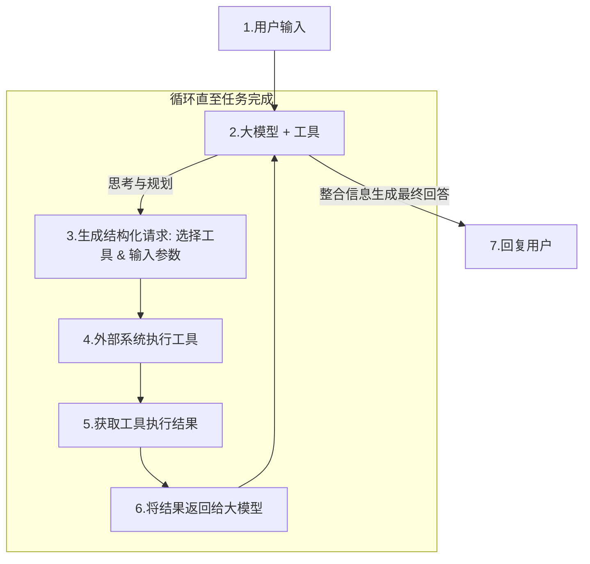
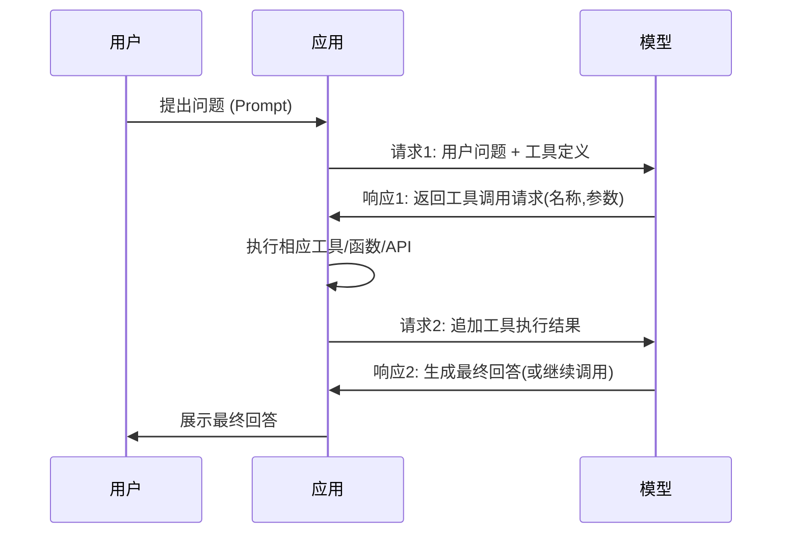

# 大模型工具/函数调用原理和实践
> [OpenAI最初在2023年6月13日](https://openai.com/index/function-calling-and-other-api-updates/)的更新中为Chat Completions模型引入了**Function calling（工具调用）**功能。随着技术发展，OpenAI已将Function calling升级为更通用的**Tool calling（工具调用）**机制，使模型能够调用更广泛的工具集。
>
> OpenAI当前的API设计中，functions参数已被tools参数取代，function_call参数也被tool_choice参数取代，体现了从单一工具调用向多功能工具调用的演进。
>
> 因为Function calling和Tool calling本质上是一样的，可以互换使用，所以这里为了方便，统一叫做工具调用。
>

最开始写这篇文章的标题是 “如何让大模型进行工具调用”，发现这个标题非常容易引起误解，虽然 "工具调用 "这个名称意味着模型直接执行某些操作，但实际上并非如此！模型只是根据传入的工具定义按照特定的格式返回需要调用的工具名称和工具调用入参，而工具的实际运行（或不运行）取决于用户**。**

大模型工具调用的核心原理是：**大模型本身并不直接执行代码或调用API，而是扮演一个“大脑”或“规划者”的角色。它理解用户的意图，规划需要执行的步骤，并生成结构化的请求，由外部系统（执行环境）来实际执行这些工具，最后将结果返回给模型进行总结和回复。**

## 为什么大模型需要工具调用能力
大语言模型（LLMs）是强大的工具，然而有时LLMs本身的能力不足以应对所有任务。

+ 一方面，LLMs存在固有的建模局限性。首先，它们无法了解训练数据之外的内容，包括训练结束后发生的新信息。此外，它们通过概率学习知识，这意味着对于具有固定规则的任务（例如数学计算），LLMs可能不够精确。
+ 另一方面，LLMs难以作为即插即用（Plug-and-Play）的服务与其他系统编程交互。LLMs主要通过开放性文本进行交流，而其他软件、应用程序或系统则通过预定义的、结构化的编程接口进行通信，两者之间存在语义和格式的鸿沟。

工具调用提供了"**使用工具行动的能力**"，使大模型从被动响应者转变为主动执行者。

工具调用是实现智能体(Agent)能力的关键技术：**Agent 智能体 = 大语言模型的推理能力 + 使用工具行动的能力。**

**工具调用通过标准化LLMs与外部系统的交互，弥补了LLMs的局限性，使其能够结合外部工具（如数据库、API、代码解释器）完成复杂任务，是构建AI应用的关键技术之一。**

## 工具调用核心架构与流程
一个典型的大模型工具调用系统遵循以下流程，这是一个经典的 **ReAct (Reason + Act)** 模式：




下图清晰地展示了大模型工具调用的交互和循环关系：



**流程说明**：

1. 用户向**应用**提出问题。
2. **应用**将问题和可供调用的工具列表一并发送给**模型**。
3. **模型**返回一个结构化的工具调用请求（例如，调用某个API并传入特定参数）。
4. **应用**接收该请求，并在其后台安全地执行指定的工具（如运行代码、查询数据库）。
5. **应用**将工具执行的结果作为新的消息上下文，再次发送给**模型**。
6. **模型**收到结果后，将其整合并生成面向用户的最终回答，返回给**应用**。
7. **应用**将最终回答呈现给用户。

这个过程的核心在于**模型负责决策和规划**，而**应用负责信任执行和安全保障**，两者通过结构化数据紧密协作。

## 实现工具调用的关键技术
### 1. 提示工程（Prompt Engineering）与思维链（CoT）
提示工程是最基础的方法，通过精心设计的提示词来引导模型。

**步骤：**
 1. **系统提示词（System Prompt）：** 在对话开始时，给模型一个明确的指令，定义它可以使用的工具列表、每个工具的功能、输入参数格式以及输出格式。
 2. **用户请求（User Query）：** 用户提出自然语言请求。
 3. **模型响应（Model Response）：** 模型根据提示词，生成一个结构化的响应（如JSON格式），指明要调用哪个工具以及参数是什么。
 4. **外部执行：** 你的应用程序**解析模型的响应**，调用相应的API或函数。
 5. **结果返回：** 将API返回的结果再次提供给模型，让模型生成最终的用户回复。

**示例提示词：**

```plain
你是一个有帮助的AI助手，你可以通过以下工具来帮助用户：
- get_current_weather(location: string): 获取指定城市的当前天气。
- send_email(to: string, subject: string, body: string): 发送电子邮件。

请根据用户请求，决定是否需要调用工具。如果需要，请严格按照以下JSON格式回复：
{"tool": "tool_name", "parameters": {"arg1": "value1", "arg2": "value2"}}

如果不需要调用工具，请直接回复用户。

用户请求：<用户的输入>
```

对于不支持函数调用的模型可以尝试使用提示工程实现工具调用，但是使用提示工程有如下**缺点**：

+ **提示词长度限制**：如果函数数量非常多、描述非常复杂，可能会占用大量 Token，甚至超出模型的上下文窗口。
+ **可靠性问题**：模型的输出可能存在格式错误或偏差，需要强大的后处理（解析、重试）逻辑来保证稳定性。
+ **依赖基础模型能力**：如果基础模型本身逻辑或指令遵循能力不强，效果会大打折扣。
+ **潜在延迟**：复杂的提示词可能会导致更长的生成时间。

### 2. 函数调用（Function Calling） - 当前的主流方式
OpenAI、Qwen、deepeek 等主流厂商在其API中直接内置了此功能，极大地简化了流程。

**工作原理：**
  1. **定义函数：** 开发者向模型的API调用（如 `ChatCompletions`）提交一个列表，其中详细描述了可用函数的名称、描述、参数（遵循[JSON Schema](https://json-schema.org/)格式）。
  2. **模型决策：** 模型分析用户输入，决定是否调用函数。
      * 如果不需要调用，则正常回复。
      * 如果需要调用，则**返回一个结构化的JSON对象**，其中包含需要调用的函数名和具体的参数。
  3. **执行函数：** 你的代码解析这个JSON对象，在你的服务器上调用相应的函数。
  4. **提交结果：** 你将函数的执行结果再次提交给模型的API，模型会汇总结果并生成最终的用户回复。

**优势：**
 - **标准化：** 提供了标准的、可靠的JSON输出，无需依赖不稳定的模型自由生成。
 - **高效：** 将“决策”和“回复生成”两步分开，流程更清晰。
 - **可靠：** 降低了提示词工程的需求和输出解析的难度。

因为这些模型经过了微调，既能检测何时需要调用工具（取决于用户的输入），又能使用符合工具定义的 JSON 进行响应。函数调用能力是大模型（如GPT）的一个重要特性，其原理大致如下：

+ 通过指令微调（instruction tuning）和强化学习（RLHF），模型被训练成能够根据用户指令生成工具调用的格式。
+ 模型本身并不真正执行函数，而是生成一个符合规范的工具调用请求，由外部系统执行。

训练大模型具有工具调用能力的数据集可以到 huggingface 的 dataset 中搜索 `function_call` ，可以看到很多开源的支持函数调用的数据集，这里以[Hermes Function-Calling V1](https://modelscope.cn/datasets/NousResearch/hermes-function-calling-v1)为例，查看一条单轮对话的工具调用训练数据示例如下：

```json
[
  {
    "from": "system",
    "value": "You are a function calling AI model. You are provided with function signatures within <tools> </tools> XML tags. You may call one or more functions to assist with the user query. Don't make assumptions about what values to plug into functions.\n<tools>\n[{'type': 'function', 'function': {'name': 'get_camera_live_feed', 'description': 'Retrieves the live feed from a specified security camera.', 'parameters': {'type': 'object', 'properties': {'camera_id': {'type': 'string', 'description': 'The unique identifier for the camera.'}, 'stream_quality': {'type': 'string', 'description': 'The desired quality of the live stream.', 'enum': ['720p', '1080p', '4k']}}, 'required': ['camera_id']}}}, {'type': 'function', 'function': {'name': 'list_all_cameras', 'description': 'Lists all the security cameras connected to the home network.', 'parameters': {'type': 'object', 'properties': {'include_offline': {'type': 'boolean', 'description': 'Whether to include cameras that are currently offline.', 'default': False}}, 'required': []}}}, {'type': 'function', 'function': {'name': 'record_camera_feed', 'description': 'Starts recording the live feed from a specified security camera.', 'parameters': {'type': 'object', 'properties': {'camera_id': {'type': 'string', 'description': 'The unique identifier for the camera.'}, 'duration': {'type': 'integer', 'description': 'The duration in minutes for which to record the feed.', 'default': 60}}, 'required': ['camera_id']}}}, {'type': 'function', 'function': {'name': 'get_recorded_feed', 'description': 'Retrieves a previously recorded feed from a specified security camera.', 'parameters': {'type': 'object', 'properties': {'camera_id': {'type': 'string', 'description': 'The unique identifier for the camera.'}, 'start_time': {'type': 'string', 'description': 'The start time of the recording to retrieve, in ISO 8601 format.'}, 'end_time': {'type': 'string', 'description': 'The end time of the recording to retrieve, in ISO 8601 format.'}}, 'required': ['camera_id', 'start_time', 'end_time']}}}, {'type': 'function', 'function': {'name': 'pan_tilt_camera', 'description': 'Controls the pan and tilt functions of a PTZ (Pan-Tilt-Zoom) security camera.', 'parameters': {'type': 'object', 'properties': {'camera_id': {'type': 'string', 'description': 'The unique identifier for the PTZ camera.'}, 'pan_angle': {'type': 'integer', 'description': 'The angle in degrees to pan the camera. Positive values pan right, negative values pan left.'}, 'tilt_angle': {'type': 'integer', 'description': 'The angle in degrees to tilt the camera. Positive values tilt up, negative values tilt down.'}}, 'required': ['camera_id', 'pan_angle', 'tilt_angle']}}}]\n</tools>\nFor each function call return a json object with function name and arguments within <tool_call> </tool_call> tags with the following schema:\n<tool_call>\n{'arguments': <args-dict>, 'name': <function-name>}\n</tool_call>\n"
  },
  {
    "from": "human",
    "value": "I've recently installed a new security system at my home, and I want to ensure everything is functioning as it should. Specifically, I'd like to start by checking the live feed from the camera located at the front door to monitor any activity. The camera has a unique identifier, which I've already configured to be \"front_door.\" I'd prefer to view the live stream in high definition, so a 1080p quality would be ideal. Could you please call the appropriate function to retrieve the live feed from my front door camera in 1080p quality and provide me with the link to the stream?\n\nFollowing this, I would also like to record the live feed from this camera for the next 30 minutes. This is to test the recording feature and to keep an archived copy for security purposes. Please initiate the recording function for the \"front_door\" camera with a recording duration of 30 minutes.\n\nLastly, as part of my routine surveillance checks, I need to review footage from yesterday between 3 PM and 5 PM. The camera \"front_garden\" should have the recording for that period. I need to retrieve this specific recorded feed. The start time for the recording was at 15:00 on April 22, 2023, and it ended at 17:00 on the same day.\n\nTo summarize, I request the execution of the following functions with the provided details:\n1. Retrieve the live feed from the \"front_door\" camera at 1080p quality.\n2. Start a 30-minute recording of the live feed from the \"front_door\" camera.\n3. Retrieve the recorded feed from the \"front_garden\" camera, focusing on the time period between 15:00 and 17:00 on April 22, 2023.\n\nThank you for assisting with the management of my home security camera feeds."
  },
  {
    "from": "gpt",
    "value": "<tool_call>\n{'arguments': {'camera_id': 'front_door', 'stream_quality': '1080p'}, 'name': 'get_camera_live_feed'}\n</tool_call>\n<tool_call>\n{'arguments': {'camera_id': 'front_door', 'duration': 30}, 'name': 'record_camera_feed'}\n</tool_call>\n<tool_call>\n{'arguments': {'camera_id': 'front_garden', 'start_time': '2023-04-22T15:00:00Z', 'end_time': '2023-04-22T17:00:00Z'}, 'name': 'get_recorded_feed'}\n</tool_call>\n"
  }
]
```

这个训练数据的结构是一个JSON数组，包含三个对象，分别对应系统提示、用户输入和模型输出。每个对象都有from和value字段。系统提示里详细列出了可用的函数及其参数，用户输入是一个具体的请求，要求执行三个函数调用，而模型输出则是三个函数调用的JSON结构。

**函数调用能力的训练通常需要模型学会识别何时需要调用函数，并正确生成对应的函数名和参数**。用户的数据中，系统提示部分已经明确提供了函数列表，这可能帮助模型在训练时理解可用的工具。用户输入中的详细描述和明确的步骤要求（如三个具体任务）有助于模型学习如何将自然语言指令映射到具体的函数调用。

模型输出中的每个函数调用都使用了自定义的XML标签（如<tool_call>和</tool_call>），并以JSON格式表示函数名和参数。这种结构化的输出有助于训练模型生成准确的函数调用，尤其是在监督学习阶段，模型可以学习到正确的格式和参数组合。

> 关于如何训练模型具有工具调用能力后续会写一篇文章详细介绍，请继续关注
>

**如何判断一个开源模型是否支持函数调用** 
除了查看模型的官方介绍之外，还可以通过查看模型文件`tokenizer_config.json`中的`chat_template`字段的内容，如果`chat_template`字段内容中有tool相关描述，则表示该模型支持函数调用。下面以deepseek的模型举例，查看[tokenizer_config.json](https://modelscope.cn/models/deepseek-ai/DeepSeek-V3.1/file/view/master/tokenizer_config.json?status=1)中的`chat_template`内容如下：

```json
{{ bos_token }}{{ ns.system_prompt }}{{'<｜User｜>' + message['content']}}{{'<｜Assistant｜></think>'}}{{'<｜tool▁calls▁begin｜><｜tool▁call▁begin｜>'+ tool['function']['name'] + '<｜tool▁sep｜>' + tool['function']['arguments'] + '<｜tool▁call▁end｜>'}}{{message['content'] + '<｜tool▁calls▁begin｜><｜tool▁call▁begin｜>' + tool['function']['name'] + '<｜tool▁sep｜>' + tool['function']['arguments'] + '<｜tool▁call▁end｜>'}}{{'<｜tool▁call▁begin｜>'+ tool['function']['name'] + '<｜tool▁sep｜>' + tool['function']['arguments'] + '<｜tool▁call▁end｜>'}}{{'<｜tool▁calls▁end｜><｜end▁of▁sentence｜>'}}{{'<｜Assistant｜>'}}{{'<think>'}}  {{'</think>'}}{{message['content'] + '<｜end▁of▁sentence｜>'}}{{content + '<｜end▁of▁sentence｜>'}}{{'<｜tool▁output▁begin｜>' + message['content'] + '<｜tool▁output▁end｜>'}}{{'<｜Assistant｜>'}}{{'</think>'}}{{'<think>'}}
```

## 工具调用定义
参考openai的工具调用接口，对于每个工具（tool）的定义，它是一个 JSON 对象，包含下面的字段：

1. **type**：一个字符串，指定工具的类型，目前仅支持 `"function"`。
1. **name**：一个字符串，表示函数的名称。
2. **description**：一个字符串，描述函数的用途。
3. **parameters**：一个 [**JSON Schema**](https://json-schema.org/)，定义函数接受的参数。具体编写方法可参考相关文档。需要注意的字段包括：
    - **type**：参数的数据类型（如 `string`、`integer` 等）。
    - **description：**参数描述
    - **required**：必填参数列表。
    - **enum**：枚举值（用于限定参数的取值范围）。

下面是get_weather函数的工具调用定义示例：

```json
{
    "type": "function",
    "name": "get_weather",
    "description": "Retrieves current weather for the given location.",
    "parameters": {
        "type": "object",
        "properties": {
            "location": {
                "type": "string",
                "description": "City and country e.g. Bogotá, Colombia"
            },
            "units": {
                "type": "string",
                "enum": ["celsius", "fahrenheit"],
                "description": "Units the temperature will be returned in."
            }
        },
        "required": ["location", "units"],
        "additionalProperties": false
    },
    "strict": true
}
```

**定义函数的最佳实践**  

1. **编写清晰详细的函数名称、参数描述和说明**  
    - 明确描述函数的用途、每个参数（及其格式）以及输出的含义
    - 使用系统提示描述何时（及何时不）使用每个函数，通常需要明确告知模型具体操作方式
    - 包含示例和边界情况，特别是纠正重复出现的错误（注意：添加示例可能影响推理模型的性能）
2. **应用软件工程最佳实践**  
    - 保持函数的直观性和易用性（遵循最小意外原则）
    - 使用枚举和对象结构避免无效状态（例如：toggle_light(on: bool, off: bool)可能导致无效调用）
    - 通过内部测试：如果仅凭提供给模型的信息，新手/人类是否能正确使用函数？（如果不能，他们会提出什么问题？将答案添加到提示中）
3. **减轻模型负担，尽可能使用代码处理**  
    - 避免让模型填写已知参数（例如：如果已通过先前菜单获取order_id，则不应设置order_id参数，而应通过无参数函数submit_refund()并通过代码传递order_id）
    - 合并总是按顺序调用的函数（例如：如果在query_location()后总是调用mark_location()，只需将标记逻辑移至查询函数中）
4. **保持函数数量较少以提高准确性**  
    - 评估不同函数数量下的性能
    - 建议同时使用的函数数量少于20个（此为软性建议）

**token使用**  
在底层，工具调用定义会以模型训练过的语法注入系统消息中，这意味着工具调用定义会计入模型的上下文限制，并作为输入token计费。如果遇到token限制，建议限制函数数量或缩短函数参数描述的长度。

如果在工具规范中定义了多个函数，也可以通过微调减少使用的token数量。

**总结**  
前面详细介绍了在API请求中定义函数的规范与最佳实践，核心要点包括：  

1. 函数通过JSON模式定义，需明确指定类型、名称、描述、参数  
2. 强调通过清晰描述、软件工程原则和代码辅助来优化函数设计  
3. 建议控制函数数量（<20个）
4. 函数定义会消耗上下文token，建议通过精简描述或微调来控制token用量

**关键实践建议：采用直观命名、规避无效状态、合并串联操作、优先代码逻辑处理已知参数，同时通过示例说明和系统提示提升模型调用准确性。**

## 工具调用实践【重点】
从前面工具调用定义可以知道，每个工具调用定义都是一个JSON对象，可以按照工具调用定义规定的格式手动编写这个JSON对象，但是手动定义非常繁琐，有没有工具可以自动生成工具调用的定义呢？

接下来将介绍一下使用 langchain 提供的工具实现工具调用的定义。

### 使用 LangChain 定义工具
在langchain中可以使用`@tool`装饰器创建工具，该装饰器简化了工具创建过程，支持以下功能：  

+ 自动推断工具的名称、描述和预期参数，同时支持自定义。  
+ 通过注入工具参数，从模式（以及模型）中隐藏输入参数。

**工具接口**  
工具接口在`BaseTool`类中定义，该类是`Runnable`接口的子类，关键属性包括：  

+ `name`：工具的名称。  
+ `description`：工具功能的描述。  
+ `args`：工具参数的JSON模式的属性。

与工具关联函数执行的关键方法包括：  

+ `invoke`：使用给定参数调用工具。  
+ `ainvoke`：异步调用工具（用于LangChain中的异步编程）。

#### 使用`@tool`装饰器创建工具
推荐使用`@tool`装饰器创建工具。该装饰器旨在简化工具创建过程，适用于大多数场景。定义函数后，可通过`@tool`装饰器将其转换为实现工具接口的工具。

```python
from langchain_core.tools import tool


@tool
def get_current_weather(location: str) -> str:
    """模拟获取天气的工具"""
    print(f"[模拟调用] 正在查询 {location} 的天气...")
    return f"{location}的天气是晴朗的，22摄氏度。"


# 获取工具调用的schema
tool_call_schema = get_current_weather.tool_call_schema.model_json_schema()
# 输出工具调用的schema
print(tool_call_schema)
```

在函数前面添加 `@tool`注解就可以生成工具调用的定义，输出如下：

```json
{
  "description": "模拟获取天气的工具",
  "properties": {
    "location": {
      "title": "Location",
      "type": "string"
    }
  },
  "required": [
    "location"
  ],
  "title": "get_current_weather",
  "type": "object"
}
```

可以看到使用`@tool`定义工具时，生成的工具调用的JSON对象和 openai 接口定义的工具对象字段不一样。

如果你的应用主要是使用的langchain生态，那么使用langchain提供的`@tool`定义工具更加方便。

#### 转换为OpenAI的工具定义
**因为我们在使用第三方模型提供的API服务时，这些服务基本都提供了 openai 接口兼容的调用方式，所以为了统一工具调用接口，可以使用下面的方式将一个函数转换为 openai 接口的工具定义。**

在langchian中提供了一个工具`from langchain_core.utils.function_calling import convert_to_openai_tool`，使用`convert_to_openai_tool`可以将一个函数转换为openai 的工具调用定义：

```python
import json
from langchain_core.utils.function_calling import convert_to_openai_tool

def get_current_weather(location: str) -> str:
    """模拟获取天气的工具"""
    print(f"[模拟调用] 正在查询 {location} 的天气...")
    return f"{location}的天气是晴朗的，22摄氏度。"


"""
convert_to_openai_tool() 将类工具对象转换为 OpenAI 工具模式。

OpenAI 工具模式参考：
https://platform.openai.com/docs/api-reference/chat/create#chat-create-tools

参数：
    tool:
        可以是字典、pydantic.BaseModel 类、Python 函数或 BaseTool。
        如果传入字典，则假设该字典已经是有效的 OpenAI 函数、
        包含顶级 'title' 键的 JSON 模式、Anthropic 格式工具，
        或 Amazon Bedrock Converse 格式工具。
    strict:
        如果为 True，则模型输出保证与函数定义中提供的 JSON 模式完全匹配。
        如果为 None，则不会在工具定义中包含 strict 参数。

返回：
    与传入工具兼容的 OpenAI 工具调用 API 的字典版本。

"""
openai_tool = convert_to_openai_tool(tool=get_current_weather)

result = json.dumps(openai_tool, ensure_ascii=False, indent=2)
print(result)

```

输出的工具调用如下：

```json
{
  "type": "function",
  "function": {
    "name": "get_current_weather",
    "description": "模拟获取天气的工具",
    "parameters": {
      "properties": {
        "location": {
          "type": "string"
        }
      },
      "required": [
        "location"
      ],
      "type": "object"
    }
  }
}
```


### 使用 LangChain 的实现示例
LangChain 的核心抽象极大地简化了工具调用的流程，我们将实现一个简单的天气查询和邮件发送工具。

+ 第 1 步：定义工具函数
+ 第 2 步：模型绑定工具
+ 第 3 步：向模型发送用户问题
+ 第 4 步：解析模型响应的输出 - 使用模型提供的参数执行工具调用
+ 第 5 步：向模型发送工具调用的结果，生成最终回复

#### 步骤 1: 定义工具函数
首先，我们定义两个简单的工具函数（在实际应用中，这些函数会调用真实的API）。

```python
# 假设的工具函数
def get_current_weather(location: str) -> str:
    """模拟获取天气的工具"""
    print(f"[模拟调用] 正在查询 {location} 的天气...")
    return f"{location}的天气是晴朗的，22摄氏度。"

def send_email(to: str, subject: str, body: str) -> str:
    """模拟发送邮件的工具"""
    print(f"[模拟调用] 正在发送邮件给 {to}...")
    print(f"主题: {subject}")
    print(f"内容: {body}")
    return f"邮件已成功发送至 {to}。"

# 创建工具列表
tools = [get_current_weather, send_email]

# 定义一个工具工厂，后续通过名称调用工具
tool_factory = {
    "get_current_weather": get_current_weather,
    "send_email": send_email
}

```

#### 步骤 2: 模型绑定工具（Agent）
模型绑定工具时，需要选择支持函数/工具调用的模型。这里使用`langchain_litellm`负责理解用户指令、选择工具、生成输入参数。

```python
import os
from langchain_litellm import ChatLiteLLM
from langchain_core.language_models.chat_models import BaseChatModel

model_config_dict = {
    "bailing_80b_function_call": {
        "model": "openai/bailing_80b_function_call",
        "base_url": "https://antchat.alipay.com/v1",
        "api_key": os.getenv("BAILING_API_KEY"),
    },
    "deepseek-chat": {
        "model": "openai/deepseek-chat",
        "base_url": "https://api.deepseek.com/v1",
        "api_key": os.getenv("DEEPSEEK_API_KEY"),
    },
}

# 为了更好的支持其他模型和langchain集成，这里使用 langchain_litellm 的 ChatLiteLLM 实现模型调用，而不是 init_chat_model
# 参考：https://python.langchain.com/docs/integrations/chat/litellm/
def create_llm_chat(model: str = "deepseek-chat") -> BaseChatModel:
    model_config = model_config_dict.get(model)

    llm = ChatLiteLLM(
        model=model_config.get('model'),
        api_base=model_config.get('base_url'),
        api_key=model_config.get('api_key'),
    )
    return llm

llm =  create_llm_chat("bailing_80b_function_call")
# 其内部使用 convert_to_openai_tool 工具将函数转换为 openai 的工具定义
agent = llm.bind_tools(tools=tools)

```

#### 步骤 3: 解析并调用工具
现在，我们可以向 agent 提出复杂的、需要组合工具的请求了。这里使用`langchain`负责处理模型选择的工具和生成的输入参数、执行工具并解析结果。

> 关于 litellm 的工具调用说明，参考文档：[https://docs.litellm.ai/docs/completion/function_call](https://docs.litellm.ai/docs/completion/function_call)
>
> 关于 langchian 的工具调用说明，参考文档：[https://python.langchain.com/docs/how_to/function_calling](https://python.langchain.com/docs/how_to/function_calling/)
>

##### 示例 1: 简单工具调用
```python
# 示例 1: 简单工具调用
query = "北京的天气怎么样？"
print(f'示例一：{query}')
# 调用 agent
response = agent.invoke(query)
tool_calls = response.tool_calls
print(f"工具调用列表: {tool_calls}")
# 检查是否有工具调用
if tool_calls:
    for tool_call in tool_calls:
        print(f"执行工具调用: {tool_call}")
        function_name = tool_call.get("name")
        function_args = tool_call.get("args")

        function_to_call = tool_factory[function_name]
        if function_to_call is None:
            print(f"工具 {function_name} 不存在")
            continue
        function_response = function_to_call(**function_args)

        print(f"工具响应: {function_response}")


```

输出结果如下：

```python
示例一：北京的天气怎么样？
工具调用列表: [{'name': 'get_current_weather', 'args': {'location': '北京'}, 'id': 'fc-07ec4672-6865-4f67-a6cb-3971bb17fc3e', 'type': 'tool_call'}]
执行工具调用: {'name': 'get_current_weather', 'args': {'location': '北京'}, 'id': 'fc-07ec4672-6865-4f67-a6cb-3971bb17fc3e', 'type': 'tool_call'}
[模拟调用] 正在查询 北京 的天气...
工具响应: 北京的天气是晴朗的，22摄氏度。
```

##### 示例 2: 需要推理的并行工具调用
> 并行工具调用是模型在一轮对话中返回多个工具调用，客户端能够同时执行多个函数调用，允许并行解析这些函数调用的结果
>
> **并行工具调用需要大模型支持**，在 openai 的接口中通过 `parallel_tool_calls`参数控制是否开启并行工具调用
>
> 参考文档：[https://docs.litellm.ai/docs/completion/input](https://docs.litellm.ai/docs/completion/input)
>

接下来介绍一下并行工具调用，问题如下：

```python
给tom@example.com发一封邮件，祝他生日快乐，主题写'生日快乐'，同时查一下北京的天气
```

分析前面的问题，可以知道该问题需要调用两个工具： `get_current_weather`和`send_email`，这两个工具互不影响可以同时调用，因此可以考虑使用并行工具调用。

开启并行工具调用的方法：

1. 检查模型是否支持并行工具调用
2. 如果模型支持并行工具调用，那么需要设置模型调用参数`<font style="color:rgb(28, 30, 33);background-color:rgb(246, 247, 248);">parallel_tool_calls=True`

因为在这里使用的是`langchain_litellm`，这个工具是对 `litellm` 进行了封装以无缝集成 `langchain`，下面演示如何配置使用 `langchain_litellm`开启并行工具调用：

```python
def create_llm_chat(model: str = "deepseek-chat") -> BaseChatModel:
    model_config = model_config_dict.get(model)

    llm = ChatLiteLLM(
        model=model_config.get('model'),
        api_base=model_config.get('base_url'),
        api_key=model_config.get('api_key'),
        model_kwargs={
            "parallel_tool_calls": True,
        }
    )
    return llm
```

需要在创建 `ChatLiteLLM`实例时，配置`model_kwargs`参数为 `{"parallel_tool_calls": True}`,然后调用模型，示例如下：

```python
# 示例 2: 需要推理的并行工具调用
query2 = "给tom@example.com发一封邮件，祝他生日快乐，主题写'生日快乐'，同时查一下北京的天气"
print(f'示例二：{query2}')
response = agent.invoke(query2)
tool_calls = response.tool_calls
print(f"工具调用列表: {tool_calls}")
if tool_calls:
    for tool_call in tool_calls:
        print(f"执行工具调用: {tool_call}")
        function_name = tool_call.get("name")
        function_args = tool_call.get("args")

        function_to_call = tool_factory[function_name]
        if function_to_call is None:
            print(f"工具 {function_name} 不存在")
            continue
        function_response = function_to_call(**function_args)

        print(f"工具响应: {function_response}")
```

**没有开启并行工具调用输出结果如下**：

```python
示例二：给tom@example.com发一封邮件，祝他生日快乐，主题写'生日快乐'，同时查一下北京的天气
工具调用列表: [{'name': 'get_current_weather', 'args': {'location': '北京'}, 'id': 'fc-5e439bb0-07f3-4bce-b73e-90e7776879a8', 'type': 'tool_call'}]
执行工具调用: {'name': 'get_current_weather', 'args': {'location': '北京'}, 'id': 'fc-5e439bb0-07f3-4bce-b73e-90e7776879a8', 'type': 'tool_call'}
[模拟调用] 正在查询 北京 的天气...
工具响应: 北京的天气是晴朗的，22摄氏度。
```

**开启并行工具调用输出结果如下**：

```python
示例二：给tom@example.com发一封邮件，祝他生日快乐，主题写'生日快乐'，同时查一下北京的天气
工具调用列表: [{'name': 'send_email', 'args': {'to': 'tom@example.com', 'subject': '生日快乐', 'body': '祝你生日快乐！'}, 'id': 'fc-d333c46b-9a44-4e67-b45e-c57f3d765999', 'type': 'tool_call'}, {'name': 'get_current_weather', 'args': {'location': '北京'}, 'id': 'fc-04b118f7-f8b6-4405-8a2b-965d37fe956c', 'type': 'tool_call'}]
执行工具调用: {'name': 'send_email', 'args': {'to': 'tom@example.com', 'subject': '生日快乐', 'body': '祝你生日快乐！'}, 'id': 'fc-d333c46b-9a44-4e67-b45e-c57f3d765999', 'type': 'tool_call'}
[模拟调用] 正在发送邮件给 tom@example.com...
主题: 生日快乐
内容: 祝你生日快乐！
工具响应: 邮件已成功发送至 tom@example.com。
执行工具调用: {'name': 'get_current_weather', 'args': {'location': '北京'}, 'id': 'fc-04b118f7-f8b6-4405-8a2b-965d37fe956c', 'type': 'tool_call'}
[模拟调用] 正在查询 北京 的天气...
工具响应: 北京的天气是晴朗的，22摄氏度。
```

开启并行工具调用后，模型在一轮对话中返回了多个工具调用，用户可以同时执行对应的工具调用。

##### 示例 3: 另一个组合任务
接下来介绍一下串行工具调用，问题如下：

```python
查一下巴黎的天气，然后写一封邮件给alice@example.com，告诉她天气情况，主题就叫'巴黎天气简报'。
```

分析该问题，可以知道需要串行调用两个工具：先调用`get_current_weather`，然后将`get_current_weather`的调用结果作为参数传给 `send_email`工具，所以我们在调用过程中需要将每一步调用的结果记录下来，可以定义一个`messages`列表用来记录所有的消息，代码实现如下：

```python
# 示例 3: 另一个组合任务
query3 = "查一下巴黎的天气，然后写一封邮件给alice@example.com，告诉她天气情况，主题就叫'巴黎天气简报'。"
print(f'示例三：{query3}')
messages: list[BaseMessage] = [HumanMessage(query3)]
response = agent.invoke(query3)
messages.append(response)

last_massage = messages[-1]
# 检查最后一个消息是否有工具调用
while last_massage.tool_calls:
    tool_calls = last_massage.tool_calls
    print(f"工具调用列表: {tool_calls}")
    for tool_call in tool_calls:
        print()
        print(f"执行工具调用: {tool_call}")
        function_name = tool_call.get("name")
        function_args = tool_call.get("args")

        function_to_call = tool_factory[function_name]
        if function_to_call is None:
            print(f"工具 {function_name} 不存在")
            continue
        function_response = function_to_call(**function_args)
        print(f"工具响应: {function_response}")
        # 如果我们使用模型生成的工具调用来实际调用工具并希望将工具结果传递回模型，则可以使用 ToolMessages 来实现。
        messages.append(ToolMessage(content=function_response, tool_call_id=tool_call["id"]))

    response = agent.invoke(messages)
    messages.append(response)
    last_massage = messages[-1]

print(f"消息列表: {messages}")
print(f'最终响应: {last_massage.content}')
```

输出结果如下：

```python
示例三：查一下巴黎的天气，然后写一封邮件给alice@example.com，告诉她天气情况，主题就叫'巴黎天气简报'。
工具调用列表: [{'name': 'get_current_weather', 'args': {'location': 'Paris'}, 'id': 'fc-dcf08102-877d-411f-b4a7-61e409b91c9f', 'type': 'tool_call'}]

执行工具调用: {'name': 'get_current_weather', 'args': {'location': 'Paris'}, 'id': 'fc-dcf08102-877d-411f-b4a7-61e409b91c9f', 'type': 'tool_call'}
[模拟调用] 正在查询 Paris 的天气...
工具响应: Paris的天气是晴朗的，22摄氏度。
工具调用列表: [{'name': 'send_email', 'args': {'to': 'alice@example.com', 'subject': '巴黎天气简报', 'body': '亲爱的Alice，\n根据我查询到的最新信息，巴黎现在是晴朗的天气，气温是22摄氏度。希望这能帮助你做好出行准备。\n祝好，\n你的助手'}, 'id': 'fc-d6331298-76db-4ea0-b65e-7676ac352585', 'type': 'tool_call'}]

执行工具调用: {'name': 'send_email', 'args': {'to': 'alice@example.com', 'subject': '巴黎天气简报', 'body': '亲爱的Alice，\n根据我查询到的最新信息，巴黎现在是晴朗的天气，气温是22摄氏度。希望这能帮助你做好出行准备。\n祝好，\n你的助手'}, 'id': 'fc-d6331298-76db-4ea0-b65e-7676ac352585', 'type': 'tool_call'}
[模拟调用] 正在发送邮件给 alice@example.com...
主题: 巴黎天气简报
内容: 亲爱的Alice，
根据我查询到的最新信息，巴黎现在是晴朗的天气，气温是22摄氏度。希望这能帮助你做好出行准备。
祝好，
你的助手
工具响应: 邮件已成功发送至 alice@example.com。
消息列表: 
[HumanMessage(content="查一下巴黎的天气，然后写一封邮件给alice@example.com，告诉她天气情况，主题就叫'巴黎天气简报'。", additional_kwargs={}, response_metadata={}), 
AIMessage(content='', additional_kwargs={'tool_calls': [ChatCompletionMessageToolCall(function=Function(arguments='{"location": "Paris"}', name='get_current_weather'), id='fc-dcf08102-877d-411f-b4a7-61e409b91c9f', type='function')]}, response_metadata={'token_usage': Usage(completion_tokens=21, prompt_tokens=781, total_tokens=802, completion_tokens_details=None, prompt_tokens_details=None), 'model': 'openai/bailing_80b_function_call', 'finish_reason': 'tool_calls', 'model_name': 'openai/bailing_80b_function_call'}, id='run--e10556e4-4b94-4e25-bef8-a51bc11c3226-0', tool_calls=[{'name': 'get_current_weather', 'args': {'location': 'Paris'}, 'id': 'fc-dcf08102-877d-411f-b4a7-61e409b91c9f', 'type': 'tool_call'}], usage_metadata={'input_tokens': 781, 'output_tokens': 21, 'total_tokens': 802}), 
ToolMessage(content='Paris的天气是晴朗的，22摄氏度。', tool_call_id='fc-dcf08102-877d-411f-b4a7-61e409b91c9f'), 
AIMessage(content='\n', additional_kwargs={'tool_calls': [ChatCompletionMessageToolCall(function=Function(arguments='{"to": "alice@example.com", "subject": "巴黎天气简报", "body": "亲爱的Alice，\\n根据我查询到的最新信息，巴黎现在是晴朗的天气，气温是22摄氏度。希望这能帮助你做好出行准备。\\n祝好，\\n你的助手"}', name='send_email'), id='fc-d6331298-76db-4ea0-b65e-7676ac352585', type='function')]}, response_metadata={'token_usage': Usage(completion_tokens=74, prompt_tokens=838, total_tokens=912, completion_tokens_details=None, prompt_tokens_details=None), 'model': 'openai/bailing_80b_function_call', 'finish_reason': 'tool_calls', 'model_name': 'openai/bailing_80b_function_call'}, id='run--d37b2a21-1b9d-43d7-8dcd-3db39d2a362f-0', tool_calls=[{'name': 'send_email', 'args': {'to': 'alice@example.com', 'subject': '巴黎天气简报', 'body': '亲爱的Alice，\n根据我查询到的最新信息，巴黎现在是晴朗的天气，气温是22摄氏度。希望这能帮助你做好出行准备。\n祝好，\n你的助手'}, 'id': 'fc-d6331298-76db-4ea0-b65e-7676ac352585', 'type': 'tool_call'}], usage_metadata={'input_tokens': 838, 'output_tokens': 74, 'total_tokens': 912}), 
ToolMessage(content='邮件已成功发送至 alice@example.com。', tool_call_id='fc-d6331298-76db-4ea0-b65e-7676ac352585'), AIMessage(content="邮件已成功发送至Alice的邮箱，主题为'巴黎天气简报'，内容包含当前巴黎的天气情况。感谢您的查询，祝您有美好的一天！", additional_kwargs={}, response_metadata={'token_usage': Usage(completion_tokens=33, prompt_tokens=1198, total_tokens=1231, completion_tokens_details=None, prompt_tokens_details=None), 'model': 'openai/bailing_80b_function_call', 'finish_reason': 'stop', 'model_name': 'openai/bailing_80b_function_call'}, id='run--d833972f-7eaf-48ff-8578-95ea769142b8-0', usage_metadata={'input_tokens': 1198, 'output_tokens': 33, 'total_tokens': 1231})]
最终响应: 邮件已成功发送至Alice的邮箱，主题为'巴黎天气简报'，内容包含当前巴黎的天气情况。感谢您的查询，祝您有美好的一天！
```

#### 步骤 4: 生成最终回复
如果我们使用模型生成的工具调用来实际调用工具，并希望将工具结果传递回模型，则可以使用 `ToolMessages` 来实现。我们需要定义定义一个`messages`列表用来记录所有的消息，并且将 `ToolMessages`放在消息列表中，使用 `messages`列表再次调用模型获取最终的回复，代码可以参考前面示例3。

#### 完整代码
```python
import os
from langchain_litellm import ChatLiteLLM
from langchain_core.language_models.chat_models import BaseChatModel
from langchain_core.messages import ToolMessage, HumanMessage, BaseMessage

from dotenv import load_dotenv
load_dotenv()


# 假设的工具函数
def get_current_weather(location: str) -> str:
    """模拟获取天气的工具"""
    print(f"[模拟调用] 正在查询 {location} 的天气...")
    return f"{location}的天气是晴朗的，22摄氏度。"

def send_email(to: str, subject: str, body: str) -> str:
    """模拟发送邮件的工具"""
    print(f"[模拟调用] 正在发送邮件给 {to}...")
    print(f"主题: {subject}")
    print(f"内容: {body}")
    return f"邮件已成功发送至 {to}。"


# 创建工具列表
tools = [get_current_weather, send_email]

# 定义一个工具工厂，后续通过名称调用工具
tool_factory = {
    "get_current_weather": get_current_weather,
    "send_email": send_email
}


model_config_dict = {
    "bailing_80b_function_call": {
        "model": "openai/bailing_80b_function_call",
        "base_url": "https://antchat.alipay.com/v1",
        "api_key": os.getenv("BAILING_API_KEY"),
    },
    "deepseek-chat": {
        "model": "openai/deepseek-chat",
        "base_url": "https://api.deepseek.com/v1",
        "api_key": os.getenv("DEEPSEEK_API_KEY"),
    },
}

# 为了更好的支持其他模型和langchain集成，这里使用 langchain_litellm 的 ChatLiteLLM 实现模型调用，而不是 init_chat_model
# 参考：https://python.langchain.com/docs/integrations/chat/litellm/
def create_llm_chat(model: str = "deepseek-chat") -> BaseChatModel:
    model_config = model_config_dict.get(model)

    llm = ChatLiteLLM(
        model=model_config.get('model'),
        api_base=model_config.get('base_url'),
        api_key=model_config.get('api_key'),
        model_kwargs={
            "parallel_tool_calls": True,
        }
    )
    return llm

llm =  create_llm_chat("bailing_80b_function_call")

agent = llm.bind_tools(tools=tools)

if __name__ == '__main__':

    # 示例 1: 简单工具调用
    # query = "北京的天气怎么样？"
    # 示例 2: 需要推理的并行工具调用
    query = "给tom@example.com发一封邮件，祝他生日快乐，主题写'生日快乐'，同时查一下北京的天气"
    # 示例 3: 另一个组合任务
    # query = "查一下巴黎的天气，然后写一封邮件给alice@example.com，告诉她天气情况，主题就叫'巴黎天气简报'。"
    print(f'示例：{query}')
    messages: list[BaseMessage] = [HumanMessage(query)]
    response = agent.invoke(query)
    messages.append(response)

    last_massage = messages[-1]
    # 检查最后一个消息是否有工具调用
    while last_massage.tool_calls:
        tool_calls = last_massage.tool_calls
        print(f"工具调用列表: {tool_calls}")
        for tool_call in tool_calls:
            print()
            print(f"执行工具调用: {tool_call}")
            function_name = tool_call.get("name")
            function_args = tool_call.get("args")

            function_to_call = tool_factory[function_name]
            if function_to_call is None:
                print(f"工具 {function_name} 不存在")
                continue
            function_response = function_to_call(**function_args)
            print(f"工具响应: {function_response}")
            # 如果我们使用模型生成的工具调用来实际调用工具并希望将工具结果传递回模型，则可以使用 ToolMessages 来实现。
            messages.append(ToolMessage(content=function_response, tool_call_id=tool_call["id"]))

        response = agent.invoke(messages)
        messages.append(response)
        last_massage = messages[-1]

    print(f"消息列表: {messages}")
    print(f'最终响应: {last_massage.content}')
    import time

    time.sleep(5)
```

## 总结
通过以上步骤，我们实现了一个简单的工具调用和组合任务的示例。这个示例展示了如何使用 LangChain 和 LiteLLM 来创建一个能够理解自然语言并执行相应操作的智能助手。


参考文档

+ [https://qwen.readthedocs.io/en/latest/framework/function_call.html](https://qwen.readthedocs.io/en/latest/framework/function_call.html)
+ [https://platform.openai.com/docs/guides/function-calling](https://platform.openai.com/docs/guides/function-calling)
+ [https://python.langchain.com/docs/how_to/tool_calling/](https://python.langchain.com/docs/how_to/tool_calling/)
+ [https://python.langchain.com/docs/how_to/function_calling/](https://python.langchain.com/docs/how_to/function_calling/)
+ [https://python.langchain.com/docs/how_to/custom_tools/](https://python.langchain.com/docs/how_to/custom_tools/)
+ [https://python.langchain.com/docs/concepts/tools/](https://python.langchain.com/docs/concepts/tools/)


