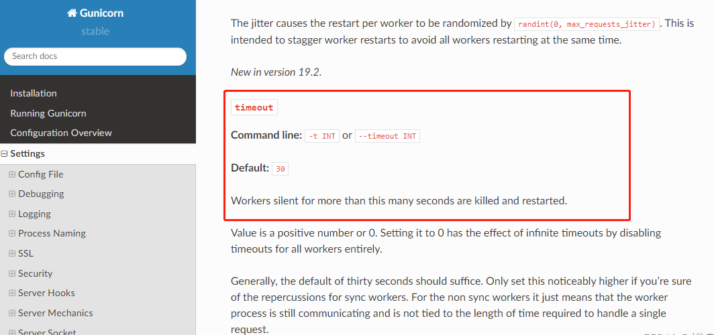

# gunicorn 超时报错：[1] [CRITICAL] WORKER TIMEOUT 解决

# 一. 问题描述
在使用 Gunicorn +  flask 搭建的一个 web 项目中，由于使用了机器学习模型，在第一次请求接口的时候需要加载模型，在本地运行的时候加载模型很快所以正常运行，将应用使用 docker 的方式部署到服务器上面（模型是通过 volume 的方式挂载到容器中的）， 第一次请求加载模型耗时比较长，报出如下错误：

```python
[2021-09-11 07:22:33 +0000] [1] [CRITICAL] WORKER TIMEOUT (pid:12)
[2021-09-11 07:22:35 +0000] [12] [INFO] Worker exiting (pid: 12)
```
> Gunicorn 'Green Unicorn'是UNIX的Python WSGI HTTP服务器。它是一个从Ruby的Unicorn项目移植过来的预分叉worker模型。Gunicorn服务器广泛兼容各种web框架，实现简单，服务器资源使用少，速度相当快。
# 二. 原因分析
从报错信息可以看出，gunicorn 的 worker 进程超时导致进程退出重启。
查阅 gunicorn 官方文档，有下图所示的描述：


**翻译如下：**

`timeout`

**命令行**：`-t INT 或 --timeout INT`

**默认**： `30`

默认超过这么多秒的 worker 进程将被杀死并重新启动。

值为正数或 0。将其设置为 0 会通过完全禁用所有 worker 的超时来实现无限超时。

通常，默认值 30 秒就足够了。如果您确定对同步 worker 的影响，则仅将此设置更高。对于非同步 worker，这仅意味着工作进程仍在通信，并且与处理单个请求所需的时间长度无关。

# 三. 解决方法

从官网的文档说明我们可以知道，gunicorn 默认的超时时间为 30s ，如果超过 30s，则 worker 进程将被杀死并重新启动。

所以解决这个问题只需要设置较大的超时时间即可：

1. 使用 `gunicorn` 的命令行设置超时时间

   ```sh
   gunicorn -w 2 -b 0.0.0.0:4343  manage:app --timeout 120 
   ```

   在 gunicorn 的启动命令中加上：`--timeout 120`  表示超时时间设置为 120 秒。

2. 在 `gunicorn` 的配置文件 `gunicorn.conf.py` 文件中配置超时时间

   ```sh
   workers = 4  # 定义同时开启的处理请求的进程数量，根据网站流量适当调整
   worker_class = "gevent"  # 采用gevent库，支持异步处理请求，提高吞吐量
   bind = "0.0.0.0:8500"  # 监听IP放宽，以便于Docker之间、Docker和宿主机之间的通信
   timeout = 120  # 设置超时时间为 120 秒
   ```

   > 关于  `gunicorn.conf.py` 文件的更多配置查看[官网](https://docs.gunicorn.org/en/stable/settings.html#config)


参考文档：
[gunicorn 官方文档](https://docs.gunicorn.org/en/stable/settings.html)
[gunicorn服务器gunicorn_conf.py常用配置详解](http://www.04007.cn/article/945.html)