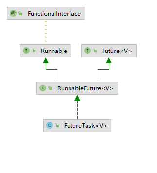

#  Java 中如何实现线程间通信

> 世界以痛吻我，要我报之以歌 —— 泰戈尔《飞鸟集》

虽然通常每个子线程只需要完成自己的任务，但是有时我们希望多个线程一起工作来完成一个任务，这就涉及到线程间通信。

关于线程间通信本文涉及到的方法和类包括：`thread.join()`、`object.wait()`、`object.notify()`、`CountdownLatch`、`CyclicBarrier`、`FutureTask`、`Callable`。

接下来将用几个例子来介绍如何在Java中实现线程间通信：

1. **如何让两个线程依次执行，即一个线程等待另一个线程执行完成后再执行？**
2. **如何让两个线程以指定的方式有序相交执行？**
3. **有四个线程：A、B、C、D，如何实现 D 在 A、B、C 都同步执行完毕后执行？**
4. **三个运动员分开准备，然后在每个人准备好后同时开始跑步。**
5. **子线程完成任务后，将结果返回给主线程。**

# 1. 如何让两个线程依次执行？

假设有两个线程：A 和 B，这两个线程都可以按照顺序打印数字，代码如下：

```java
public class Test01 {

    public static void main(String[] args) throws InterruptedException {
        demo1();
    }

    public static void demo1() {
        Thread a = new Thread(() -> {
            printNumber("A");
        });

        Thread b = new Thread(() -> {
            printNumber("B");
        });

        a.start();
        b.start();
    }

    public static void printNumber(String threadName) {
        int i = 0;
        while (i++ < 3) {
            try {
                Thread.sleep(100);
            } catch (InterruptedException e) {
                e.printStackTrace();
            }
            System.out.println(threadName + " print: " + i);
        }
    }

}

```

得到的结果如下：

```java
A print: 1
B print: 1
B print: 2
A print: 2
A print: 3
B print: 3
```

可以看到 A 和 B 同时打印数字，如果我们希望 B 在 A 执行完成之后开始执行，那么可以使用 `thread.join()` 方法实现，代码如下：

```java
public static void demo2() {
    Thread a = new Thread(() -> {
        printNumber("A");
    });

    Thread b = new Thread(() -> {
        System.out.println("B 等待 A 执行");
        try {
            a.join();
        } catch (InterruptedException e) {
            e.printStackTrace();
        }
        printNumber("B");
    });

    a.start();
    b.start();
}

```

得到的结果如下：

```java
B 等待 A 执行
A print: 1
A print: 2
A print: 3
B print: 1
B print: 2
B print: 3
```

我们可以看到该 `a.join()` 方法会让 B 等待 A 完成打印。

`thread.join()` 方法的作用就是阻塞当前线程，等待调用 `join()` 方法的线程执行完毕后再执行后面的代码。

查看 `join()` 方法的源码，内部是调用了 `join(0)` ，如下：

```java
public final void join() throws InterruptedException {
    join(0);
}
```

查看 `join(0)` 的源码如下：

```java
// 注意这里使用了 sychronized 加锁，锁对象是线程的实例对象
public final synchronized void join(long millis) throws InterruptedException {
    long base = System.currentTimeMillis();
    long now = 0;

    if (millis < 0) {
        throw new IllegalArgumentException("timeout value is negative");
    }
	// 调用 join(0) 执行下面的代码
    if (millis == 0) {
        // 这里使用 while 循环的目的是为了避免虚假唤醒
        // 如果当前线程存活则调用 wait(0), 0 表示永久等待，直到调用 notifyAll() 或者 notify() 方法
        // 当线程结束的时候会调用 notifyAll() 方法
        while (isAlive()) {
            wait(0);
        }
    } else {
        while (isAlive()) {
            long delay = millis - now;
            if (delay <= 0) {
                break;
            }
            wait(delay);
            now = System.currentTimeMillis() - base;
        }
    }
}
```

从源码中可以看出 `join(long millis)` 方法是通过 `wait(long timeout)` （`Object` 提供的方法）方法实现的，调用 `wait` 方法之前，当前线程必须获得对象的锁，所以此 `join` 方法使用了 `synchronized` 加锁，锁对象是线程的实例对象。其中 `wait(0)`方法会让当前线程阻塞等待，直到另一个线程调用**此对象**的 `notify()` 或者 `notifyAll()` 方法才会继续执行。当调用 `join` 方法的线程结束的时候会调用 `notifyAll()` 方法，所以 `join()` 方法可以实现一个线程等待另一个调用 `join()` 的线程结束后再执行。


> **虚假唤醒**：一个线程在没有被通知、中断、超时的情况下被唤醒；
>
> 虚假唤醒可能导致条件不成立的情况下执行代码，破坏被锁保护的约束关系；
>
> 为什么使用 while 循环来避免**虚假唤醒**：
>
> 在 if 块中使用 wait 方法，是非常危险的，因为一旦线程被唤醒，并得到锁，就不会再判断 if 条件而执行 if 语句块外的代码，所以建议凡是先要做条件判断，再 wait 的地方，都使用 while 循环来做，循环会在等待之前和之后对条件进行测试。


# 2. 如何让两个线程按照指定的方式有序相交？

如果现在我们希望 B线程在 A 线程打印 1 后立即打印 1，2，3，然后 A 线程继续打印 2，3，那么我们需要更细粒度的锁来控制执行顺序。

在这里，我们可以利用 `object.wait()` 和 `object.notify()` 方法，代码如下：

```java
public static void demo3() {
    Object lock = new Object();
    Thread A = new Thread(() -> {
        synchronized (lock) {
            System.out.println("A 1");
            try {
                lock.wait();
            } catch (InterruptedException e) {
                e.printStackTrace();
            }
            System.out.println("A 2");
            System.out.println("A 3");
        }
    });

    Thread B = new Thread(() -> {
        synchronized (lock) {
            System.out.println("B 1");
            System.out.println("B 2");
            System.out.println("B 3");
            lock.notify();
        }
    });

    A.start();
    B.start();
}
```

得到的结果如下：

```java
A 1
B 1
B 2
B 3
A 2
A 3
```

上述代码的执行流程如下：

1. 首先我们创建一个由 A 和 B 共享的对象锁： `lock = new Object()`;
2. 当A拿到锁时，先打印1，然后调用`lock.wait()`方法进入等待状态，然后交出锁的控制权；
3. B 不会被执行，直到 A 调用该`lock.wait()`方法释放控制权并且 B 获得锁；
4. B拿到锁后打印1，2，3，然后调用`lock.notify()`方法唤醒正在等待的A；
5. A 唤醒后继续打印剩余的 2，3。

为了便于理解，我将上面的代码添加了日志，代码如下：

```java
public static void demo3() {
    Object lock = new Object();
    Thread A = new Thread(() -> {
        System.out.println("INFO：A 等待获取锁");
        synchronized (lock) {
            System.out.println("INFO：A 获取到锁");
            System.out.println("A 1");
            try {
                System.out.println("INFO：A 进入 waiting 状态，放弃锁的控制权");
                lock.wait();
            } catch (InterruptedException e) {
                e.printStackTrace();
            }
            System.out.println("INFO：A 被 B 唤醒继续执行");
            System.out.println("A 2");
            System.out.println("A 3");
        }
    });

    Thread B = new Thread(() -> {
        System.out.println("INFO：B 等待获取锁");
        synchronized (lock) {
            System.out.println("INFO：B 获取到锁");
            System.out.println("B 1");
            System.out.println("B 2");
            System.out.println("B 3");
            System.out.println("INFO：B 执行结束，调用 notify 方法唤醒 A");
            lock.notify();
        }
    });

    A.start();
    B.start();
}
```

得到的结果如下：

```java
INFO：A 等待获取锁
INFO：A 获取到锁
A 1
INFO：A 进入 waiting 状态，放弃锁的控制权
INFO：B 等待获取锁
INFO：B 获取到锁
B 1
B 2
B 3
INFO：B 执行结束，调用 notify 方法唤醒 A
INFO：A 被 B 唤醒继续执行
A 2
A 3
```

# 3. 线程 D 在A、B、C都同步执行完毕后执行

`thread.join()` 前面介绍的方法允许一个线程在等待另一个线程完成运行后继续执行。但是如果我们将A、B、C依次加入到D线程中，就会让A、B、C依次执行，而我们希望它们三个同步运行。

我们要实现的目标是：A、B、C三个线程可以同时开始运行，各自独立运行完成后通知D；D 不会开始运行，直到 A、B 和 C 都运行完毕。所以我们 `CountdownLatch` 用来实现这种类型的通信。它的基本用法是：

1. 创建一个计数器，并设置一个初始值， `CountdownLatch countDownLatch = new CountDownLatch(3)`;
2. 调用`countDownLatch.await()`进入等待状态，直到计数值变为0；
3. 在其他线程调用`countDownLatch.countDown()`，该方法会将计数值减一；
4. 当计数器的值变为 `0` 时，`countDownLatch.await()`等待线程中的方法会继续执行下面的代码。

实现代码如下：

```java
public static void runDAfterABC() {
    int count = 3;
    CountDownLatch countDownLatch = new CountDownLatch(count);
    new Thread(() -> {
        System.out.println("INFO: D 等待 A B C 运行完成");
        try {
            countDownLatch.await();
            System.out.println("INFO: A B C 运行完成，D 开始运行");
            System.out.println("D is working");
        } catch (InterruptedException e) {
            e.printStackTrace();
        }
    }).start();

    for (char threadName = 'A'; threadName <= 'C' ; threadName++) {
        final String name = String.valueOf(threadName);
        new Thread(() -> {
            System.out.println(name + " is working");
            try {
                Thread.sleep(100);
            } catch (InterruptedException e) {
                e.printStackTrace();
            }
            System.out.println(name + " finished");
            countDownLatch.countDown();
        }).start();
    }
}
```

得到的结果如下：

```java
INFO: D 等待 A B C 运行完成
A is working
B is working
C is working
C finished
B finished
A finished
INFO: A B C 运行完成，D 开始运行
D is working
```

其实`CountDownLatch`它本身就是一个倒数计数器，我们把初始的count值设置为3。D运行的时候，首先调用该`countDownLatch.await()`方法检查计数器的值是否为0，如果不是0则保持等待状态. A、B、C 运行完毕后，分别使用`countDownLatch.countDown()`方法将倒数计数器减1。计数器将减为 0，然后通知`await()`方法结束等待，D开始继续执行。

因此，`CountDownLatch`适用于一个线程需要等待多个线程的情况。

# 4. 三个运动员分开准备同时开跑

这一次，A、B、C这三个线程都需要分别准备，等三个线程都准备好后开始同时运行，我们应该如何做到这一点？

`CountDownLatch`可以用来计数，但完成计数的时候，只有一个线程的一个`await()`方法会得到响应，所以多线程不能在同一时间被触发。为了达到线程相互等待的效果，我们可以使用该`CyclicBarrier`，其基本用法为：

1. 首先创建一个公共对象`CyclicBarrier`，并设置同时等待的线程数，`CyclicBarrier cyclicBarrier = new CyclicBarrier(3);`
2. 这些线程同时开始准备，准备好后，需要等待别人准备好，所以调用`cyclicBarrier.await()`方法等待别人；
3. 当指定的需要同时等待的线程都调用了该`cyclicBarrier.await()`方法时，意味着这些线程准备好了，那么这些线程就会开始同时继续执行。

想象一下有三个跑步者需要同时开始跑步，所以他们需要等待其他人都准备好，实现代码如下：

```java
public static void runABCWhenAllReady() {
    int count = 3;
    CyclicBarrier cyclicBarrier = new CyclicBarrier(count);
    Random random = new Random();
    for (char threadName = 'A'; threadName <= 'C' ; threadName++) {
        final String name = String.valueOf(threadName);
        new Thread(() -> {
            int prepareTime = random.nextInt(10000);
            System.out.println(name + " 准备时间：" + prepareTime);
            try {
                Thread.sleep(prepareTime);
            } catch (InterruptedException e) {
                e.printStackTrace();
            }
            System.out.println(name + " 准备好了，等待其他人");
            try {
                cyclicBarrier.await();
            } catch (InterruptedException | BrokenBarrierException e) {
                e.printStackTrace();
            }
            System.out.println(name + " 开始跑步");
        }).start();
    }
}
```

得到结果如下：

```java
A 准备时间：1085
B 准备时间：7729
C 准备时间：8444
A 准备好了，等待其他人
B 准备好了，等待其他人
C 准备好了，等待其他人
C 开始跑步
A 开始跑步
B 开始跑步
```

`CyclicBarrier` 的作用就是等待多个线程同时执行。

# 5. 子线程将结果返回给主线程

在实际开发中，往往我们需要创建子线程来做一些耗时的任务，然后将执行结果传回主线程。那么如何在 Java 中实现呢？

一般在创建线程的时候，我们会把 `Runnable` 对象传递给 `Thread` 执行，`Runable` 的源码如下：

```java
@FunctionalInterface
public interface Runnable {
    public abstract void run();
}

```

可以看到 Runable 是一个函数式接口，该接口中的 run 方法没有返回值，那么如果要返回结果，可以使用另一个类似的接口 `Callable`。

> 函数式接口：只有一个方法的接口

`Callable` 接口的源码如下：

```java
@FunctionalInterface
public interface Callable<V> {
    /**
     * Computes a result, or throws an exception if unable to do so.
     *
     * @return computed result
     * @throws Exception if unable to compute a result
     */
    V call() throws Exception;
}
```

可以看出，最大的区别`Callable`在于它返回的是泛型。

那么接下来的问题是，如何将子线程的结果传回去呢？Java 有一个类，`FutureTask`，它可以与 一起工作`Callable`，但请注意，`get`用于获取结果的方法会阻塞主线程。`FutureTask` 本质上还是一个 `Runnable`，所以可以直接传到 `Thread` 中。




比如我们想让子线程计算1到100的总和，并将结果返回给主线程，代码如下：

```java
public static void getResultInWorker() {
    Callable<Integer> callable = () -> {
        System.out.println("子任务开始执行");
        Thread.sleep(1000);
        int result = 0;
        for (int i = 0; i <= 100; i++) {
            result += i;
        }
        System.out.println("子任务执行完成并返回结果");
        return result;
    };
    FutureTask<Integer> futureTask = new FutureTask<>(callable);
    new Thread(futureTask).start();

    try {
        System.out.println("开始执行 futureTask.get()");
        Integer result = futureTask.get();
        System.out.println("执行的结果：" + result);
    } catch (InterruptedException e) {
        e.printStackTrace();
    } catch (ExecutionException e) {
        e.printStackTrace();
    }
}

```

得到的结果如下：

```java
开始执行 futureTask.get()
子任务开始执行
子任务执行完成并返回结果
执行的结果：5050
```

可以看出在主线程调用`futureTask.get()`方法时阻塞了主线程；然后`Callable`开始在内部执行并返回操作的结果；然后`futureTask.get()`得到结果，主线程恢复运行。

在这里我们可以了解到，`FutureTask`和`Callable`可以直接在主线程中获取子线程的结果，但是它们会阻塞主线程。当然，如果你不希望阻塞主线程，可以考虑使用`ExecutorService`把`FutureTask`到线程池来管理执行。


参考文章：

https://www.tutorialdocs.com/article/java-inter-thread-communication.html

