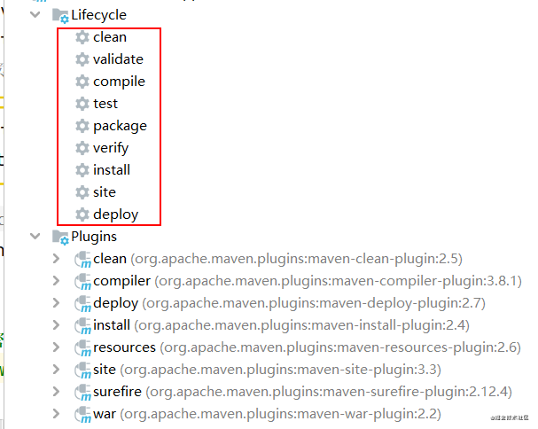
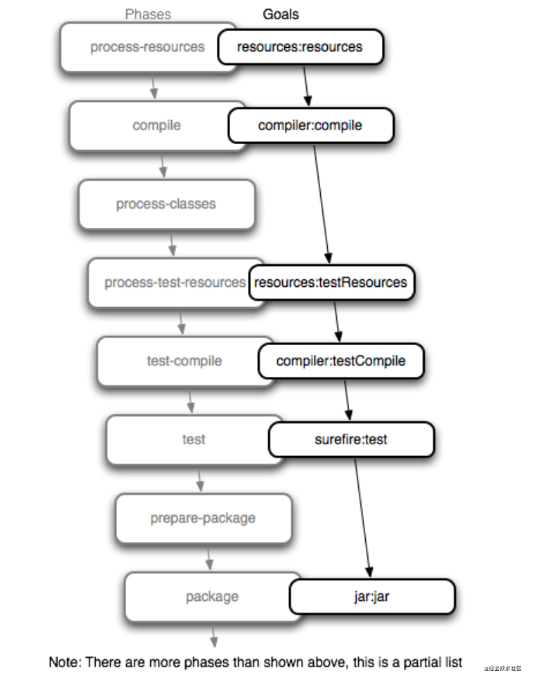
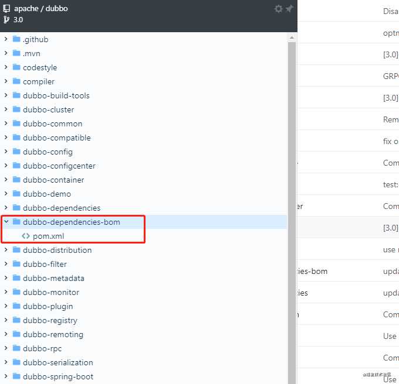
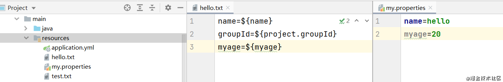
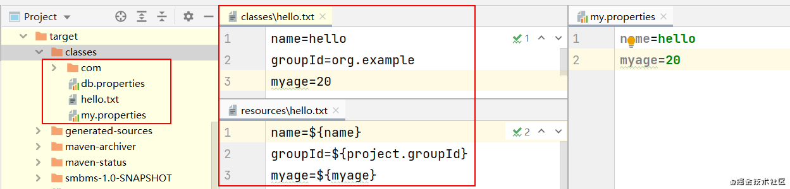

# maven 基础知识总结

这里记录 maven 的基础知识，一方面巩固自己学到的知识，另一方面希望可以对有同样困惑的小伙伴提供一些帮助。

# 一. maven 简介

 `Maven` 是一个项目管理工具，它包含了一个项目对象模型`POM` (Project Object Model)，一组标准集合，一个项目生命周期(Project Lifecycle)，一个依赖管理系统(Dependency Management System)和用来运行定义在生命周期阶段(phase)中插件(plugin)目标(goal)的逻辑。 当你使用Maven的时候，你用一个明确定义的 `POM` 来描述你的项目，然后 `Maven` 可以应用横切的逻辑，这些逻辑来自一组共享的（或者自定义的）插件。

Maven 的核心其实不做什么实际的事情，除了解析一些 XML 文档，管理生命周期与插件之外，它什么也不懂。Maven 被设计成将主要的职责委派给一组 Maven 插件，这些插件可以影响 Maven 生命周期，提供对目标的访问。绝大多数 Maven 的动作发生于Maven 插件的目标（goal），如编译源码，打包二进制代码，发布站点和其它构建任务。你从 Apache 下载的 Maven 不知道如何打包 WAR 文件，也不知道如何运行单元测试，Maven 大部分的智能是由插件实现的，而插件从 Maven 仓库获得。事实上，第一次你用全新的 Maven 安装运行诸如 `mvn install` 命令的时候，它会从中央 Maven 仓库下载大部分核心 Maven 插件。这不仅仅是一个最小化 Maven 分发包大小的技巧，这种方式更能让你升级插件以给你项目的构建提高能力。Maven 从远程仓库获取依赖和插件的这一事实允许了构建逻辑的全局性重用。

使用下面的命令可以查看指定插件的详细信息：

```sh
mvn help:describe -Dplugin=install -Dfull
```

# 二. maven 生命周期

## 1. maven默认生命周期

| 生命周期阶段            | 描述                                                         |
| ----------------------- | ------------------------------------------------------------ |
| **validate**            | 验证项目是否正确，以及所有为了完整构建必要的信息是否可用     |
| generate-sources        | 生成所有需要包含在编译过程中的源代码                         |
| process-sources         | 处理源代码，比如过滤一些值                                   |
| generate-resources      | 生成所有需要包含在打包中的资源文件                           |
| process-resources       | 复制并处理资源文件至目标(target)目录，准备打包               |
| **compile**             | 编译项目的源代码                                             |
| process-classes         | 后处理编译生成的 class 文件，例如对Java类进行字节码增强      |
| generate-test-sources   | 生成所有包含在测试编译过程中的测试源码                       |
| process-test-sources    | 处理测试源码，比如过滤一些值                                 |
| generate-test-resources | 生成测试需要的资源文件                                       |
| process-test-resources  | 复制并处理测试资源文件至测试目标目录                         |
| test-compile            | 编译测试源码至测试目标目录                                   |
| **test**                | 使用合适的单元测试框架运行测试，这些测试不需要被打包或发布   |
| prepare-package         | 在真正的打包之前，执行一些准备打包必要的操作                 |
| **package**             | 将编译好的代码打包成可分发的格式，如 JAR，WAR                |
| pre-integration-test    | 执行一些在集成测试运行之前需要的动作。如建立集成测试需要的环境 |
| integration-test        | 如果有必要的话，处理包并发布至集成测试可以运行的环境         |
| post-integration-test   | 执行一些在集成测试运行之后需要的动作。如清理集成测试环境。   |
| **verify**              | 执行所有检查，验证包是有效的，符合质量规范                   |
| **install**             | 安装包至本地仓库，以备本地的其它项目作为依赖使用             |
| **deploy**              | 安装包至远程仓库，共享给其他开发人员和项目                   |

在上面的表格中标出了常用的生命周期，对应 idea 中 maven 的生命周期如下图：



## 2. 执行 mvn package 发生了什么





我们可以将插件的目标绑定到 maven 的生命周期阶段上，执行 `mvn package` 命令，在 Maven 沿着生命周期一步步向前的过程中，它将运行绑定在每个阶段上的所有目标。


# 三. maven 项目依赖

Maven可以管理内部和外部依赖。内部依赖是指一个 maven 项目内部各个模块之间的依赖，比如一个三层架构的 web 项目中 service 模块依赖 model 模块，或者持久层模块；外部依赖是指依赖第三方类库，比如依赖 spring、mybatis 等相关的依赖。

## 1. 依赖范围

在 `pom.xml` 文件中指定 `dependency` 依赖时，可以指定依赖的 `scope` 范围，范围可以控制哪些依赖在哪些`classpath` 中可用，哪些依赖包含在一个应用中。让我们详细看一下每一种范围：

- **compile（编译范围）**

  **compile 是默认的范围**。如果没有提供一个范围，那该依赖的范围就是编译范围。编译范围依赖在所有的 `classpath` 中可用，同时它们也会被打包。

- **provided（已提供范围）**

  `provided` 依赖只有在当 `JDK` 或者一个容器已提供该依赖之后才使用。例如，如果你开发了一个web应用，你可能在编译 `classpath` 中需要可用的 `Servlet API` 来编译一个 `servlet`，但是你不会想要在打包好的WAR中包含这个`Servlet API`，这个`Servlet API JAR`由你的应用服务器或者`servlet` 容器提供。**已提供范围的依赖在编译`classpath`（不是运行时）可用，它们不是传递性的，也不会被打包。**

- **runtime（运行时范围）**

  **`runtime` 依赖在运行的时候需要，但在编译的时候不需要**。比如，你可能在编译的时候只需要 `JDBC API JAR` 接口，而只有在运行的时候才需要 `JDBC` 驱动实现。

- **test（测试范围）**

  test 范围依赖在一般的编译和运行时都不需要，它们只有在**测试编译和测试运行阶段可用**。

- **system（系统范围）**

  system 范围依赖与 provided 类似，但是你必须显式的提供一个对于本地系统中JAR文件的路径。这么做是为了允许基于本地对象编译，而这些对象是系统类库的一部分。这样的构件应该是一直可用的，Maven也不会在仓库中去寻找它。如果你将一个依赖范围设置成系统范围，你必须同时提供一个systemPath元素。**注意该范围是不推荐使用的**（你应该一直尽量去从公共或定制的Maven仓库中引用依赖）。

  | scope 取值      | 有效范围（compile, runtime, test） | 依赖传递 | 例子        |
  | --------------- | ---------------------------------- | -------- | ----------- |
  | compile（默认） | all                                | 是       | spring-core |
  | provided        | compile、test                      | 否       | servlet-api |
  | runtime         | runtime、test                      | 是       | JDBC驱动    |
  | test            | test                               | 否       | Junit       |
  | system          | compile、test                      | 是       | 不推荐使用  |

  

## 2. 可选依赖

在 pom.xml 文件中指定`<dependency>`依赖时，可以通过 `<optional>true<optional>`标签将此依赖声明为可选依赖。如果项目中依赖的类库包含可选依赖，我们在使用的时候需要显示指定需要的可选依赖。

## 3. 传递依赖

传递性依赖就是对于一个依赖的依赖。如果 project-a 依赖于 project-b，而后者接着依赖于 project-c，那么 project-c 就被认为是 project-a 的传递性依赖。如果 project-c 依赖于 project-d，那么project-d 就也被认为是 project-a 的传递性依赖。Maven 的部分优势是由于它能够管理传递性依赖，并且能够帮助开发者屏蔽掉跟踪所有编译期和运行期依赖的细节。你可以只依赖于一些包如 Spring Framework，而不用担心 Spring Framework 的所有依赖，Maven 帮你自动管理了，你不用自己去详细了解配置。

Maven 是怎样完成这件事情的呢？它建立一个依赖图，并且处理一些可能发生的冲突和重叠。如果Maven 看到有两个项目依赖于同样的 groupId 和 artifactId，它会自动选择那个最新版本的依赖。虽然这听起来很方便，但在一些边界情况中，传递性依赖会造成一些配置问题。在这种情况下，你可以使用`<exclusion>`依赖排除。

下面几种情况可以使用`<exclusion>`依赖排除：

1. 排除通过传递依赖引入但是项目中没有使用的依赖
2. 排除运行时容器已经提供的依赖
3. 排除可能有多个实现的 API 依赖
4. 有多个版本的依赖，排除你不想使用的那个依赖

## 4. 依赖管理

在一个有很多模块的复杂 maven 项目中，如果有很多模块都使用了相同的依赖，比如 `MySQL` 数据库驱动的依赖，需要在各个模块中独立的列出该依赖的版本，在你需要升级到一个新版本的时候你就会遇到问题。由于这些版本号分散在你的项目树中，你需要手动修改每一个引用该依赖的 `pom.xml`，确保每个地方的版本号都更改了。那么如何解决这个问题呢？

maven 提供了 `dependencyManagement`元素来统一管理依赖版本号，使用 `pom.xml`中的`dependencyManagement` 元素能让你在子项目中引用一个依赖而不用显式的列出版本号，maven 会沿着父子层次向上走，直到找到一个拥有 `dependencyManagement`  元素的项目，然后它就会使用在这个

`dependencyManagement` 元素中指定的版本号。

> 注意 如果子项目定义了一个版本 `version`，它将覆盖顶层 POM 的 `dependencyManagement` 元素中的版本。只有在子项目没有直接声明一个版本的时候，`dependencyManagement` 定义的版本才会被使用。


定义在顶层 `pom.xml` 文件的 `dependencyManagement` 中的依赖，在子项目中如果没有显示引用则不会被引入，但是定义顶层 `pom.xml` 的 `dependencies` 中的依赖会被所有子项目引入，为了不添加一些不必要的依赖，使用 `dependencyManagement` 能让你统一并集中化依赖版本的管理，而不用添加那些会被所有子项目继承的依赖。**换句话说，`dependencyManagement`元素和一个环境变量一样，能让你在一个项目下面的任何地方声明一个依赖而不用指定一个版本号。**


# 四. maven 内置属性

## 1. maven 属性

你可以在 `pom.xml` 文件或者资源文件中使用属性，资源文件被会 `Maven Resource` 插件的过滤特性处理。一个属性永远包含在中`${}`中。例如，要引用 `project.version` 属性，就需要这样写 `${project.version}`。在任何Maven项目中都有一些隐式的属性，这些隐式的属性是：

- project.*

  可以使用该 `project.*` 前缀来引用任何在 `pom.xml` 中的值。

- settings.*

  可以使用该 `settings.*` 前缀来引用 `~/.m2/settings.xml` 文件中的值。

- env.*

   可以使用 `env.*` 前缀来引用环境变量如 `PATH` 和 `M2_HOME`的值。

- 系统属性

  任何可以通过 `System.getProperty()` 方法获取的属性都可以作为 maven 属性被引用。

可以使用 `mvn help:system` 命令可查看所有环境变量。

除了上述的隐式属性，用户还可以使用 `<properties>` 自定义属性。

## 2. pom.xml 文件常用属性


```properties
${project.groupId}:项目的groupId.
${project.artifactId}:项目的artifactId.
${project.version}:项目的version,于${version}等价 
${project.basedir}:表示项目根目录，即包含pom.xml文件的目录;  
${project.build.sourceDirectory}:项目的主源码目录，默认为src/main/java/.
${project.build.testSourceDirectory}:项目的测试源码目录，默认为/src/test/java/.
${project.build.directory}:项目构建输出目录，默认为target/.
${project.outputDirectory}:项目主代码编译输出目录，默认为target/classes/.
${project.testOutputDirectory}:项目测试代码编译输出目录，默认为target/testclasses/.
${project.build.finalName}:项目打包输出文件的名称，默认为${project.artifactId}-${project.version}

```

## 3. setting.xml 文件属性

与pom属性同理，用户可以用以`settings.`开头的属性引用 `setting.xml` 文件的XML元素值。

`${settings.localRepository}` 表示本地仓库的地址


## 4. 自定义属性

自定义属性：在 `pom.xml` 文件的 `<properties>` 标签下定义的maven属性：

```xml
<properties>
    <spring>5.2.13.RELEASE</spring>
</properties>
```

可以在其他地方使用自定义的属性：

```xml
<dependency>
    <groupId>org.springframework</groupId>
    <artifactId>spring-context</artifactId>
    <version>${spring}</version>
</dependency>
```


# 五. POM 最佳实践

## 1. 依赖归类

如果你有一组逻辑上归类在一起的依赖，你可以创建一个打包方式为 `pom` 的子模块来将这些依赖归在一起。比如创建一个叫做 `dependencies` 的子模块，此模块只包含一个 `pom.xml` 文件，用来归类管理一些公共依赖的版本号，注意指定此模块的打包类型为：`<packaging>pom</packaging>`。

比如在 [dubbo](https://github.com/apache/dubbo) 项目中也是这样使用的，它定义了一个叫做 `dubbo-dependencies-bom` 的子模块，模块中只有一个 `pom.xml` 文件，如下图:





在 `dubbo-dependencies-bom` 的父 `pom.xml` 中通过如下方式引入使用：

```xml
    <dependencyManagement>
        <dependencies>
            <dependency>
                <groupId>org.apache.dubbo</groupId>
                <artifactId>dubbo-dependencies-bom</artifactId>
                <version>${project.version}</version>
                <type>pom</type>
                <scope>import</scope>
            </dependency>
        </dependencies>
    </dependencyManagement>
```
## 2. 资源过滤的问题
在上面的 maven 生命周期一节我们可以知道，maven 将 `resources:resources`目标绑定到 `process-resources` 生命周期阶段，默认情况下  `resources:resources` 目标的作用是将 `src/main/resources` 目录下的文件复制到 `target/classes` 目录中。除了复制文件到输出目录之外，`resources:resources` 目标还可以使用过滤器，用于将资源文件中的符号变量（`${变量名}`）替换为变量指向的值，可以使用下面的方式开启过滤器功能：
```xml
<build>
    <resources>
        <resource>
            <directory>src/main/resources</directory>
        
            <!--使用 <excludes> 排除 src/main/resources 目录下的 test.txt 文件 -->
            <excludes>
                <exclude>test.txt</exclude>
            </excludes>

            <!--
            开启过滤器功能，开启之后就可以从 <properties> 元素
            或者下面 <filters>中指定的 properties 文件中读取变量的值
            替换 ${变量名} 
            -->
            <filtering>true</filtering>
        </resource>
    </resources>
    <filters>
        <filter>src/main/resources/my.properties</filter>
    </filters>
</build>
```
可以使用 `<excludes>` 排除指定目录下的指定文件，支持通配符匹配，比如通过 `*.txt` 排除以 `.txt`为后缀的文件。

通过`<filtering>true</filtering>`开启过滤器功能，开启之后就可以从`pom.xml`文件、 `<properties>` 元素或者 `<filters>` 中指定的 properties 文件中读取变量的值替换 `${变量名}`。
> 需要注意的是：
>
> 在 `pom.xml`文件、 `<properties>` 元素或者 `<filters>` 中有相同变量名时，读取变量优先级如下：
>
> `<filters>` > `<properties>` >  `pom.xml`

下面通过一个例子来说明上面的功能，定义一个 `hello.txt` 文件，文件中通过 `${变量名}` 方式定义一些变量，用来验证变量替换的功能，定义了 `test.txt` 用来验证文件排除功能，定义了一个 `my.properties` 文件指定变量的值，如下图所示:



 使用如下命令编译打包：
 ```sh
 mvn clean package
 ```
 输出结果如下图：



从结果中我们可以看出，`test.txt` 文件被排除了，自定义变量的值也被正确替换了。

资源文件是Java代码中要使用的文件，代码在执行的时候会到指定目录去查找这些文件。一般情况下，我们用到的资源文件（各种xml，properties，xsd文件等）都放在`src/mian/resources`下，利用Maven打包的时候，Maven都能默认将这些资源文件打包到相应的jar包或者war包中。

但是有些时候，可能会把资源文件放到`src/main/java`下，比如说`Mybatis`的`Mapper.xml`文件就是和`Mapper.java`放在一起，也就导致了java文件能打到jar包中，Mapper.xml却没有打进jar包中。这时候，就需要在pom.xml中添加特定的配置来将这些资源文件能打进jar包或war包中。

配置有两种方法，一是在 `<build>` 标签节点下添加 `<resources>`标签节点，二是在 `<build>`标签节点下的`<plugins>`标签节点中配置`maven-resources-plugin`等处理资源文件的插件。

- `<resources>`标签方式引入`src/main/java` 中的 `properties` 和 `xml` 文件
```xml
<build>
    .......
      <resources>
        <resource>
            <directory>src/main/resources</directory>
            <excludes>
                <exclude>**/*.properties</exclude>
                <exclude>**/*.xml</exclude>
             </excludes>
            <filtering>false</filtering>
        </resource>
        <resource>
            <directory>src/main/java</directory>
            <includes>
                <include>**/*.properties</include>
                <include>**/*.xml</include>
            </includes>
            <filtering>false</filtering>
        </resource>
    </resources>
    ......
</build>
```
- `maven-resources-plugin`插件方式引入`src/main/java` 中的 `properties` 和 `xml` 文件
```xml
<plugin>
    <artifactId>maven-resources-plugin</artifactId>
    <version>2.5</version>
    <executions>
        <execution>
            <id>copy-xmls</id>
            <phase>process-sources</phase>
            <goals>
                <goal>copy-resources</goal>
            </goals>
            <configuration>                                  
                <outputDirectory>${basedir}/target/classes</outputDirectory>
                <resources>
                    <resource>
                        <directory>${basedir}/src/main/java</directory>
                        <includes>
                            <include>**/*.xml</include>
                        </includes>
                    </resource>
                </resources>
            </configuration>
        </execution>
    </executions>
</plugin>
```


参考文档

[maven 指南](http://www.kailing.pub/PdfReader/web/viewer.html?file=mavenGuide)