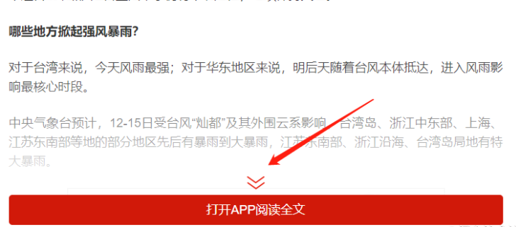

# selenium 如何拖动滚动条？

# 一. 问题描述
有一些特殊网页，需要模拟点击并且有时候需要拖动滚动条才能显示完整的内容，举一个例子，比如人民日报客户端的网页，如下图所示：



需要点击阅读全文才能显示完整的内容，并且网页的图片需要拖动滚动条到图片的位置才能显示图片内容，如果需要获取这种网页的内容，我们可以使用 `python + selenium` 模拟浏览器的行为来获取。

# 二. 解决方法

> 关于 selenium 的安装与使用可以查看这篇文章：https://juejin.cn/post/6996973391328575525

## 1. 使用 js 脚本直接拖动滚动条到底部
```python
# document.body.scrollHeight 是用来获取滚动条的高度
js = 'window.scrollTo(0, document.body.scrollHeight)'
driver.execute_script(js)
```

或者

```python
js = "var q=document.documentElement.scrollTop=10000"
driver.execute_script(js)
```


## 2. 使用 js 脚本拖动滚动条到指定位置

```python
target = driver.find_element_by_class_name("class_name")
driver.execute_script("arguments[0].scrollIntoView();", target) # 拖动到可见的元素去
```

这个方法可以将滚动条拖动到需要显示的元素位置，此方法用途比较广。

比如需要拖动滚动条到最后一个图片显示的位置，可以使用下面的方式：

```python
time.sleep(1)
# 使用 xpath 获取最后一个图片
target = driver.find_element_by_xpath('(//img)[last()]')
driver.execute_script("arguments[0].scrollIntoView();", target)  # 拖动到可见的元素去
```

对于图片网站，通过滚动条下拉加载图片就可以使用上述方式实现。

## 3. 使用 js 脚本缓慢拖动滚动条

有的网页图片需要拖动滚动条到图片的位置才能显示图片内容，可以使用下面的方式缓慢拖动滚动条：

```python
js = "return document.body.scrollHeight"
# 获取滚动条的高度
new_height = driver.execute_script(js)
for i in range(0, new_height, 350):
    time.sleep(0.05)
    driver.execute_script('window.scrollTo(0, %s)' % i)
```

这里实现方式是，先获取滚动条的高度，再通过 `range(start, stop, step)` 函数每次 350 的间距拖动。

## 4. selenium 如何判断元素是否存在

**第一种方式：捕获异常**

```python
def isElementExist(driver, class_name):
    try:
        el = driver.find_element_by_class_name(class_name)
        return True
    except Exception as e:
        logging.error(e)
        return False
```


**第二种方式：find_elements 方法**

```python
def is_element_exist(driver, class_name):
    el = driver.find_elements_by_class_name(class_name)
    if len(el) > 0:
        return True
    else:
        return False
```


# 四. 获取客户端网页数据的完整代码

```python
import time

from lxml import etree
from selenium import webdriver
from selenium.webdriver import DesiredCapabilities
from selenium.webdriver.common.by import By
from selenium.webdriver.support import expected_conditions as EC  # 和下面WebDriverWait一起用的
from selenium.webdriver.support.wait import WebDriverWait


def get_news_content(url):
    """
    解析网页内容
    :param url: 
    :return: 
    """
    html = html_selenium_firefox(url)
    tree = etree.HTML(html)
    title = tree.xpath('//h1[@class="title"]/text()')[0]
    pubtime = tree.xpath('//span[@class="pr10"]/text()')
    pubtime = pubtime[0] if len(pubtime) > 0 else ''
    source = tree.xpath('//span[@class="pr10 head-info-copyfrom"]/text()')
    source = source[0] if len(source) > 0 else '人民日报'
    img_urls = tree.xpath('//img/@src')

    result = {
        "title": title,
        "pubtime": pubtime,
        "source": source,
        "img_urls": img_urls,
    }
    return result


def html_selenium_firefox(url):
    """
    使用 selenium 获取网页内容
    :param url: 
    :return: 
    """
    driver = webdriver.Remote(
        command_executor='http://localhost:4444/wd/hub',
        desired_capabilities=DesiredCapabilities.FIREFOX,
    )
    # 隐式等待
    driver.implicitly_wait(10)
    # 请求页面
    driver.get(url)
    # 显式等待：显式地等待某个元素被加载
    wait = WebDriverWait(driver, 5)
    wait.until(EC.presence_of_element_located((By.TAG_NAME, 'span')))
    handle_selenium_content(driver, url)
    time.sleep(2)
    html = driver.page_source
    driver.quit()
    return html


def handle_selenium_content(driver, url):
    """
    模拟点击和滚动滚动条
    :param driver: 
    :param url: 
    :return: 
    """
    if 'wap.peopleapp.com' in url:
        class_name = 'read-more-zhankai'
        if is_element_exist(driver, class_name):
            i = driver.find_element_by_class_name(class_name)
            i.click()
        js = "return document.body.scrollHeight"
        new_height = driver.execute_script(js)
        for i in range(0, new_height, 350):
            time.sleep(0.05)
            driver.execute_script('window.scrollTo(0, %s)' % i)


def is_element_exist(driver, class_name):
    """
    判断元素是否存在
    :param driver: 
    :param class_name: 
    :return: 
    """
    el = driver.find_elements_by_class_name(class_name)
    if len(el) > 0:
        return True
    else:
        return False


if __name__ == '__main__':
    url = "https://wap.peopleapp.com/article/6305024/6198096"
    result = get_news_content(url)
    print(result)

```


参考文档：

https://zhuanlan.zhihu.com/p/343516637

https://www.cnblogs.com/landhu/p/5761794.html