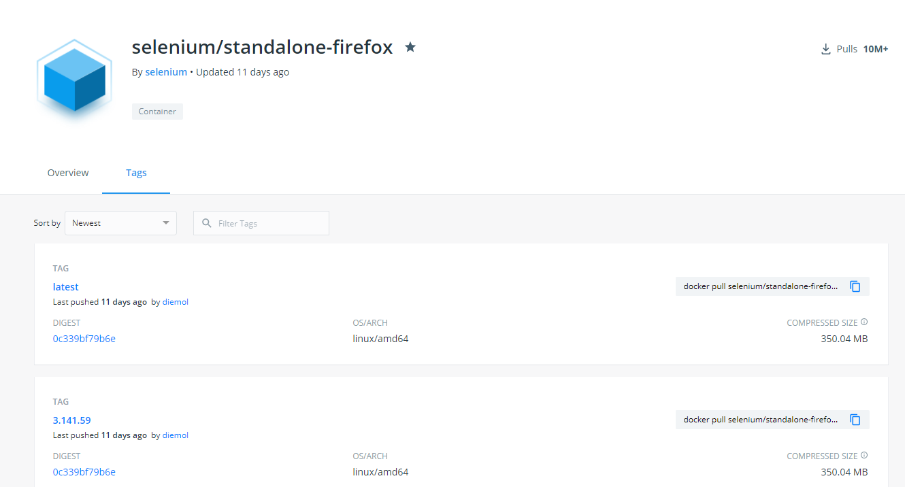
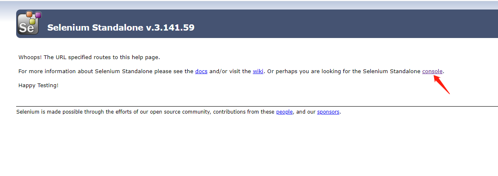
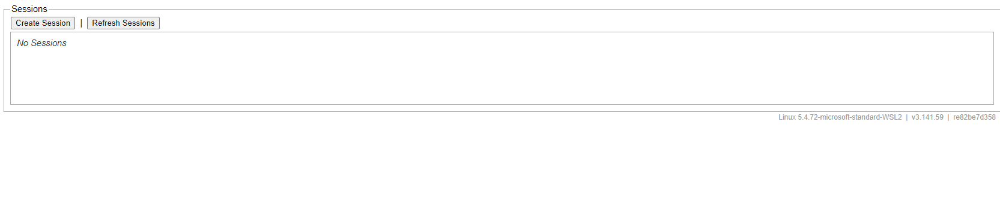
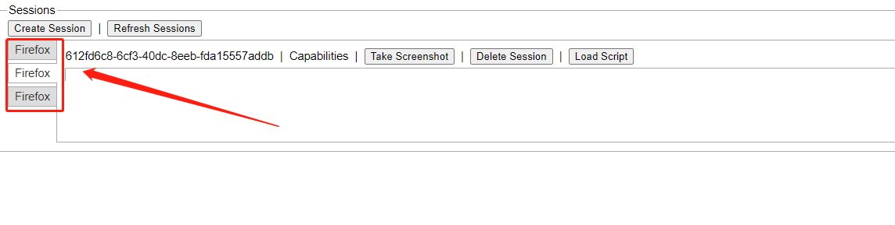

# 【爬虫】docker 部署 python + selenium + firefox-headless

> 外观往往和事物的本身完全不符，世人都容易为表面的装饰所欺骗。—— 莎士比亚 《威尼斯商人》

# 一. 概述

上一篇文章 [【爬虫】python+selenium+firefox使用与部署详解 ](./【爬虫】python+selenium+firefox使用与部署详解.md)介绍了 `selenium` 传统方式部署与使用，需要安装浏览器、安装浏览器对应的驱动等，对于我来说配置还是比较繁琐，有没有没有简单的配置方式呢？有，那就是使用 `docker` 来部署，接下来将介绍如何使用 `docker` 部署 `python + selenium + firefox-headless`。

# 二. docker 安装 selenium/standalone-firefox

> selenium docker hub 地址：https://hub.docker.com/u/selenium

访问上面的地址，选择一个对应浏览器镜像，这里选择 `selenium/standalone-firefox`，如下图所示：



## 快速开始

> 更多配置与使用可以查看 github：https://github.com/SeleniumHQ/docker-selenium

1. 使用下面的命令启动一个 `Firefox` 的 `docker` 容器：

   ```sh
   $ docker run --name firefox -d -p 4444:4444 -p 7900:7900 --shm-size="2g" selenium/standalone-firefox:3.141
   ```

2. 访问 http://localhost:4444 测试 `webDriver`，如下图所示：

   

3. 访问 http://localhost:4444/wd/hub/static/resource/hub.html 跳转到 selenium 控制台，如下图所示：

   

   > 注意：
   >
   > 1. 当为包含浏览器的镜像执行docker运行时，请使用标志 `--shm-size 2g` 来使用主机的共享内存
   > 2. 始终使用带有完整标签的 Docker 镜像来固定特定的浏览器和网格版本。

   为什么需要设置 `--shm-size 2g`：

   这是一个已知的解决方案，以避免在docker容器内浏览器崩溃，2gb的shm大小是任意的，但已知可以很好地工作，您的特定用例可能需要不同的值，建议根据您的需要调整这个值。

可以使用下面的命令进入到 firefox 容器中：

```sh
docker exec -it firefox bash
```

使用下面命令，可以看到容器中已经安装好了 `firefox` 和 `geckodriver`：

```sh
seluser@67be1f8cd61f:/opt$ ls -al /opt
total 8228
drwxr-xr-x 1 root root    4096 Jul 29 08:49 .
drwxr-xr-x 1 root root    4096 Aug 15 08:02 ..
drwxr-xr-x 1 root root    4096 Jul 29 08:52 bin
drwxr-xr-x 7 root root    4096 Jul 29 08:49 firefox-latest
-rwxr-xr-x 1 1000 1000 8401832 Apr  8 22:01 geckodriver-0.29.1
drwxrwxrwx 1 root root    4096 Jul 29 08:44 selenium
```


# 三. 使用 webdriver.Remote() 配置远程浏览器

`selenium` 提供了 `webdriver.Remote()`通过发送命令到远程服务器来控制浏览器，可以使执行测试的机器和发送测试命令的机器独立开来。

关于 `webdriver.Remote()`的配置使用非常简单，不需要像前面文章提到的指定各种配置，其参数默认如下：

```python
selenium.webdriver.remote.webdriver.WebDriver 
def __init__(self,
             command_executor: str = 'http://127.0.0.1:4444/wd/hub',
             desired_capabilities: Any = None,
             browser_profile: Any = None,
             proxy: Any = None,
             keep_alive: bool = False,
             file_detector: Any = None,
             options: Any = None) -> Any
```

使用示例如下：

```python
from selenium import webdriver
from selenium.webdriver import DesiredCapabilities

if __name__ == '__main__':
    driver = webdriver.Remote(
        # 指定远程浏览器的地址
        command_executor='http://localhost:4444/wd/hub',
        # 指定期望的浏览器类型，这里安装的是 firefox 所以指定firefox
        desired_capabilities=DesiredCapabilities.FIREFOX,
    )
    # 发送请求
    driver.get("https://www.baidu.com")
    # 获取网页源码
    html = driver.page_source
    print(html)
    # 获取网页title
    title = driver.title
    print(title)  # 百度一下，你就知道
    # 获取当前网页的 url
    current_url = driver.current_url
    print(current_url)  # https://www.baidu.com/
    # 退出驱动，关闭所有关联的窗口
    driver.quit()

```

当使用 `driver.close()` 关闭当前窗口的时候，可以看到 selenium 控制台会产生一个会话，并且没有自动关闭会话，如下图所示：



这里运行了三次产生了三个会话，如果使用 `driver.quit()` 会自动关闭关联的所有会话，不会保留会话 id 在控制台。

## driver = webdriver.Remote() 常用方法与属性：

```python
driver.get(url)
```

在当前浏览器会话中访问传入的url地址。

用法：`driver.get('https://www.baidu.com')`

```python
driver.close()
```

关闭浏览器当前窗口。

```python
driver.quit()
```

退出webdriver并关闭所有窗口。

```python
driver.refresh()
```

刷新当前页面。

```python
driver.title
```

获取当前页的标题。

```python
driver.page_source
```

获取当前页渲染后的源代码。

```python
driver.current_url
```

获取当前页面的url。

```python
driver.window_handles
```

获取当前会话中所有窗口的句柄，返回的是一个列表。

# 四. python + selenium 配置远程浏览器获取今日头条数据

上一篇文章中获取今日头条数据的代码配置远程浏览器修改如下：

```python
from lxml import etree
from selenium import webdriver
from selenium.webdriver import DesiredCapabilities
from selenium.webdriver.common.by import By
from selenium.webdriver.support import expected_conditions as EC  # 和下面WebDriverWait一起用的
from selenium.webdriver.support.wait import WebDriverWait


def html_selenium_firefox(url):
    """
    根据 url 使用 selenium 获取网页源码
    :param url: url
    :return: 网页源码
    """
    driver = webdriver.Remote(
        # 指定远程浏览器的地址
        command_executor='http://localhost:4444/wd/hub',
        # 指定期望的浏览器类型，这里安装的是 firefox 所以指定firefox
        desired_capabilities=DesiredCapabilities.FIREFOX,
    )
    # 发送请求
    driver.get(url)
    # 显式等待：显式地等待某个元素被加载
    wait = WebDriverWait(driver, 20)
    wait.until(EC.presence_of_element_located((By.CLASS_NAME, 'article-content')))
    wait.until(EC.presence_of_element_located((By.TAG_NAME, 'span')))
    # 获取网页源码
    html = driver.page_source
    # 关闭浏览器释放资源
    driver.quit()
    return html


def get_news_content(url):
    html = html_selenium_firefox(url)
    tree = etree.HTML(html)
    title = tree.xpath('//div[@class="article-content"]/h1/text()')[0]
    # xpath 查找没有 class 的元素：span[not(@class)]
    pubtime = tree.xpath('//div[@class="article-meta mt-4"]/span[not(@class)]/text()')[0]
    # xpath 查找 class="name" 的元素：span[@class="name"]
    source = tree.xpath('//div[@class="article-meta mt-4"]/span[@class="name"]/a/text()')[0]
    # xpath 某个标签中的所有元素：//div
    content = tree.xpath('//article')[0]
    # 处理 content 乱码问题
    content = str(etree.tostring(content, encoding='utf-8', method='html'), 'utf-8')
    # 提取 content 中所有图片的地址
    images = etree.HTML(content).xpath('//img/@src')

    result = {
        "title": title,
        "pubtime": pubtime,
        "source": source,
        "content": content,
        "images": images,
    }
    return result


if __name__ == '__main__':
    url = "https://www.toutiao.com/a6969138023774667264/"
    result = get_news_content(url)
    print(result)

```


参考文档：

https://github.com/SeleniumHQ/docker-selenium

