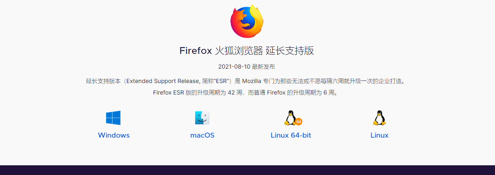
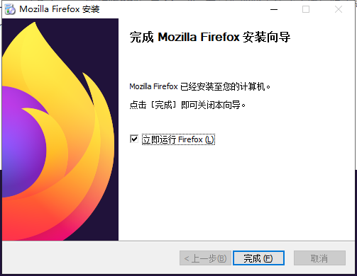
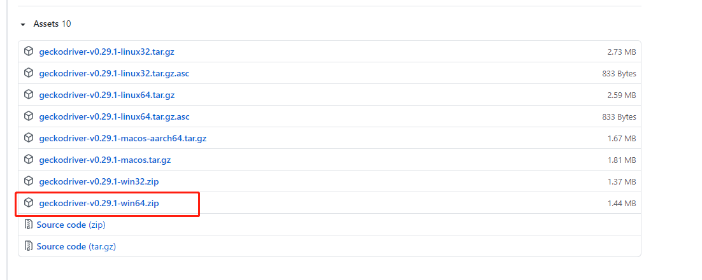

# 【爬虫】python+selenium+firefox使用与部署详解

> 我的梦想，值得我本人去争取，我今天的生活，绝不是我昨天生活的冷淡抄袭。—— 司汤达《红与黑》

# 一. 概述

以前对爬虫感兴趣学习了 `requests`、`scrapy` 等 `python` 库用来爬取一些网站数据，最近刚好由于需要，又开始做一些爬虫相关的工作，写本文的目的是将自己学习过程和遇到的问题记录下来，一方面巩固学习的知识，另一方面希望对遇到同样问题的朋友提供一些帮助。

本文主要从以下几个方面介绍（这也是自己学习的过程）：

1. **为什么要使用 selenium** 

2. **传统方式配置使用 selenium**

   

# 二. 为什么要使用 selenium 

在使用爬虫工具比如 `requests` 时候，使用 `requests.get(url)`命令获取网页内容，发现没有我们需要的内容，那是因为有些网页是前后端分离，需要浏览器执行 `js` 脚本通过 `ajax` 请求获取数据再渲染到页面，直接请求这个页面地址的话，得到的html上面是没有数据的。有些网站的网页是通过 `js` 生成的，并非原生的 `HTML` 代码，这其中并不包含 `Ajax` 请求。

如何解决这个问题呢？通常情况下可以分析 js 脚本，找到调用的接口，直接请求接口获取数据，但是这些接口有加密或者验证，请求接口是比较麻烦的。对于需要执行 js 脚本才能生成页面的网站是无法直接通过接口获取数据的，为了方便，我们可以直接使用 `selenium + （浏览器驱动）firefox` 模拟浏览器的行为，通过这个工具就可以执行 js 脚本获取到整个网页的完整数据。

> selenium 是一个自动化测试工具
>
> 详细内容及使用可以查看官方文档：https://www.selenium.dev/documentation/

比如今日头条新闻网页的数据数据经过算法加密，无法直接请求接口，需要破解它的加密规则，网上有很多大佬写过如果抓取今日头条的数据，可以自行百度查找，总之有很多坑很麻烦，后面会介绍如何使用 selenium 抓取今日头条的数据。

大概知道了使用 selenium 可以获取任何网页中的数据，但是使用 selenium 存在的缺点如下：

1. **效率较低**

   每一次请求相当于要打开一次浏览器，这个启动效率相对于直接调用接口来说是非常低的，通常需要几秒的时间。

2. **资源浪费**

   selenium 模拟浏览器的行为，大量请求会极其消耗资源

# 三. 传统方式配置使用 selenium

## 1. 在 windows 中配置 selenium

这里主要演示使用 python + selenium 来爬取数据，所以下面只会介绍 python 的安装方式，其他安装方式可以查看官方文档。

### 安装 Selenum 库

使用下面的命令安装 selenium 库：

```sh
pip install selenium
```

### 安装 firefox 浏览器

> firefox 下载地址：http://www.firefox.com.cn/download/



根据需要下载对应环境的安装包，因为这里是在 windows 中配置，所以下载 windows 的。下载完成后，双击 `.exe`文件，点击 下一步完成安装。




### 安装 firefox 浏览器驱动

安装好浏览器之后，还需要安装浏览器的驱动才能是浏览器完成相应的操作。因为这里是使用的 firefox 浏览器，所以需要安装其对应的驱动 [geckodriver](https://github.com/mozilla/geckodriver) 。

如果没有安装  **geckodriver** 这个驱动，当使用如下代码运行的时候：

```python
import time
from selenium.webdriver import Firefox
from selenium import webdriver
driver = webdriver.Firefox()
driver.get("https://www.toutiao.com/a6969138023774667264/")
time.sleep(2)
html = driver.page_source
print(html)
driver.quit()
```

会报出如下错误：

```sh
FileNotFoundError: [WinError 2] 系统找不到指定的文件。
Traceback (most recent call last):
    raise WebDriverException(
selenium.common.exceptions.WebDriverException: Message: 'geckodriver' executable needs to be in PATH. 
```

关于 **geckodriver** 官方介绍如下：

**geckodriver**：使用 W3C WebDriver 兼容客户端与基于 Gecko 的浏览器交互的代理。

该程序提供了 WebDriver 协议描述的 HTTP API 来与 Gecko 浏览器进行通信，例如 Firefox。 它通过充当本地端和远程端之间的代理将调用转换为 Marionette 远程协议。

> geckodriver 下载地址：https://github.com/mozilla/geckodriver/releases

**1. 请根据系统版本选择下载，如下图所示**：



**2. 下载解压后将 `getckodriver.exe` 添加到 Path 环境变量中。**

> 如果不想添加到环境变量中，还可以在创建 firefox 驱动实例的时候指定 geckodirver 的位置：
>
> ```
> webdriver.Firefox(executable_path="E:/Downloads/geckodriver/geckodriver.exe")
> ```

**3. 添加 `getckodriver` 到环境变量中需要重启cmd或者idea **


### 其他浏览器的驱动下载地址

| 浏览器            | 支持的操作系统              | 维护者          | 下载                                                         | 问题追踪                                                     |
| ----------------- | --------------------------- | --------------- | ------------------------------------------------------------ | ------------------------------------------------------------ |
| Chromium/Chrome   | Windows/macOS/Linux         | 谷歌            | [下载](https://chromedriver.storage.googleapis.com/index.html) | [问题](https://bugs.chromium.org/p/chromedriver/issues/list) |
| 火狐              | Windows/macOS/Linux         | Mozilla         | [下载](https://github.com/mozilla/geckodriver/releases)      | [问题](https://github.com/mozilla/geckodriver/issues)        |
| Edge              | Windows 10                  | 微软            | [下载](https://developer.microsoft.com/en-us/microsoft-edge/tools/webdriver/) | [问题](https://developer.microsoft.com/en-us/microsoft-edge/platform/issues/?page=1&q=webdriver) |
| Internet Explorer | Windows                     | Selenium 项目组 | [下载](https://selenium-release.storage.googleapis.com/index.html) | [问题](https://github.com/SeleniumHQ/selenium/labels/D-IE)   |
| Safari            | macOS El Capitan 及更高版本 | 苹果            | 内置                                                         | [问题](https://bugreport.apple.com/logon)                    |
| Opera             | Windows/macOS/Linux         | Opera           | [下载](https://github.com/operasoftware/operachromiumdriver/releases) | [问题](https://github.com/operasoftware/operachromiumdriver/issues) |


## 2. 在 linux 中配置 selenium

在 linux 中的配置和 windows 的配置步骤一样，下面简单介绍一下。

### 安装 Selenum 库

使用下面的命令安装 selenium 库：

```sh
pip install selenium
```

### 安装 firefox 浏览器

>  firefox 下载地址：http://www.firefox.com.cn/download/

使用如下命令下载 linux 版本的 firefox 浏览器：

```sh
wget https://download-ssl.firefox.com.cn/releases/firefox/esr/91.0/zh-CN/Firefox-latest-x86_64.tar.bz2
```

下载完成后使用下面的命令解压得到 `Firefox-latest-x86_64.tar`：

```sh
bunzip2 -d Firefox-latest-x86_64.tar.bz2
```

再次使用下面的命令解压：

```sh
tar -xvf Firefox-latest-x86_64.tar
```

### 安装 firefox 浏览器驱动

> geckodriver 驱动下载地址：https://github.com/mozilla/geckodriver/releases

使用下面的命令下载 linux 系统的驱动：

```sh
wget https://github.com/mozilla/geckodriver/releases/download/v0.29.1/geckodriver-v0.29.1-linux64.tar.gz
```

解压后将 `geckodriver` 存放至 `/usr/local/bin/` 路径下即可

```sh
tar -zxvf geckodriver-v0.29.1-linux64.tar.gz
cp geckodriver /usr/local/bin/
```

>  同理对于IE和Chrome浏览器，IEDriverServer，chromedriver也是相同的安装方法

# 四. python + selenium 获取今日头条数据

下面的代码是根据 url 获取今日头条新闻中的**标题、发布时间、来源、正文内容、图片地址**，详细说明查看代码注释：

```python
from lxml import etree
from selenium import webdriver
from selenium.webdriver.common.by import By
from selenium.webdriver.support import expected_conditions as EC  # 和下面WebDriverWait一起用的
from selenium.webdriver.support.wait import WebDriverWait


def html_selenium_firefox(url):
    """
    根据 url 使用 selenium 获取网页源码
    :param url: url
    :return: 网页源码
    """
    opt = webdriver.FirefoxOptions()
    # 设置无界面
    opt.add_argument("--headless")
    # 禁用 gpu
    opt.add_argument('--disable-gpu')
    # 指定 firefox 的安装路径，如果配置了环境变量则不需指定
    firefox_binary = "C:\\Program Files (x86)\\Mozilla Firefox\\firefox.exe"
    # 指定 geckodirver 的安装路径，如果配置了环境变量则不需指定
    executable_path = "E:\\Downloads/geckodriver\\geckodriver.exe"
    driver = webdriver.Firefox(firefox_binary=firefox_binary, executable_path=executable_path, options=opt)
    # 发送请求
    driver.get(url)
    # 显式等待：显式地等待某个元素被加载
    wait = WebDriverWait(driver, 20)
    wait.until(EC.presence_of_element_located((By.CLASS_NAME, 'article-content')))
    wait.until(EC.presence_of_element_located((By.TAG_NAME, 'span')))
    # 获取网页源码
    html = driver.page_source
    # 关闭浏览器释放资源
    driver.quit()
    return html


def get_news_content(url):
    html = html_selenium_firefox(url)
    tree = etree.HTML(html)
    title = tree.xpath('//div[@class="article-content"]/h1/text()')[0]
    # xpath 查找没有 class 的元素：span[not(@class)]
    pubtime = tree.xpath('//div[@class="article-meta mt-4"]/span[not(@class)]/text()')[0]
    # xpath 查找 class="name" 的元素：span[@class="name"]
    source = tree.xpath('//div[@class="article-meta mt-4"]/span[@class="name"]/a/text()')[0]
    # xpath 某个标签中的所有元素：//div
    content = tree.xpath('//article')[0]
    # 处理 content 乱码问题
    content = str(etree.tostring(content, encoding='utf-8', method='html'), 'utf-8')
    # 提取 content 中所有图片的地址
    images = etree.HTML(content).xpath('//img/@src')

    result = {
        "title": title,
        "pubtime": pubtime,
        "source": source,
        "content": content,
        "images": images,
    }
    return result


if __name__ == '__main__':
    url = "https://www.toutiao.com/a6969138023774667264/"
    result = get_news_content(url)
    print(result)

```

关于 selenium 和 xpath 的更多使用，可以查看官方文档，这里不再详细说明。

参考文章：

https://blog.csdn.net/rhx_qiuzhi/article/details/80296801

https://github.com/mozilla/geckodriver

https://www.selenium.dev/documentation

