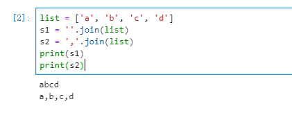

# 记录使用 python 过程中的问题总结

## 怎样创建一个 dataframe?


## 在pandas中dataframe怎么转化为字典？

**`DataFrame.to_dict` (\*self\*, *orient='dict'*, *into=*)**


## python 中的 list 如何转换为字符串？

### 1.list 转 string

**命令：`''.join(list)`**

```python
list = ['a', 'b', 'c', 'd']
s1 = ''.join(list)
s2 = ','.join(list)
print(s1) # abcd
print(s2) # a,b,c,d
```




面向对象设计五个基本原则

- 单一职责原则：一个方法只做一件事
- 开放封闭原则：对扩展开放，对修改关闭
- 接口隔离原则：实现专门的多个接口比实现一个总接口要好
- 里氏替换原则：子类可以在程序中代替基类
- 依赖倒置原则：程序要依赖抽象接口，不要依赖具体实现，简单的说就是面向接口编程，目的是为了降低耦合

