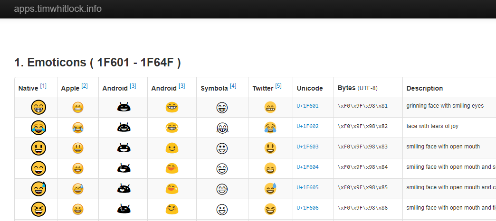
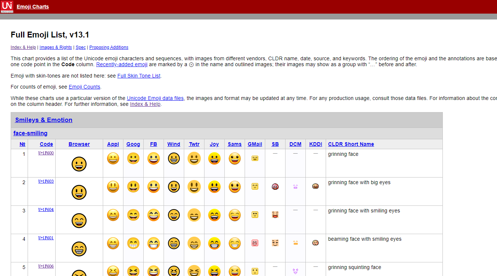
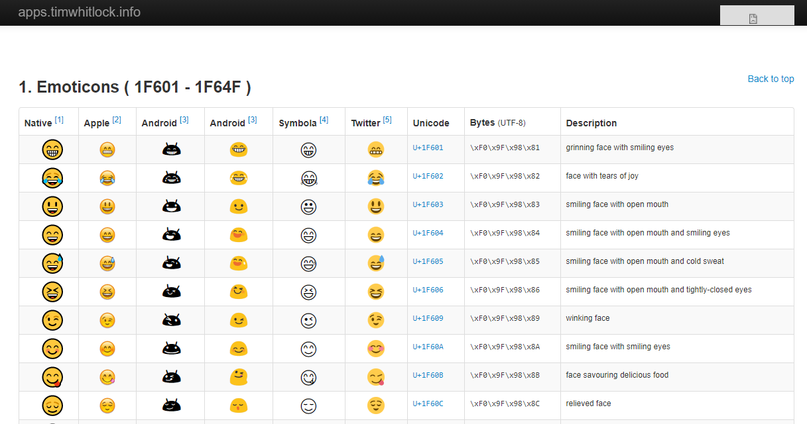
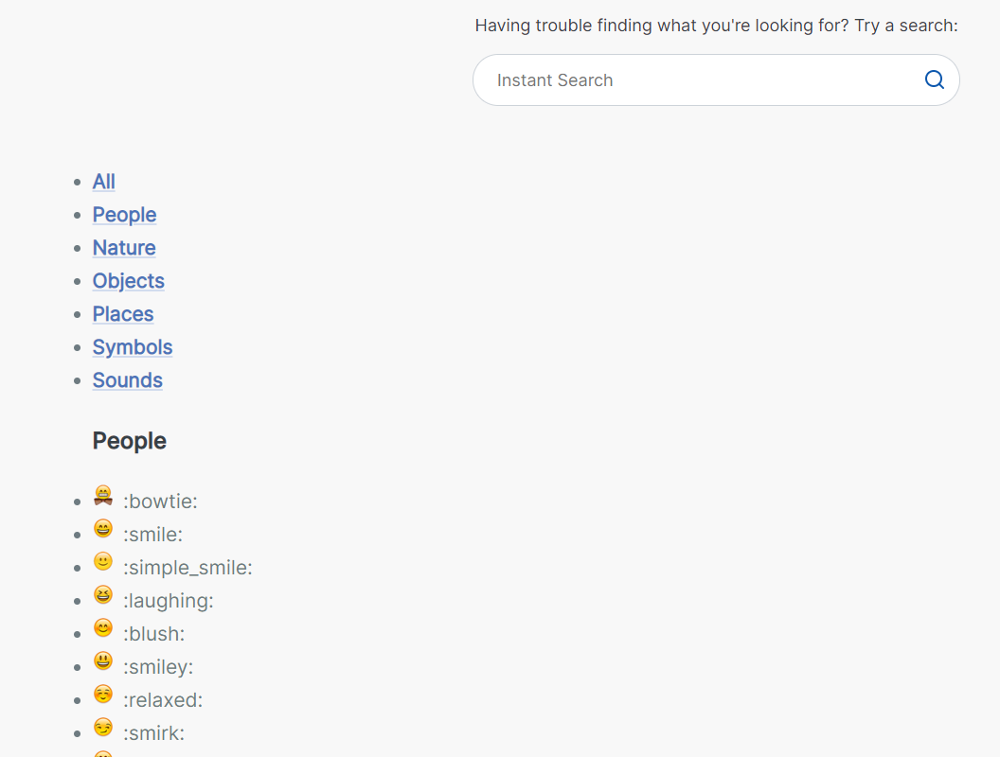

# 在 markdown 中使用表情符号😍

# 1️⃣ 概述

经常看到别人写的文章中有各种有趣的表情符号，像是这样的😂，在文章中添加一些表情符号能够增强文章的趣味性😊，对于这些表情符号我们可以直接复制粘贴使用，这些表情符号到底是什么呢？

这种表情符号的官方名字叫做 `emoji` ，来自[日语](https://baike.baidu.com/item/日语)词汇“**絵文字**”（假名为“えもじ”，读音即 `emoji`），`emoji` 的创造者是日本人**栗田穰崇**。

 `emoji` 是一种文本类型的象形符号， 它和图片、表情包不同，**它能够在任何文本输入的地方使用**，**因为它本身就是一种文字** ；最新的 `emoji 13.1`版本包含**1816**个独立的表情符号（该统计不包含由多符号组成和其他肤色的表情符号），`emoji` 能够在各个不同的操作平台上显示，但显示效果会有一些不同，如下图显示了不同操作平台上的表情符号：




`emoji` 发明的初衷是为了让人们的表达更加的多样化和趣味性，发展到现在更像是一种新的语言，并有自己独特的魅力，它在我们日常的网络聊天中随处可见，通过它你可以了解到行行文字后的感情，甚至于一个 `emoji` 就可以表达我们当下的心情，

统一码联盟(Unicode Consortium)每年都会推出许多新的 `emoji`，大家只要及时更新自己的操作系统，就可以更好的显示这些又新又有趣的 `emoji` 了。


>  说明：一个 `emoji` 字符占 4 个字节，在 `MySQL` 建表时，建议使用 `utf8mb4` 字符集，可以存储表情符号。
>
>  **`MySQL 8.0`开始： 默认字符集为`utf8mb4`**


# 2️⃣ 表情符号资源网站

- [完整的表情符号汇总  v13.1](https://www.unicode.org/emoji/charts/full-emoji-list.html)



可以在这里查看表情符号的 Code 以及不同平台的显示效果。

- [表情符号 Unicode 列表](https://apps.timwhitlock.info/emoji/tables/unicode#)




- [表情符号备忘清单](https://www.webfx.com/tools/emoji-cheat-sheet/)



在 markdown 以及部分平台可以使用这种方式的表情符号，格式为 `:smile:`，在后面将列出哪些常用的平台支持使用这种表情符号。

- [表情符号中文网](https://www.emojiall.com/zh-hans)


表情符号中文网站有最全最详细的 `emoji` 图标，同时支持分类、检索、专栏推荐、`emoji` 小游戏等功能。可以直接在网站中搜索需要的表情符号，复制粘贴即可使用，非常方便。


#  3️⃣ 在 markdown 中使用表情符号

## 1. **基本用法**

**语法：`&#xcode;`**  (注意最后的分号 `;` 不可少)

其中 code 可以从[表情符号 Unicode 列表](https://apps.timwhitlock.info/emoji/tables/unicode#)中查到

**例子：** 查到了 表情对应的 **Unicode** 编码为 `U+1F600`，则与此表情对应的 `CODE` 为 `1F600` (舍弃前面的 **U+**)。我们只需在 Markdown 文档中输入 `&#x1F600;` 即可显示为 &#x1F600;。

下面的符号显示如下：

```
&#x1F600;
&#x1F601;
&#x1F602;
&#x1F603;
&#x1F604;
&#x1F605;
```

&#x1F600;
&#x1F601;
&#x1F602;
&#x1F603;
&#x1F604;
&#x1F605;


## 2. 常用的表情：直接复制粘贴即可使用

😀 😃 🥰 😍 😘

❤️ ✨⭐ ❗❓❕❔ 

✊✌️ ✋✋ ☝️ 👏 🤝

☀️ ☔ ☁️ ❄️ ⛄ ⚡ ⛅

⛪ ⛺ ⛲ ⛵ ⛵ ⚓ ✈️ ⛽ ⚠️ ♨️

1️⃣ 2️⃣ 3️⃣ 4️⃣ 5️⃣ 6️⃣ 7️⃣ 8️⃣ 9️⃣ 0️⃣

#️⃣ ◀️ ⬇️ ▶️ ⬅️ ↙️ ↘️ ➡️ ⬆️ ↖️ ↗️ 

⏬ ⏫ ⤵️ ⤴️ ↩️ ↪️ ↔️ ↕️ ⏪ ⏩ ℹ️ ️ ️ ️ 

♿ ㊙️ ㊗️ Ⓜ️ ⛔ ✳️ ❇️ ✴️ 

♈ ♉ ♊ ♋ ♌ ♍ ♎ ♏ ♐ ♑ ♒ ♓ ⛎ 

❎ ️ ️ ️ ♻️ ©️ ®️ ™️ ❌ ❗ ‼️ ⁉️ ⭕ ✖️ ➕ ➖ ➗ ✔️ 

☑️ ➰ 〰️ 〽️ ▪️ ▫️ ◾ ◽ ◼️ ◻️ ⬛ ⬜ ✅ ⚫ ⚪


# 4️⃣ 在常用博客中使用表情符号

**简书**支持 ` &#x1f602;`  &#x1f602;的表情符号，不支持`:smile:` 的表情符号，支持直接复制的表情  😁

**掘金**不支持` &#x1f602;` 的表情符号，不支持`:smile:` 的表情符号，支持直接复制的表情  😁

**思否**支持 ` &#x1f602;`  &#x1f602;的表情符号，不支持`:smile:` 的表情符号，支持直接复制的表情  😁

**CSDN** 支持 ` &#x1f602;`  &#x1f602;的表情符号，支持`:smile:`  :smile: 的表情符号，支持直接复制的表情 😁

**GitHub** 支持 ` &#x1f602;`  &#x1f602;的表情符号，支持`:smile:`  :smile: 的表情符号，支持直接复制的表情 😁

**Markdown** 支持 ` &#x1f602;`  &#x1f602;的表情符号，支持`:smile:`  :smile: 的表情符号，支持直接复制的表情 😁

| 博客平台 | 格式：`&#x1f602;` | 格式：`:smile:` | 直接复制的表情 |
| -------- | ----------------- | --------------- | -------------- |
| markdown | 支持              | 支持            | 支持           |
| github   | 支持              | 支持            | 支持           |
| CSDN     | 支持              | 支持            | 支持           |
| 思否     | 支持              | 不支持          | 支持           |
| 掘金     | 不支持            | 不支持          | 支持           |
| 简书     | 支持              | 不支持          | 支持           |


参考文档

https://zhuanlan.zhihu.com/p/147764147


