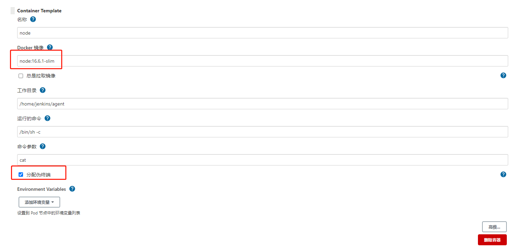

# 在 k8s 中安装 jenkins 并配置实现 CI/CD

> 我们把世界看错，反说它欺骗了我们。—— 泰戈尔《飞鸟集》

# 一. 概述

在学习使用一个工具之前，我们需要知道怎么安装它。本文将自己学习的过程记录下来，一方面巩固学习的内容，另一方面希望对有同样需求的小伙伴提供一些帮助。

| 开源工具 | 描述               | 官方文档                                | 官方安装文档                                         | docker 安装                                              |
| -------- | ------------------ | --------------------------------------- | ---------------------------------------------------- | -------------------------------------------------------- |
| jenkins  | devops持续集成工具 | [jenkins 官网](https://www.jenkins.io/) | [jenkins 快速安装](https://www.jenkins.io/download/) | [docker 安装](https://hub.docker.com/r/jenkins/jenkins/) |

上面表格列出了官方的安装地址，如果需要快速体验使用，建议直接使用 docker 安装，一行命令就可以启动应用：

```she
docker run -p 8080:8080 -p 50000:50000 jenkins/jenkins:lts-jdk11
```

本文介绍在 k8s 中安装并使用 jenkins，主要通过两种方式安装实践：

- **自己编写 `yaml` 文件安装**
- **使用 helm 安装**

## 安装环境

>  这里使用 minikube 进行安装，在 k8s 集群中基本使用是一样的

- minikube :  v1.18.1
- helm : v3.5.3


# 二. 自定义 `yaml` 文件安装 jenkins

由于 jenkins 需要持久化数据，所以我们需要创建 `PVC` ，建议使用 `storageClass` 动态创建 `PVC`，在 `minikube` 中有一个默认的 `storageClass`，名称是：`standard`，可以使用下面的命令查看：

```shell
# kubectl get sc
NAME                 PROVISIONER                RECLAIMPOLICY   VOLUMEBINDINGMODE   ALLOWVOLUMEEXPANSION   AGE
standard (default)   k8s.io/minikube-hostpath   Delete          Immediate           false                  50m
```

>  关于 **storageClass** 的使用可以查看官网：https://kubernetes.io/zh/docs/concepts/storage/storage-classes/


创建 `jenkins-deploy.yaml` 文件，文件内容如下：

```yaml
###############使用 storageClass 创建 pvc ###################
---
apiVersion: v1
kind: PersistentVolumeClaim
metadata:
  name: jenkins-data-pvc
  namespace: default
spec:
  accessModes:
    - ReadWriteMany
  # 指定 storageClass 的名字，这里使用 minikube 默认的 standard
  storageClassName: "standard"
  resources:
    requests:
      storage: 10Gi

###############创建一个ServiceAccount 名称为：jenkins-admin###################
---
apiVersion: v1
kind: ServiceAccount
metadata:
  name: jenkins-admin
  namespace: default
  labels:
    name: jenkins

###############绑定账户jenkins-admin 为集群管理员角色，为了控制权限建议绑定自定义角色###################
---
kind: ClusterRoleBinding
apiVersion: rbac.authorization.k8s.io/v1
metadata:
  name: jenkins-admin
  labels:
    name: jenkins
subjects:
  - kind: ServiceAccount
    name: jenkins-admin
    namespace: default
roleRef:
  kind: ClusterRole
  # cluster-admin 是 k8s 集群中默认的管理员角色
  name: cluster-admin
  apiGroup: rbac.authorization.k8s.io


############### 在 default 命名空间创建 deployment ###################
---
apiVersion: apps/v1
kind: Deployment
metadata:
  name: jenkins
  namespace: default
spec:
  replicas: 1
  selector:
    matchLabels:
      app: jenkins
  template:
    metadata:
      labels:
        app: jenkins
    spec:
      terminationGracePeriodSeconds: 10
      # 注意：k8s 1.21.x 中 serviceAccount 改名为 serviceAccountName
      # 这里填写上面创建的 serviceAccount 的 name
      serviceAccount: jenkins-admin
      containers:
        - name: jenkins
          image: jenkins/jenkins:lts-jdk11
          imagePullPolicy: IfNotPresent
          env:
            - name: JAVA_OPTS
              value: -Duser.timezone=Asia/Shanghai
          ports:
            - containerPort: 8080
              name: web
              protocol: TCP
            - containerPort: 50000
              name: agent
              protocol: TCP
          resources:
            limits:
              cpu: 1000m
              memory: 1Gi
            requests:
              cpu: 500m
              memory: 512Mi
          livenessProbe:
            httpGet:
              path: /login
              port: 8080
            initialDelaySeconds: 60
            timeoutSeconds: 5
            failureThreshold: 12
          readinessProbe:
            httpGet:
              path: /login
              port: 8080
            initialDelaySeconds: 60
            timeoutSeconds: 5
            failureThreshold: 12
          volumeMounts:
            - name: jenkinshome
              mountPath: /var/jenkins_home
      volumes:
        - name: jenkinshome
          persistentVolumeClaim:
            claimName: jenkins-data-pvc

############### 在 default 命名空间创建 service ###################
---
apiVersion: v1
kind: Service
metadata:
  name: jenkins
  namespace: default
  labels:
    app: jenkins
spec:
  selector:
    app: jenkins
  type: ClusterIP
  ports:
    - name: web
      port: 8080
      targetPort: 8080


---
apiVersion: v1
kind: Service
metadata:
  name: jenkins-agent
  namespace: default
  labels:
    app: jenkins
spec:
  selector:
    app: jenkins
  type: ClusterIP
  ports:
    - name: agent
      port: 50000
      targetPort: 50000

```

使用下面的命令部署 jenkins：

```shell
# kubectl apply -f jenkins-deploy.yaml

persistentvolumeclaim/jenkins-data-pvc created
serviceaccount/jenkins-admin created
clusterrolebinding.rbac.authorization.k8s.io/jenkins-admin created
deployment.apps/jenkins created
service/jenkins created
service/jenkins-agent created
```

使用下面的命令临时暴露服务端口：

```shell
kubectl port-forward service/jenkins 8080:8080 -n default
```

> 生产环境建议使用 ingress 通过域名暴露服务


暴露服务端口后，可以访问：http://localhost:8080


使用下面的命令查看管理员密码：

```shell
# kubectl get pod -n default
NAME                       READY   STATUS    RESTARTS   AGE
jenkins-68666b56fc-p8fvd   1/1     Running   0          8m28s

# kubectl exec jenkins-68666b56fc-p8fvd -- cat /var/jenkins_home/secrets/initialAdminPassword
b06be4420bcd4a02ab4968ab02838986
```

登录成功后，需要安装插件：


这里不安装推荐的插件的原因是，很多插件我们是不需要的，还有就是默认下载插件会从国外下载，比较慢，后面会介绍配置国内下载地址。

点击安装后，创建第一个管理员用户：


根据实际情况配置，这里选择使用admin 账号继续。


# 三. 使用 helm 安装 jenkins

可以去到 helm 官方包管理仓库查找需要安装的应用。

> helm 包管理地址：https://artifacthub.io/

在 Artifact hub 中搜索 jenkins，如下图所示：


根据 jenkins 的说明进行安装，下面详细介绍一下安装步骤：

使用下面的命令添加安装 jenkins 的仓库

```sh
$  helm repo add jenkins https://charts.jenkins.io
"jenkins" has been added to your repositories
```

使用下面的命令查看已经添加的helm仓库：

```sh
$  helm repo list
NAME            URL
kong            https://charts.konghq.com
aliyun          https://kubernetes.oss-cn-hangzhou.aliyuncs.com/charts
stable          https://charts.helm.sh/stable
kubeview        https://benc-uk.github.io/kubeview/charts
tscharts        https://technosophos.github.com/tscharts
bitnami         https://charts.bitnami.com/bitnami
apisix          https://charts.apiseven.com
jenkins         https://charts.jenkins.io
```

使用下面的命令更新 helm 仓库：

```sh
$  helm repo update
```

使用下面的命令可以搜索仓库中的 jenkins：

```sh
$  helm search repo jenkins

aliyun/jenkins  0.13.5          2.73            Open source continuous integration server. It s...
bitnami/jenkins 8.0.8           2.289.3         The leading open source automation server
jenkins/jenkins 3.5.9           2.289.3         Jenkins - Build great things at any scale! The ...
stable/jenkins  2.5.4           lts             DEPRECATED - Open source continuous integration...
```

使用下面的命令查看可以配置的内容：

```sh
$  helm show values jenkins/jenkins
```

使用下面的命令下载 helm 的 chart 包到本地：

```sh
$  helm pull jenkins/jenkins
```

下载下来的是一个压缩包，可以通过 `tar -zxvf` 命令解压：

```sh
$  tar -zxvf jenkins-3.5.9.tgz

-rw-r--r-- 1  1049089 45006 Jul 28 23:36 CHANGELOG.md
-rw-r--r-- 1  1049089  1287 Jul 28 23:36 Chart.yaml
-rw-r--r-- 1  1049089 30809 Jul 28 23:36 README.md
-rw-r--r-- 1  1049089 37647 Jul 28 23:36 VALUES_SUMMARY.md
drwxr-xr-x 1  1049089     0 Aug  5 17:59 templates
-rw-r--r-- 1  1049089 36203 Jul 28 23:36 values.yaml
```

根据需要修改 `values.yaml` 文件进行自定义配置，这里为了快速体验，不做其他配置，直接使用下面的命令进行安装：

```sh
$  helm install jenkins ./jenkins
```


使用下面的命令查看登录的用户名和密码：

```sh
# 查看登录的用户名
$  kubectl exec jenkins-0 -- cat /run/secrets/chart-admin-username
# 查看登录的密码
$  kubectl exec jenkins-0 -- cat /run/secrets/chart-admin-password
```

使用下面的命令临时暴露服务：

```sh
kubectl --namespace default port-forward svc/jenkins 8080:8080
```

> 生产环境建议使用 ingress 通过域名暴露服务


暴露服务端口后，可以访问：http://localhost:8080，如下图所示：


# 四. 配置 jenkins 实现 devops

根据前面的步骤已经安装好了 jenkins，接下来我将介绍如何配置 jenkins 实现 devops。

## 1. 配置插件更新站点为国内源

默认插件更新站点为： `https://updates.jenkins.io/update-center.json`

修改插件更新站点为：`https://mirrors.tuna.tsinghua.edu.cn/jenkins/updates/update-center.json`

如下图所示：


## 2. 下载常用插件

下载常用插件如下图所示：


## 3. 配置 kubernetes 集群

点击 【系统管理】—> 【节点管理】—> 【Configure Clouds】


这里不做任何配置，直接点击【连接测试】就可以发现连接 k8s 成功，如下图所示：


配置 k8s 集群相关，如下图：


配置 pod 模板，如下图：


在 pod 模板中添加第一个容器：`jenkins/inbound-agent`，作为 jenkins 的 slave 节点，如下图所示：


在 pod 模板中添加第二个容器：`docker`，用于构建以及推送镜像，如下图所示：


在 pod 模板中添加第三个容器：`maven:3.8.1-openjdk-11`，如下图所示：


根据需要添加更多容器，比如需要构建前端项目，可以添加一个 `node:16.6.1-slim` 容器，如下图所示：



## 4. 为 maven 容器配置缓存和挂载 settings.xml

若需要为Jenkins Slave Pod挂载自定义Settings文件，则可以先创建Config Map Volume，再配置到Pod Template上。

执行以下命令创建自定义Settings文件：

```sh
kubectl -n default create configmap maven-config --from-file=settings.xml 
```

在**卷**下单击**添加卷**，选择**Config Map Volume**类型卷，另一个是 maven 的配置，为了持久化依赖，提高构建速度，配置如下图所示：


## 5. 使用 docker 构建和推送容器镜像

使用**docker**推送镜像时，需要设置镜像仓库的访问权限，通过下面的方式设置：

执行以下命令登录镜像仓库，登录镜像仓库的同时会生成 config.json文件：

```sh
docker login -u <username> -p <password> registry.cn-hangzhou.aliyuncs.com
```

在**jenkins**命名空间下使用生成的config.json文件创建名为 my-secret 的Secret：

```sh
kubectl create secret generic jenkins-docker-cfg -n default --from-file=/root/.docker/config.json
```

在Jenkins系统的Pod Template中配置挂载卷及环境变量：


## 6. 配置访问k8s的kubeconfig

配置访问k8s的kubeconfig，在pipeline中使用`kubernetesDeploy`的时候会使用到

- [Manage Credentials] -> [jenkins] -> [全局凭据] -> [添加凭据]


## 7. 设置拉取私有仓库镜像的用户名和密码

- [Manage Credentials] -> [jenkins] -> [全局凭据] -> [添加凭据]


## 8. 测试 devops 构建流程

创建一个 pipeline 项目，如下图所示：


在流水线脚本中输入如下内容：

```json
pipeline {
     // 定义本次构建使用哪个标签的构建环境
    agent{
        node{
          label 'slave-pipeline'
        }
      }

    stages {
        stage('Hello') {
            steps {
                echo 'Hello World'
            }
        }
        // 拉取代码
        stage('git clone') {
            steps {
                git branch: "master", credentialsId: "", url: "https://gitee.com/peterwd/devops-demo.git"
            }
        }
        //  运行源码打包命令
        stage('Package'){
          steps{
              container("maven") {
                  sh "mvn --version"
                  sh "mvn clean package -DskipTests"
              }
          }
        }

        // 运行容器镜像构建和推送命令
        stage('Image Build And Publish'){
          steps{
              container('docker') {
                   sh 'docker version'
              }
          }
        }
        
        //  运行 node 构建命令
        stage('node'){
          steps{
              container('node') {
                   sh 'npm version'
              }
          }
        }
    }
}

```

如下图所示：


点击保存，并构建，显示如下：


