# 在 k8s 中安装并使用 nexus

> 生活是属于每个人自己的感受，不属于任何别人的看法。—— 余华《活着》

# 一. 概述

在学习使用一个工具之前，我们需要知道怎么安装它。本文将自己学习的过程记录下来，一方面巩固学习的内容，另一方面希望对有同样需求的小伙伴提供一些帮助。

| 开源工具 | 描述               | 官方文档                                | 官方安装文档                                                 | docker 安装                                             |
| -------- | ------------------ | --------------------------------------- | ------------------------------------------------------------ | ------------------------------------------------------- |
| nexus    | maven 仓库管理工具 | [nexus 官网](https://www.sonatype.com/) | [nexus 快速安装](https://help.sonatype.com/repomanager3/download) | [docker 安装](https://hub.docker.com/r/sonatype/nexus3) |

上面表格列出了官方的安装地址，如果需要快速体验使用，建议直接使用 docker 安装，一行命令就可以启动应用：

```shel
docker run -d -p 8081:8081 --name nexus sonatype/nexus3
```

下文将介绍在 k8s 中安装并使用 nexus，这里将使用两种方式安装：

- 自己编写部署清单 `nexus-deploy.yaml` 安装

- 使用 helm 安装

## 安装环境

>  这里使用 minikube 进行安装，在 k8s 集群中基本使用是一样的

- minikube :  v1.18.1
- helm : v3.5.3

# 二. 编写部署清单 `nexus-deploy.yaml` 安装

由于 nexus 需要持久化数据，所以我们需要创建 `PVC` ，建议使用 `storageClass` 动态创建 `PVC`，在 `minikube` 中有一个默认的 `storageClass`，名称是：`standard`，可以使用下面的命令查看：

```shell
# kubectl get sc
NAME                 PROVISIONER                RECLAIMPOLICY   VOLUMEBINDINGMODE   ALLOWVOLUMEEXPANSION   AGE
standard (default)   k8s.io/minikube-hostpath   Delete          Immediate           false                  50m
```

>  storageClass 的使用可以查看官网：https://kubernetes.io/zh/docs/concepts/storage/storage-classes/


创建 `nexus-deploy.yaml` 文件，文件内容如下：

```yaml
---
apiVersion: v1
kind: PersistentVolumeClaim
metadata:
  name: nexus-data-pvc
  namespace: default
spec:
  accessModes:
    - ReadWriteMany
  # 指定 storageClass 的名字，这里使用默认的 standard
  storageClassName: "standard"
  resources:
    requests:
      storage: 10Gi


---
apiVersion: apps/v1
kind: Deployment
metadata:
  namespace: default
  name: nexus3
  labels:
    app: nexus3
spec:
  replicas: 1
  selector:
    matchLabels:
      app: nexus3
  template:
    metadata:
      labels:
        app: nexus3
    spec:
      containers:
      - name: nexus3
        image: sonatype/nexus3:3.32.0
        imagePullPolicy: IfNotPresent
        ports:
          - containerPort: 8081
            name: web
            protocol: TCP
        livenessProbe:
          httpGet:
            path: /
            port: 8081
          initialDelaySeconds: 100
          periodSeconds: 30
          failureThreshold: 6
        readinessProbe:
          httpGet:
            path: /
            port: 8081
          initialDelaySeconds: 100
          periodSeconds: 30
          failureThreshold: 6
        resources:
          limits:
            cpu: 4000m
            memory: 2Gi
          requests:
            cpu: 500m
            memory: 512Mi
        volumeMounts:
        - name: nexus-data
          mountPath: /nexus-data
      volumes:
        - name: nexus-data
          persistentVolumeClaim:
            claimName: nexus-data-pvc


---
apiVersion: v1
kind: Service
metadata:
  name: nexus3
  namespace: default
  labels:
    app: nexus3
spec:
  selector:
    app: nexus3
  type: ClusterIP
  ports:
    - name: web
      protocol: TCP
      port: 8081
      targetPort: 8081
```


使用如下命令部署应用：

```shell
# kubectl apply -f nexus-deploy.yaml

deployment.apps/nexus3 created
persistentvolumeclaim/nexus-data-pvc created
service/nexus3 created
```

使用如下命令查看 pod 是否正常运行：

```shell
# kubectl get pod
NAME                      READY   STATUS    RESTARTS   AGE
nexus3-6c75965bcf-6tj5w   1/1     Running   0          5m37s
```

使用如下命令查看 pod 的日志：

```shell
kubectl logs -f nexus3-6c75965bcf-6tj5w -n default
```

看到如下内容，则表示应用启动成功：

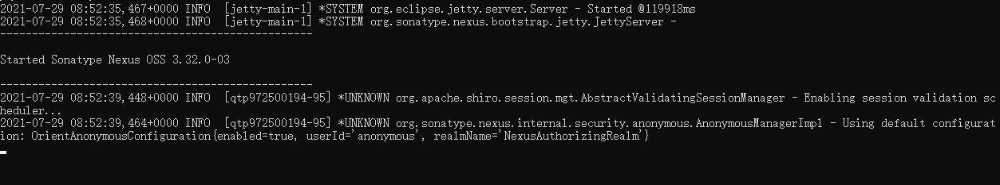

使用如下命令暴露 pod 端口到本机，以便外部访问：

```shell
# 使用说明： kubectl port-forward TYPE/NAME [options] [LOCAL_PORT:]REMOTE_PORT
kubectl port-forward service/nexus3 8081:8081
```

> 生产使用建议通过 ingress 暴露服务，这里通过 port-forward 临时暴露服务

访问地址：http://localhost:8081/

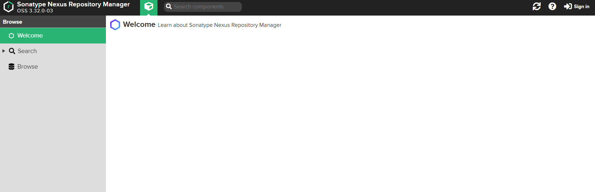


默认登录 nexus 的账号和密码如下：

- 用户名：admin
- 密码：默认的初始密码在服务器的`/nexus-data/admin.password`文件中

使用下面的命令获取默认的密码：

```shell
kubectl exec nexus3-6c75965bcf-6tj5w -- cat /nexus-data/admin.password
```

登录 nexus：

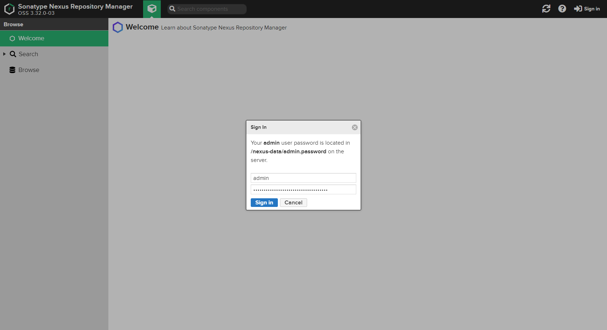

登录成功后需要设置新密码：

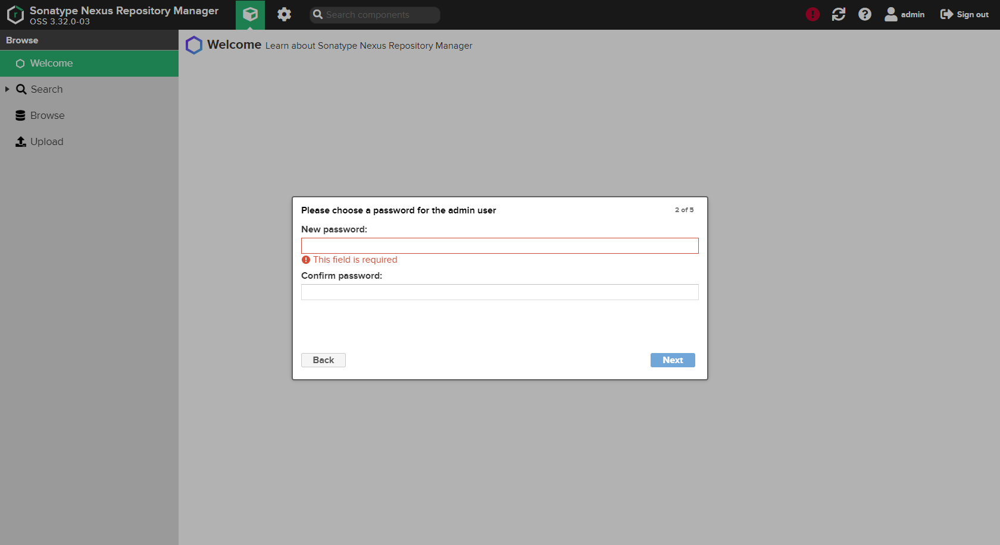

更新密码后，配置是否开启匿名访问。启用匿名访问意味着默认情况下，用户可以在没有凭据的情况下从存储库搜索、浏览和下载组件。考虑到安全的问题，这里选择禁用匿名访问。

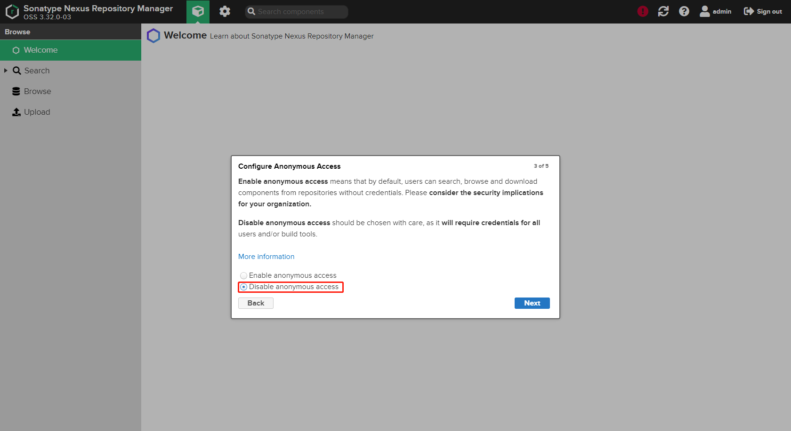

安装完成后如下图：

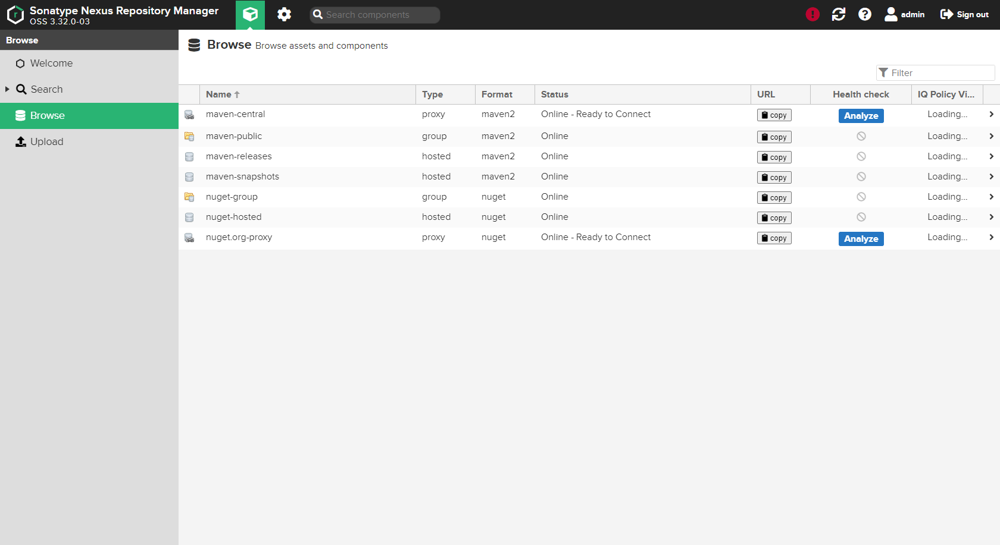


可以使用下面的命令删除安装的 nexus 相关的资源：

```shell
# kubectl delete -f nexus-deploy.yaml

deployment.apps "nexus3" deleted
persistentvolumeclaim "nexus-data-pvc" deleted
service "nexus3" deleted
```


# 三. 使用 helm 安装 nexus

可以去到 helm 官方包管理仓库查找需要安装的应用。

> helm 包管理地址：https://artifacthub.io/

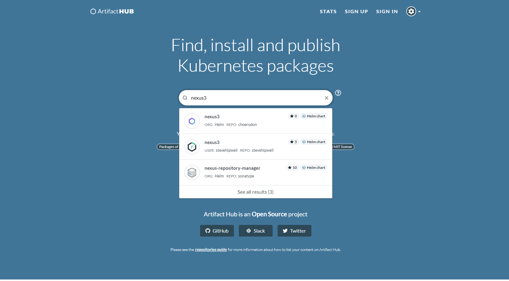

这里我选择安装下图所示的 nexus：（可以根据自己的需求选择安装 star 比较多，更新比较频繁的 chart）

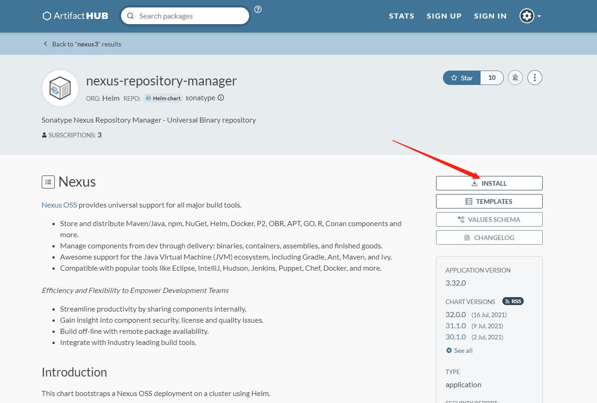

根据上面的文档说明进行安装即可，这里不再详细介绍。

# 四. nexus 的基本配置及使用

## 1. nexus 配置说明

点击左侧Repositories按钮，可以看到下图所示的仓库内容：

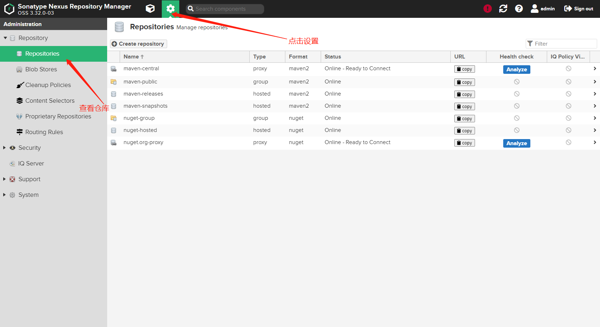

**仓库说明：**

**Name 列**

- maven-central：maven中央库，默认从 `https://repo1.maven.org/maven2/` 拉取 jar。

- maven-releases：私库发行版 jar。

- maven-snapshots：私库快照版（调试版本）jar。

- maven-public：仓库分组，把上面三个仓库组合在一起对外提供服务，在本地 maven 基础配置 `settings.xml`中使用。

**Type 列**（Nexus默认的仓库类型有以下四种）：

- group(仓库组类型)：又叫组仓库，用于方便开发人员自己选择仓库以及设置仓库的顺序；

- hosted(宿主类型)：内部项目的发布仓库（内部开发人员发布 jar 包存放的仓库）；

- proxy(代理类型)：从远程中央仓库中寻找数据的仓库（可以点击对应的仓库的Configuration页签，其中 `Remote Storage Location` 属性的值即被代理的远程仓库的路径）；

- virtual(虚拟类型)：虚拟仓库（这个基本用不到，重点关注上面三个仓库的使用）；


## 2. 创建自定义私有仓库

### 自定义发行版（release）私库

点击 `Create repository` 创建自定义发行版（release）私库，选择 `maven2 (hosted)`，如下图所示：

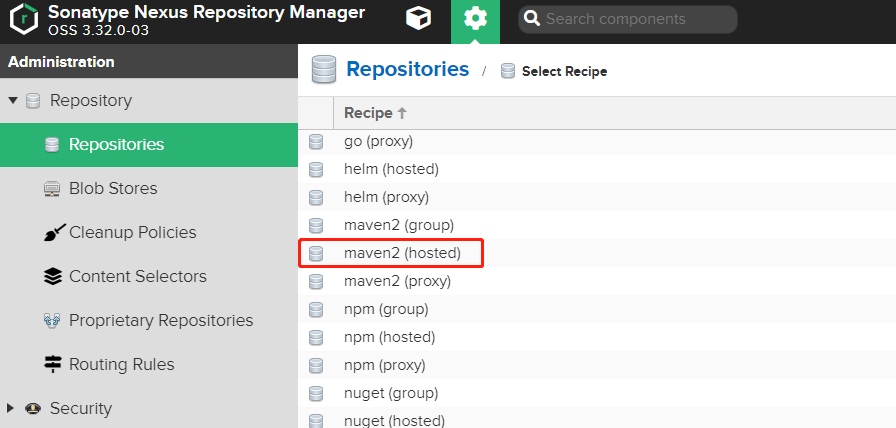

自定义仓库配置如下：

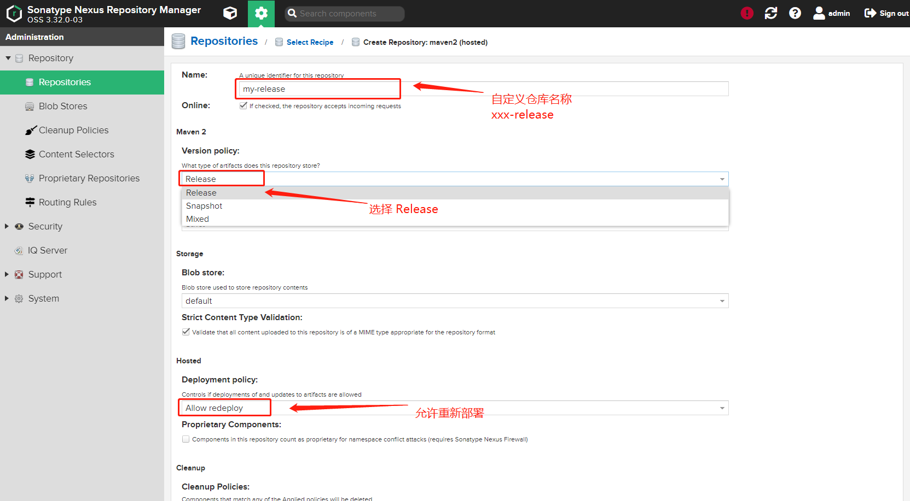

主要配置如下几项内容：

Name：自定义名称，必须唯一，通常发行版仓库以 `xxx-release` 结尾，快照版仓库以 `xxx-snapshots` 结尾

Version policy：

- Release 一般是发行版的 jar
- Snapshot 一般是快照版的 jar
- Mixed 混合的

Deployment policy：Allow redeploy

其他的配置保持默认即可。


### 自定义快照版（snapshot）私库

创建快照版（snapshot）私库和上面的一样，只需要将 Name 修改为 `xxx-snapshots`，Version policy 修改为 `Snapshot`，如下图所示：

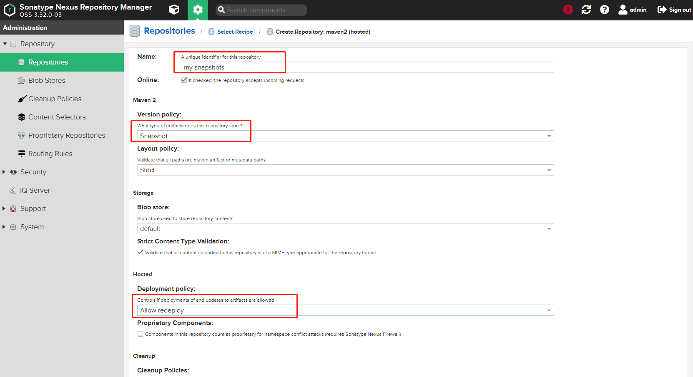


### 自定义代理（proxy）仓库

默认从 `https://repo1.maven.org/maven2/` 拉取 jar，由于网络的原因经常导致无法下载相关的资源，所以这里介绍配置阿里云的 maven 仓库代理。

> 阿里云 maven 仓库代理配置：https://maven.aliyun.com/mvn/guide

创建代理仓库：

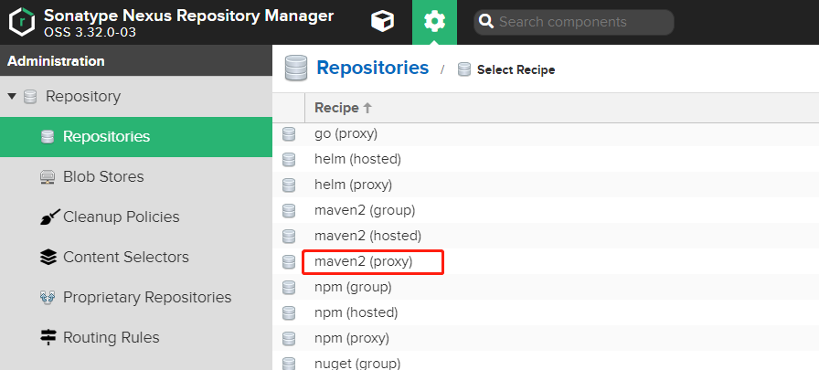

配置内容如下图：

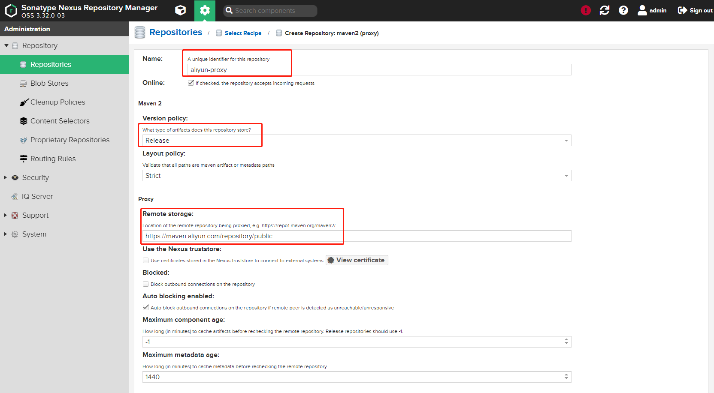

配置说明：

Name：仓库的名称必须唯一，这里配置为 `aliyun-proxy`

Version policy ：Release

Remote storage：远程仓库地址，这里配置阿里云 maven  仓库地址：`https://maven.aliyun.com/repository/public`


### 自定义 group 仓库的顺序

可以使用默认的 `maven-public` ，也可以自定义一个 `maven2 (group)` 类型的仓库进行设置，这里选择自定义一个`maven2 (group)` 类型的仓库，方便学习理解。

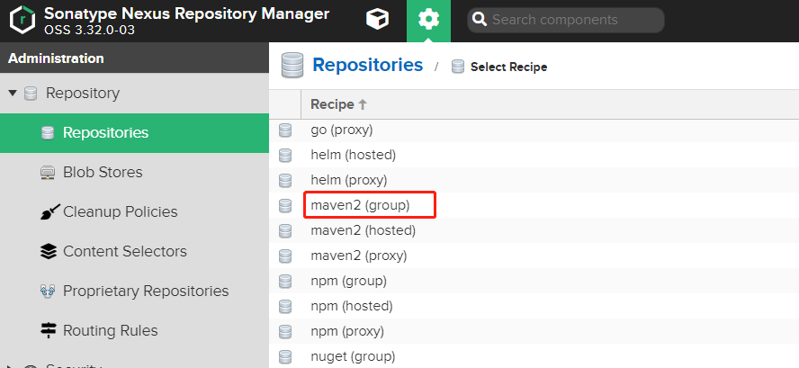

配置如下图：

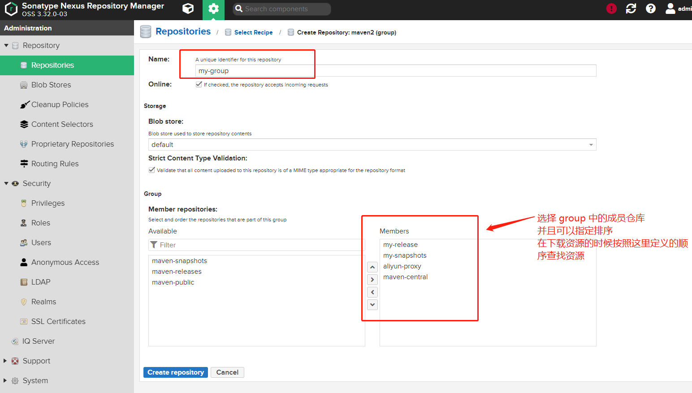

## 3. 创建 nexus 用户

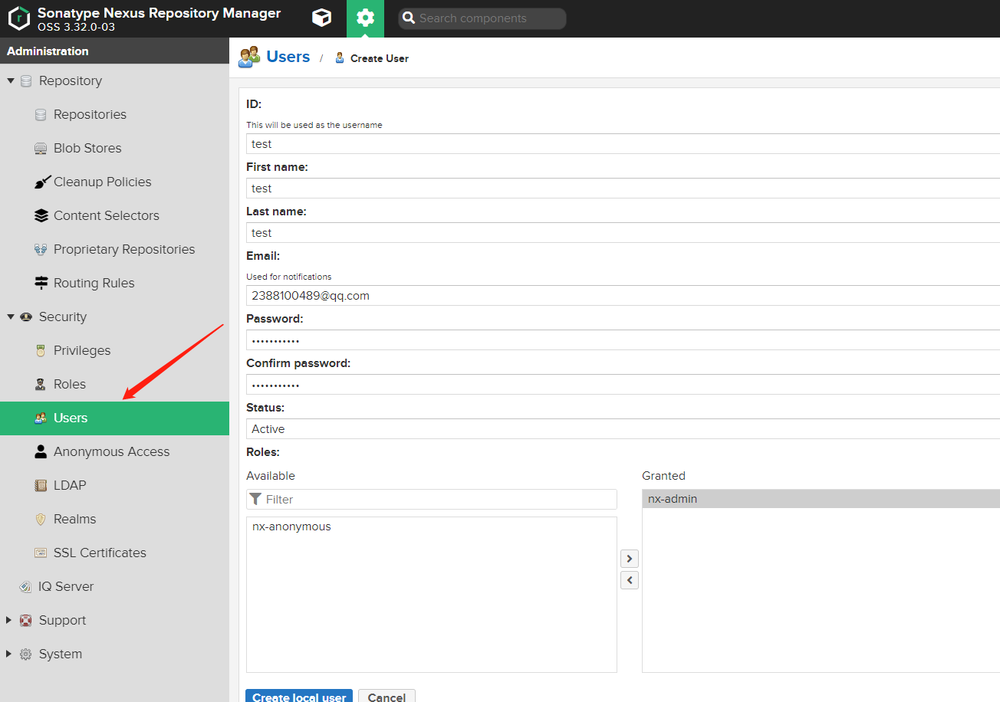


# 五.  maven 配置 nexus 说明

点击前面定义的 `maven2 (group)` 查看其 URL 地址，如下图所示：

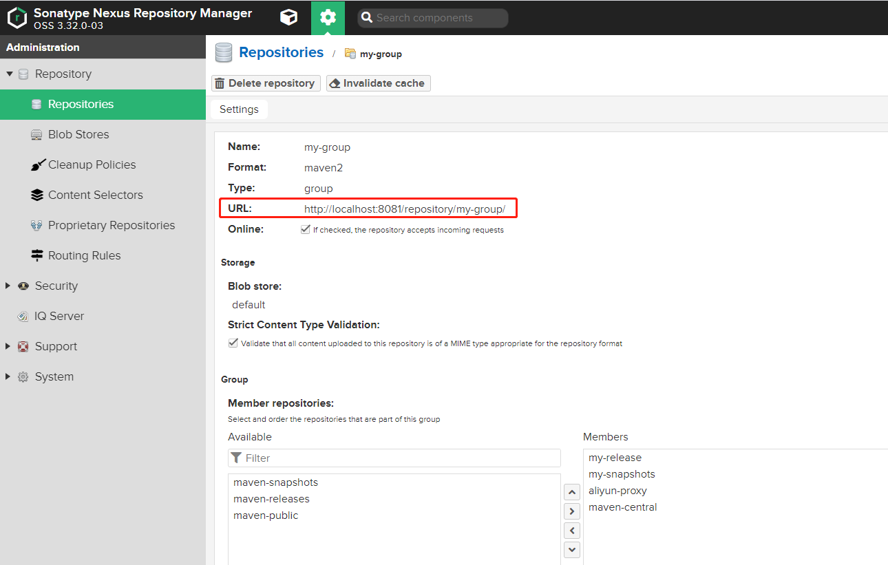

## 1. 在 settings.xml 文件中配置（全局有效）

打开 maven 的配置文件（ windows 机器一般在 maven 安装目录的 **conf/settings.xml** ），在`<mirrors></mirrors>`标签中添加 mirror 子节点，复制上面的地址，在 `settings.xml` 文件中添加如下内容：

```xml
  <servers>
    <!-- 这里配置 nexus 的认证信息，注意这里的 id 需要和 mirros 中的 id 相同才能够匹配认证 -->
	 <server>
      <id>my-maven</id>
      <username>test</username>
      <password>maven123456</password>
    </server>
  </servers>
  <mirrors>
	<mirror>
	  <id>my-maven</id>
      <!--mirrorof配置为 * 时，所有的请求都走这个mirror的url，mirrorof配置是某个repositoryid时，若构建找不到，则会到maven默认中央仓库去获取的。-->
	  <mirrorOf>*</mirrorOf>
	  <name>自定义私有仓库</name>
	  <url>http://localhost:8081/repository/my-group/</url>
	</mirror>
  </mirrors>
```

配置完成之后，可以在 idea 中指定这个 `settings.xml` 文件，如下图所示：

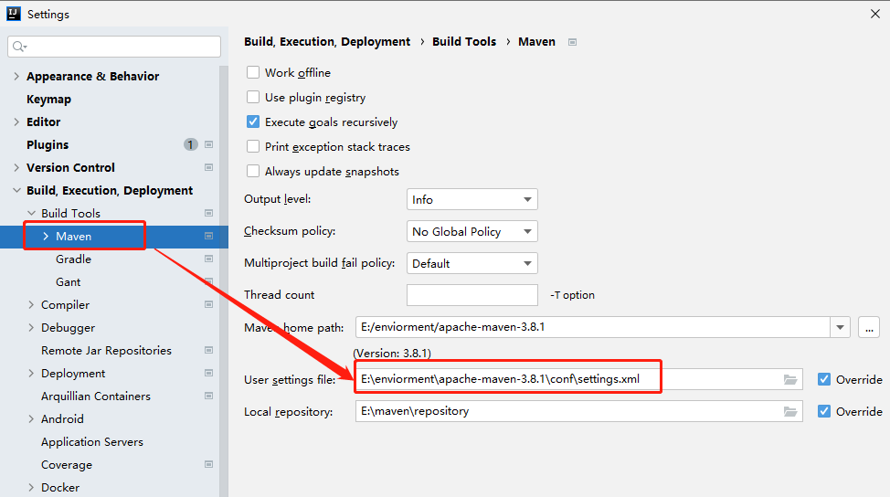

当指定配置文件之后，可以看到 idea 从 nexus 私有仓库中下载 jar 包：

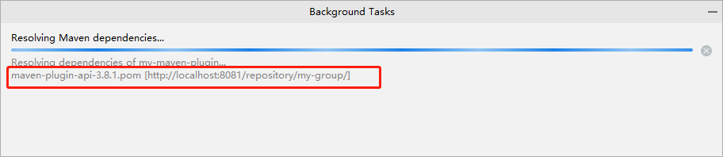

去到 nexus 仓库中查看仓库内容，如下图所示：

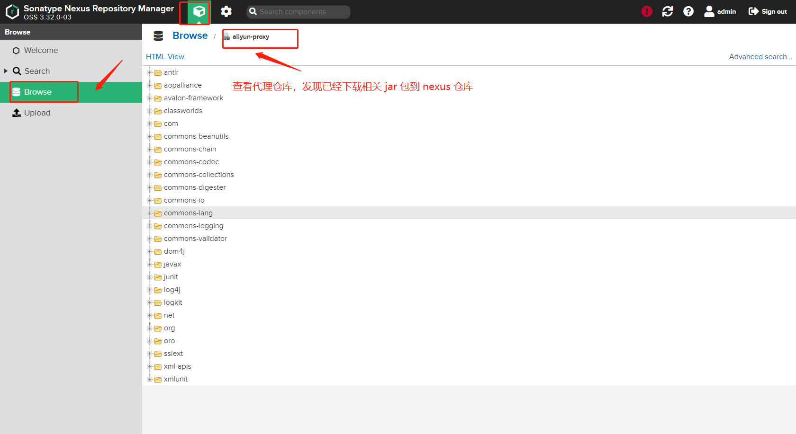

## 2. 在 pom.xml 文件中配置私有仓库地址（项目有效）

在 `pom.xml` 中 `repositories` 标签的作用是用来配置 `maven` 项目的远程仓库，示例如下:

```xml
    <repositories>
        <repository>
            <!--定义仓库 id ,必须唯一，需要 server 中的id对应，以便认证-->
            <id>my-maven</id>
            <!--仓库描述-->
            <name>自定义私有仓库</name>
            <!--仓库地址-->
            <url>http://localhost:8081/repository/my-group/</url>
            <!--是否可以从这个仓库下载releases版本的构件，默认为 true-->
            <releases>
                <enabled>true</enabled>
            </releases>
            <!--是否可以从这个仓库下载snapshots版本的构件，默认为 true
            禁止从公共仓库下载snapshot构件是推荐的做法，因为这些构件不稳定
            -->
            <snapshots>
                <enabled>true</enabled>
            </snapshots>
        </repository>
    </repositories>
```

>  建议在 settings.xml 文件中配置私有仓库地址，这样所有项目都可以使用那个地址。


## 3. 发布本地 jar 包到 nexus 仓库

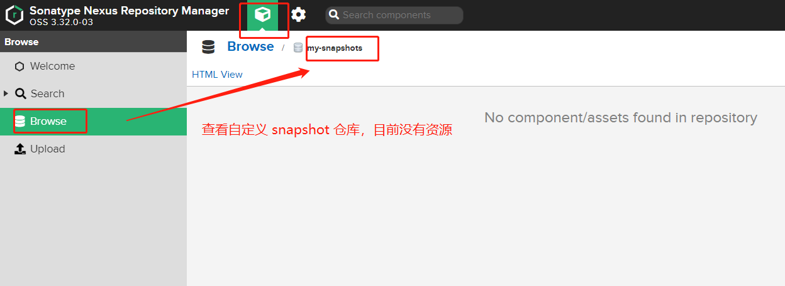

查看自定义的 snapshot 仓库，目前没有相关 jar 包资源，下面如何将本地jar包发布到私有仓库。

在 pom.xml 文件中添加如下配置：

```xml
    <distributionManagement>
        <repository>
            <!--定义仓库 id ,必须唯一，需要 server 中的id对应，以便认证-->
            <id>my-maven</id>
            <!--仓库描述-->
            <name>自定义发行版仓库</name>
            <!--仓库地址-->
            <url>http://localhost:8081/repository/my-release/</url>
        </repository>
        <snapshotRepository>
            <!--定义仓库 id ,必须唯一，需要 server 中的id对应，以便认证-->
            <id>my-maven</id>
            <!--仓库描述-->
            <name>自定义快照版仓库</name>
            <!--仓库地址-->
            <url>http://localhost:8081/repository/my-snapshots/</url>
        </snapshotRepository>
    </distributionManagement>
```

执行如下命令发布项目到 nexus 仓库：

```sh
mvn clean deploy
```

构建成功之后可以查看 nexus 仓库内容如下：

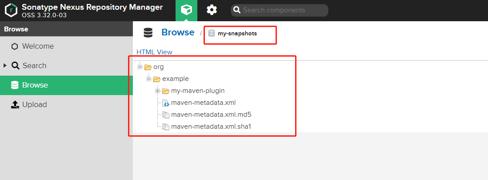

**这里有一点值得注意的地方，如何将 jar 包发布到 release 仓库？**

其实非常简单，只需要将 `<version>1.0.0-SNAPSHOT</version>` 中的 `1.0.0-SNAPSHOT` 改为 `1.0.0` 即可，当再次执行 `mvn clean deploy` 则会将 jar 包发布到 **release** 仓库中了。

还可以直接通过 nexus 控制台上传 jar 包到私有仓库：

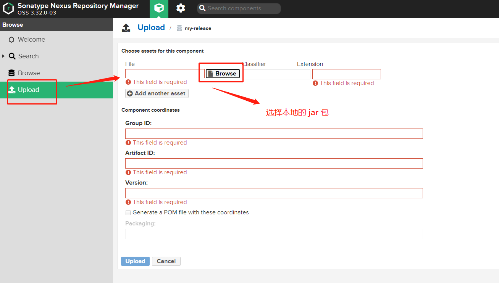

