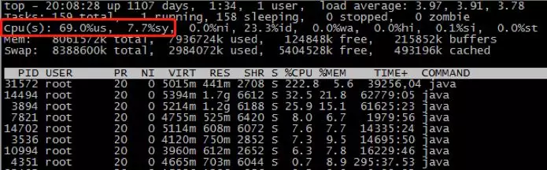
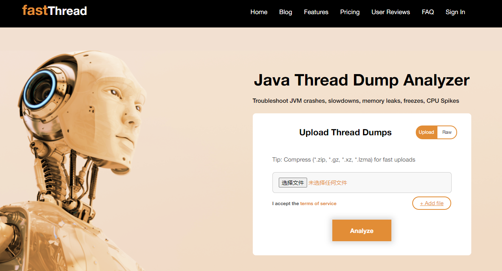

# 是什么让 Java 应用程序的 CPU 使用率飙升？

> 如果命运是一条孤独的河流，谁会是你的灵魂摆渡人？ ——  克莱儿·麦克福尔《摆渡人》

# 一. 问题

- **while 的无限循环是否会导致 CPU 使用率飙升？**
- **频繁的 Young GC 是否会导致 CPU 使用率飙升？**
- **有大量线程的应用程序的 CPU 使用率高吗？**
- **CPU 使用率高的应用程序的线程数是否很大？**
- **处于 BLOCKED 状态的线程是否会导致 CPU 使用率飙升？**
- **分时操作系统中的 CPU 是消耗 `us(用户态)` 还是 `sy(内核态)`?**

# 二. 思考

## 1. 我们如何计算 CPU 使用率？

`CPU% = (1 - idleTime / sysTime )  *  100`

- `idleTime`：CPU 的空闲时间

- `sysTime`：CPU 处于用户态和内核态的时间总和

## 2. 常见的 CPU 密集型操作有哪些？

人们常说，计算密集型程序就是 CPU 密集型的，那么，Java 应用程序中有哪些操作是计算密集型的呢？

下面列出常见 CPU 密集型操作：

- 频繁的 GC；如果访问量很大，可能会导致频繁的GC甚至Full GC。当调用量大时，内存分配会非常快，以至于 GC 线程会不断执行，导致 CPU 飙升。
- 序列化和反序列化
- 加密和解码
- 正则表达式。原因可能是Java正则表达式使用的引擎实现是NFA自动机，它会在字符匹配时进行回溯。
- 线程上下文切换。有很多启动的线程，这些线程的状态在 Blocked（锁等待、IO等待等）和 Running 之间不断变化，当锁争用激烈时，这种情况很容易发生。
- 一些线程正在执行非阻塞操作，例如`while (true)`语句。如果程序中计算时间较长，可以休眠线程。

## 3. CPU 与 进程和线程有关吗？

现在，分时操作系统采用轮询的方式为进程调度分配时间片。如果进程正在等待或阻塞，则它不会使用 CPU 资源。线程称为轻进程，共享进程资源，因此线程调度在 CPU 中也是分时的。但是在 Java 中，我们使用 JVM 进行线程调度，所以一般来说，线程的调度有两种模式：分时调度和抢占式调度。线程和进程在阻塞或者等待时，都不会使用 CPU 资源。

# 三. 答案

## 1. while的无限循环是否导致CPU使用率飙升？

**回答**：是的

**分析**：首先，无限循环会调用CPU寄存器进行计数，这个操作会占用CPU资源。那么，如果线程一直处于死循环状态，CPU会不会切换线程呢？除非操作系统时间片到期，否则无限循环不会放弃占用的CPU资源，并且无限循环会继续向系统请求时间片，直到系统没有空闲时间做其他事情。

## 2. 频繁的Young GC会导致CPU使用率飙升吗？

**回答**：是的

**分析**：**Young GC** 本身就是 JVM 进行垃圾回收的操作，需要计算内存和调用寄存器，因此频繁的 **Young GC** 肯定会占用 CPU 资源。

让我们来看一个真实的案例：for 循环从数据库中查询数据集合，然后再次封装新的数据集合。如果内存不够存储，JVM 会回收不再使用的数据。因此，如果需要的存储空间很大，可能会收到 CPU 使用率警报。

## 3. 线程多的应用CPU使用率一定高吗？

**回答**：不一定

**分析**：如果我们通过 `jstack` 查看系统线程状态时线程总数很大，但处于 `Runnable` 和 `Running` 状态的线程并不多，那么 CPU 使用率不一定高。但是大多数情况下，如果线程数很大，那么常见的原因是大量线程处于 `BLOCKED` 和 `WAITING` 状态。

## 4. CPU 使用率高的应用程序的线程数一定大吗？

**回答**：不一定

**分析**：CPU 使用率高的关键因素是计算密集型操作。如果一个线程有大量计算，CPU使用率也可能很高，这也是一个数据脚本任务需要在大规模集群上运行的原因。

## 5. 处于BLOCKED状态的线程是否会导致CPU使用率飙升？

**回答**：不一定

**分析**：CPU 使用率的飙升更多是因为上下文切换或过多的可运行状态线程。处于阻塞状态的线程不一定会导致 CPU 使用率上升。

### 6 . CPU的`us`和`sy`值在分时操作系统中高是什么意思？

我们可以使用 `top` 命令查看 CPU 的 `us` 和 `sy` 的值，如下图所示：

- **us**：用户空间占用 CPU 的百分比。简单来说，如果 `us` 的值比较高，则是我们程序引起的，并且分析线程堆栈很容易定位有问题的线程。
- **sy**：内核空间占用 CPU 的百分比。`sy` 高的时候，如果是程序引起的，那么基本上是线程上下文切换引起的。

# 四. 经验

如何定位CPU使用率高的原因？下面简要介绍分析过程。

如果发现某个应用服务器的CPU使用率高，首先检查**线程数、JVM、系统负载**等参数，然后用这些参数来证明问题的原因。其次，**用 jstack 打印堆栈信息**，使用工具分析线程使用情况（推荐使用在线线程分析工具fastThread）。

> 在线线程分析工具fastThread 地址：https://fastthread.io/

下一篇文章介绍如何使用在线线程分析工具 **fastThread** 分析线程堆栈信息。

参考文档：

https://www.tutorialdocs.com/article/java-cpu-soar.html